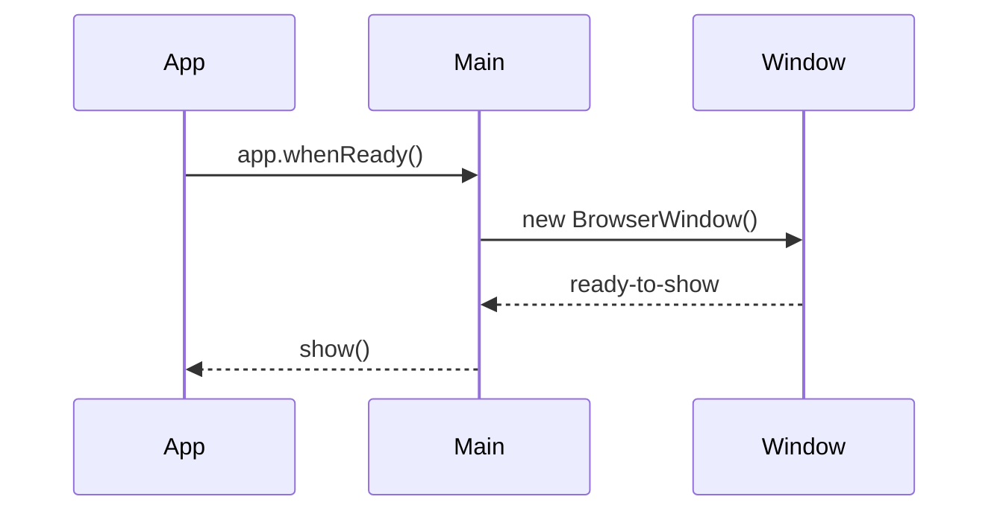
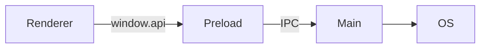
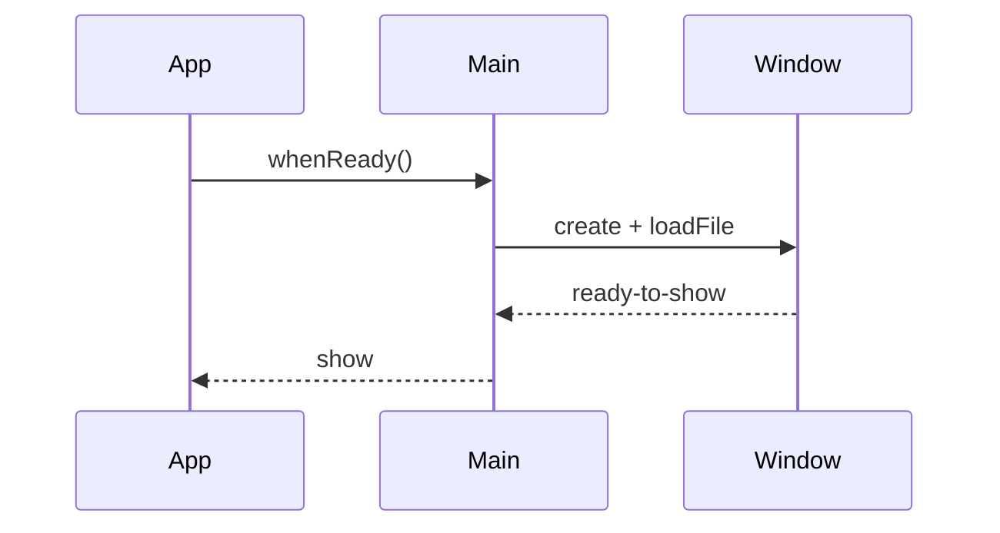

# 📘 0. Vue d’ensemble & objectifs (Découvrir Electron)

> 🎯 **Objectif du chapitre**  
> Comprendre **ce qu’est Electron** (Chromium + Node.js), ses **composants** (Main, Renderer, Preload, IPC), son **cycle de vie**, et les **principes de sécurité par défaut**. Mettre en place une **application minimale** et maîtriser les **DevTools** pour bien démarrer.

---

## 🧩 0.1 Qu’est‑ce qu’Electron ?

- **Electron** combine **Chromium** (UI web) et **Node.js** (APIs système) pour créer des **applications desktop multiplateformes** (Windows/macOS/Linux) avec des **technologies Web**.
- **Philosophie** : réutiliser les compétences web pour le **desktop**, avec une **séparation stricte** des responsabilités et une **sécurité** contrôlée.

---

## 🧩 0.2 Architecture — Main / Renderer / Preload / IPC

- **Main** : Processus principal — crée les **BrowserWindow**, gère l’**OS** (menus, fichiers, notifications), valide les **requêtes**.
- **Renderer** : Processus UI — pages **HTML/CSS/JS** (aucun accès Node).
- **Preload** : Script **isolé** injecté par fenêtre — expose via `contextBridge` des **APIs sûres** (`window.api`), **valide** les payloads et **whitelist** les canaux.
- **IPC** : Communication **contrôlée** (Main ↔ Renderer) via `ipcMain.handle` / `ipcRenderer.invoke`.

**Schéma (Mermaid)**
```mermaid
flowchart LR
  UI[Renderer] -->|window.api| Preload[Preload (Facade)]
  Preload -->|invoke| Main[Main]
  Main --> OS[OS APIs]
```

---

## 🧩 0.3 Cycle de vie d’une app Electron

- `app.whenReady()` → création de la **fenêtre**.  
- `ready-to-show` → afficher la fenêtre sans flash.  
- `window-all-closed` → quitter (sauf macOS).  
- `activate` (macOS) → recréer une fenêtre si nécessaire.

**Schéma (Mermaid)**


---

## 🧩 0.4 Sécurité — par défaut et règles d’or

- **Désactiver** Node en Renderer : `nodeIntegration: false`.  
- **Isoler** le contexte : `contextIsolation: true`.  
- **Preload** + `contextBridge` pour une **façade minimale**.  
- **CSP** (Content Security Policy) stricte et **navigation verrouillée** (`will-navigate`, `setWindowOpenHandler`).  
- **Jamais** d’IPC direct **Renderer↔Renderer**.

**Formule (HTML) — CSP minimale**
```html
<meta http-equiv="Content-Security-Policy" content="default-src 'self'; script-src 'self'; style-src 'self'; img-src 'self' data:;">
```

---

## 🧩 0.5 Application minimale (fichiers de base)

**`main.js` (extrait)**
```javascript
const { app, BrowserWindow } = require('electron');
function createWindow(){
  const win = new BrowserWindow({
    width: 900, height: 600,
    webPreferences: { preload: __dirname + '/preload.js', nodeIntegration: false, contextIsolation: true }
  });
  win.loadFile('index.html');
}
app.whenReady().then(createWindow);
app.on('window-all-closed', ()=> { if (process.platform !== 'darwin') app.quit(); });
app.on('activate', ()=> { if (BrowserWindow.getAllWindows().length === 0) createWindow(); });
```

**`preload.js` (extrait)**
```javascript
const { contextBridge } = require('electron');
contextBridge.exposeInMainWorld('api', Object.freeze({
  ping: () => 'pong'
}));
```

**`index.html` (extrait)**
```html
<!doctype html>
<html lang="fr-CA">
<head>
  <meta charset="utf-8" />
  <meta http-equiv="Content-Security-Policy" content="default-src 'self'; script-src 'self'; style-src 'self';">
  <meta name="viewport" content="width=device-width, initial-scale=1" />
  <title>Electron — Hello</title>
</head>
<body>
  <main>
    <h1>Bienvenue</h1>
    <p id="out"></p>
    <script>
      document.getElementById('out').textContent = window.api.ping();
    </script>
  </main>
</body>
</html>
```

---

## 🧩 0.6 DevTools & logs

- **Renderer** : `Ctrl/Cmd+Shift+I` pour **DevTools** (Performance, Memory).  
- **Main** : lancer avec `--inspect` (VS Code ou Chrome DevTools).

**Formule (JS) — logger minimal**
```javascript
const log = { info: (...a)=>console.log('[info]', ...a), error: (...a)=>console.error('[error]', ...a) };
```

---

## 🧩 0.7 Avantages & limites (bref)

- ✅ **Productivité** : stack Web, écosystème npm; **multi‑OS**.  
- ✅ **Natif** via APIs Electron & **N‑API** (chap. 16).  
- ⚠️ **Poids** (runtime Chromium), **discipline sécurité** nécessaire (CSP/Preload/IPC).  
- ⚠️ **Perf** : mesurer et optimiser (chap. 13).

---

## 🧩 0.8 Spécificités Windows/macOS

- **macOS** : `activate`/roles menus; signatures/notarization (chap. 10).  
- **Windows** : `AppUserModelId` (notifications), High Contrast (`forced-colors`).

---

## 🛠️ 0.9 Atelier pas‑à‑pas

1. **Initialiser** le projet (`npm init -y`, `npm i electron --save-dev`).  
2. **Créer** `main.js`, `preload.js`, `index.html` avec **CSP stricte**.  
3. **Lancer** `npx electron .` et ouvrir **DevTools**.  
4. **Ajouter** `window.api.ping()` et afficher la réponse.

---

## 🖼️ 0.10 Schémas (Mermaid)

**Vue d’architecture** *(rappel)*


**Cycle minimal**


---

## 🧪 0.11 (Aperçu) Tests

- **Smoke** : l’app démarre, `ping()` répond `pong`.  
- **Sécurité** : vérifier **CSP** appliquée, pas de Node en Renderer.

```javascript
// Pseudo-tests
console.assert(typeof window === 'object', 'Renderer chargé');
```

---

## 🔚 0.12 Résumé — Points essentiels

- **Electron = Chromium + Node** : UI web + APIs système.  
- **Couches** : Main, Renderer, Preload (façade) + **IPC**.  
- **Cycle de vie** : `ready`/`ready-to-show`/`activate`/`closed`.  
- **Sécurité** : `nodeIntegration:false`, `contextIsolation:true`, **CSP** + navigation verrouillée.  
- **Démarrage** : app minimale + DevTools + logs.

---

> ✅ **Livrable** : `01-decouvrir-electron.md` (ce fichier), prêt pour Obsidian.
