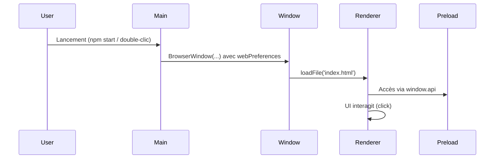
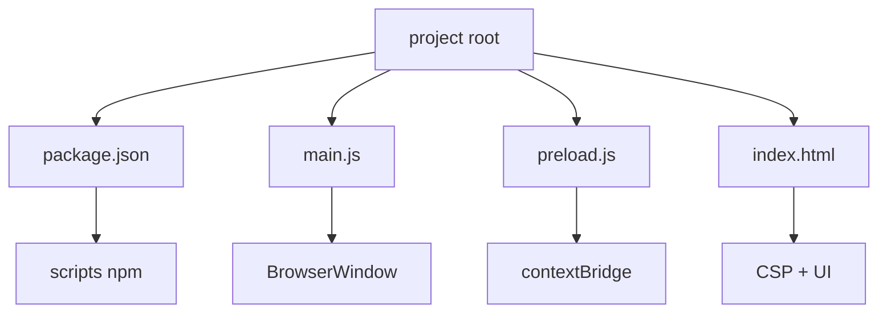

# 📘 1. Environnement & premiers pas (Vanilla JS, Windows & macOS)

> 🎯 **Objectif du chapitre**  
> Installer les outils (Node.js, npm, Electron), créer un **projet minimal** et comprendre **pourquoi** chaque fichier existe (`package.json`, `main.js`, `preload.js`, `index.html`). Vous lancerez l’application en mode développement, ouvrirez les DevTools, et poserez **des bases de sécurité** saines dès le départ.

---

## 🧩 1.1 Qu’est-ce qu’un environnement Electron ?

**Définition.** L’environnement Electron regroupe **Node.js** (moteur d’exécution JS côté système), **Chromium** (moteur de rendu web), et votre **code d’application** réparti entre :
- **Processus principal (Main)** : pilote l’application, gère les fenêtres et les intégrations OS.
- **Processus de rendu (Renderer)** : affiche l’UI (HTML/CSS/JS) par fenêtre.
- **Script de préchargement (Preload)** : expose des **API sécurisées** au Renderer via `contextBridge`, sans lui donner accès direct à Node.

**Pourquoi cette séparation ?**  
Comme dans une **maison** : le **Main** est le **tableau électrique** (centralise et protège), le **Renderer** est la **pièce à vivre** (UI), et le **Preload** est la **porte sécurisée** entre les deux (on contrôle ce qui passe). Cette séparation **réduit les risques** (ex. injection) et **organise la responsabilité** de chaque bloc.

**Schéma (Mermaid)**
```mermaid
flowchart LR
  A[Utilisateur] -->|double-clic| B(Main)
  B --> C[BrowserWindow]
  C --> D[Renderer (UI)]
  D --> E[Preload (API sûre)]
  D <--> B
  E -.expose.-> D
```

---

## 🧩 1.2 Pré-requis et installations

### Windows (PowerShell)
1. **Node.js LTS** : Téléchargez le binaire LTS sur le site officiel et installez.
2. **Vérification** :
   ```powershell
   node -v
   npm -v
   ```
3. **Optionnel (gestion de versions)** : `nvm-windows` pour basculer entre versions.

### macOS (Terminal)
1. **Node.js LTS** : via Homebrew ou package officiel.
   ```bash
   brew install node
   ```
2. **Vérification** :
   ```bash
   node -v
   npm -v
   ```
3. **Optionnel** : `nvm` (gestionnaire de versions) pour fixer une LTS.

> 🧠 **Bonnes pratiques**
> - Choisissez une **version LTS** de Node pour la stabilité.
> - Gardez vos outils à jour, mais évitez d’**upgrader en pleine production**.

---

## 🧩 1.3 Créer la structure minimale du projet

### 1) Initialiser `package.json`
Dans un dossier vide (ex. `electron-hello`):
```bash
npm init -y
```

**Pourquoi `package.json` ?**  
C’est la **carte d’identité** de votre projet (nom, version), son **tableau de bord** (scripts), et sa **liste d’achats** (dépendances).

### 2) Installer Electron en dépendance de développement
```bash
npm install --save-dev electron
```

**Pourquoi `--save-dev` ?**  
Electron n’est pas **requis** par votre code métier en production (une fois packagé), mais **indispensable** pour lancer et développer localement.

### 3) Ajouter les scripts npm
Dans `package.json`, ajoutez :
```json
{
  "name": "electron-hello",
  "version": "0.1.0",
  "private": true,
  "main": "main.js",
  "scripts": {
    "start": "electron .",
    "clean": "rimraf dist build",
    "postinstall": "echo \"✅ Installation OK\""
  }
}
```
> ℹ️ `main` pointe vers **le point d’entrée** de l’application côté Main.

---

## 🧩 1.4 Fichiers de base

### `main.js` (processus principal)
- **Rôle** : créer la fenêtre, gérer le cycle de vie.
- **Sécurité par défaut** : `nodeIntegration: false`, `contextIsolation: true`, `preload: path.join(__dirname, 'preload.js')`.

```javascript
// main.js
const { app, BrowserWindow } = require('electron');
const path = require('path');

function createMainWindow() {
  const win = new BrowserWindow({
    width: 900,
    height: 600,
    show: false,
    webPreferences: {
      preload: path.join(__dirname, 'preload.js'),
      nodeIntegration: false,
      contextIsolation: true,
      sandbox: true
    }
  });

  win.loadFile('index.html');

  win.once('ready-to-show', () => {
    win.show();
  });
}

app.whenReady().then(() => {
  createMainWindow();

  app.on('activate', () => {
    if (BrowserWindow.getAllWindows().length === 0) {
      createMainWindow();
    }
  });
});

app.on('window-all-closed', () => {
  if (process.platform !== 'darwin') {
    app.quit();
  }
});
```

### `preload.js` (API sécurisée)
- **Rôle** : exposer **une surface contrôlée** au Renderer.
- **Principe** : pas d’accès direct à Node côté Renderer.

```javascript
// preload.js
const { contextBridge } = require('electron');

contextBridge.exposeInMainWorld('api', {
  appName: () => 'Electron Hello',
  now: () => new Date().toISOString()
});
```

### `index.html` (Renderer)
- **Rôle** : UI minimale + CSP stricte.

```html
<!-- index.html -->
<!DOCTYPE html>
<html lang="fr">
<head>
  <meta charset="UTF-8" />
  <meta http-equiv="Content-Security-Policy" content="default-src 'self'; script-src 'self'; style-src 'self' 'unsafe-inline'; img-src 'self' data:; connect-src 'self'" />
  <meta name="viewport" content="width=device-width, initial-scale=1.0" />
  <title>Electron Hello</title>
  <style>
    body { font-family: system-ui, -apple-system, Segoe UI, Roboto, sans-serif; margin: 2rem; }
    .info { margin-top: 1rem; color: #555; }
    button { padding: .5rem 1rem; }
  </style>
</head>
<body>
  <h1>👋 Bonjour Electron</h1>
  <button id="btn">Afficher l'heure</button>
  <div class="info" id="out"></div>
  <script>
    const btn = document.getElementById('btn');
    const out = document.getElementById('out');
    btn.addEventListener('click', () => {
      out.textContent = `${window.api.appName()} — ${window.api.now()}`;
    });
  </script>
</body>
</html>
```

> ⚠️ **CSP** aide à bloquer les exécutions non prévues (XSS). On autorise seulement `self`.

---

## 🧩 1.5 Lancer et observer

### Démarrer en développement
```bash
npm start
```
- **Windows/macOS** : ouvre la fenêtre principale.
- **DevTools** : `Ctrl+Shift+I` (Windows) / `Cmd+Option+I` (macOS).

### Ajouter des logs
Dans `main.js` :
```javascript
console.log('[Main] App démarrée, PID=', process.pid);
```
Dans le Renderer (via DevTools Console) :
```javascript
console.log('Renderer prêt');
```

> 💡 **Analogie** : Les **logs** sont vos **caméras de surveillance**; placez-les aux endroits critiques du flux (démarrage, création de fenêtre, IPC).

---

## ⚠️ 1.6 Sécurité : bases indispensables

- **Désactivez** `nodeIntegration` (évite accès `require` en Renderer).
- **Activez** `contextIsolation` (sépare les contextes JS, réduit la surface d’attaque).
- **Utilisez** Preload + `contextBridge` pour exposer une **API minimaliste**.
- **Posez** une **CSP** (limiter scripts/styles/images).
- **Ne chargez pas** de contenu distant non maîtrisé (`loadURL` vers internet) en développement.

**Formule (JavaScript) — principe du moindre privilège**
```javascript
// Surface API minimale et immuable
const API = Object.freeze({ read: () => {/* ... */} });
```

---

## 🛠️ 1.7 Atelier pas-à-pas

1. **Créer** le dossier du projet et initialiser `npm`.
2. **Installer** Electron en dev.
3. **Écrire** `main.js`, `preload.js`, `index.html` (copier-coller depuis ci-dessus).
4. **Configurer** les scripts `start` dans `package.json`.
5. **Lancer** l’application; ouvrir DevTools; **tester** le bouton.
6. **Expérimenter** : ajouter une nouvelle API Preload (ex. `appVersion()`), l’appeler depuis l’UI.

> 🧠 **Bonnes pratiques**
> - Versionnez le projet avec **Git** dès maintenant (`git init`).
> - Ajoutez un fichier `.editorconfig` pour normaliser formatage.
> - Documentez rapidement les choix (CSP, options `webPreferences`).

---

## 🖼️ 1.8 Schémas supplémentaires

**Flux de démarrage**


**Structure du projet**


---

## 🧪 1.9 (Aperçu) Tester le Preload sans framework

**Idée** : tester la surface `window.api` en isolant le code.

```javascript
// Exemple de test manuel (pseudo)
(function(){
  const exposed = { appName: () => 'Electron Hello' };
  console.assert(exposed.appName() === 'Electron Hello', 'API appName doit répondre');
})();
```

> 📝 Les vrais tests unitaires seront détaillés au chapitre **12** (Jest + Playwright).

---

## 🔚 1.10 Résumé — Points essentiels

- Electron sépare **Main / Renderer / Preload** pour **robustesse et sécurité**.
- Créez une **structure minimale** claire, avec `package.json` et scripts utiles.
- **Sécurisez** dès le départ : `nodeIntegration: false`, `contextIsolation: true`, **CSP**.
- Utilisez **Preload** pour exposer **une API minimale** au Renderer.
- **Lancez et observez** avec DevTools et logs; itérez petit à petit.

---

> ✅ **Livrable** : `02-environnement-premiers-pas.md` (ce fichier), prêt pour Obsidian.
