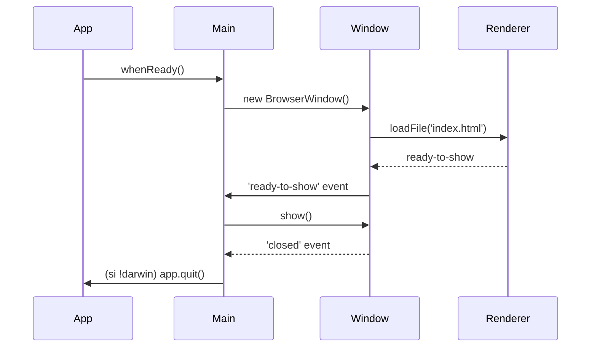

# 📘 2. Cycle de vie & fenêtres (BrowserWindow)

> 🎯 **Objectif du chapitre**  
> Maîtriser le **cycle de vie** d’une application Electron et la **gestion des fenêtres** : événements `app`, création/affichage/fermeture de `BrowserWindow`, différences **Windows/macOS**, options `webPreferences` sûres, **modales**, **raccourcis** et un **WindowManager** maintenable.

---

## 🧩 2.1 Définition et "pourquoi"

**Cycle de vie (définition).** C’est la **suite d’états** que parcourt l’application : installation → lancement → prêt (`ready`) → affichage (`ready-to-show`) → activité (fenêtres ouvertes) → fermeture (`window-all-closed`) → extinction (`quit`).

**Pourquoi le maîtriser ?**  
Comme un **chef d’orchestre**, vous devez déclencher les **bons instruments** (fenêtres, menus, IPC) **au bon moment**. Un cycle mal géré entraîne **clignotements**, **écrans blancs**, **fuites de mémoire**, ou des **comportements incohérents** entre Windows et macOS.

---

## 🧩 2.2 Les événements clés de `app`

- `app.whenReady()` : promisification de l’état **prêt** ; créez vos fenêtres **après** ceci.
- `app.on('activate')` (macOS) : relancé quand l’icône du Dock est cliquée ; recrée une fenêtre si aucune n’existe.
- `app.on('window-all-closed')` : déclenché quand **toutes** les fenêtres sont fermées.
- `app.on('before-quit')` : juste avant la fermeture ; utile pour **sauvegarder l’état**.
- `app.on('second-instance')` : si vous appliquez le **single-instance lock**.

**Exemple d’orchestration :** (vanilla JS)
```javascript
// main.js (extrait pédagogique)
const { app, BrowserWindow } = require('electron');

function createMainWindow() { /* ... */ }

app.whenReady().then(() => {
  createMainWindow();
  app.on('activate', () => {
    if (BrowserWindow.getAllWindows().length === 0) createMainWindow();
  });
});

app.on('window-all-closed', () => {
  // macOS garde l'app active sans fenêtres
  if (process.platform !== 'darwin') app.quit();
});

app.on('before-quit', () => {
  // Ex: persist state to disk
});
```

> 💡 **Analogie** : `app.whenReady()` est le **feu vert** sur un circuit : tant qu’il est rouge, on ne s’élance pas.

---

## 🧩 2.3 Créer, afficher et fermer une `BrowserWindow`

**Définition.** `BrowserWindow` est l’**enveloppe native** (Windows/macOS) qui **embarque** un onglet Chromium (Renderer). 

**Étapes typiques :**
1. **Créer** la fenêtre avec des **`webPreferences` sûres**.
2. **Charger** l’UI (`loadFile` pour un fichier local; `loadURL` pour du contenu local/packagé; évitez les URLs distantes non maîtrisées).
3. Attendre l’événement **`ready-to-show`** puis **afficher**.
4. **Nettoyer** les références sur `closed`.

```javascript
const path = require('path');
let mainWindow = null;

function createMainWindow() {
  mainWindow = new BrowserWindow({
    width: 1000,
    height: 700,
    show: false,
    webPreferences: {
      preload: path.join(__dirname, 'preload.js'),
      nodeIntegration: false,
      contextIsolation: true,
      sandbox: true,
      devTools: true
    }
  });

  mainWindow.loadFile('index.html');

  mainWindow.once('ready-to-show', () => {
    mainWindow.show();
  });

  mainWindow.on('closed', () => {
    mainWindow = null; // libère la référence
  });
}
```

> 🧠 **Pourquoi `ready-to-show` ?** Cela garantit que le **Renderer** a suffisamment rendu pour éviter un **flash** ou un **écran blanc**.

---

## 🧩 2.4 `loadFile` vs `loadURL`

- `loadFile('index.html')` : **fichiers packagés** et locaux. **Recommandé** en dev/prod.
- `loadURL('app://...')` : schémas personnalisés, ou `file://`/`data:` ; utile avec des **protocoles** maison.
- **Évitez** `http(s)://` **non maîtrisé** : risque XSS, mélange de contextes. Si nécessaire, **CSP stricte** + filtrage.

---

## 🧩 2.5 Options `webPreferences` importantes

- `preload` : chemin vers `preload.js` (API sécurisées).
- `nodeIntegration: false` : **pas de `require`** direct en Renderer.
- `contextIsolation: true` : chaque monde JS est **isolé**.
- `sandbox: true` : renforce la **barrière**.
- `devTools: true` : activer pour le développement.
- `enableRemoteModule: false` : (module `remote` déconseillé).

**Formule (JavaScript) — configuration immuable**
```javascript
const WEB_PREFS = Object.freeze({
  nodeIntegration: false,
  contextIsolation: true,
  sandbox: true
});
```

---

## 🧩 2.6 Gérer **plusieurs fenêtres** proprement (WindowManager)

**Problème.** À mesure que l’application grandit, contrôler les fenêtres devient **complexe** (références, parents, focus, fermeture). 

**Solution.** Un **WindowManager** centralisé : crée, récupère, ferme et diffuse des **événements**.

```javascript
// window-manager.js
const { BrowserWindow } = require('electron');
const path = require('path');

class WindowManager {
  constructor() {
    this.registry = new Map(); // id -> BrowserWindow
  }
  create(key, opts = {}) {
    if (this.registry.has(key)) return this.registry.get(key);
    const win = new BrowserWindow({
      width: 800, height: 600, show: false,
      webPreferences: {
        preload: path.join(__dirname, 'preload.js'),
        nodeIntegration: false, contextIsolation: true, sandbox: true
      },
      ...opts
    });
    win.once('ready-to-show', () => win.show());
    win.on('closed', () => this.registry.delete(key));
    this.registry.set(key, win);
    return win;
  }
  get(key) { return this.registry.get(key) || null; }
  focus(key) { const w = this.get(key); if (w) w.focus(); }
  close(key) { const w = this.get(key); if (w) w.close(); }
}

module.exports = { WindowManager };
```

**Utilisation :**
```javascript
// main.js
const { app } = require('electron');
const { WindowManager } = require('./window-manager');
const wm = new WindowManager();

app.whenReady().then(() => {
  wm.create('main').loadFile('index.html');
});
```

> 💡 **Analogie** : Le WindowManager est un **registre d’état civil** pour vos fenêtres.

---

## 🧩 2.7 Fenêtres **modales** et hiérarchie parent-enfant

- `modal: true` + `parent: mainWindow` : bloque l’interaction avec la fenêtre parente jusqu’à la fermeture.
- Utilisez pour **préférences**, **dialogues de confirmation**, **authentification**.

```javascript
function openPreferences(parent) {
  const win = new BrowserWindow({
    width: 500, height: 400, modal: true, parent,
    webPreferences: {
      preload: require('path').join(__dirname, 'preload.js'),
      nodeIntegration: false, contextIsolation: true, sandbox: true
    }
  });
  win.loadFile('preferences.html');
}
```

---

## 🧩 2.8 Raccourcis clavier & focus

- **DevTools** : `Ctrl+Shift+I` (Windows) / `Cmd+Option+I` (macOS).
- **Focus** : `win.focus()` remet la fenêtre au premier plan.
- **Raccourcis globaux** : via `globalShortcut` (attention aux **conflits** et à la **sécurité**). 

```javascript
const { globalShortcut } = require('electron');
app.whenReady().then(() => {
  globalShortcut.register('CommandOrControl+Shift+D', () => {
    const [win] = BrowserWindow.getAllWindows();
    if (win) win.webContents.toggleDevTools();
  });
});
app.on('will-quit', () => globalShortcut.unregisterAll());
```

---

## 🧩 2.9 Différences **Windows vs macOS** (comportements)

- **Fermeture** :
  - Windows : `window-all-closed` → `app.quit()` (par défaut).
  - macOS : l’app reste active; on recrée la fenêtre sur `activate`.
- **Barre de menus** : intégration différente; veillez à **ne pas dépendre** d’un seul OS.
- **Dock/Taskbar** : icône Dock (macOS) vs Taskbar (Windows) — gestion du focus.

**Formule (JavaScript) — comportement conditionnel**
```javascript
const isMac = process.platform === 'darwin';
app.on('window-all-closed', () => { if (!isMac) app.quit(); });
app.on('activate', () => {
  if (isMac && BrowserWindow.getAllWindows().length === 0) createMainWindow();
});
```

---

## ⚠️ 2.10 Sécurité — rappels indispensables

- **Toujours** `nodeIntegration: false` et `contextIsolation: true`.
- **Jamais** d’API sensible exposée sans validation côté **Preload/Main**.
- **Évitez** le module `remote` (préférez IPC + Preload). 
- **CSP** stricte si vous chargez du contenu HTML (local).

---

## 🛠️ 2.11 Atelier pas-à-pas

1. **Créer** une app avec `main.js` + `WindowManager`.
2. **Ajouter** une fenêtre **modale** “Préférences” (parent-enfant).
3. **Implémenter** un raccourci `CmdOrCtrl+Shift+D` pour toggler DevTools.
4. **Tester** fermeture sur Windows et persistance sur macOS (simulateurs via `process.platform`).
5. **Mesurer** la latence d’affichage (différence entre `create` et `ready-to-show`) et **optimiser**.

**Formule (JavaScript) — mesure simple de latence**
```javascript
const t0 = Date.now();
const win = new BrowserWindow({ /* ... */ });
win.once('ready-to-show', () => {
  const dt = Date.now() - t0; // ms
  console.log(`Temps de démarrage UI: ${dt} ms`);
  win.show();
});
```

---

## 🖼️ 2.12 Schémas (Mermaid)

**Cycle de vie général**


**Gestion multi-fenêtres**
```mermaid
flowchart TD
  A[WindowManager] -->|create('main')| B[(Main Window)]
  A -->|create('prefs', {parent: B, modal: true})| C[(Preferences Modal)]
  A -->|focus('main')| B
  B --> D{closed?}
  D -->|yes| A
  D -->|no| B
```

---

## 🧪 2.13 (Aperçu) Tests et validation

- **Smoke test** (manuel) : créer → `ready-to-show` → afficher → fermer.
- **E2E** (plus tard) : automatiser avec Playwright pour vérifier comportements Windows/macOS.
- **Unitaires** : valider le `WindowManager` (création unique, focus, fermeture).

```javascript
// Pseudo-test unitaire minimal
const wm = new (require('./window-manager').WindowManager)();
const w1 = wm.create('main');
const w2 = wm.create('main');
console.assert(w1 === w2, 'WindowManager doit retourner la même instance pour la même clé');
```

---

## 🔚 2.14 Résumé — Points essentiels

- **Créez les fenêtres** après `app.whenReady()` et affichez-les sur `ready-to-show`.
- **Respectez les différences** Windows/macOS (`window-all-closed` vs `activate`).
- **Verrouillez la sécurité** via `webPreferences` (Preload, isolation, pas de Node en Renderer).
- **Centralisez la gestion** des fenêtres avec un **WindowManager**.
- **Mesurez** et **optimisez** le temps de démarrage UI.

---

> ✅ **Livrable** : `03-cycle-vie-fenetres.md` (ce fichier), prêt pour Obsidian.
