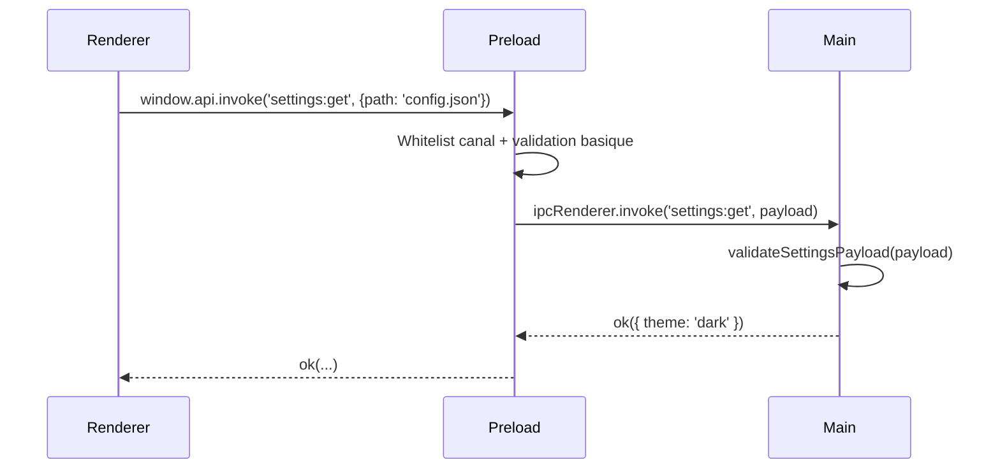
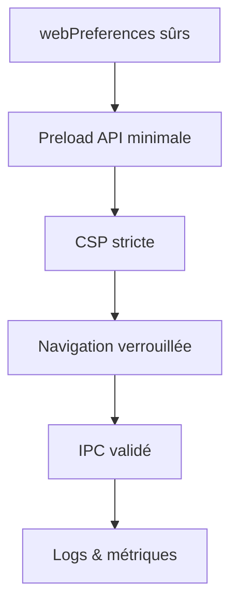

# 📘 3. Sécurité d’abord (Preload, sandbox, CSP)

> 🎯 **Objectif du chapitre**  
> Déployer une **sécurité de bout en bout** dans votre app Electron : isolation stricte (`contextIsolation`), **API Preload** minimale avec `contextBridge`, **sandbox** renforcée, **CSP** (Content Security Policy) stricte, **navigation verrouillée** et **IPC sécurisé** avec validation. 
> À la fin, vous disposerez d’une **checklist** et d’un **atelier** pour auditer rapidement votre configuration.

---

## 🧩 3.1 Modèle de menace et principes

**Définition.** Le **modèle de menace** décrit *qui* pourrait attaquer, *par quels vecteurs* (XSS, navigation externe, canaux IPC, lecture/écriture de fichiers), et *quelles conséquences* (exécution de code, exfiltration de données).

**Principes clés :**
- **Moindre privilège** : n’exposer que ce qui est nécessaire.
- **Isolation** : séparer les mondes JS (Renderer vs Preload/Main).
- **Validation** : vérifier **chaque entrée** (types, formats, tailles, chemins).
- **Défense en profondeur** : combiner plusieurs barrières (CSP, sandbox, whitelists).

**Formule (JavaScript) — Capabilities minimales**
```javascript
// API exposée côté Preload : minimale et immuable
const API = Object.freeze({
  appVersion: () => '0.1.0',
  readSettings: () => {/* lecture sûre par IPC */},
});
```

---

## 🧩 3.2 Preload + `contextBridge` : barrière sûre

**Définition.** Le **Preload** s’exécute *avant* le Renderer et peut exposer une **API contrôlée** via `contextBridge.exposeInMainWorld`, sans donner accès direct à Node (grâce à `nodeIntegration: false`).

**Pourquoi ?**  
C’est votre **portier** : il **autorise** des capacités **spécifiques** (lecture d’un fichier de configuration, ouvrir un dialog) et **refuse** le reste.

```javascript
// preload.js
const { contextBridge, ipcRenderer } = require('electron');

function isSafeKey(key) {
  return ['settings:get', 'dialog:open'].includes(key);
}

contextBridge.exposeInMainWorld('api', Object.freeze({
  invoke: (channel, payload) => {
    if (!isSafeKey(channel)) throw new Error('Canal interdit');
    // Validation simple : types et taille
    if (payload && typeof payload !== 'object') throw new Error('Payload invalide');
    return ipcRenderer.invoke(channel, payload);
  },
  appVersion: () => '0.1.0'
}));
```

> ⚠️ **Ne jamais** exposer `require`, `process`, `fs` ou toute API Node côté Renderer.

---

## 🧩 3.3 `webPreferences` et sandbox

**Paramètres indispensables (Main → BrowserWindow)**
```javascript
const WEB_PREFS = Object.freeze({
  preload: require('path').join(__dirname, 'preload.js'),
  nodeIntegration: false,
  contextIsolation: true,
  sandbox: true,
  webviewTag: false,
  devTools: true,
  enableRemoteModule: false,
});
```

- `sandbox: true` : réduit la surface d’attaque du Renderer.
- `webviewTag: false` : évite l’API `webview` (source d’attaques si mal configurée).
- `enableRemoteModule: false` : le module `remote` est **déconseillé**.

**Formule (JavaScript) — verrouillage des options**
```javascript
function lockPrefs(prefs) {
  return Object.freeze({ ...prefs });
}
const LOCKED_PREFS = lockPrefs(WEB_PREFS);
```

---

## 🧩 3.4 CSP (Content Security Policy) stricte

**Définition.** La **CSP** déclare les **sources autorisées** pour scripts, styles, images, etc. Elle **bloque** l’injection de scripts non prévus (XSS).

**Meta tag (Renderer — local)**
```html
<meta http-equiv="Content-Security-Policy"
      content="default-src 'self'; script-src 'self'; style-src 'self' 'unsafe-inline'; img-src 'self' data:; connect-src 'self'"> 
```

- `default-src 'self'` : tout doit venir de l’app.
- `script-src 'self'` : aucun script externe.
- `style-src 'self' 'unsafe-inline'` : autorise le style inline uniquement si nécessaire; privilégiez fichiers CSS.
- `img-src 'self' data:` : images locales ou `data:`.
- `connect-src 'self'` : pas de requêtes réseau externes.

**Formule (JavaScript) — whitelist basique des schémas**
```javascript
const ALLOWED_PROTOCOLS = Object.freeze(['file:', 'data:']);
function isAllowedUrl(url) {
  try { const u = new URL(url); return ALLOWED_PROTOCOLS.includes(u.protocol); } catch { return false; }
}
```

---

## 🧩 3.5 Verrouiller la **navigation** et l’ouverture de fenêtres

Empêchez le Renderer d’ouvrir des pages externes ou nouvelles fenêtres non maîtrisées :

```javascript
// main.js
app.whenReady().then(() => {
  const win = new BrowserWindow({ webPreferences: LOCKED_PREFS });
  win.loadFile('index.html');

  // Bloque les navigations sortantes
  win.webContents.on('will-navigate', (event, url) => {
    if (!isAllowedUrl(url)) { event.preventDefault(); }
  });

  // Bloque l'ouverture de nouvelles fenêtres
  win.webContents.setWindowOpenHandler(({ url }) => {
    return { action: isAllowedUrl(url) ? 'allow' : 'deny' };
  });
});
```

> 💡 **Analogie** : Imaginez un **musée** : les visiteurs (Renderer) ne doivent pas franchir les portes vers l’extérieur sans surveillance (Main).

---

## 🧩 3.6 IPC sécurisé (Main)

**Canaux nommés et validation systématique**
```javascript
// main.js
const { ipcMain } = require('electron');

function validateSettingsPayload(p) {
  if (!p || typeof p !== 'object') return false;
  if ('path' in p) {
    // Empêche traversée de répertoires : 
    // ex. '../../etc/passwd' (Windows/macOS)
    const invalid = /\\|\.\./.test(String(p.path));
    if (invalid) return false;
  }
  return true;
}

ipcMain.handle('settings:get', async (event, payload) => {
  if (!validateSettingsPayload(payload)) throw new Error('Payload invalide');
  // Lecture sûre (ex: via app.getPath('userData'))
  return { theme: 'dark', locale: 'fr-CA' };
});
```

**Formule (JavaScript) — schéma de réponse standardisé**
```javascript
function ok(data){ return Object.freeze({ ok: true, data }); }
function fail(message){ return Object.freeze({ ok: false, error: String(message) }); }
```

---

## 🧩 3.7 Interdictions fréquentes

- ❌ `eval`, `Function('...')` et équivalents.
- ❌ `nodeIntegration: true` en Renderer.
- ❌ Charger du **HTTP externe** non maîtrisé.
- ❌ Exposer des **chemins** bruts ou des API de fichiers sans validation.
- ❌ Utiliser `remote` (préférez IPC + Preload).

---

## 🧩 3.8 Journalisation et détection

- **Logs** côté Main et Renderer (sans secrets).
- **Compteurs** de tentatives d’accès refusés.
- **Mesures** : temps de démarrage, latence IPC.

**Formule (JavaScript) — compteur simple**
```javascript
const metrics = Object.freeze({ blockedNav: { count: 0 } });
function incBlockedNav(){ metrics.blockedNav.count += 1; }
```

---

## 🛠️ 3.9 Atelier d’audit (pas-à-pas)

1. **Vérifier** `webPreferences` : `nodeIntegration: false`, `contextIsolation: true`, `sandbox: true`, `webviewTag: false`, `enableRemoteModule: false`.
2. **Mettre en place** une **CSP** stricte dans `index.html` (copier le meta tag proposé).
3. **Implémenter** `contextBridge` (API minimaliste) + **whitelist** des canaux IPC.
4. **Bloquer** `will-navigate` et `setWindowOpenHandler` pour tout ce qui n’est pas `file:`/`data:`.
5. **Ajouter** une **validation** côté Main sur **chaque** `ipcMain.handle`.
6. **Tester** : tentatives de navigation externe, payload IPC invalide, chemins suspects.

---

## 🖼️ 3.10 Schémas (Mermaid)

**Barrière Preload et IPC sécurisé**


**Défense en profondeur**


---

## 🧪 3.11 (Aperçu) Tests sécurité

- **Unitaires** : validation de payloads; whitelists de canaux.
- **E2E** : vérification que les navigations externes sont **bloquées**.
- **Audit manuel** : inspection des flags de `webPreferences`.

```javascript
// Pseudo-tests
console.assert(isAllowedUrl('file:///index.html'), 'file: autorisé');
console.assert(!isAllowedUrl('https://inconnu'), 'https: interdit');
```

---

## 🔚 3.12 Résumé — Points essentiels

- **Preload + contextBridge** : exposez une **API minimale** et immuable.
- **webPreferences** : `nodeIntegration: false`, `contextIsolation: true`, `sandbox: true`, `webviewTag: false`, `enableRemoteModule: false`.
- **CSP stricte** : `default-src 'self'`, **pas** de scripts externes.
- **Navigation verrouillée** : bloquez `will-navigate` et contrôlez `setWindowOpenHandler`.
- **IPC sécurisé** : canaux whitelistés + **validation systématique** des payloads.
- **Logs & métriques** : détecter les comportements anormaux.

---

> ✅ **Livrable** : `04-securite-preload-csp.md` (ce fichier), prêt pour Obsidian.
