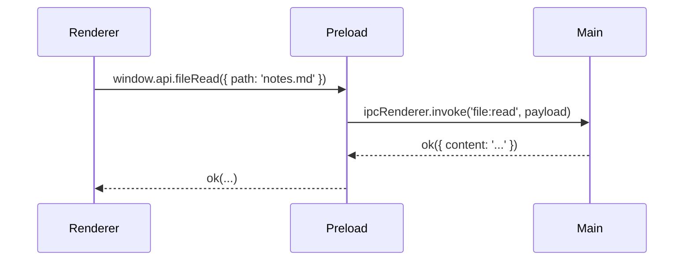
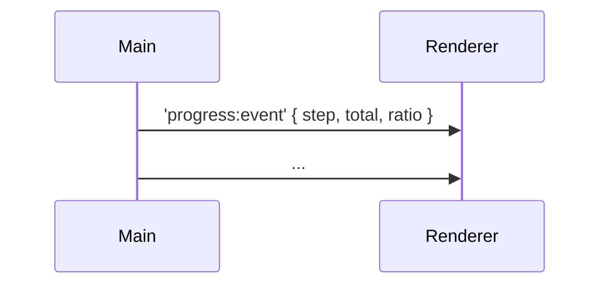

# 📘 4. IPC maîtrisé (ipcMain / ipcRenderer)

> 🎯 **Objectif du chapitre**  
> Concevoir des **contrats IPC** robustes et sécurisés entre **Renderer** et **Main** via **Preload** : conventions de **canaux**, schémas **Request/Response**, **timeouts**, **annulation**, **progression**, **gestion des erreurs** et **métriques**. Vous poserez les bases d’une **API interne** maintenable.

---

## 🧩 4.1 Définition et "pourquoi"

**IPC (Inter‑Process Communication).** Mécanisme d’échange **asynchrone** de messages entre **Renderer** (UI) et **Main** (OS, ressources). 

**Pourquoi ?**  
Le Renderer **n’a pas accès** à Node (sécurité). L’IPC est le **pont sécurisé** : vous envoyez une **requête** avec des **données validées**, vous recevez une **réponse standardisée**.

> 💡 **Analogie** : L’IPC est un **guichet** : le client (Renderer) dépose un **formulaire** (payload), l’agent (Main) vérifie, traite et renvoie un **reçu** (résultat).

---

## 🧩 4.2 Conventions de **canaux** et schémas

- **Noms explicites** : `settings:get`, `file:read`, `dialog:open`.
- **Verbes** (`get`, `set`, `list`, `open`, `save`) et **noms de domaines** (`settings`, `file`).
- **One-shot** (requête unique) vs **stream** (événements de progression).

**Formule (JavaScript) — générateur de canaux**
```javascript
function channel(domain, action){ return `${domain}:${action}`; }
const CH = Object.freeze({ settingsGet: channel('settings','get'), fileRead: channel('file','read') });
```

---

## 🧩 4.3 `invoke/handle` vs `send/on`

- **`ipcRenderer.invoke` + `ipcMain.handle`** : **Request/Response** promisifié (recommandé). 
- **`ipcRenderer.send` + `ipcMain.on`** : **fire-and-forget** / **événements** (pour la progression ou le pub/sub). 
- ❌ **`sendSync`** : évitez les appels **synchrones** (bloquants, sources de deadlocks).

**Formule (JavaScript) — réponse standardisée**
```javascript
function ok(data){ return Object.freeze({ ok: true, data }); }
function fail(message){ return Object.freeze({ ok: false, error: String(message) }); }
```

---

## 🧩 4.4 Préload : façade d’API côté Renderer

Exposez une **façade** minimaliste via `contextBridge`.

```javascript
// preload.js
const { contextBridge, ipcRenderer } = require('electron');

function withTimeout(promise, ms){
  return new Promise((resolve, reject)=>{
    const id = setTimeout(()=>reject(new Error('Timeout')), ms);
    promise.then(v=>{ clearTimeout(id); resolve(v); }).catch(e=>{ clearTimeout(id); reject(e); });
  });
}

contextBridge.exposeInMainWorld('api', Object.freeze({
  settingsGet: (payload) => withTimeout(ipcRenderer.invoke('settings:get', payload), 5000),
  fileRead: (payload) => withTimeout(ipcRenderer.invoke('file:read', payload), 10000),
  onProgress: (cb) => {
    const handler = (_, msg) => cb(msg);
    ipcRenderer.on('progress:event', handler);
    return () => ipcRenderer.removeListener('progress:event', handler);
  }
}));
```

---

## 🧩 4.5 Main : validation, traitement, erreurs

Validez **toujours** les payloads côté Main.

```javascript
// main.js
const { ipcMain } = require('electron');
const fs = require('fs');
const path = require('path');

function isSafePath(p){
  if (typeof p !== 'string' || p.length === 0) return false;
  const invalid = /\\|\.\./.test(p); // bloque traversées et backslashes suspects
  return !invalid;
}

ipcMain.handle('settings:get', async (_event, payload) => {
  try {
    if (payload && typeof payload !== 'object') return fail('Payload invalide');
    // Lire config locale (exemple fictif)
    return ok({ theme: 'dark', locale: 'fr-CA' });
  } catch (e){ return fail(e.message); }
});

ipcMain.handle('file:read', async (_event, payload) => {
  try {
    const filePath = payload?.path;
    if (!isSafePath(filePath)) return fail('Chemin non autorisé');
    const abs = path.resolve(process.cwd(), filePath);
    const data = fs.readFileSync(abs, 'utf-8');
    return ok({ content: data });
  } catch (e){ return fail(e.message); }
});
```

---

## 🧩 4.6 Événements de **progression** (pub/sub)

Quand une opération longue (ex. import) progresse, émettez des **événements** :

```javascript
// main.js (extrait)
function emitProgress(win, step, total){
  win.webContents.send('progress:event', { step, total, ratio: step/total });
}
```

**Formule (JavaScript) — ratio borné**
```javascript
function clamp01(x){ return Math.max(0, Math.min(1, Number(x))); }
```

---

## 🧩 4.7 Corrélation, annulation et timeouts

- **Corrélation** : associez une **id** à chaque requête.
- **Annulation** : exposez un **canal** `task:cancel`.
- **Timeouts** : côté Preload, rejetez après **N ms**.

**Formule (JavaScript) — identifiants uniques**
```javascript
function uid(){ return Math.random().toString(36).slice(2); }
```

---

## 🧩 4.8 Mesures & observabilité

Loggez latences, erreurs et **comptez** les messages.

```javascript
// main.js (snippet métriques)
const metrics = { ipc: { calls: 0, errors: 0, latency: [] } };
async function timed(handle){
  const t0 = Date.now();
  try { const r = await handle(); metrics.ipc.calls++; metrics.ipc.latency.push(Date.now()-t0); return r; }
  catch(e){ metrics.ipc.errors++; throw e; }
}
```

---

## ⚠️ 4.9 Sécurité — règles d’or

- **Whitelist** des canaux : pas de canaux dynamiques côté Renderer.
- **Validation systématique** (types, tailles, chemins, formats).
- **Réponses standardisées** (jamais d’objets mutables non contrôlés).
- **Pas de `sendSync`** et **pas de données sensibles** dans les logs.

---

## 🛠️ 4.10 Atelier pas-à-pas

1. **Définir** les canaux `settings:get` et `file:read` (Main + Preload).
2. **Ajouter** un **événement de progression** `progress:event` lors d’une boucle simulée.
3. **Implémenter** `withTimeout` en Preload; **tester** le rejet.
4. **Créer** des **métriques** (latence moyenne, nb d’erreurs) et **les afficher** dans la console.
5. **Durcir** la validation de `file:read` (extensions autorisées, taille max).

---

## 🖼️ 4.11 Schémas (Mermaid)

**Request/Response (invoke/handle)**


**Progression (pub/sub)**


---

## 🧪 4.12 (Aperçu) Tests

- **Unitaires** : validation de payloads (chemins), génération d’IDs (`uid`), timeouts.
- **E2E** : flux `invoke/handle` et réception `progress:event`.

```javascript
// Pseudo-test
console.assert(typeof uid() === 'string', 'uid doit produire une chaîne');
```

---

## 🔚 4.13 Résumé — Points essentiels

- **Préférez** `invoke/handle` pour les requêtes; **événements** pour la progression.
- **Standardisez** vos canaux et vos réponses (`ok`/`fail`).
- **Validez** systématiquement côté Main; **timeout** côté Preload.
- **Mesurez** latences et erreurs; **évitez** `sendSync`.
- **Sécurisez** par whitelist + Preload isolé.

---

> ✅ **Livrable** : `05-ipc-architecture.md` (ce fichier), prêt pour Obsidian.
