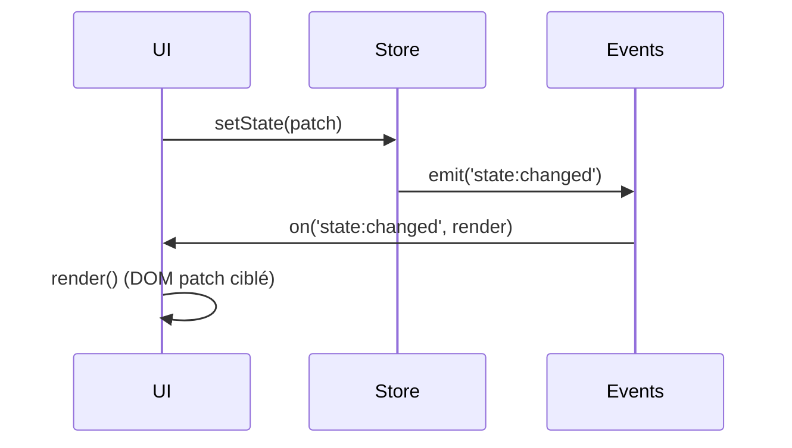

# 📘 5. Interface Renderer (Vanilla JS)

> 🎯 **Objectif du chapitre**  
> Construire une **UI maintenable et sécurisée** en **Vanilla JavaScript** (sans framework) : architecture de composants, gestion d’**état**, **routing** minimal, **accessibilité**, **thèmes** (clair/sombre), appels IPC via `window.api`, **performance** (éviter reflows, `DocumentFragment`, `requestAnimationFrame`) et **CSP-friendly** (pas d’`innerHTML` non sûr).

---

## 🧩 5.1 Renderer : définition et pourquoi

**Définition.** Le **Renderer** est le **document HTML** chargé dans chaque `BrowserWindow` ; il contient le **DOM**, le **CSS** et le **JS** d’interface. 

**Pourquoi une architecture ?**  
Sans framework, vous avez besoin d’**organisation** (composants, état, événements) pour éviter le **spaghetti code**. Une UI bien structurée facilite la **sécurité** (CSP), la **performance** (rendus ciblés) et l’**évolutivité**.

---

## 🧩 5.2 Structure des fichiers (Renderer)

```
renderer/
  index.html
  styles.css
  app.js            // bootstrap et routing
  core/dom.js       // helpers DOM (create, mount, clear)
  core/events.js    // pub/sub minimal
  core/router.js    // hash routing
  core/store.js     // état global + actions
  components/
    header.js
    sidebar.js
    note-list.js
    note-editor.js
    statusbar.js
```

---

## 🧩 5.3 Composants en Vanilla JS

**Définition.** Un **composant** est un **module** qui **rend** une portion d’UI et **s’abonne** aux événements/état pertinents.

**Pourquoi ?**  
Séparer en composants limite les effets de bord et clarifie les responsabilités.

**Formule (JavaScript) — contrat d’un composant**
```javascript
function defineComponent({ id, init, render, destroy }){
  return Object.freeze({ id, init, render, destroy });
}
```

---

## 🧩 5.4 Helpers DOM sûrs (CSP-friendly)

Évitez `innerHTML` non maîtrisé; préférez **création déclarative** et **`textContent`**.

```javascript
// core/dom.js
export function el(tag, attrs = {}, children = []){
  const node = document.createElement(tag);
  for (const [k,v] of Object.entries(attrs)){
    if (k === 'class') node.className = v; else node.setAttribute(k, v);
  }
  for (const child of children){
    if (typeof child === 'string'){ node.appendChild(document.createTextNode(child)); }
    else if (child) node.appendChild(child);
  }
  return node;
}
export function mount(parent, node){ parent.appendChild(node); }
export function clear(node){ while(node.firstChild) node.removeChild(node.firstChild); }
export function frag(){ return document.createDocumentFragment(); }
```

---

## 🧩 5.5 Pub/Sub minimal (événements d’app)

Un **bus d’événements** simple améliore le **découplage**.

```javascript
// core/events.js
const listeners = new Map();
export function on(topic, fn){
  if (!listeners.has(topic)) listeners.set(topic, new Set());
  listeners.get(topic).add(fn);
  return () => listeners.get(topic).delete(fn);
}
export function emit(topic, payload){
  (listeners.get(topic) || []).forEach(fn => { try { fn(payload); } catch(e){ console.error(e); } });
}
```

**Analogie.** Le bus est un **journal d’annonces** : chacun s’abonne aux rubriques qui l’intéressent.

---

## 🧩 5.6 État global (store) et actions

**Définition.** Le **store** contient l’**état** (notes, sélection, thème) et des **actions** pour le modifier.

```javascript
// core/store.js
const state = Object.freeze({ notes: [], selectedId: null, theme: 'light' });
let current = { ...state };

export function getState(){ return Object.freeze({ ...current }); }
export function setState(patch){ current = { ...current, ...patch }; emit('state:changed', getState()); }
export function addNote(note){ setState({ notes: [...current.notes, note] }); }
export function selectNote(id){ setState({ selectedId: id }); }
export function setTheme(t){ setState({ theme: t }); }
```

**Formule (JavaScript) — immutabilité naïve**
```javascript
function assign(obj, patch){ return Object.freeze({ ...obj, ...patch }); }
```

---

## 🧩 5.7 Routing minimal (hash)

**Principe.** Utiliser `location.hash` pour des **vues** simples (ex. `#notes`, `#settings`).

```javascript
// core/router.js
const routes = new Map();
export function register(path, handler){ routes.set(path, handler); }
export function start(){
  window.addEventListener('hashchange', () => navigate(location.hash || '#notes'));
  navigate(location.hash || '#notes');
}
function navigate(path){ const fn = routes.get(path); if (fn) fn(); }
```

---

## 🧩 5.8 Thèmes (CSS variables)

**Approche.** Basculer **clair/sombre** via variables CSS et une classe racine.

```css
/* styles.css */
:root { --bg: #ffffff; --fg: #111111; --accent: #4a90e2; }
:root.dark { --bg: #0f1115; --fg: #e6e6e6; --accent: #7aa2f7; }
body { background: var(--bg); color: var(--fg); }
.btn { background: var(--accent); color: #fff; }
```

**Formule (JavaScript) — bascule de thème**
```javascript
function applyTheme(theme){ document.documentElement.classList.toggle('dark', theme === 'dark'); }
```

---

## 🧩 5.9 Accessibilité (A11y) de base

- **Roles ARIA** (ex. `role="list"`, `role="textbox"`).
- **Focus & clavier** : `tabindex`, `aria-selected`, raccourcis.
- **Couleurs** : contraste **AA**.

```javascript
// Exemple : liste de notes
const list = el('ul', { role: 'list' }, []);
```

---

## 🧩 5.10 Performance : patterns pratiques

- **`DocumentFragment`** pour insertions groupées.
- **Event delegation** (écouter sur le parent).
- **`requestAnimationFrame`** pour animations/rendus.
- **Éviter** les mesures synchrones (`offsetHeight`) répétées.

**Formule (JavaScript) — debounce/throttle**
```javascript
export function debounce(fn, ms){ let id; return (...a)=>{ clearTimeout(id); id=setTimeout(()=>fn(...a), ms); }; }
export function throttle(fn, ms){ let last=0; return (...a)=>{ const t=Date.now(); if (t-last>ms){ last=t; fn(...a); } }; }
```

---

## 🧩 5.11 Intégration IPC via `window.api`

Le Renderer **n’appelle jamais** Node directement : il passe par **Preload** (`window.api`).

```javascript
// app.js (extraits)
import { on, emit } from './core/events.js';
import { getState, setTheme, addNote, selectNote } from './core/store.js';

async function bootstrap(){
  const version = await window.api.settingsGet({});
  console.log('Version app', version);
}

on('notes:add', async (payload)=>{
  const r = await window.api.fileRead({ path: payload.path });
  if (r?.ok) addNote({ id: payload.id, content: r.data.content });
});
```

---

## 🧩 5.12 Composants concrets (liste & éditeur)

**note-list.js** : rend la liste, s’abonne à `state:changed`, **delegation** pour les clics.

```javascript
// components/note-list.js
import { el, clear, mount, frag } from '../core/dom.js';
import { on, emit } from '../core/events.js';
import { getState, selectNote } from '../core/store.js';

export function NoteList(container){
  function render(){
    const s = getState();
    clear(container);
    const f = frag();
    const ul = el('ul', { class: 'note-list', role: 'list' });
    s.notes.forEach(n => {
      const li = el('li', { 'data-id': n.id, class: n.id===s.selectedId?'selected':'' }, [n.id]);
      ul.appendChild(li);
    });
    f.appendChild(ul);
    mount(container, f);
  }
  container.addEventListener('click', (e)=>{
    const li = e.target.closest('li[data-id]');
    if (li){ selectNote(li.getAttribute('data-id')); }
  });
  on('state:changed', render);
  render();
}
```

**note-editor.js** : éditeur de texte, **throttling** des sauvegardes.

```javascript
// components/note-editor.js
import { el, clear, mount } from '../core/dom.js';
import { on } from '../core/events.js';
import { getState } from '../core/store.js';
import { throttle } from '../core/perf.js';

export function NoteEditor(container){
  let textarea = el('textarea', { class: 'editor', role: 'textbox' }, []);
  textarea.addEventListener('input', throttle(()=>{
    console.log('Sauvegarde…');
  }, 1000));
  mount(container, textarea);
  function render(){
    const s = getState();
    const note = s.notes.find(n=>n.id===s.selectedId);
    textarea.value = note ? note.content : '';
  }
  on('state:changed', render);
  render();
}
```

---

## 🧩 5.13 Bootstrap de l’app (Renderer)

**`app.js`** : monter les composants, démarrer le router, appliquer le thème.

```javascript
// app.js
import { NoteList } from './components/note-list.js';
import { NoteEditor } from './components/note-editor.js';
import { start as startRouter } from './core/router.js';
import { getState, setTheme } from './core/store.js';

function main(){
  const listContainer = document.getElementById('list');
  const editorContainer = document.getElementById('editor');
  NoteList(listContainer);
  NoteEditor(editorContainer);
  startRouter();
  setTheme('dark');
}

document.addEventListener('DOMContentLoaded', main);
```

---

## ⚠️ 5.14 Sécurité côté UI

- **Jamais** d’`innerHTML` avec des données non sûres; utilisez `textContent`.
- **CSP stricte** déjà posée (chap. 3) ; ne chargez pas de scripts externes.
- **Validation** côté Main pour tout contenu issu de fichiers.

---

## 🛠️ 5.15 Atelier pas-à-pas

1. **Créez** l’arborescence `renderer/` et les modules `core/` et `components/`.
2. **Implémentez** le **store** (état, actions), le **bus** (events) et les **helpers DOM**.
3. **Réalisez** la **liste de notes** et l’**éditeur** (sélection, rendu, throttling).
4. **Ajoutez** le **routing** (hash) et les **thèmes** (CSS variables + JS).
5. **Connectez** l’IPC via `window.api` (lecture de fichier simulée) et **tracez** les métriques.

---

## 🖼️ 5.16 Schémas (Mermaid)

**Arbre de composants**
```mermaid
flowchart TD
  A[App (Renderer)] --> B[Header]
  A --> C[Sidebar]
  A --> D[NoteList]
  A --> E[NoteEditor]
  A --> F[StatusBar]
```

**Flux d’état et rendu**


---

## 🧪 5.17 (Aperçu) Tests UI

- **Unitaires** : helpers DOM (création/montage), store (reducers naïfs), perf (debounce/throttle).
- **E2E** (plus tard) : cliquer sur la liste, éditer le texte, vérifier le rendu.

```javascript
// Pseudo-test
console.assert(typeof document.createDocumentFragment === 'function', 'DocumentFragment doit exister');
```

---

## 🔚 5.18 Résumé — Points essentiels

- **Architecture de composants** : modules clairs, responsabilités séparées.
- **État global** + **pub/sub** : rendu réactif sans framework.
- **Routing** minimal et **thèmes** via CSS variables.
- **Performance** : `DocumentFragment`, delegation, throttle/debounce.
- **Sécurité** : pas d’`innerHTML` non sûr, CSP stricte, `window.api` pour IPC.

---

> ✅ **Livrable** : `06-ui-renderer-vanilla.md` (ce fichier), prêt pour Obsidian.
