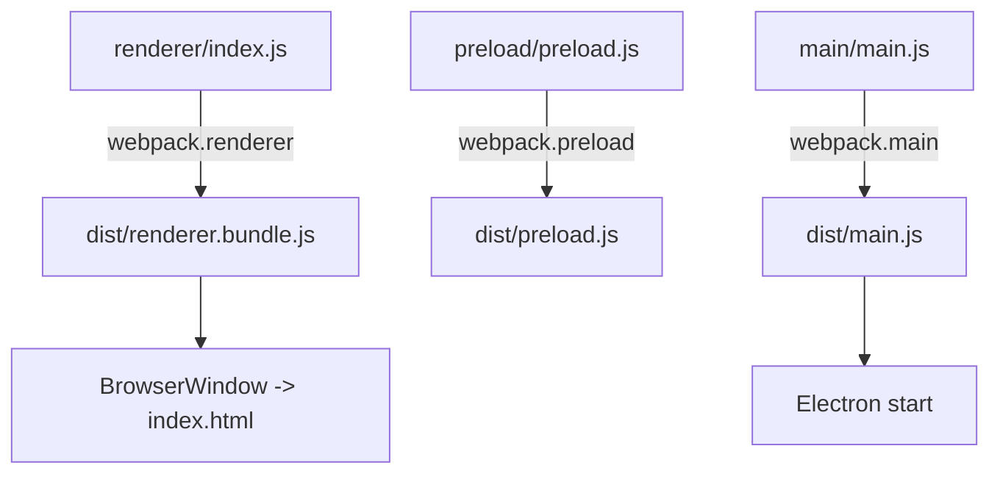
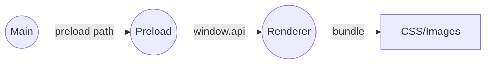

# 📘 6. Bundling avec Webpack (Main, Preload, Renderer)

> 🎯 **Objectif du chapitre**  
> Configurer **Webpack** pour bundler **séparément** les trois cibles d’Electron : **Main**, **Preload** et **Renderer**. Vous apprendrez à définir les **entrées**, choisir les **targets** (`electron-main`, `electron-preload`, `electron-renderer`), gérer **JS/CSS/Assets**, activer des **source maps**, poser des **alias**, injecter des **variables d’environnement**, et mettre en place des **scripts npm** de développement et de production (avec une option **HMR** en Renderer, tout en respectant la **CSP**).

---

## 🧩 6.1 Pourquoi bundler ? Définitions

**Bundling (définition).** Processus qui **agrège** et **optimise** vos modules (JS/CSS/Images) en **artifacts** livrables pour l’application.

**Pourquoi ?**  
- **Organisation** : structure claire par **cibles** (Main/Preload/Renderer).  
- **Performance** : réduction de la taille, **cache**, sourcemaps contrôlés.  
- **Sécurité/discipline** : surfaces API et dépendances maîtrisées; **CSP** compatible.  
- **Portabilité** : outputs stables (`dist/`) pour packaging.

---

## 🧩 6.2 Arborescence recommandée

```
project-root/
  package.json
  main/
    main.js           // point d’entrée Main (src)
    webpack.main.js   // config Webpack dédiée
  preload/
    preload.js        // point d’entrée Preload (src)
    webpack.preload.js
  renderer/
    index.html        // UI de base
    styles.css        // styles globaux
    index.js          // point d’entrée Renderer
    webpack.renderer.js
  dist/
    main.js           // artifact Webpack (Main)
    preload.js        // artifact Webpack (Preload)
    renderer.bundle.js// artifact Webpack (Renderer)
```

---

## 🧩 6.3 Cibles Webpack (`target`) et entrées

- **Main** : `target: 'electron-main'` — s’exécute dans Node intégré à Electron.  
- **Preload** : `target: 'electron-preload'` — script isolé qui expose des API sécurisées.  
- **Renderer** : `target: 'electron-renderer'` — s’exécute dans Chromium (DOM, CSS, etc.).

**Formule (JavaScript) — fabrique de config minimale**
```javascript
function makeConfig({ entry, target, outFile, mode='development' }){
  return Object.freeze({
    mode,
    target,
    entry,
    output: { path: require('path').resolve(__dirname, '../dist'), filename: outFile },
    devtool: mode === 'development' ? 'eval-cheap-module-source-map' : 'source-map',
    module: { rules: [] },
    resolve: { extensions: ['.js', '.json'], alias: {} }
  });
}
```

---

## 🧩 6.4 Config **Main** — `webpack.main.js`

Points clés : **pas** de loaders DOM, **source maps** utiles, **externals** éventuels.

- `entry: './main/main.js'`  
- `target: 'electron-main'`  
- `output: dist/main.js`

**Bonnes pratiques** :
- **Journaliser** le démarrage (`console.log`) avec sourcemaps en dev.
- **Ne pas** bundler de modules natifs non testés (voir chap. 16). 

---

## 🧩 6.5 Config **Preload** — `webpack.preload.js`

Points clés : **API minimaliste**, **aucun accès direct** au DOM; sourcemaps utiles.

- `entry: './preload/preload.js'`  
- `target: 'electron-preload'`  
- `output: dist/preload.js`

**Rappel sécurité** : le Preload est votre **portier** — exposez **peu** et **validez** via IPC (chap. 3–4).

---

## 🧩 6.6 Config **Renderer** — `webpack.renderer.js`

Points clés : loaders **CSS/Assets**, output **`renderer.bundle.js`**, **CSP-friendly**.

- `entry: './renderer/index.js'`  
- `target: 'electron-renderer'`  
- `output: dist/renderer.bundle.js`

**Loaders typiques (exemples)** :
- **JS** : `babel-loader` (optionnel)  
- **CSS** : `style-loader` ou extraction (plugin)  
- **Assets** : `asset/resource` pour images, icônes.

**Formule (JavaScript) — règle asset générique**
```javascript
const assetRule = { test: /\.(png|jpg|svg|gif)$/i, type: 'asset/resource' };
```

---

## 🧩 6.7 Intégration **index.html** & CSP

Dans `index.html`, chargez le bundle Renderer :

```html
<script defer src="../dist/renderer.bundle.js"></script>
```

- **CSP** (chap. 3) : `script-src 'self'` autorise les scripts packagés locaux.  
- **Styles** : privilégiez **fichiers CSS** (`<link rel="stylesheet" href="styles.css">`).  
- **Optionnel HMR** : si vous utilisez `webpack-dev-server`, ajoutez `connect-src` pour `ws:` **en dev seulement**.

**Formule (JavaScript) — ajustement CSP en dev**
```javascript
const isDev = process.env.NODE_ENV !== 'production';
const CSP_CONNECT = isDev ? "connect-src 'self' ws:" : "connect-src 'self'";
```

---

## 🧩 6.8 Scripts npm (dev & prod)

**Proposition simple** sans utilitaires externes :

```
"scripts": {
  "build:main": "webpack --config main/webpack.main.js",
  "build:preload": "webpack --config preload/webpack.preload.js",
  "build:renderer": "webpack --config renderer/webpack.renderer.js",
  "build": "npm run build:main && npm run build:preload && npm run build:renderer",
  "start": "electron .",
  "dev": "npm run build && electron .",
  "watch:renderer": "webpack --config renderer/webpack.renderer.js --watch"
}
```

> 🧠 **Astuce** : lancez `watch:renderer` dans un **second terminal** pour regénérer le bundle en continu pendant que `electron .` tourne.

---

## 🧩 6.9 Alias & variables d’environnement

**Alias** pour raccourcir les imports (Renderer) :
```javascript
resolve: { alias: { '@': require('path').resolve(__dirname, './') } }
```

**Variables** (ex. `process.env.APP_NAME`) via **DefinePlugin** :
```javascript
const webpack = require('webpack');
plugins: [ new webpack.DefinePlugin({ 'process.env.APP_NAME': JSON.stringify('Mini-Obsidian') }) ]
```

> ⚠️ **Ne mettez jamais** de secrets dans les bundles Renderer.

---

## 🧩 6.10 Source maps & modes

- **Dev** : `eval-cheap-module-source-map` (rapide, détail suffisant).  
- **Prod** : `source-map` (fichiers `.map` séparés), **sans** exposer de chemins sensibles.

**Formule (JavaScript) — choix du `devtool`**
```javascript
function devtoolFor(mode){ return mode==='development' ? 'eval-cheap-module-source-map' : 'source-map'; }
```

---

## 🧩 6.11 HMR (optionnel, Renderer) — précautions CSP

**webpack-dev-server** peut fournir **HMR** côté Renderer. 

- Ajoutez `connect-src 'self' ws:` dans **CSP** en **dev**.  
- **Ne jamais** utiliser HMR en **production**.  
- **Alternative** : `--watch` + reload manuel.

---

## 🧩 6.12 Différences Windows vs macOS (chemins/ICU)

- **Séparateurs de chemins** : utilisez **`path.join`**/**`path.resolve`** (pas de concat chaînes).  
- **Encodage** : restez en **UTF‑8** pour le texte; tests sur les deux OS.  
- **Icônes** : packaging (chap. 10) exige formats différents (ICO vs ICNS).

---

## 🧩 6.13 Pipeline & schémas (Mermaid)

**Pipeline de build**


**Couches et responsabilités**


---

## 🛠️ 6.14 Atelier pas-à-pas

1. **Créer** les 3 configs `webpack.main.js`, `webpack.preload.js`, `webpack.renderer.js` avec `target` adaptés et `output` dans `dist/`.  
2. **Brancher** le **Renderer** (`index.html` → `renderer.bundle.js`) et vérifier la **CSP**.  
3. **Ajouter** loaders **CSS** et **assets** (images/svg).  
4. **Configurer** **source maps** selon `NODE_ENV`.  
5. **Mettre en place** les **scripts npm** `build:*`, `build`, `dev`, `watch:renderer`.  
6. *(Optionnel)* **Activer HMR** avec `webpack-dev-server` et adapter la **CSP** en dev.

---

## 🧪 6.15 (Aperçu) Tests du bundling

- **Smoke test** : après `npm run build`, les 3 fichiers existent dans `dist/` et l’app démarre.  
- **Source maps** : en DevTools, les lignes correspondent au code source.  
- **CSP** : aucun blocage inattendu; pas de scripts externes.

```javascript
// Pseudo-test
console.assert(typeof process.env.APP_NAME === 'string', 'DefinePlugin doit injecter APP_NAME');
```

---

## 🔚 6.16 Résumé — Points essentiels

- **Bundle séparé** pour **Main/Preload/Renderer** avec `target` adaptés.  
- **Outputs** stables dans `dist/` + **scripts npm** pour dev/prod.  
- **Loaders** JS/CSS/Assets côté Renderer, **aucun DOM** côté Main/Preload.  
- **CSP** compatible : scripts **locaux** uniquement; ajuster `connect-src` en **dev** si HMR.  
- **Source maps** : rapides en dev, précises en prod, sans fuite d’infos sensibles.  
- **Alias/variables** : pratiques mais **sans secrets**.

---

> ✅ **Livrable** : `07-bundling-webpack.md` (ce fichier), prêt pour Obsidian.
