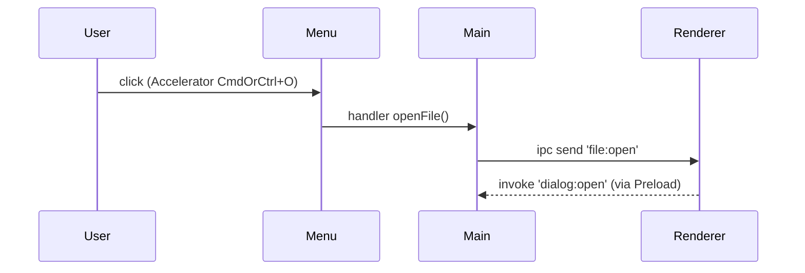
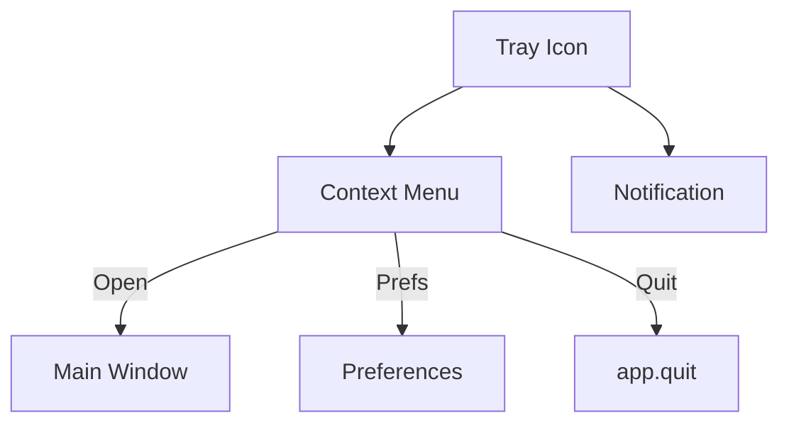

# 📘 7. Intégrations OS (Menus, Tray, Dialogs, Clipboard, Notifications)

> 🎯 **Objectif du chapitre**  
> Exploiter les **intégrations natives** d’Electron pour une **UX desktop** : **Menu** d’application et contextuel, **Tray** (icône + menu), **Dialog** (ouvrir/sauver/message), **Clipboard** (copier/coller), **Notifications** système, **shell.openExternal**. Vous apprendrez les **spécificités Windows/macOS**, les **rôles** et **accelerators**, les **icônes** via `nativeImage`, et les **bonnes pratiques de sécurité** (URLs, extensions, validations).

---

## 🧩 7.1 Menus d’application (Menu, MenuItem)

**Définition.** Le **Menu** Electron est la **barre de menus** native (macOS en haut de l’écran; Windows dans la fenêtre) et des **menus contextuels** (clic droit).

**Pourquoi ?**  
Offrir des **raccourcis universels**, améliorer l’**accessibilité** (roles), et exposer des **actions globales** (Fichier, Édition, Affichage).

**Concepts clés :**
- `Menu.buildFromTemplate([...])` pour définir menus et sous‑menus.
- `role` (macOS) : `about`, `services`, `hide`, `hideOthers`, `unhide`, `quit`…
- `accelerator` : raccourcis clavier (`CmdOrCtrl+N`, `Alt+F`…).
- `submenu` : liste d’items imbriqués.

**Formule (JavaScript) — création d’un template multi‑OS**
```javascript
function makeAppMenu({ isMac }){
  const aboutRole = isMac ? { role: 'about' } : { label: 'À propos', click: () => openAbout() };
  return [
    ...(isMac ? [{ label: 'MonApp', submenu: [ aboutRole, { type: 'separator' }, { role: 'services' }, { role: 'hide' }, { role: 'hideOthers' }, { role: 'unhide' }, { type: 'separator' }, { role: 'quit' } ] }] : []),
    { label: 'Fichier', submenu: [ { label: 'Nouveau', accelerator: 'CmdOrCtrl+N', click: () => createNew() }, { label: 'Ouvrir…', accelerator: 'CmdOrCtrl+O', click: () => openFile() }, { type: 'separator' }, isMac ? { role: 'close' } : { role: 'quit' } ] },
    { label: 'Édition', submenu: [ { role: 'undo' }, { role: 'redo' }, { type: 'separator' }, { role: 'cut' }, { role: 'copy' }, { role: 'paste' } ] },
    { label: 'Affichage', submenu: [ { role: 'reload' }, { role: 'toggledevtools' }, { type: 'separator' }, { role: 'togglefullscreen' } ] },
    { label: 'Aide', submenu: [ { label: 'Site', click: () => safeOpenExternal('https://exemple.org') } ] }
  ];
}
```

**Menu contextuel (clic droit)**
```javascript
const { Menu } = require('electron');
function showContextMenu(win){
  const template = [ { label: 'Copier', role: 'copy' }, { label: 'Coller', role: 'paste' } ];
  Menu.buildFromTemplate(template).popup({ window: win });
}
```

---

## 🧩 7.2 Tray (icône de zone de notification)

**Définition.** Le **Tray** est l’**icône système** (Windows : barre des tâches; macOS : barre de menus) pour afficher un **menu rapide**.

**Pourquoi ?**  
Fournir un **accès instantané** à des actions (ouvrir/fermer, préférences, quitter), même sans fenêtre.

**Points clés :**
- `new Tray(nativeImage)` ; `setToolTip`, `setContextMenu`.
- **macOS** : privilégier icône **template** monochrome (`setImage` avec `nativeImage.setTemplateImage(true)`).
- **Windows** : `displayBalloon` (notification de tray) **spécifique**.

**Formule (JavaScript) — fabrique d’icône Tray**
```javascript
const { nativeImage, Tray, Menu } = require('electron');
function makeTrayIcon(){
  let img = nativeImage.createFromPath(require('path').join(__dirname, 'assets', 'tray.png'));
  if (process.platform === 'darwin') img.setTemplateImage(true);
  const tray = new Tray(img);
  tray.setToolTip('MonApp');
  const menu = Menu.buildFromTemplate([
    { label: 'Ouvrir', click: () => showMain() },
    { label: 'Préférences', click: () => openPrefs() },
    { type: 'separator' },
    { label: 'Quitter', click: () => require('electron').app.quit() }
  ]);
  tray.setContextMenu(menu);
  return tray;
}
```

---

## 🧩 7.3 Dialogs (ouvrir/sauver/message)

**Définition.** Les **Dialogs** sont les fenêtres natives d’**ouverture/sauvegarde** de fichiers et **messages**.

**Pourquoi ?**  
Garantir une **expérience OS** cohérente et **sécurisée** (filtres d’extension, dossiers).

**API principales :**
- `dialog.showOpenDialog({ properties, filters })`
- `dialog.showSaveDialog({ defaultPath, filters })`
- `dialog.showMessageBox({ type, buttons, message, detail })`
- `dialog.showErrorBox(title, content)`

**Formule (JavaScript) — filtre d’extensions**
```javascript
const MD_FILTERS = Object.freeze([{ name: 'Markdown', extensions: ['md', 'markdown'] }, { name: 'Texte', extensions: ['txt'] }]);
```

---

## 🧩 7.4 Clipboard (presse‑papiers)

**Définition.** Le **Clipboard** expose des opérations **copier/coller** texte, images et HTML.

**Pourquoi ?**  
Intégrer l’app au **flux OS** (copier un lien, du texte, une image) sans dépendances.

**Exemples typiques**
- `clipboard.writeText('Bonjour')`, `clipboard.readText()`
- `clipboard.writeImage(nativeImage)`, `clipboard.readImage()`

**Formule (JavaScript) — copier sécurisé**
```javascript
function copySafeText(s){ if (typeof s === 'string') require('electron').clipboard.writeText(s); }
```

---

## 🧩 7.5 Notifications système

**Définition.** Les **Notifications** informent l’utilisateur (terminé, erreur, nouveau message).

**Pourquoi ?**  
Assistant **non intrusif** : informer sans bloquer.

**API possibles**
- **Main** : `new Notification({ title, body, icon })`.
- **Renderer** : API Web **`new window.Notification(title, options)`** (selon OS/permissions).
- **Windows** : pour fiabilité, définissez **`app.setAppUserModelId('com.exemple.monapp')`** avant d’émettre.

**Formule (JavaScript) — notification fiable (Windows/macOS)**
```javascript
const { app, Notification, nativeImage } = require('electron');
function notify(title, body){
  if (process.platform === 'win32') app.setAppUserModelId('com.exemple.monapp');
  const icon = nativeImage.createFromPath(require('path').join(__dirname, 'assets', 'icon.png'));
  const n = new Notification({ title, body, icon });
  n.show();
}
```

---

## 🧩 7.6 shell.openExternal (ouvrir dans le navigateur)

**Définition.** `shell.openExternal(url)` ouvre une **URL** dans le navigateur système.

**Pourquoi ?**  
Déléguer au **navigateur** (aide, documentation) et garder l’app **isolée**.

**Sécurité** : **valider** l’URL (schémas `https:`/`mailto:` autorisés).

**Formule (JavaScript) — whitelist d’URL**
```javascript
const ALLOWED = Object.freeze(['https:', 'mailto:']);
function safeOpenExternal(url){
  try{
    const u = new URL(url);
    if (!ALLOWED.includes(u.protocol)) throw new Error('Protocole interdit');
    require('electron').shell.openExternal(u.toString());
  }catch(e){ console.error('URL refusée', e.message); }
}
```

---

## 🧩 7.7 Spécificités Windows vs macOS

- **Menus** : macOS possède un **menu d’application** (rôles) distinct; Windows affiche la barre dans la fenêtre.
- **Tray** : icône **template** recommandée sur macOS; **balloons** disponibles sur Windows.
- **Notifications** : Windows exige **AppUserModelId** pour les **toasts**; macOS utilise le **Centre de notifications**.
- **Accelerators** : `CmdOrCtrl` gère auto `Command` (macOS) et `Control` (Windows).

**Formule (JavaScript) — détection OS**
```javascript
const isMac = process.platform === 'darwin';
const isWin = process.platform === 'win32';
```

---

## ⚠️ 7.8 Sécurité — bonnes pratiques

- **Validez** les **URLs** avant `openExternal`; **jamais** d’URL issue directement d’entrées utilisateur.
- **Filtrez** les **extensions** de fichiers dans les dialogs (`filters`).
- **Ne stockez pas** de secrets dans le **Clipboard**.
- **Notifications** : contenu **sobre** (pas de données sensibles).
- **Menus/Tray** : évitez les actions **destructives** sans **confirmation** (`showMessageBox`).

---

## 🛠️ 7.9 Atelier pas-à-pas

1. **Créer** un **Menu d’application** multi‑OS avec `role` et `accelerator` (Nouveau, Ouvrir, Quitter).  
2. **Ajouter** un **menu contextuel** (Copier/Coller) au clic droit dans la fenêtre.  
3. **Implémenter** une **icône Tray** (template macOS) et un menu (Ouvrir/Préférences/Quitter).  
4. **Brancher** des **dialogs** (`showOpenDialog` + `filters` Markdown/Texte).  
5. **Exposer** une fonction de **copie** dans le presse‑papiers; tester lecture/écriture.  
6. **Afficher** une **notification** système (avec `AppUserModelId` sur Windows).  
7. **Ajouter** un **lien d’aide** via `shell.openExternal` avec **whitelist**.

---

## 🖼️ 7.10 Schémas (Mermaid)

**Flux Menu → Action**


**Tray et Notifications**


---

## 🧪 7.11 (Aperçu) Tests & validation

- **Menus** : vérifier que les **accelerators** déclenchent les actions attendues.
- **Tray** : confirmer que le **menu contextuel** s’affiche et les items fonctionnent.
- **Dialogs** : tester les **filtres**; refuser les extensions non autorisées.
- **Clipboard** : tester `writeText/readText`.
- **Notifications** : sur Windows, vérifier présence de toasts (avec AppUserModelId).

```javascript
// Pseudo-tests
console.assert(typeof safeOpenExternal === 'function', 'safeOpenExternal doit exister');
```

---

## 🔚 7.12 Résumé — Points essentiels

- **Menu** : `buildFromTemplate`, **rôles** macOS, **accelerators** multiplateformes.
- **Tray** : icône **nativeImage** (template sur macOS), menu contextuel rapide.
- **Dialogs** : `showOpen/Save/MessageBox` avec **filters** et confirmations.
- **Clipboard** : API simple pour texte/images; **prudence** avec données sensibles.
- **Notifications** : classe **`Notification`**; sur Windows, **AppUserModelId** requis.
- **shell.openExternal** : **validez** les **URLs** par **whitelist**.

---

> ✅ **Livrable** : `08-integrations-os.md` (ce fichier), prêt pour Obsidian.
