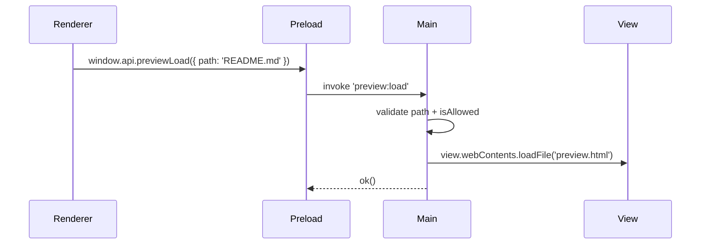
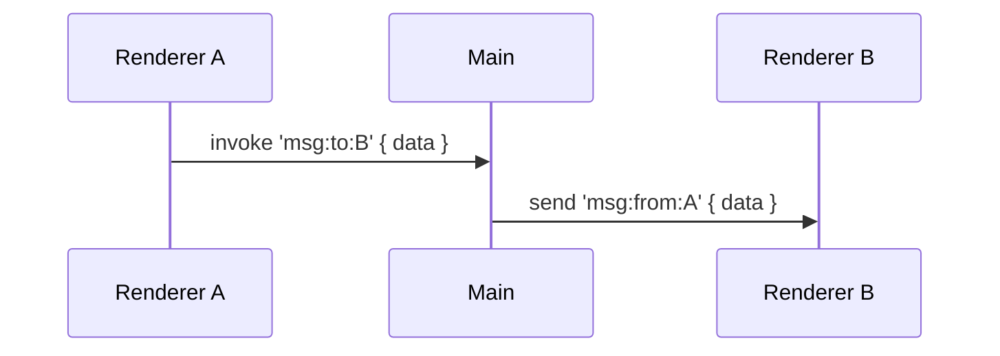

# 📘 8. Gestion multi-fenêtres & BrowserView

> 🎯 **Objectif du chapitre**  
> Orchestrer plusieurs **BrowserWindow** (principale, préférences, aperçu) et intégrer du contenu via **BrowserView**. Vous apprendrez à **positionner** et **dimensionner** correctement les fenêtres (multi‑écrans), gérer le **focus** et le **Z‑order**, organiser une **communication inter‑fenêtres** *via Main* (IPC), **persister** l’état (position/taille), **sécuriser** la navigation (CSP + whitelists) et **optimiser** (lazy loading, destruction propre).

---

## 🧩 8.1 Définition & pourquoi

- **BrowserWindow** : conteneur natif d’une UI (Renderer).  
- **BrowserView** : **vue embarquée** *sans chrome* pour afficher un contenu (local ou contrôlé) **dans** une fenêtre existante.

**Pourquoi utiliser BrowserView ?**  
Pour **prévisualiser** une page, un document, ou intégrer un panneau **web** (ex. preview Markdown) sans créer une **fenêtre distincte** ; meilleur **contrôle du layout** et du **focus**.

---

## 🧩 8.2 Manager multi‑fenêtres (rappels & extension)

Un **WindowManager** central maintient un **registre** (Map) : crée, récupère, **focus**, **ferme**, et **connecte** les fenêtres entre elles *via Main*.

**Formule (JavaScript) — registre & métadonnées**
```javascript
class WindowManager {
  constructor(){ this.registry = new Map(); }
  create(key, opts){ /* crée BrowserWindow, store opts, events, ready-to-show */ }
  get(key){ return this.registry.get(key) || null; }
  focus(key){ const w = this.get(key); if (w) w.focus(); }
  close(key){ const w = this.get(key); if (w) w.close(); }
}
```

---

## 🧩 8.3 Ajouter un **BrowserView** dans une fenêtre

- Créer la **view** (`new BrowserView({ webPreferences: {...} })`).  
- L’**attacher** à la fenêtre (`win.setBrowserView(view)`).  
- **Définir** son **rectangle** (`view.setBounds({ x, y, width, height })`).  
- Charger le contenu (`view.webContents.loadURL(...)` ou `loadFile(...)`).

**Formule (JavaScript) — calcul de layout**
```javascript
function layoutPreview(winBounds){
  const sidebar = 280; // px
  const padding = 8;
  const x = sidebar + padding;
  const width = Math.max(320, winBounds.width - sidebar - padding*2);
  const height = Math.max(240, winBounds.height - padding*2);
  return Object.freeze({ x, y: padding, width, height });
}
```

> 💡 **Analogie** : `BrowserView` est un **cadre photo** dans votre fenêtre — vous choisissez **où** il s’insère (bounds).

---

## 🧩 8.4 Focus, Z‑order et interactions

- `win.setBrowserView(view)` **remplace** la view actuelle (une seule à la fois par fenêtre).  
- Utilisez `win.setTopBrowserView(view)` si vous gérez plusieurs views (pile).  
- **Focus** : interactions clavier/souris appartiennent à la **view** si elle est dans les bounds et visible.

**Formule (JavaScript) — bascule de view**
```javascript
function switchView(win, next){
  win.setBrowserView(next);
  win.focus(); // remet au premier plan
}
```

---

## 🧩 8.5 Multi‑écrans & placement (module `screen`)

- Récupérer les **affichages** : `screen.getAllDisplays()`.  
- Calculer un **placement** sur l’écran actif : `screen.getDisplayNearestPoint({ x, y })`.  
- Tenir compte du **scaleFactor** (HiDPI).

**Formule (JavaScript) — clamp & DPI**
```javascript
function clamp(v, min, max){ return Math.max(min, Math.min(max, v)); }
function toDevicePixels(px, scale){ return Math.round(Number(px) * Number(scale)); }
```

---

## 🧩 8.6 Persistance des positions & tailles

- Sauvegarder **`win.getBounds()`** à la fermeture.  
- À l’ouverture, **valider** que les bounds sont **visibles** (l’écran peut avoir changé).  
- **Corriger** si nécessaire (clamp dans l’aire de l’affichage).

**Formule (JavaScript) — bounds sûrs**
```javascript
function safeBounds(bounds, display){
  const area = display.workArea;
  return {
    x: clamp(bounds.x, area.x, area.x + area.width - 100),
    y: clamp(bounds.y, area.y, area.y + area.height - 100),
    width: clamp(bounds.width, 400, area.width),
    height: clamp(bounds.height, 300, area.height)
  };
}
```

---

## 🧩 8.7 Communication inter‑fenêtres (via Main)

- **Jamais** de communication directe Renderer→Renderer.  
- Passez **obligatoirement** par **Main** (IPC) : `windowA` émet une requête, Main **redirige** vers `windowB` si autorisé.

**Formule (JavaScript) — relai IPC**
```javascript
// Main
function relay(channel, fromWinKey, toWinKey, payload){
  const to = wm.get(toWinKey);
  if (!to) return;
  to.webContents.send(channel, Object.freeze({ from: fromWinKey, payload }));
}
```

---

## 🧩 8.8 Sécurité pour BrowserView

- **CSP stricte** : contenus **locaux** ou contrôlés.  
- **Bloquer** `will-navigate` et **whitelister** `setWindowOpenHandler`.  
- **Pas** d’URLs externes non validées.

**Formule (JavaScript) — autorisations minimales**
```javascript
const ALLOWED_PROTOCOLS = Object.freeze(['file:', 'data:']);
function isAllowed(url){ try{ const u = new URL(url); return ALLOWED_PROTOCOLS.includes(u.protocol); } catch{ return false; } }
```

---

## 🧩 8.9 Performance & mémoire

- **Lazy loading** : créer **à la demande** fenêtres/views.  
- **Destroy** systématique (`win.close()`/`view.destroy()`) et **nullifier** les références.  
- **Throttle** redimensionnements (`resize`) pour recalculer les bounds.  
- **Éviter** d’empiler plusieurs BrowserView complexes simultanément.

**Formule (JavaScript) — throttle resize**
```javascript
function throttle(fn, ms){ let t=0; return (...a)=>{ const now=Date.now(); if (now-t>ms){ t=now; fn(...a); } }; }
```

---

## 🧩 8.10 Exemple d’orchestration (fenêtre principale + preview)

- `main` : crée la fenêtre, attache **BrowserView** pour preview.  
- `renderer` : envoie un **message** (via Preload) pour charger un fichier dans la preview.  
- `main` : **valide** et **charge** dans la view.

**Schéma (Mermaid)**


---

## 🧩 8.11 Multi‑fenêtres : préférences modales + aperçu détachable

- **Préférences** : `modal: true`, `parent: mainWindow`.  
- **Aperçu détachable** : seconde fenêtre `previewWindow`, **synchronisée** via IPC (Main relai).

**Formule (JavaScript) — création modale**
```javascript
function openPrefs(parent){ /* BrowserWindow({ modal: true, parent, ... }) */ }
```

---

## 🧩 8.12 Spécificités Windows/macOS

- **macOS** : `activate` recrée une fenêtre s’il n’y en a plus; respect des **rôles** menus.  
- **Windows** : `AppUserModelId` pour notifications (chap. 7), attention aux **taskbar groups** si plusieurs fenêtres.

**Formule (JavaScript) — détection**
```javascript
const isMac = process.platform === 'darwin';
```

---

## ⚠️ 8.13 Sécurité — règles d’or

- **Renderer↔Renderer** : **interdit** ; passer par **Main** + **validation**.  
- **BrowserView** : contenus **locaux** ou **contrôlés** uniquement.  
- **CSP** et **navigation verrouillée** (chap. 3) toujours actives.

---

## 🛠️ 8.14 Atelier pas‑à‑pas

1. **Étendre** votre `WindowManager` pour gérer **main**, **prefs**, **preview**.  
2. **Attacher** un **BrowserView** “Preview” dans la fenêtre principale avec `setBounds` dynamique (resize throttlé).  
3. **Relayer** un message Renderer → Main → View pour charger une page de preview.  
4. **Créer** une fenêtre **modale** “Préférences” et **synchroniser** un changement (ex. thème) vers la fenêtre principale.  
5. **Persister** `getBounds()` et **restaurer** à l’ouverture (**safeBounds**).

---

## 🖼️ 8.15 Schémas (Mermaid)

**Manager de fenêtres & preview**
```mermaid
flowchart TD
  WM[WindowManager] --> M[Main Window]
  M --> V[BrowserView Preview]
  WM --> P[Preferences (modal)]
  WM --> R[Preview Window]
```

**Relai Renderer↔Renderer via Main**


---

## 🧪 8.16 (Aperçu) Tests & validation

- **Smoke** : création/fermeture des 3 fenêtres + BrowserView sans erreurs.  
- **Focus** : vérifier qu’un `focus()` restitue correctement le premier plan.  
- **Bounds** : redimensionner la fenêtre, vérifier la mise à jour de la view.  
- **IPC relai** : messages arrivent au bon destinataire.

```javascript
// Pseudo-tests
console.assert(typeof clamp === 'function', 'clamp doit exister');
```

---

## 🔚 8.17 Résumé — Points essentiels

- **BrowserWindow** pour les conteneurs, **BrowserView** pour les panneaux intégrés.  
- **Manager central** : registre, focus, fermeture, relai IPC.  
- **Layout** : `setBounds` calculé, resize **throttlé**.  
- **Multi‑écrans** : module `screen`, `scaleFactor`, placement sûr.  
- **Persistance** : restaurer des **bounds** visibles (safe clamps).  
- **Sécurité** : pas d’IPC direct Renderer↔Renderer, **CSP** & **whitelist** en vigueur.

---

> ✅ **Livrable** : `09-multi-fenetres-browserview.md` (ce fichier), prêt pour Obsidian.
