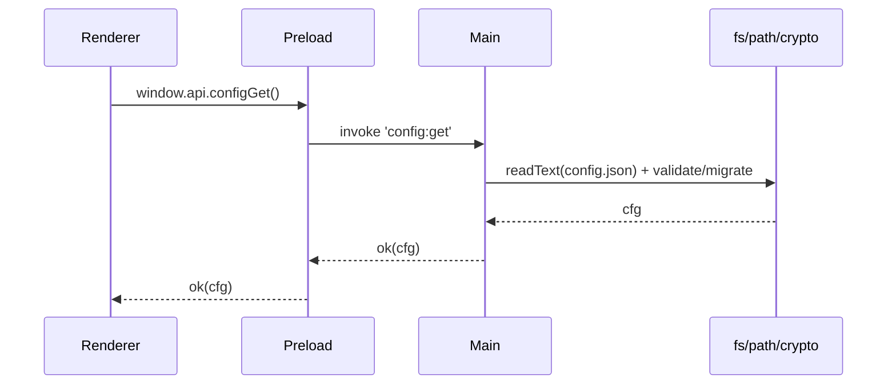

# 📘 9. Fichiers & stockage local (fs, config, chiffrement)

> 🎯 **Objectif du chapitre**  
> Lire/écrire des **fichiers** en sécurité, organiser un **répertoire de données** (`userData`), gérer des **configurations** persistantes, valider les **chemins**, et implémenter un **chiffrement symétrique basique** (AES‑256‑GCM) avec le module **`crypto`** de Node.js. Vous apprendrez aussi les **sauvegardes**, la **migration** de schéma, et les **bonnes pratiques** de sécurité.

---

## 🧩 9.1 Où stocker ? `app.getPath('userData')`

**Définition.** `app.getPath('userData')` retourne un **dossier spécifique** à votre application (Windows/macOS) où stocker **configs**, **caches**, et **données**.

**Pourquoi là ?**  
Ce dossier est **géré par l’OS**, isolé par app, et **persistant** même après mises à jour.

**Formule (JavaScript) — chemin userData**
```javascript
const { app } = require('electron');
const path = require('path');
const userDataDir = app.getPath('userData');
const dataDir = path.join(userDataDir, 'data');
const configPath = path.join(userDataDir, 'config.json');
```

---

## 🧩 9.2 Lire/écrire des fichiers (fs)

**API Node `fs`.** Pour **lire/écrire** en **UTF‑8**, éviter les corruptions, et **créer** des dossiers manquants.

```javascript
const fs = require('fs');

function ensureDir(dir){
  if (!fs.existsSync(dir)) fs.mkdirSync(dir, { recursive: true });
}

function readText(file){
  return fs.readFileSync(file, { encoding: 'utf-8' });
}

function writeText(file, content){
  fs.writeFileSync(file, content, { encoding: 'utf-8' });
}
```

> 💡 **Bonnes pratiques** : UTF‑8 pour le texte, `recursive: true` pour `mkdirSync`, et **try/catch** pour capturer les erreurs.

---

## 🧩 9.3 Valider les chemins (sécurité)

**Problème.** Les chemins comme `../../etc/passwd` ou `..\\..\\Windows\\System32` peuvent causer des **sorties** du dossier autorisé.

**Solution.** **Valider** et **normaliser** les chemins avec `path.resolve`, **interdire** `..` et les **backslashes** suspects, et **forcer** une **racine**.

```javascript
function isSafeRelative(rel){
  if (typeof rel !== 'string' || rel.length === 0) return false;
  const bad = /\\|\.\//.test(rel) || /\.\./.test(rel);
  return !bad;
}

function safeJoin(root, rel){
  const p = path.resolve(root, rel);
  if (!p.startsWith(path.resolve(root))) throw new Error('Chemin hors racine');
  return p;
}
```

**Formule (JavaScript) — whitelist d’extensions**
```javascript
const ALLOWED_EXT = Object.freeze(['.md', '.txt', '.json']);
function hasAllowedExt(file){ return ALLOWED_EXT.includes(path.extname(file).toLowerCase()); }
```

---

## 🧩 9.4 Configurations JSON sécurisées

**Définition.** Un **fichier de configuration** (ex. `config.json`) stocke des **préférences** de l’utilisateur.

**Pourquoi sécuriser ?**  
Pour **éviter** corruption, **valider** les types, et **gérer** les migrations.

```javascript
function loadConfig(file){
  try {
    const text = fs.existsSync(file) ? readText(file) : '{}';
    const cfg = JSON.parse(text);
    return validateConfig(cfg);
  } catch(e){ console.error('Config invalide, réinitialisation', e); return defaultConfig(); }
}

function saveConfig(file, cfg){ writeText(file, JSON.stringify(cfg, null, 2)); }

function defaultConfig(){ return { theme: 'dark', locale: 'fr-CA', version: 1 }; }

function validateConfig(cfg){
  const base = defaultConfig();
  const out = { ...base, ...cfg };
  if (!['dark','light'].includes(out.theme)) out.theme = base.theme;
  if (typeof out.locale !== 'string') out.locale = base.locale;
  if (typeof out.version !== 'number') out.version = base.version;
  return out;
}
```

---

## 🧩 9.5 Chiffrement symétrique basique (AES‑256‑GCM)

**Définition.** **AES‑256‑GCM** est un **chiffrement authentifié** : il chiffre **et** ajoute un **tag** d’intégrité. 

**Pourquoi GCM ?**  
Évite les **altérations silencieuses** et détecte les **modifications**.

```javascript
const crypto = require('crypto');

async function deriveKey(passphrase){
  return new Promise((resolve, reject)=>{
    crypto.scrypt(passphrase, 'salt.fixed.app', 32, (err, key)=>{
      if (err) reject(err); else resolve(key);
    });
  });
}

function encryptAesGcm(plain, key){
  const iv = crypto.randomBytes(12); // GCM IV 96 bits
  const cipher = crypto.createCipheriv('aes-256-gcm', key, iv);
  const enc = Buffer.concat([cipher.update(Buffer.from(plain, 'utf-8')), cipher.final()]);
  const tag = cipher.getAuthTag();
  return Buffer.concat([iv, tag, enc]).toString('base64');
}

function decryptAesGcm(b64, key){
  const buf = Buffer.from(b64, 'base64');
  const iv = buf.subarray(0, 12);
  const tag = buf.subarray(12, 28);
  const data = buf.subarray(28);
  const decipher = crypto.createDecipheriv('aes-256-gcm', key, iv);
  decipher.setAuthTag(tag);
  const dec = Buffer.concat([decipher.update(data), decipher.final()]);
  return dec.toString('utf-8');
}
```

> ⚠️ **Attention** : évitez d’utiliser des **clés fixes** codées en dur ; dérivez la clé à partir d’un **secret utilisateur** (mot de passe) et **ne stockez pas** ce secret en clair.

---

## 🧩 9.6 Fichier sécurisé (écrire/lire chiffré)

**But.** Stocker des données **sensibles** (ex. token) dans un **fichier chifré**.

```javascript
async function writeEncrypted(file, plain, passphrase){
  ensureDir(path.dirname(file));
  const key = await deriveKey(passphrase);
  const b64 = encryptAesGcm(plain, key);
  writeText(file, b64);
}

async function readEncrypted(file, passphrase){
  const key = await deriveKey(passphrase);
  const b64 = readText(file);
  return decryptAesGcm(b64, key);
}
```

**Formule (JavaScript) — taille estimée (base64)**
```javascript
function estimateBase64Size(bytes){ return Math.ceil(bytes / 3) * 4; }
```

---

## 🧩 9.7 Sauvegardes & versions (SemVer)

**Principe.** Avant d’écrire, **sauvegarder** `config.json` en `config.bak.json` ; utiliser **SemVer** (`major.minor.patch`) dans le champ `version` pour **migrations**.

```javascript
function backup(file){
  const bak = file.replace(/\.json$/, '.bak.json');
  try { if (fs.existsSync(file)) fs.copyFileSync(file, bak); } catch(e){ console.warn('Backup échoué', e); }
}

function migrateConfig(cfg){
  switch(String(cfg.version)){
    case '1': return { ...cfg, version: 2, editor: { fontSize: 14 } };
    default: return cfg;
  }
}
```

---

## 🧩 9.8 Flux complet (Main/Preload/Renderer)

1. **Main** : crée `userData`/`data`, charge `config.json`, applique migration.  
2. **Preload** : expose `window.api.configGet()` / `configSet()` / `fileRead()` / `fileWrite()`.  
3. **Renderer** : appelle `window.api` pour **lire/écrire**; **jamais** de `fs` direct.

**Schéma (Mermaid)**


---

## 🧩 9.9 Différences Windows vs macOS

- **Chemins** : séparateur `\\` (Windows) vs `/` (macOS). Utiliser **`path.join`**/**`path.resolve`** partout.  
- **Emplacement `userData`** : spécifique à l’OS, géré par Electron.  
- **Permissions** : évitez les emplacements nécessitant des **droits élevés** ; restez dans `userData`.

**Formule (JavaScript) — détection OS**
```javascript
const isMac = process.platform === 'darwin';
const isWin = process.platform === 'win32';
```

---

## ⚠️ 9.10 Sécurité — règles d’or

- **Racine stricte** : toutes les opérations fichiers doivent rester dans `userData` (ou sous‑dossier autorisé).  
- **Whitelist extensions** : n’ouvrez/sauvegardez que des extensions **connues**.  
- **Chiffrement** : utilisez **AES‑GCM** pour les données sensibles; **pas** de clés en dur.  
- **Logs** : ne loggez pas de **contenu** sensible ; seulement des **événements**.

---

## 🛠️ 9.11 Atelier pas‑à‑pas

1. **Initialiser** `userData` + `data/` (créer dossiers si manquants).  
2. **Implémenter** `loadConfig`/`saveConfig` + `backup` + `migrateConfig`.  
3. **Ajouter** `isSafeRelative`/`safeJoin` + `hasAllowedExt`.  
4. **Créer** `writeEncrypted`/`readEncrypted` (AES‑256‑GCM) et **tester** avec une **passphrase**.  
5. **Exposer** en **Preload** : `configGet/configSet/fileRead/fileWrite/secretSave/secretLoad`.  
6. **Consommer** en Renderer : paramétrer, lire un `.md`, sauvegarder un **secret** chifré.

---

## 🖼️ 9.12 Schémas (Mermaid)

**Arborescence et fichiers**
```mermaid
flowchart TD
  U[userData] --> D[data/]
  U --> C[config.json]
  D --> F1[note1.md]
  D --> F2[note2.md]
  U --> S[secret.bin (AES-GCM base64)]
```

**Validation des chemins**
```mermaid
flowchart LR
  R[rel chemin] --> V{isSafeRelative?}
  V -->|no| X[Refuser]
  V -->|yes| J[safeJoin(userData, rel)] --> O[Opérations fs]
```

---

## 🧪 9.13 (Aperçu) Tests

- **Unitaires** : `isSafeRelative`, `safeJoin`, `hasAllowedExt`, chiffrement/déchiffrement.  
- **E2E** : lecture/écriture `config.json` avec migration, sauvegarde `.bak.json`, écriture/lecture chifrée.

```javascript
// Pseudo-tests
console.assert(hasAllowedExt('note.md') === true, 'md autorisé');
console.assert(hasAllowedExt('script.exe') === false, 'exe interdit');
```

---

## 🔚 9.14 Résumé — Points essentiels

- Utilisez **`userData`** comme **racine** des données.  
- **Validez** les chemins et **restreignez** les **extensions**.  
- **Configs** : validation, **backup**, **migration**, sauvegarde en **UTF‑8**.  
- **Chiffrement** : **AES‑256‑GCM** avec **IV aléatoire** et **tag**; dérivez la **clé** (scrypt).  
- **Logs** : **aucun secret**; journalisez les événements seulement.

---

> ✅ **Livrable** : `10-stockage-fichiers.md` (ce fichier), prêt pour Obsidian.
