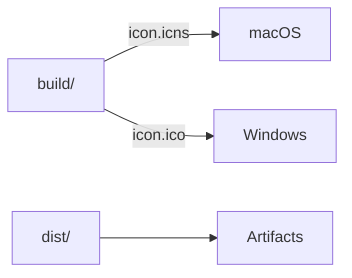

# 📘 10. Packaging & distribution (electron-builder)

> 🎯 **Objectif du chapitre**  
> Préparer le **packaging** et la **distribution** avec **electron‑builder** : configuration `build`, **icônes** (ICO/ICNS), **targets** (Windows NSIS, macOS DMG/ZIP), **code signing** (Windows/macOS), **notarization** (macOS), **répertoires** & **fichiers** inclus/exclus, **artifacts** et **scripts npm**. En fin de chapitre, vous saurez produire des **installateurs** fiables pour Windows et macOS.

---

## 🧩 10.1 Qu’est‑ce qu’electron‑builder et pourquoi ?

**Définition.** `electron-builder` est un **outil de packaging** qui génère des **artifacts** (installateurs, archives) pour **Windows/macOS/Linux** à partir de votre projet Electron.

**Pourquoi l’utiliser ?**  
- **Multi‑plateforme** : cibles et formats adaptés (NSIS, DMG, ZIP).  
- **Automatisation** : pipeline de build et publication.  
- **Signatures** : intégration **code signing** et **notarization**.  
- **Simplicité** : configuration via `package.json` **ou** fichier dédié (`electron-builder.yml/json`).

---

## 🧩 10.2 Structure des assets (icônes & répertoires)

```
project-root/
  dist/                 // bundles (chap. 6)
  build/                // assets packaging
    icon.icns           // macOS icône
    icon.ico            // Windows icône
    background.png      // DMG background (optionnel)
  package.json          // section "build"
  electron-builder.yml  // (optionnel) configuration externe
```

**Formule (JavaScript) — chemins d’assets**
```javascript
const path = require('path');
const ICON_MAC = path.join(__dirname, 'build', 'icon.icns');
const ICON_WIN = path.join(__dirname, 'build', 'icon.ico');
```

---

## 🧩 10.3 Section `build` (package.json)

**Clés essentielles** : `appId`, `productName`, `directories`, `files`, `extraResources`, `mac`, `win`, `publish`.

```json
{
  "name": "mini-obsidian",
  "version": "0.10.0",
  "main": "dist/main.js",
  "build": {
    "appId": "com.exemple.miniobsidian",
    "productName": "Mini‑Obsidian",
    "directories": { "buildResources": "build" },
    "files": [
      "dist/**",
      "renderer/**",
      "!**/*.map"  
    ],
    "extraResources": [ { "from": "assets", "to": "assets" } ],
    "mac": {
      "icon": "build/icon.icns",
      "category": "public.app-category.productivity",
      "artifactName": "${productName}-${version}-mac.${ext}",
      "hardenedRuntime": true,
      "entitlements": "build/entitlements.mac.plist",
      "entitlementsInherit": "build/entitlements.mac.plist",
      "gatekeeperAssess": false,
      "target": [ "dmg", "zip" ]
    },
    "win": {
      "icon": "build/icon.ico",
      "target": [ { "target": "nsis", "arch": [ "x64" ] } ],
      "artifactName": "${productName}-${version}-win.${ext}"
    },
    "nsis": {
      "oneClick": true,
      "perMachine": false,
      "allowElevation": false,
      "createDesktopShortcut": true,
      "shortcutName": "Mini‑Obsidian"
    },
    "publish": [ { "provider": "generic", "url": "https://exemple.org/downloads/" } ]
  }
}
```

> 🧠 **Bonnes pratiques** : Mettre `hardenedRuntime: true` et des **entitlements** sur macOS; utiliser `artifactName` pour des fichiers nommés de façon **prévisible**.

---

## 🧩 10.4 Signatures (code signing)

### macOS (Developer ID)
- **Certificat** : Developer ID (Application) obtenu via Apple.  
- **Hardened Runtime** + **entitlements** (permissions).  
- Variables d’environnement typiques :
  - `APPLE_ID`, `APPLE_APP_SPECIFIC_PASSWORD` (ou **API Key** `APPLE_API_KEY`, `APPLE_API_ISSUER`)
  - `CSC_LINK`, `CSC_KEY_PASSWORD` (stockage du certificat p12)

### Windows (Authenticode)
- **Certificat** : fichier **.pfx** + **mot de passe**.  
- Variables : `WIN_CSC_LINK`, `WIN_CSC_KEY_PASSWORD` ou `CSC_LINK`/`CSC_KEY_PASSWORD`.

**Formule (JavaScript) — présence des variables critiques**
```javascript
function hasSigningEnv(){
  const keys = ['CSC_LINK','CSC_KEY_PASSWORD'];
  return keys.every(k => typeof process.env[k] === 'string' && process.env[k].length > 0);
}
```

---

## 🧩 10.5 Notarization (macOS)

**Définition.** La **notarization** est la validation **Apple** des binaires pour éviter les alertes **Gatekeeper**.

**Étapes** : 
1. Activer `hardenedRuntime` et fournir des **entitlements**.  
2. Construire (`build`) l’app **signée**.  
3. Soumettre à la **notarization** via credentials (`APPLE_ID` + app‑specific password, ou API key).  
4. **Stapler** (agrafer) le ticket de notarization.

**Formule (JavaScript) — vérification de mode**
```javascript
const isMac = process.platform === 'darwin';
const needsNotarization = isMac && process.env.NODE_ENV === 'production';
```

---

## 🧩 10.6 Icônes & assets

- **Windows** : `.ico` multi‑résolutions (256×256 conseillé).  
- **macOS** : `.icns` avec tailles adaptées (16→1024).  
- **DMG** : fond (`background.png`) optionnel pour une présentation soignée.

**Formule (JavaScript) — choix d’icône par OS**
```javascript
function iconForOS(){
  return process.platform === 'darwin' ? 'build/icon.icns' : 'build/icon.ico';
}
```

---

## 🧩 10.7 Scripts npm (build & release)

```
"scripts": {
  "build": "webpack --config main/webpack.main.js && webpack --config preload/webpack.preload.js && webpack --config renderer/webpack.renderer.js",
  "pack": "electron-builder --dir",
  "dist": "electron-builder",
  "dist:mac": "electron-builder --mac",
  "dist:win": "electron-builder --win",
  "release": "NODE_ENV=production electron-builder"
}
```

> 💡 **Astuce** : `--dir` produit un dossier **non signé** pour tests; `--mac/--win` cible des plateformes précises.

---

## 🧩 10.8 Fichiers inclus/exclus

- **`files`** : inclure `dist/**`, `renderer/**`, **exclure** `**/*.map`, `.git`, `node_modules` non nécessaires.  
- **`extraResources`** : copier des fichiers **runtime** (ex. modèles, dictionnaires) vers le paquet.

**Formule (JavaScript) — taille estimée d’un artifact**
```javascript
function humanBytes(n){ const u=['B','KB','MB','GB']; let i=0; while(n>1024&&i<u.length-1){ n/=1024; i++; } return `${n.toFixed(1)} ${u[i]}`; }
```

---

## 🧩 10.9 Cibles & formats

- **macOS** : `dmg` (disque installable), `zip` (archive).  
- **Windows** : `nsis` (installateur), `zip` (archive).  
- **Linux** (optionnel) : `AppImage`, `deb`, etc.

**Formule (JavaScript) — sélection de target**
```javascript
function targetsForOS(){
  if (process.platform === 'darwin') return ['dmg','zip'];
  if (process.platform === 'win32') return ['nsis','zip'];
  return ['AppImage'];
}
```

---

## 🧩 10.10 Publication (provider & channels)

- **Provider** : `generic` (URL), `github`, `s3`, etc.  
- **Channels** : `latest`, `beta`, `alpha` — utiles avec **auto‑update** (chap. 11).

**Formule (JavaScript) — URL de téléchargement**
```javascript
function downloadUrl(base, product, version, os, ext){
  return `${base}/${product}-${version}-${os}.${ext}`;
}
```

---

## 🖼️ 10.11 Schémas (Mermaid)

**Pipeline packaging**
```mermaid
flowchart TD
  A[Bundles dist/] --> B[electron-builder]
  B --> C[Artifacts: DMG/ZIP/NSIS]
  C --> D[Code signing]
  D --> E[Notarization (macOS)]
  E --> F[Publication]
```

**Répartition des assets**


---

## ⚠️ 10.12 Sécurité & conformité

- **Signer** toutes les builds destinées à la distribution.  
- **Notariser** les builds macOS (hardened runtime + entitlements).  
- **Ne pas** embarquer de **secrets** (API keys) dans les bundles.  
- **Vérifier** les **licences** des dépendances.

---

## 🛠️ 10.13 Atelier pas‑à‑pas

1. **Ajouter** la section `build` dans `package.json` (appId, productName, targets, icons).  
2. **Placer** `icon.icns` et `icon.ico` dans `build/`.  
3. **Configurer** les entitlements macOS et activer `hardenedRuntime`.  
4. **Définir** les scripts `pack`, `dist`, `dist:mac`, `dist:win`.  
5. **Préparer** les variables d’environnement de signature (macOS/Windows).  
6. **Générer** les artifacts et **tester** l’installation sur chaque OS.  
7. *(Optionnel)* **Publier** via provider `generic` (chap. 11 utilisera cette URL pour l’auto‑update).

---

## 🧪 10.14 (Aperçu) Tests & validation

- **Artifacts** : confirmer présence des fichiers attendus (`.dmg`, `.zip`, `.exe`/NSIS).  
- **Signature** : vérifier que l’installateur est **signé** (OS rapporte l’éditeur).  
- **Notarization** : macOS ouvre sans alerte Gatekeeper.  
- **Icônes** : correctes sur chaque OS.

```javascript
// Pseudo-test
console.assert(Array.isArray(targetsForOS()), 'targetsForOS doit renvoyer un tableau');
```

---

## 🔚 10.15 Résumé — Points essentiels

- **electron-builder** produit des installateurs **multi‑OS** avec une config unique.  
- **Icônes & assets** : `.icns` pour macOS, `.ico` pour Windows; nommage `artifactName`.  
- **Signatures** et **notarization** : indispensables pour une distribution fiable.  
- **Scripts npm** : `pack`, `dist`, ciblés par OS; variables d’environnement **sécurisées**.  
- **Publication** : provider + channels, prêts pour l’auto‑update.

---

> ✅ **Livrable** : `11-packaging-distribution.md` (ce fichier), prêt pour Obsidian.
