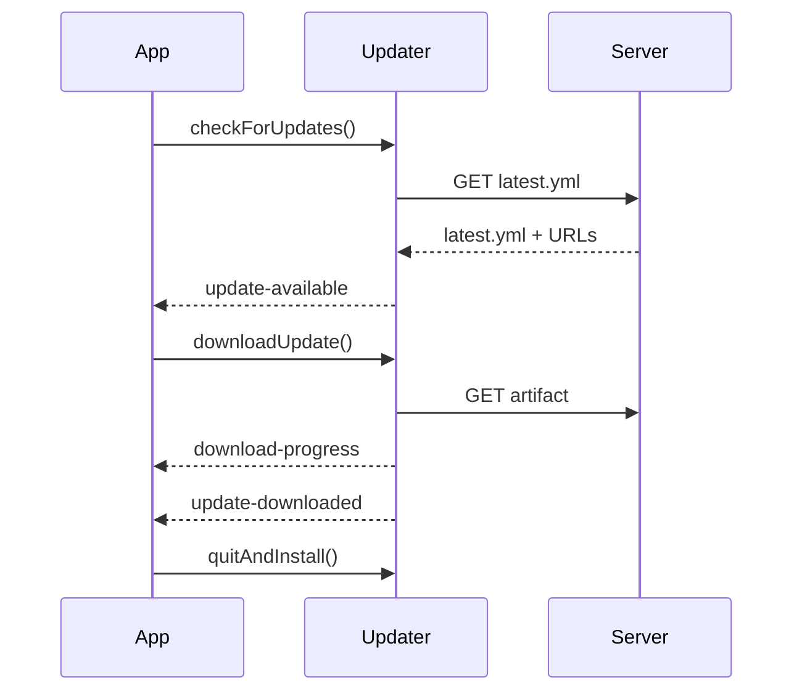

# 📘 11. Auto-update (electron-updater)

> 🎯 **Objectif du chapitre**  
> Mettre en place des **mises à jour automatiques** professionnelles avec **electron‑updater** : **publication** des artifacts (provider *generic* ou GitHub), **canaux** (`latest`, `beta`), **fichiers manifest** (`latest.yml`), **flux d’événements** (`update-available`, `download-progress`, `update-downloaded`, `error`), **UX utilisateur** (dialogues, notifications), **sécurité** (HTTPS, signatures), et **stratégies de rollback**.

---

## 🧩 11.1 Pourquoi l’auto‑update ? Définition

**Auto‑update (définition).** Mécanisme qui **vérifie**, **télécharge** et **applique** une nouvelle version sans intervention manuelle.

**Pourquoi ?**  
Assurer une **base utilisateur homogène**, corriger rapidement des **bugs** et livrer des **améliorations** sans friction.

---

## 🧩 11.2 Prérequis & publication (artifacts)

- **Packaging** via `electron-builder` (chap. 10).  
- **Artifacts** publiés sur un **endpoint HTTPS** ou **GitHub Releases**.  
- **Manifests** générés (`latest.yml`, `latest-mac.yml` / Windows `latest.yml`) décrivent la version et les URLs.

**Structure recommandée (provider generic)**
```
/updates/
  Mini-Obsidian-0.10.0-mac.zip
  Mini-Obsidian-0.10.0-win.exe
  latest.yml
  latest-mac.yml
```

**Formule (JavaScript) — URL de flux**
```javascript
function makeFeedURL(base){
  return base.endsWith('/') ? `${base}` : `${base}/`;
}
```

> 🧠 **Recommandation** : Sur **macOS**, utilisez des **archives .zip** pour l’auto‑update (DMG pour l’installation initiale). Sur **Windows**, ciblez **NSIS**.

---

## 🧩 11.3 API `electron-updater` (Main)

**Principales méthodes/événements** :
- `autoUpdater.setFeedURL()` (si provider manuel), sinon config `publish` de `electron-builder`.
- `autoUpdater.checkForUpdates()` / `checkForUpdatesAndNotify()`.
- `autoUpdater.downloadUpdate()`.
- `autoUpdater.quitAndInstall()`.
- Événements : `update-available`, `update-not-available`, `download-progress`, `update-downloaded`, `error`.

**Formule (JavaScript) — logger & options**
```javascript
const log = { info: console.log, error: console.error };
const updaterOpts = Object.freeze({ allowPrerelease: false, autoDownload: false });
```

---

## 🧩 11.4 Implémentation complète (Main + Preload + Renderer)

**Main** : orchestrer le cycle, relayer les événements vers le Renderer.

```javascript
// main.js
const { app, BrowserWindow, ipcMain, dialog } = require('electron');
const { autoUpdater } = require('electron-updater');

function bindUpdater(win){
  autoUpdater.logger = { info: (...a)=>console.log('[updater]', ...a), error: (...a)=>console.error('[updater]', ...a) };
  autoUpdater.autoDownload = false; // on contrôle l'UX

  autoUpdater.on('update-available', (info)=> win.webContents.send('update:available', info));
  autoUpdater.on('update-not-available', ()=> win.webContents.send('update:none'));
  autoUpdater.on('download-progress', (p)=> win.webContents.send('update:progress', p));
  autoUpdater.on('update-downloaded', (info)=> win.webContents.send('update:ready', info));
  autoUpdater.on('error', (err)=> win.webContents.send('update:error', String(err)));

  ipcMain.handle('update:check', async ()=> autoUpdater.checkForUpdates());
  ipcMain.handle('update:download', async ()=> autoUpdater.downloadUpdate());
  ipcMain.handle('update:install', async ()=> { autoUpdater.quitAndInstall(); return true; });
}
```

**Preload** : exposer une API minimale.

```javascript
// preload.js
const { contextBridge, ipcRenderer } = require('electron');
contextBridge.exposeInMainWorld('updates', Object.freeze({
  check: ()=> ipcRenderer.invoke('update:check'),
  download: ()=> ipcRenderer.invoke('update:download'),
  install: ()=> ipcRenderer.invoke('update:install'),
  onAvailable: (cb)=> ipcRenderer.on('update:available', (_, info)=> cb(info)),
  onNone: (cb)=> ipcRenderer.on('update:none', cb),
  onProgress: (cb)=> ipcRenderer.on('update:progress', (_, p)=> cb(p)),
  onReady: (cb)=> ipcRenderer.on('update:ready', (_, info)=> cb(info)),
  onError: (cb)=> ipcRenderer.on('update:error', (_, e)=> cb(e))
}));
```

**Renderer** : dialog d’update.

```javascript
// renderer/dialog-update.js
function humanPct(x){ return `${Math.round(Number(x)*100)}%`; }
export function bindUpdateUI(){
  const btnCheck = document.getElementById('checkUpdate');
  const btnDownload = document.getElementById('downloadUpdate');
  const btnInstall = document.getElementById('installUpdate');
  const out = document.getElementById('updateOut');

  btnCheck.addEventListener('click', ()=> updates.check());
  btnDownload.addEventListener('click', ()=> updates.download());
  btnInstall.addEventListener('click', ()=> updates.install());

  updates.onAvailable((info)=>{ out.textContent = `Nouvelle version ${info.version}`; });
  updates.onNone(()=>{ out.textContent = 'Aucune mise à jour disponible.'; });
  updates.onProgress((p)=>{ out.textContent = `Téléchargement… ${humanPct(p.percent/100)} (${Math.round(p.transferred/1024)}KB)`; });
  updates.onReady((info)=>{ out.textContent = `Mise à jour téléchargée (${info.version}). Cliquez sur Installer.`; });
  updates.onError((e)=>{ out.textContent = `Erreur update: ${e}`; });
}
```

---

## 🧩 11.5 Channels & stratégies

- **`latest`** : canal par défaut pour les releases stables.  
- **`beta`/`alpha`** : tester avant la prod.  
- **Stratégie** : utilisateurs stables reçoivent `latest`; bêta reçoit `beta` **uniquement**.

**Formule (JavaScript) — opt‑in bêta**
```javascript
function channelForUser(isBetaUser){ return isBetaUser ? 'beta' : 'latest'; }
```

---

## 🧩 11.6 Sécurité & conformité

- **HTTPS** obligatoire pour les endpoints; **pas** de HTTP en clair.  
- **Signatures** vérifiées (chap. 10).  
- **Validation** des métadonnées (versions, tailles) avant d’afficher.

**Formule (JavaScript) — vérif simple de version SemVer**
```javascript
function isNewer(a, b){
  const pa = a.split('.').map(Number), pb = b.split('.').map(Number);
  for (let i=0;i<3;i++){ if (pa[i]>pb[i]) return true; if (pa[i]<pb[i]) return false; }
  return false;
}
```

---

## 🧩 11.7 UX : dialogues & notifications

- **Notifier** `update-available` avec un **message** clair + bouton “Télécharger”.  
- **Afficher** une **progression** (pourcentage, taille).  
- **Proposer** “Installer maintenant” ou “Plus tard” lorsque `update-downloaded`.

**Formule (JavaScript) — calcul de pourcentage**
```javascript
function pct(transferred, total){ return total>0 ? Math.round((transferred/total)*100) : 0; }
```

---

## 🧩 11.8 Rollback & erreurs

- **Plan** : si une version pose problème, **retirer** son manifest et **publier** la précédente avec un **numéro supérieur patch** (`x.y.(z+1)`).  
- **Erreurs** : écouter `error`, appliquer un **backoff** et **journaliser**.

**Formule (JavaScript) — backoff exponentiel**
```javascript
function backoff(attempt){ const base=1000; return Math.min(30000, base * Math.pow(2, attempt)); }
```

---

## 🛠️ 11.9 Atelier pas‑à‑pas

1. **Configurer** `publish` (provider `generic` HTTPS) dans `package.json` (chap. 10).  
2. **Générer** une release `0.10.0` (Windows NSIS, macOS ZIP) avec `electron-builder`.  
3. **Uploader** `latest.yml` + artifacts sur `/updates/`.  
4. **Implémenter** l’orchestration `autoUpdater` (Main/Preload/Renderer).  
5. **Tester** : `update-available` → **download** → `update-downloaded` → **installer**.

---

## 🖼️ 11.10 Schémas (Mermaid)

**Flux de mise à jour**


---

## 🧪 11.11 (Aperçu) Tests & validation

- **Manifests** : contenu `latest.yml` correct (version, URL, sha512).  
- **Flux** : événements reçus dans l’ordre attendu.  
- **HTTPS** : certificat valide, pas d’erreurs réseau.  
- **Compatibilité** : Windows/macOS.

```javascript
// Pseudo-test
console.assert(isNewer('0.10.1','0.10.0') === true, '0.10.1 > 0.10.0');
```

---

## 🔚 11.12 Résumé — Points essentiels

- **Publiez** les artifacts (ZIP/NSIS) et les **manifests** (`latest.yml`) sur un **endpoint HTTPS**.  
- **Implémentez** `autoUpdater` avec écoute des **événements** et **contrôle** de l’UX (download/install).  
- **Canaux** : distinguer `latest` vs `beta` selon l’utilisateur.  
- **Sécurité** : signatures, HTTPS, validation des données.  
- **Rollback** : stratégie simple via versions patch et retrait du manifest fautif.

---

> ✅ **Livrable** : `12-auto-update.md` (ce fichier), prêt pour Obsidian.
