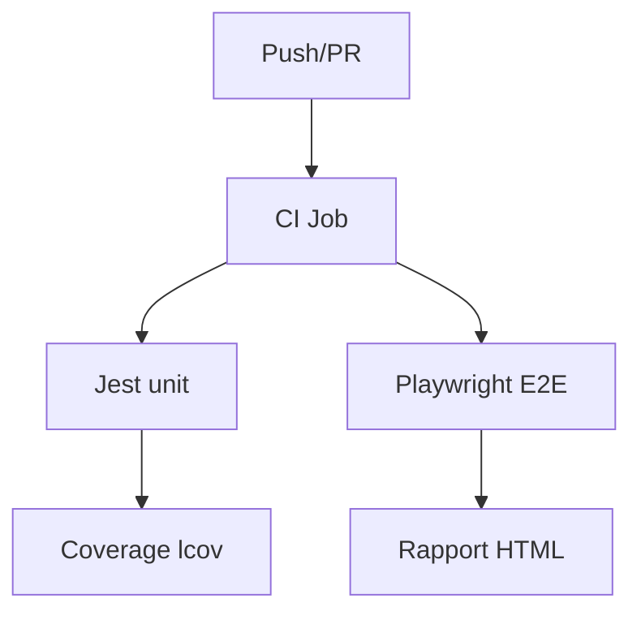
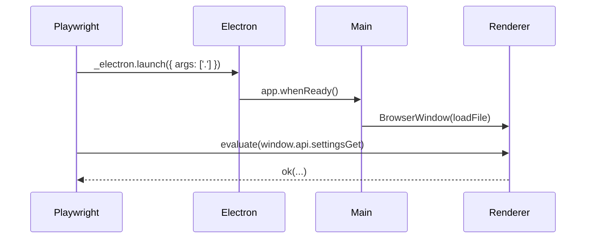

# 📘 12. Tests (Jest + Playwright)

> 🎯 **Objectif du chapitre**  
> Mettre en place des **tests unitaires** (Jest) pour **Preload**/**Renderer** et des **tests End‑to‑End** (Playwright) pour l’application Electron. Organiser la **pyramide de tests**, structurer les **fixtures** et **mocks**, configurer **Jest** (projets Node + jsdom) et **Playwright** (`_electron.launch`), gérer la **couverture** et intégrer en **CI** (Windows & macOS).

---

## 🧩 12.1 Pyramide de tests (définition & pourquoi)

- **Unitaires** : testent des **modules isolés** (fonctions utilitaires, logique Preload). Rapides, nombreux.  
- **Intégration légère** : petits ensembles (ex. helpers DOM).  
- **E2E** : scénario **réel** sur l’app Electron (fenêtres, IPC, UI). Moins nombreux, plus lents.

**Pourquoi structurer ?**  
Pour **détecter tôt** les bugs, **documenter** le comportement, et garantir une **qualité** reproductible.

---

## 🧩 12.2 Dépendances & scripts npm

**DevDependencies** (exemple) :
```
npm i -D jest @playwright/test
```

**Scripts** (proposition) :
```
"scripts": {
  "test": "jest",
  "test:unit": "jest --selectProjects unit-node,unit-jsdom",
  "test:e2e": "playwright test",
  "test:ci": "jest --coverage && playwright test"
}
```

---

## 🧩 12.3 Config Jest (projets Node & jsdom)

**Objectif.** Avoir **deux projets** : 
- `unit-node` (Preload/utilitaires) avec **environnement Node**.  
- `unit-jsdom` (Renderer/helpers) avec **environnement jsdom**.

**`jest.config.js` (exemple minimal)**
```javascript
module.exports = {
  projects: [
    {
      displayName: 'unit-node',
      testEnvironment: 'node',
      testMatch: ['**/__tests__/**/*.node.test.js']
    },
    {
      displayName: 'unit-jsdom',
      testEnvironment: 'jsdom',
      testMatch: ['**/__tests__/**/*.jsdom.test.js']
    }
  ],
  collectCoverage: true,
  coverageDirectory: 'coverage',
  coverageReporters: ['text','lcov']
};
```

> 🧠 **Astuce** : concevez le **Preload** avec des **fonctions pures** réutilisables pour simplifier les tests (export local non exposé à `contextBridge`).

---

## 🧩 12.4 Tests unitaires : Preload

**But.** Valider la **surface API** et la **validation** des payloads avant IPC.

**Exemple (structure)**
```javascript
// __tests__/preload.node.test.js
const { isSafeKey, validatePayload } = require('../preload/lib');

describe('Preload validation', () => {
  test('isSafeKey whitelist', () => {
    expect(isSafeKey('settings:get')).toBe(true);
    expect(isSafeKey('danger:exec')).toBe(false);
  });
  test('validatePayload object only', () => {
    expect(() => validatePayload('bad')).toThrow();
  });
});
```

---

## 🧩 12.5 Tests unitaires : Renderer (jsdom)

**But.** Tester des **helpers DOM** (création/montage), **bus d’événements**, et **store**.

**Exemple (structure)**
```javascript
// __tests__/dom.jsdom.test.js
const { el, clear, frag } = require('../renderer/core/dom');

test('el crée un noeud et children text', () => {
  const n = el('div', { class: 'box' }, ['hello']);
  expect(n.tagName).toBe('DIV');
  expect(n.textContent).toBe('hello');
});
```

---

## 🧩 12.6 Playwright E2E : lancer Electron

**Approche.** Utiliser **Playwright** pour **lancer** votre app via Electron et **piloter** la fenêtre.

**`playwright.config.ts/js` (exemple minimal)**
```javascript
// playwright.config.js
module.exports = {
  testDir: '__e2e__',
  timeout: 30_000,
  reporter: [['list']],
};
```

**Test E2E : ouverture de fenêtre & vérification UI**
```javascript
// __e2e__/app.e2e.test.js
const { _electron: electron } = require('playwright');

test('ouvre la fenêtre principale et affiche le titre', async () => {
  const app = await electron.launch({ args: ['.'] });
  const win = await app.firstWindow();
  const title = await win.title();
  expect(title).toMatch(/Electron Hello|Mini-Obsidian/i);
  await app.close();
});
```

> ⚠️ **Note** : `_electron` permet de **lancer** l’app et d’accéder aux **BrowserWindow** via Playwright.

---

## 🧩 12.7 Playwright E2E : IPC & Preload

**But.** Vérifier que le **Renderer** peut appeler `window.api` et obtenir une réponse.

```javascript
// __e2e__/ipc.e2e.test.js
const { _electron: electron } = require('playwright');

test('window.api.settingsGet répond', async () => {
  const app = await electron.launch({ args: ['.'] });
  const win = await app.firstWindow();
  const result = await win.evaluate(() => window.api && window.api.settingsGet && window.api.settingsGet({}));
  expect(result).toBeTruthy();
  await app.close();
});
```

---

## 🧩 12.8 Couverture & rapports

- **Jest** : `collectCoverage: true`, rapport **LCOV** pour CI.  
- **Playwright** : focus sur **fiabilité** (rapports HTML intégrés).

**Formule (JavaScript) — seuils de couverture**
```javascript
module.exports = { coverageThreshold: { global: { branches: 60, functions: 70, lines: 75, statements: 75 } } };
```

---

## 🧩 12.9 Intégration CI (Windows & macOS)

- **Windows** : exécuter `npm run test:ci` sur **Windows-latest**.  
- **macOS** : même commande sur **macOS-latest**.  
- **Caches** : `node_modules`, **artifacts** de couverture.

**Schéma (Mermaid)**


---

## 🧩 12.10 Différences Windows vs macOS (tests)

- **Chemins** : utiliser `path.join` pour compatibilité.  
- **Affichages** : E2E headful **avec** gestion des permissions (notifications sur macOS).  
- **Env** : variables d’**Update/Signing** **non** requises pour les tests.

---

## ⚠️ 12.11 Sécurité & stabilité des tests

- **Ne jamais** exposer `require`/`fs` en Renderer pendant les tests.  
- **Isoler** les tests E2E : **pas** d’accès externe (CSP), **mock** des ressources si nécessaire.  
- **Nettoyer** (fermer l’app) après chaque test E2E.

---

## 🛠️ 12.12 Atelier pas‑à‑pas

1. **Installer** Jest et Playwright (`npm i -D jest @playwright/test`).  
2. **Créer** `jest.config.js` (projets Node/jsdom) et dossiers `__tests__/` & `__e2e__/`.  
3. **Écrire** tests unitaires pour Preload & helpers DOM.  
4. **Configurer** Playwright et un test E2E (lancement Electron, titre, IPC).  
5. **Activer** la **couverture** et intégrer **CI**.

---

## 🖼️ 12.13 Schémas (Mermaid)

**Pyramide de tests**
```mermaid
flowchart TD
  U[Unitaires (Jest)] --> I[Intégration légère]
  I --> E[E2E (Playwright)]
```

**Flux E2E**


---

## 🧪 12.14 (Aperçu) Tests & validation

- **Unitaires** : Preload (whitelists, validation), DOM helpers (création/montage).  
- **E2E** : ouverture fenêtre, titre, appel `window.api`.

```javascript
// Pseudo-tests
expect(typeof require).toBe('function'); // côté Node uniquement
```

---

## 🔚 12.15 Résumé — Points essentiels

- **Jest** : deux projets (Node & jsdom), tests **rapides** et **nombreux**.  
- **Playwright** : E2E **fiables** (`_electron.launch`), fermeture propre et ICP vérifiés.  
- **Couverture/CI** : rapports **LCOV**, jobs Windows/macOS.  
- **Sécurité** : **CSP**, pas d’accès Node en Renderer; modules testables isolés.

---

> ✅ **Livrable** : `13-tests-jest-playwright.md` (ce fichier), prêt pour Obsidian.
