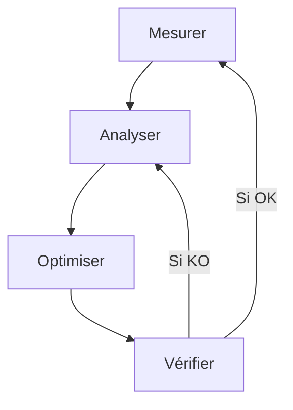
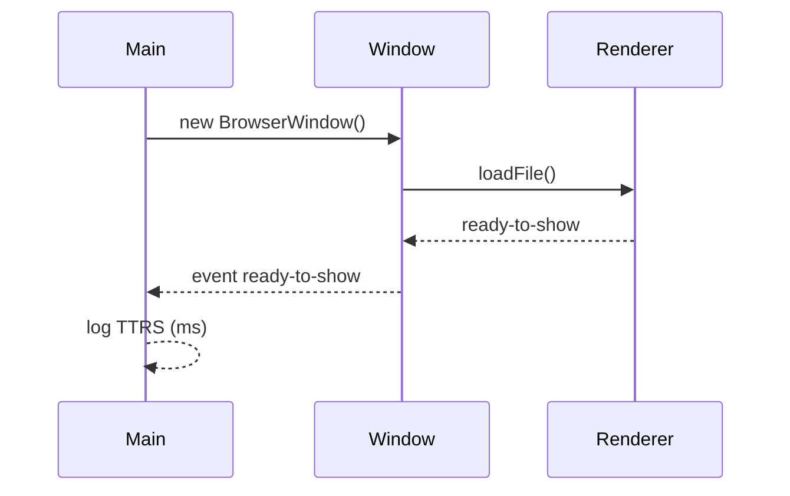

# 📘 13. Performance & debugging

> 🎯 **Objectif du chapitre**  
> Mettre en place une **méthodologie de mesure** et utiliser les **outils** (DevTools, profilers, traces) pour **diagnostiquer** et **optimiser** les performances **Renderer** & **Main** : temps d’affichage (`ready-to-show`), **latence IPC**, **CPU/Memory**, **fuites** (DOM/BrowserWindow), **GPU** et **I/O**. Structurer des **budgets de perf**, des **logs** utiles, et un **crash reporting** minimal.

---

## 🧩 13.1 Indicateurs clés & budgets

- **TTRS** (*Time To Ready‑to‑Show*) : ms entre création de la fenêtre et `ready-to-show`.  
- **TTI** (*Time To Interactive*) : moment où l’UI réagit sans saccade.  
- **IPC Latency** : temps moyen des `invoke/handle`.  
- **CPU** : % moyen pendant actions critiques.  
- **Memory** : empreinte (Renderer/Main), nombre d’objets et tailles.  
- **GPU** : frames drop, compositing.

**Formule (JavaScript) — budget simple**
```javascript
const PERF_BUDGET = Object.freeze({ ttrs: 700, ipcAvg: 50, cpuPeak: 75, memRendererMB: 300 });
```

---

## 🧩 13.2 Renderer : DevTools Performance

**Outils.** Panneau **Performance** (profilage CPU, **timelines**, **flame charts**), **Memory** (heap snapshots), **Coverage** (JS/CSS non utilisé). 

**Gestes clés :**
- Enregistrer une **trace** pendant une action (ouverture de note, scroll).  
- Repérer les **recalculs de styles**/**layouts** coûteux, **listeners** et **timers**.  
- Vérifier la **garbage collection** (GC) et **Detached DOM**.

**Formule (JavaScript) — marquer des phases**
```javascript
// renderer
performance.mark('open:start');
// ... action rendue ...
performance.mark('open:end');
performance.measure('open', 'open:start', 'open:end');
```

---

## 🧩 13.3 Main : Profilage & traces

**Approches.** 
- Lancer l’app avec **inspecteur Node** (VS Code/Chrome DevTools).  
- Utiliser `perf_hooks` pour **marquer** des sections (IPC, fs).  
- Chronométrer les **créations** de fenêtres et les **handlers** IPC.

**Formule (JavaScript) — perf_hooks**
```javascript
// main.js
const { performance, PerformanceObserver } = require('perf_hooks');
new PerformanceObserver((items) => {
  items.getEntries().forEach(e => console.log(`[perf] ${e.name}: ${e.duration.toFixed(1)}ms`));
}).observe({ entryTypes: ['measure'] });
performance.mark('ipc:file:read:start');
// ... traitement fs ...
performance.mark('ipc:file:read:end');
performance.measure('ipc:file:read', 'ipc:file:read:start', 'ipc:file:read:end');
```

---

## 🧩 13.4 Latence IPC & instrumentation

- **Mesurer** côté **Preload/Renderer** et côté **Main**.  
- **Échantillonner** sur N appels; afficher moyenne, médiane, p95.

**Formule (JavaScript) — mesure de latence**
```javascript
async function timeInvoke(channel, payload){
  const t0 = performance.now();
  const res = await window.api.invoke(channel, payload);
  const dt = performance.now() - t0;
  return { res, dt };
}
```

---

## 🧩 13.5 Mémoire & fuites

**Signaux.** Rendu qui **ralentit**, mémoire qui **croît** sans redescendre, **Detached DOM**, **listeners** non nettoyés, **BrowserWindow** non libérées.

**Remèdes.** 
- Toujours **`win = null`** sur `closed`.  
- **Détacher** les listeners (`removeListener`) lors du `destroy`.  
- Utiliser **heap snapshots** DevTools, rechercher **Retained size** anormal.

**Formule (JavaScript) — nettoyage composants**
```javascript
function mountComponent(el){
  const onClick = (e)=>{/* ... */};
  el.addEventListener('click', onClick);
  return () => el.removeEventListener('click', onClick); // destroy()
}
```

---

## 🧩 13.6 GPU & rendu

- **Désactiver** le GPU en cas de crashs graphiques : `app.disableHardwareAcceleration()` (à tester).  
- Vérifier les **composites** et **paint** via DevTools.  
- Éviter les **animations JS** coûteuses, préférer **CSS transform**.

---

## 🧩 13.7 I/O & fs

- **Batcher** les écritures, éviter **sync** sur le **Main thread**.  
- Déplacer les I/O lourdes hors du **chemin critique** de rendu.  
- Mettre en cache **lecture de config**.

---

## 🧩 13.8 Logs utiles & niveau

- **Debug** ciblé : préfixes par **domaine** (`[ipc]`, `[fs]`, `[renderer]`).  
- **Niveaux** : `info`, `warn`, `error`; **pas** de secrets.  
- **Rotation** simple (taille max) ou écriture limitée.

**Formule (JavaScript) — logger simple**
```javascript
const log = Object.freeze({
  info: (...a)=>console.log('[info]', ...a),
  warn: (...a)=>console.warn('[warn]', ...a),
  error: (...a)=>console.error('[error]', ...a)
});
```

---

## 🧩 13.9 Crash reporting minimal

- Utiliser **`crashReporter`** (Electron) pour **collecter** des rapports.  
- **Redémarrer** proprement après un crash, proposer **envoi** volontaire.

**Formule (JavaScript) — crashReporter**
```javascript
const { crashReporter } = require('electron');
crashReporter.start({ companyName: 'MonApp', submitURL: 'https://exemple.org/crash', uploadToServer: false });
```

---

## 🧩 13.10 Différences Windows vs macOS

- **HiDPI** : macOS (Retina) → tailles et **scaleFactor** influent sur le rendu.  
- **GPU drivers** : Windows plus variés → tester **disableHardwareAcceleration** en cas d’instabilités.  
- **Animations système** : macOS (Dock, Mission Control) peuvent impacter focus; mesurer.

---

## ⚠️ 13.11 Sécurité & confidentialité

- **Logs** : ne jamais inclure **données** sensibles; anonymiser les IDs.  
- **Crashs** : obtenir **consentement** pour l’envoi; utiliser **HTTPS**.  
- **Perf traces** : supprimer après analyse.

---

## 🛠️ 13.12 Atelier pas‑à‑pas

1. **Instrumenter** TTRS (création → `ready-to-show`) et afficher la valeur.  
2. **Mesurer** la **latence IPC** (moyenne/p95) sur `file:read`.  
3. **Profiler** une action Renderer (Performance panel) et éliminer un goulot (layout/reflow).  
4. **Prendre** un **heap snapshot** et corriger une fuite (listener/détaché).  
5. **Activer** un **logger** minimal et **crashReporter** (upload désactivé en dev).

---

## 🖼️ 13.13 Schémas (Mermaid)

**Boucle de mesure & optimisation**


**Flux TTRS**


---

## 🧪 13.14 (Aperçu) Tests & validation

- **TTRS** : vérifier que la valeur respecte le **budget**.  
- **IPC** : latence moyenne sous le budget; aucune dérive.  
- **Heap** : absence de **Detached DOM** persistants.

```javascript
// Pseudo-tests
console.assert(PERF_BUDGET.ttrs <= 1000, 'Budget TTRS raisonnable');
```

---

## 🔚 13.15 Résumé — Points essentiels

- **Mesurer avant d’optimiser** : TTRS, IPC, CPU, mémoire, GPU.  
- **Outillage** : DevTools (Performance/Memory), Node inspecteur, `perf_hooks`.  
- **Fuites** : listeners, DOM détaché, fenêtres non libérées.  
- **Logs & crashs** : utiles, sobres, respectueux de la confidentialité.  
- **Budgets** : définir, suivre, améliorer.

---

> ✅ **Livrable** : `14-performance-debugging.md` (ce fichier), prêt pour Obsidian.
