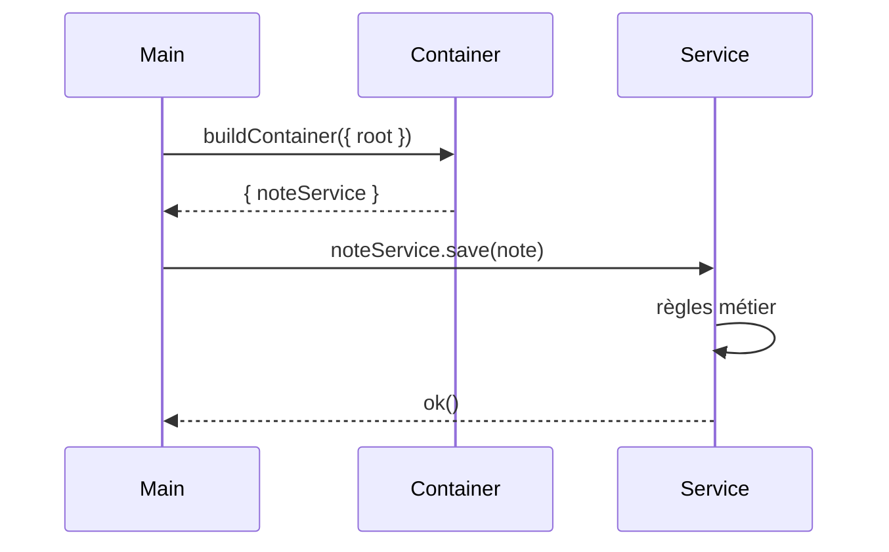

# 📘 14. Architecture & patterns

> 🎯 **Objectif du chapitre**  
> Concevoir une **architecture claire, testable et sécurisée** pour une application Electron : séparation **Main/Preload/Renderer**, **couches** (Services, Adapters, UI), **patterns** (Facade, Adapter, Repository, Command, Observer/pub‑sub, MV*), **contrats IPC**, **gestion d’erreurs**, **configuration**, **injection de dépendances (DI)** et **documentation**. Vous repartirez avec une **boîte à outils** de patterns prête pour évoluer.

---

## 🧩 14.1 Couches & responsabilités

**Découpage recommandé** :
- **UI (Renderer)** : composants, état, interactions; **aucun accès Node** (CSP).  
- **Preload (façade)** : expose **API contrôlées** (`window.api`) et **valide** minimalement.  
- **Main (orchestrateur)** : fenêtres, OS, sécurité, IPC; **pas** de DOM.  
- **Services** : logique métier (lecture/écriture, config, crypto).  
- **Adapters** : interfaces vers **ressources externes** (fs, network).  
- **Repositories** : accès **structuré** aux données (config, notes).  

**Formule (JavaScript) — contrat de couche**
```javascript
// services/note.service.js
export class NoteService {
  constructor(repo){ this.repo = repo; }
  async list(){ return this.repo.list(); }
  async save(note){ /* règles métier */ return this.repo.save(note); }
}
```

---

## 🧩 14.2 MV* (MVC / MVVM) en Renderer

**MVC/MVVM** pour structurer l’UI :
- **Model** : état + règles d’update.  
- **View** : composants visuels (DOM).  
- **Controller/ViewModel** : relie **actions** UI et **Model**, appelle `window.api`.

**Formule (JavaScript) — ViewModel simple**
```javascript
// ui/viewmodel.js
export class NotesVM {
  constructor(api, store){ this.api = api; this.store = store; }
  async load(){ const r = await this.api.fileRead({ path: 'notes.md' }); if (r?.ok) this.store.setNotes(r.data.content); }
  select(id){ this.store.select(id); }
}
```

---

## 🧩 14.3 Facade & Adapter

- **Facade** (Preload) : **simplifie** l’accès aux capacités internes en exposant une API **cohérente** (`window.api`), avec **timeouts** et **whitelist**.  
- **Adapter** : **normalise** une source externe (fs, network) à une **interface** stable.

**Formule (JavaScript) — adapter fs**
```javascript
// adapters/fs.adapter.js
import fs from 'fs'; import path from 'path';
export class FsAdapter {
  constructor(root){ this.root = root; }
  read(rel){ const file = path.resolve(this.root, rel); return fs.readFileSync(file, 'utf-8'); }
  write(rel, content){ const file = path.resolve(this.root, rel); fs.writeFileSync(file, content, 'utf-8'); }
}
```

---

## 🧩 14.4 Repository

**But.** Encapsuler l’accès aux données avec un **contrat** clair; faciliter **tests** et **migrations**.

```javascript
// repositories/note.repo.js
export class NoteRepo {
  constructor(adapter){ this.adapter = adapter; }
  list(){ /* parse index.json ou scan dir */ return []; }
  save(note){ /* sérialiser et écrire */ return true; }
}
```

---

## 🧩 14.5 Command & pub‑sub

- **Command** : encapsuler une **action** (ex. `ImportNotesCommand`).  
- **Observer/pub‑sub** : diffuser des **événements** entre modules **découplés**.

**Formule (JavaScript) — Command générique**
```javascript
export class Command {
  constructor(execute){ this.execute = execute; }
}
const importNotes = new Command(async (ctx)=> { const data = await ctx.api.fileRead({ path: 'notes.md' }); ctx.store.add(data); });
```

---

## 🧩 14.6 Contrats IPC & DTOs

**Contrats** : définir **canaux**, **payloads** et **réponses** (`ok/fail`) **versionnés**.

**Formule (JavaScript) — DTO versionné**
```javascript
export const DTO = Object.freeze({
  fileReadV1: (rel)=> ({ v: 1, rel }),
  fileReadR1: (content)=> ({ v: 1, ok: true, data: { content } })
});
```

---

## 🧩 14.7 Gestion d’erreurs & règles

- **Normer** les erreurs : code, message, contexte.  
- **Mapper** en UI (toast/dialog).  
- **Ne jamais** exposer stack brute en Renderer.

**Formule (JavaScript) — erreur normalisée**
```javascript
function err(code, message, ctx){ return Object.freeze({ code, message: String(message), ctx: ctx||{} }); }
```

---

## 🧩 14.8 DI (injection de dépendances)

**But.** Injecter les **implémentations** (adapters/repos/services) pour **tester** et **échanger** facilement.

```javascript
// container.js
import { NoteService } from './services/note.service.js';
import { NoteRepo } from './repositories/note.repo.js';
import { FsAdapter } from './adapters/fs.adapter.js';

export function buildContainer({ root }){
  const fsAdapter = new FsAdapter(root);
  const noteRepo = new NoteRepo(fsAdapter);
  const noteService = new NoteService(noteRepo);
  return { fsAdapter, noteRepo, noteService };
}
```

---

## 🧩 14.9 Structure de dossiers (exemple)

```
project/
  main/                // BrowserWindow, IPC, sécurité
  preload/             // Facade + whitelist
  renderer/            // UI (composants, ViewModel)
  domain/              // services/, repositories/, adapters/
  assets/
  tests/
```

---

## 🧩 14.10 Documentation vivante

- **Contrats IPC** : table des canaux + schémas Mermaid.  
- **Règles** de sécurité (CSP, navigation).  
- **Décisions** (ADR — Architecture Decision Records).

**Formule (Markdown) — ADR minimal**
```md
# ADR-0001: Whitelist de canaux IPC
- Contexte: Sécuriser les échanges.
- Décision: Liste statique dans Preload + validation Main.
- Conséquences: Testabilité accrue, surface réduite.
```

---

## 🧩 14.11 Anti‑patterns fréquents

- ❌ **`remote`** (obsolète) : préférer IPC + Preload.  
- ❌ **Singletons globaux** partagés partout : injectez via **container**.  
- ❌ **Mélange** responsabilités (DOM + fs dans Renderer).  
- ❌ **Canaux IPC dynamiques** non contrôlés.  
- ❌ **Secrets** en clair dans les bundles.

---

## 🛠️ 14.12 Atelier pas‑à‑pas

1. **Créer** `domain/` avec **adapters**, **repositories**, **services**.  
2. **Construire** un **container** (`buildContainer`) et **injecter** dans Main/Preload/Renderer.  
3. **Documenter** les **contrats** IPC (DTO versionnés) et ajouter des **tests** unitaires sur Services/Repos.  
4. **Isoler** l’UI en **MVVM** (ViewModel ↔ store ↔ View).  
5. **Lister** les **anti‑patterns** à éviter dans le README d’archi.

---

## 🖼️ 14.13 Schémas (Mermaid)

**Couches & flux**
```mermaid
flowchart LR
  UI[Renderer (View+VM)] -->|window.api| P[Preload (Facade)]
  P -->|IPC| M[Main (Orchestrateur)]
  M --> S[Services]
  S --> R[Repositories]
  R --> A[Adapters (fs/net)]
```

**Injection & contrats**


---

## 🧪 14.14 (Aperçu) Tests & validation

- **Unitaires** : Services (règles), Repos (contrats), Adapters (fs mock).  
- **E2E** : flux MVVM + IPC (`file:read` → rendu).  
- **Audit** : absence d’anti‑patterns (lint, review).

```javascript
// Pseudo-tests
console.assert(typeof buildContainer === 'function', 'DI: container disponible');
```

---

## 🔚 14.15 Résumé — Points essentiels

- **Couches** nettes : UI ↔ Preload ↔ Main ↔ Domain (Services/Repos/Adapters).  
- **Patterns** : Facade, Adapter, Repository, Command, pub‑sub, MVVM.  
- **Contrats** IPC versionnés, **erreurs** normalisées.  
- **DI** : testabilité et évolutivité.  
- **Anti‑patterns** : à éviter (remote, singletons globaux, mélange des couches, canaux dynamiques, secrets).  
- **Documentation** : ADRs + schémas.

---

> ✅ **Livrable** : `15-architecture-patterns.md` (ce fichier), prêt pour Obsidian.
