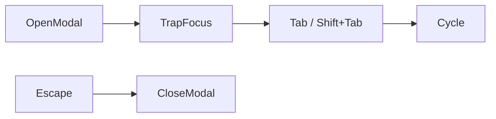

# 📘 15. Accessibilité & i18n (A11y + Internationalisation)

> 🎯 **Objectif du chapitre**  
> Concevoir une interface **inclusive** et **multilingue** : respecter **WCAG** (navigation clavier, rôles **ARIA**, contrastes), prendre en compte les préférences **OS** (`prefers-reduced-motion`, `forced-colors`), gérer **i18n/l10n** (**Intl**, ICU MessageFormat, **pluriels**, **dates/nombres**), **RTL** et **polices** adaptées, tout en garantissant une **CSP** sûre pour les traductions et une **performance** fluide.

---

## 🧩 15.1 Pourquoi A11y & i18n ?

- **A11y** : rendre l’app **utilisable par tous** (clavier, lecteur d’écran, contrastes).  
- **i18n/l10n** : offrir une **expérience native** pour chaque langue/locale (formats, direction, polices), en **sécurité** et sans perte de performance.

---

## 🧩 15.2 Navigation clavier & gestion du focus

- **Ordre logique** (`tabindex` ≥ 0 avec parcimonie).  
- **Piège de focus** (modales) : rendre **cyclique** et **évadable** (`Esc`).  
- **Raccourcis** : `CmdOrCtrl+K` (recherche), `Alt+F` (menu), éviter conflits OS.

**Formule (JavaScript) — piège de focus minimal**
```javascript
export function trapFocus(modal){
  const focusables = modal.querySelectorAll('a, button, input, textarea, select, [tabindex="0"]');
  let i = 0;
  modal.addEventListener('keydown', (e)=>{
    if (e.key === 'Tab'){
      e.preventDefault();
      i = (i + (e.shiftKey?-1:1) + focusables.length) % focusables.length;
      focusables[i].focus();
    } else if (e.key === 'Escape') modal.close?.();
  });
}
```

---

## 🧩 15.3 Rôles ARIA, landmarks & annonces

- **Landmarks** : `header`, `nav`, `main`, `aside`, `footer`.  
- **Labels** : `aria-label`, `aria-labelledby`, `aria-describedby`.  
- **Live regions** : `aria-live="polite"` pour messages non bloquants.

**Formule (HTML) — exemple de landmark**
```html
<main id="content" role="main" aria-labelledby="title">
  <h1 id="title">Mes notes</h1>
</main>
```

---

## 🧩 15.4 Contrastes, modes & préférences OS

- **Contraste** : viser **WCAG AA** (ratio ≥ 4.5:1).  
- **Réduction de mouvement** :
```css
@media (prefers-reduced-motion: reduce){
  * { animation: none !important; transition: none !important; }
}
```
- **Forced colors** (Windows High Contrast) :
```css
@media (forced-colors: active){
  * { forced-color-adjust: auto; }
}
```

---

## 🧩 15.5 Internationalisation : bases **Intl**

- **Langue & locale** : `navigator.language` (Renderer), `app.getLocale()` (Main).  
- **Formats** : `Intl.NumberFormat`, `Intl.DateTimeFormat`, `Intl.PluralRules`.

**Formule (JavaScript) — pluriels & nombres**
```javascript
export function pluralize(n, { one, other }){
  const pr = new Intl.PluralRules(navigator.language);
  return (pr.select(n) === 'one' ? one : other).replace('{n}', String(n));
}
export const fmtNumber = (n)=> new Intl.NumberFormat(navigator.language).format(n);
export const fmtDate = (d)=> new Intl.DateTimeFormat(navigator.language, { dateStyle: 'medium', timeStyle: 'short' }).format(d);
```

---

## 🧩 15.6 ICU MessageFormat & ressources

- **Messages** : stocker en **JSON** (un fichier par locale).  
- **Interpolation sûre** : **jamais** d’`innerHTML`; utilisez `textContent`.

**Formule (JavaScript) — `t()` sûre**
```javascript
const MESSAGES = { 'fr-CA': { hello: 'Bonjour {name}!', items: '{n} élément(s)' }, 'en': { hello: 'Hello {name}!', items: '{n} item(s)' } };
export function t(key, vars={}){
  const loc = navigator.language in MESSAGES ? navigator.language : 'en';
  let s = MESSAGES[loc][key] || key;
  for (const [k,v] of Object.entries(vars)) s = s.replace(`{${k}}`, String(v));
  return s; // assigner via textContent
}
```

---

## 🧩 15.7 RTL & polices

- **Direction** : `dir="rtl"` sur `<html>` pour ar languages.  
- **Polices** : charger des fontes adaptées (Noto Sans Arabic/Hebrew, etc.).

**Formule (JavaScript) — bascule de direction**
```javascript
export function applyDirection(lang){
  const rtl = /^ar|he|fa|ur/.test(lang);
  document.documentElement.setAttribute('dir', rtl ? 'rtl' : 'ltr');
  document.documentElement.setAttribute('lang', lang);
}
```

---

## 🧩 15.8 Pipeline i18n (Renderer ↔ Preload ↔ Main)

- **Main** : expose la **locale** et charge les **ressources** sûres.  
- **Preload** : façade `window.i18n` (`getLocale`, `getMessages`).  
- **Renderer** : applique la **direction**, rend avec `t()`.

**Schéma (Mermaid)**
```mermaid
sequenceDiagram
  participant Renderer
  participant Preload
  participant Main

  Renderer->>Preload: window.i18n.getLocale()
  Preload->>Main: invoke 'i18n:locale'
  Main-->>Preload: 'fr-CA'
  Renderer->>Preload: window.i18n.getMessages('fr-CA')
  Preload->>Main: invoke 'i18n:messages'
  Main-->>Preload: { ... }
  Renderer->>Renderer: applyDirection('fr-CA'); render(t('hello',{name:'Eric'}))
```

---

## 🧩 15.9 Sécurité des traductions

- **CSP stricte** : **scripts locaux** uniquement; **pas** de chargement de bundles depuis CDN.  
- **Sanitiser** les **variables** (pas de HTML).  
- **Limiter** les **ressources** chargées à une **liste blanche**.

---

## 🧩 15.10 Différences Windows vs macOS

- **Lecteurs d’écran** : macOS **VoiceOver**, Windows **Narrator** (raccourcis et verbosité différents).  
- **High Contrast** : Windows → `forced-colors`; macOS → préférences d’accessibilité (inversion, contraste).  
- **Claviers** : `Cmd` vs `Ctrl` pour les **accelerators**.

---

## ⚠️ 15.11 Vérifications A11y minimales

- **Labels** présents et liés, **ordre** de tabulation cohérent.  
- **Couleurs** conformes (contraste AA).  
- **Focus visible**.  
- **Annonces** des messages via live regions.

---

## 🛠️ 15.12 Atelier pas‑à‑pas

1. **Ajouter** un **focus trap** pour la modale “Préférences”.  
2. **Mettre** en place `prefers-reduced-motion` et `forced-colors`.  
3. **Créer** `window.i18n` (Preload) et une API Main pour `i18n:locale`/`i18n:messages`.  
4. **Implémenter** `t()` et **pluralize** avec **Intl**; tester **fr‑CA** et **en**.  
5. **Appliquer** `applyDirection(lang)` pour une langue **RTL** et charger des **polices** adaptées.

---

## 🖼️ 15.13 Schémas (Mermaid)

**Focus trap (modale)**


**i18n ressources**
```mermaid
flowchart TD
  MainLocale[i18n:locale] --> PreloadAPI
  MainMessages[i18n:messages] --> PreloadAPI
  PreloadAPI --> Renderer[t()/applyDirection]
```

---

## 🧪 15.14 (Aperçu) Tests

- **Unitaires** : `t()` (interpolation), `pluralize`, `applyDirection`.  
- **E2E** : tabulation, focus visible, messages annoncés.  
- **Contraste** : vérifications CSS automatisées (outil externe, à documenter).

```javascript
// Pseudo-tests
console.assert(['ltr','rtl'].includes(document.documentElement.dir), 'dir doit être ltr ou rtl');
```

---

## 🔚 15.15 Résumé — Points essentiels

- **A11y** : focus, rôles, live regions, contrastes, préférences OS.  
- **i18n** : Intl/ICU, pluriels, dates/nombres, direction & polices.  
- **Sécurité** : pas d’`innerHTML` pour les traductions, CSP stricte.  
- **Pipeline** : Main ↔ Preload ↔ Renderer; API i18n minimaliste.  
- **Tests** : unitaires + E2E, checklist A11y.

---

> ✅ **Livrable** : `16-accessibilite-i18n.md` (ce fichier), prêt pour Obsidian.
