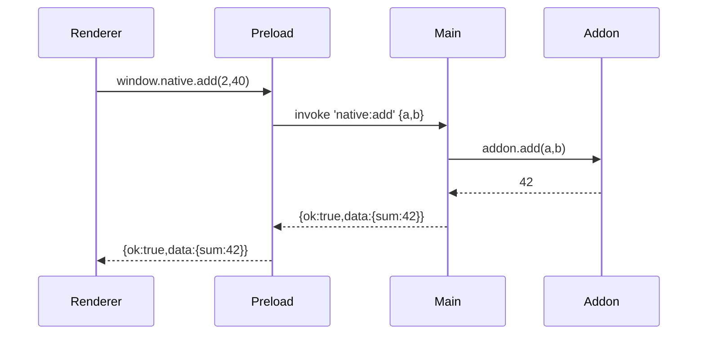

# 📘 16. Intégrations avancées (N‑API / Node‑API)

> 🎯 **Objectif du chapitre**  
> Intégrer des **addons natifs** (C/C++) via **N‑API**/**Node‑API** pour exécuter des tâches **bas niveau** (perf, accès système) **sans exposer** directement des primitives dangereuses à l’UI. Nous verrons où **charger** l’addon, comment **compiler** pour **Windows/macOS**, gérer l’**ABI** d’Electron, bâtir une **façade Preload**, et **distribuer** en toute sécurité.

---

## 🧩 16.1 N‑API : définition & pourquoi

- **N‑API/Node‑API** est une **interface binaire stable** pour écrire des extensions **C/C++** utilisables depuis Node/Electron.  
- **Pourquoi** : performances, accès à des **APIs natives** ou librairies C existantes, tout en **isolant** ces capacités **côté Main**.

---

## 🧩 16.2 Architecture recommandée

- **Main** : **charge** l’addon natif et expose des méthodes **sécurisées** via IPC.  
- **Preload** : **façade** (`window.native`) avec **whitelist** + timeouts.  
- **Renderer** : **aucun require** de l’addon; **seulement** `window.native.*`.

**Schéma (Mermaid)**
```mermaid
flowchart LR
  Renderer -->|window.native| Preload
  Preload -->|invoke| Main
  Main --> Addon[N-API (C/C++)]
```

---

## 🧩 16.3 Exemple minimal d’addon (C) + binding

**Fichier `src/addon.c`**
```c
#include <node_api.h>

static napi_value add(napi_env env, napi_callback_info info){
  size_t argc = 2; napi_value args[2];
  napi_get_cb_info(env, info, &argc, args, NULL, NULL);
  double a, b; napi_get_value_double(env, args[0], &a); napi_get_value_double(env, args[1], &b);
  napi_value result; napi_create_double(env, a + b, &result);
  return result;
}

static napi_value init(napi_env env, napi_value exports){
  napi_value fn; napi_create_function(env, "add", NAPI_AUTO_LENGTH, add, NULL, &fn);
  napi_set_named_property(env, exports, "add", fn);
  return exports;
}

NAPI_MODULE(NODE_GYP_MODULE_NAME, init)
```

**`binding.gyp` (extrait)**
```json
{
  "targets": [
    {
      "target_name": "addon",
      "sources": [ "src/addon.c" ]
    }
  ]
}
```

**Wrapper JS (Main)**
```javascript
// main/native.js
const path = require('path');
const addon = require(path.join(__dirname, '..', 'build', 'Release', 'addon.node'));
exports.add = (a, b)=> {
  if (typeof a !== 'number' || typeof b !== 'number') throw new TypeError('numbers only');
  return addon.add(a, b);
};
```

---

## 🧩 16.4 Façade Preload & usage Renderer

**Preload** :
```javascript
// preload.js (extrait)
const { contextBridge, ipcRenderer } = require('electron');
contextBridge.exposeInMainWorld('native', Object.freeze({
  add: (a,b)=> ipcRenderer.invoke('native:add', { a, b })
}));
```

**Main (IPC)** :
```javascript
// main.js (extrait)
const { ipcMain } = require('electron');
const native = require('./main/native');
ipcMain.handle('native:add', async (_, { a, b })=> ({ ok: true, data: { sum: native.add(a,b) } }));
```

**Renderer** :
```javascript
// renderer/app.js (extrait)
const r = await window.native.add(2, 40);
console.log('Somme', r.data.sum);
```

---

## 🧩 16.5 ABI Electron & compilation

- **ABI** : Electron embarque une version de **Node** spécifique → l’addon doit être **compilé** pour l’**ABI** correspondante.  
- **Outils usuels** : `node-gyp` (MSBuild/clang), *(en prod)* **précompilations** par OS/arch.

**Bonnes pratiques** :
- **Ne pas** packager `.node` du **développement** pour la **prod**; recompiler ou utiliser des **prébuilds**.
- Utiliser des **scripts** dédiés pour `build:native`.

---

## 🧩 16.6 Windows vs macOS (toolchains)

- **Windows** : Visual Studio Build Tools (**MSVC**), SDK Windows, `msbuild`.  
- **macOS** : **Xcode/clang**, architectures **x64/arm64** (Apple Silicon), signatures/notarization si nécessaire.

**Formule (JavaScript) — détection arch/OS**
```javascript
const os = process.platform; const arch = process.arch; // 'win32'|'darwin', 'x64'|'arm64'
```

---

## 🧩 16.7 Chargement sécurisé & chemins

- **Résolution** **statique** des chemins (`path.join` sur dossier **resources**).  
- **Jamais** de chargement via chemins **utilisateur** (pas de `openFile` → `require`).  
- **Validation** des **paramètres** des fonctions natives.

**Formule (JavaScript) — chemin contrôlé**
```javascript
function loadAddon(){
  const p = require('path').join(process.resourcesPath, 'native', 'addon.node');
  return require(p);
}
```

---

## 🧩 16.8 Threads & performances

- **Ne jamais** bloquer le **Main thread** avec des appels natifs **lourds**.  
- Utiliser **Worker Threads** (Node) ou N‑API **thread‑safe functions** pour **offloader**.  
- Mesurer **latence** et **débit** (voir chap. 13).

---

## 🧩 16.9 Tests & robustesse

- **Unitaires** : wrapper JS (validation, types).  
- **Intégration** : appels IPC → addon.  
- **E2E** : scénarios critiques (fichiers volumineux, temps réel).  
- **Crash** : tester **comportement** si l’addon **jette** (try/catch → réponse **fail** standardisée).

---

## 🧩 16.10 Distribution & packaging

- **Inclure** les binaries `.node` **par OS/arch** dans `extraResources` (chap. 10).  
- **Séparer** la logique de **chargement** (chemin `resourcesPath`).  
- **Fallback** : message d’erreur **clair** si module manquant.

---

## 🧩 16.11 Sécurité : règles d’or

- Charger l’addon **uniquement côté Main**.  
- **Amener** vers l’UI des **capacités minimales** (façade contrôlée).  
- **Journaliser** les **erreurs** natives; **désactiver** l’addon si instable.  
- **Aucune** entrée utilisateur **directe** vers l’API native.

---

## 🛠️ 16.12 Atelier pas‑à‑pas

1. **Écrire** l’addon N‑API (fonction `add`).  
2. **Compiler** avec `node-gyp` sur **Windows** et **macOS**.  
3. **Charger** côté **Main** et exposer via **IPC**.  
4. **Créer** une **façade Preload** (`window.native.add`).  
5. **Tester** un appel en Renderer et **mesurer** la latence.

---

## 🖼️ 16.13 Schémas (Mermaid)

**Flux complet**


---

## 🧪 16.14 (Aperçu) Tests

```javascript
// Pseudo-test
console.assert(typeof require('path').join === 'function', 'path.join disponible');
```

---

## 🔚 16.15 Résumé — Points essentiels

- **N‑API** : interface **binaire stable** pour addons natifs.  
- **Chargement côté Main**, **façade Preload** uniquement.  
- **Compilation** par **OS/arch** compatible avec **ABI** d’Electron.  
- **Sécurité** : chemins contrôlés, validations, capacités minimales.  
- **Performance** : threads si lourds, mesurer latence.  
- **Packaging** : inclure `.node` et chemins `resourcesPath`.

---

> ✅ **Livrable** : `17-integrations-avancees.md` (ce fichier), prêt pour Obsidian.
