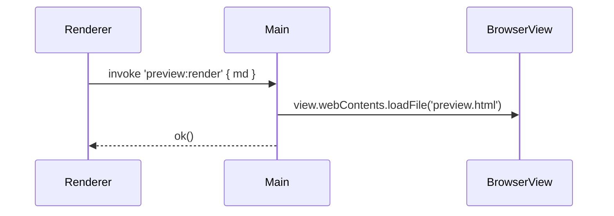
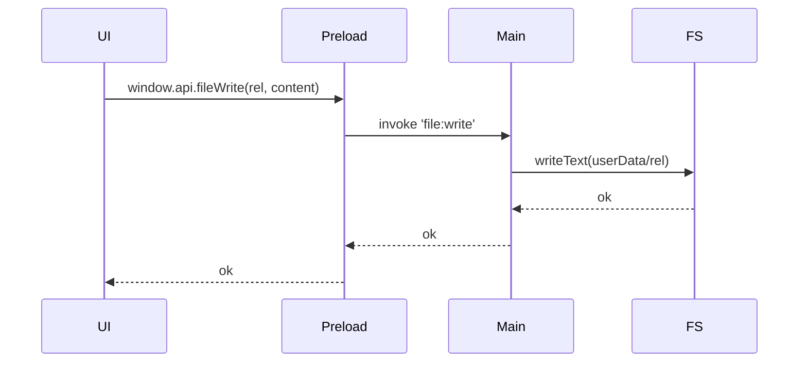

# 📘 17. Projet fil rouge : Mini‑Obsidian Desktop

> 🎯 **Objectif du chapitre**  
> Réaliser une application **Mini‑Obsidian Desktop** (gestion de notes **Markdown** locale) qui **intègre** tous les acquis : **Main/Preload/Renderer**, **Sécurité** (CSP, sandbox, whitelists), **IPC** robuste, **UI Vanilla JS**, **BrowserView** pour la **preview** Markdown, **Webpack**, **Intégrations OS** (Menu/Tray/Dialogs/Notifications), **Stockage** dans `userData`, **Packaging**/**Auto‑update**, **Tests** (Jest/Playwright), **Performance** & **A11y**, **i18n**, et **N‑API** *(optionnel)*.

---

## 🧭 17.1 Vision & périmètre

- **Produit** : éditeur/lecteur de notes Markdown avec **arborescence**, **recherche**, **preview** et **thèmes**.  
- **Local‑first** : fichiers stockés dans `userData/data/`.  
- **Single source of truth** : `Main` gère le filesystem; `Renderer` interagit via `window.api`.

---

## 🗂️ 17.2 Arborescence recommandée

```
mini-obsidian/
  main/                # BrowserWindow, IPC, sécurité
  preload/             # Façade window.api + whitelists
  renderer/            # UI Vanilla JS (composants, store, router)
  domain/              # services/, repos/, adapters/
  assets/              # icônes, images, styles
  build/               # assets packaging (icns/ico, entitlements)
  dist/                # outputs webpack
  tests/               # __tests__/ + __e2e__/
```

---

## 🧩 17.3 Backlog fonctionnel (MVP + Plus)

**MVP**  
- 📁 **Explorer** les notes (tree/list, tri, filtre).  
- ✍️ **Éditer** une note (Markdown) avec **autosave**.  
- 🖼️ **Preview** Markdown (BrowserView) **CSP‑friendly**.  
- 🔎 **Recherche** plein texte simple.  
- 🎨 **Thèmes** (clair/sombre) + **police** ajustable.  
- 🌐 **i18n** `fr‑CA` / `en`.

**Plus** (itérations suivantes)  
- 📑 **Tags**/métadonnées.  
- 🔗 **Liens** internes/externes (validation).  
- 🔄 **Auto‑update** + **canal beta**.  
- 🔔 **Notifications** (actions longues terminées).  
- 🧩 **N‑API** (ex. stats rapides sur un corpus).

---

## 🧱 17.4 Exigences non fonctionnelles

- **Sécurité** : pas d’accès Node en Renderer; **CSP stricte**; whitelists de canaux; validation des chemins/extensions.
- **Perf** : TTRS < **700 ms** (budget), latence IPC moyenne < **50 ms** (chap. 13).  
- **A11y** : navigation clavier complète, contrastes AA, focus visible.  
- **Tests** : couverture **≥ 75%** (branches/fonctions/lignes).  
- **Portabilité** : Windows/macOS, x64 & arm64 (si possible).

---

## 🧩 17.5 Contrats IPC (extraits)

```javascript
// IPC canaux (contrats versionnés)
const IPC = Object.freeze({
  'file:list:v1': { req: { dir: 'string' }, res: { ok: 'boolean', data: { files: 'array' } } },
  'file:read:v1': { req: { rel: 'string' }, res: { ok: 'boolean', data: { content: 'string' } } },
  'file:write:v1': { req: { rel: 'string', content: 'string' }, res: { ok: 'boolean' } },
  'search:query:v1': { req: { q: 'string' }, res: { ok: 'boolean', data: { hits: 'array' } } }
});
```

---

## 🧩 17.6 UI Vanilla JS (composants & store)

- **Composants** : Sidebar (liste), Editor (textarea), Preview (BrowserView), Toolbar (actions).  
- **Store** : état central (note courante, filtre, thème, locale).  
- **Router minimal** : hachage (`#note/ID`).

**Formule (JS) — store minimal**
```javascript
export const store = (()=>{
  let state = { current: null, notes: [], filter: '', theme: 'dark', locale: 'fr-CA' };
  const subs = new Set();
  const set = (patch)=>{ state = { ...state, ...patch }; subs.forEach(fn=>fn(state)); };
  return { get: ()=>state, set, sub: fn=>subs.add(fn), unsub: fn=>subs.delete(fn) };
})();
```

---

## 🧩 17.7 BrowserView preview Markdown

- **Renderer** envoie `preview:render` → **Main** valide et **charge** la page preview (CSP stricte) avec styles.

**Schéma (Mermaid)**


---

## 🧩 17.8 Stockage & userData

- **Racine** : `app.getPath('userData')/data/`.  
- **Fichiers** : `.md`, `.json` (index/config).  
- **Sauvegarde** : `.bak.json` avant écriture (chap. 9).  
- **Chiffrement** : secrets via **AES‑256‑GCM** (chap. 9) si nécessaire.

---

## 🧩 17.9 Webpack & scripts

- **3 configs** : `webpack.main.js`, `webpack.preload.js`, `webpack.renderer.js`.  
- **Scripts** : `build`, `dev`, `watch:renderer`, `pack`, `dist` (chap. 6 & 10).

---

## 🧩 17.10 Intégrations OS

- **Menu** : Fichier (Nouveau/Ouvrir/Enregistrer/Quitter), Édition (Couper/Copier/Coller), Affichage (Reload/DevTools).  
- **Tray** : Ouvrir/Préférences/Quitter.  
- **Dialogs** : `showOpenDialog` (filtres Markdown/Texte).  
- **Notifications** : fin d’indexation/recherche.

---

## 🧩 17.11 Packaging & auto‑update

- **electron‑builder** : cibles **macOS (DMG/ZIP)**, **Windows (NSIS/ZIP)**, icônes **ICNS/ICO**.  
- **publish** `generic` (HTTPS) + **latest.yml**; **auto‑update** via `electron‑updater` (chap. 10–11).

---

## 🧩 17.12 Tests (Jest + Playwright)

- **Unitaires** : Preload (validation), services/repos, helpers DOM.  
- **E2E** : lancement app, titre, ouverture note, preview, IPC.

---

## 🧩 17.13 Performance & A11y

- **Budgets** : TTRS/IPC/CPU/mémoire (chap. 13).  
- **A11y** : **focus trap** modales, **ARIA** landmarks, **prefers‑reduced‑motion**, **forced‑colors** (chap. 15).

---

## 🧩 17.14 i18n

- **Locales** : `fr‑CA`/`en`.  
- **Intl** pour nombres/dates/pluriels; **t()** sans `innerHTML`.  
- **RTL** *(optionnel)* : bascule `dir`, polices adaptées.

---

## 🧩 17.15 (Optionnel) N‑API

- **Addon** simple (ex. stats de mots) chargé **côté Main**; façade Preload `window.native.stats()`.

---

## 🛣️ 17.16 Milestones & critères d’acceptation

1. **MVP UI + IPC**  
   - ✅ Sidebar + Editor + Preview fonctionnels.  
   - ✅ Lecture/écriture `.md` dans `userData`.  
   - ✅ Contrats IPC versionnés + validations.
2. **Stockage & recherche**  
   - ✅ Index `.json` généré; recherche retourne des hits pertinents.  
3. **Intégrations OS**  
   - ✅ Menus & Tray actifs; Dialogs filtrent les extensions.  
4. **Packaging & update**  
   - ✅ Artifacts **signés**; auto‑update **opérationnel** (endpoint HTTPS).  
5. **Qualité & perf**  
   - ✅ Couverture **≥ 75%**; TTRS **< 700 ms**; latence IPC **< 50 ms**.  
6. **A11y & i18n**  
   - ✅ Focus, ARIA, contrastes; UI et contenus **fr‑CA/en**.

---

## 📦 17.17 Livrables

- **Code source** complet + **README** (ADR, contrats IPC, budgets).  
- **Artifacts** : DMG/ZIP (macOS), NSIS/ZIP (Windows).  
- **URL** de **publication** (updates).  
- **Rapports** : couverture, perf (captures), checklist A11y.

---

## 🖼️ 17.18 Schémas (Mermaid)

**Vue d’ensemble**
```mermaid
flowchart LR
  UI[Renderer UI] -->|window.api| Preload[Facade]
  Preload -->|IPC| Main[Main/Services]
  Main --> FS[Filesystem (userData)]
  Main --> BV[BrowserView Preview]
  Main --> OS[Menus/Dialogs/Tray/Notifications]
```

**Flux fichier**


---

## 🧪 17.19 (Aperçu) Tests

```javascript
// Pseudo-test
console.assert(typeof store.get === 'function', 'Store doit exposer get()');
```

---

## 🔚 17.20 Résumé — Points essentiels

- **Mini‑Obsidian Desktop** : projet intégrateur **local‑first**.  
- **Architecture** claire (UI ↔ Preload ↔ Main ↔ Domain), **IPC** robustes, **CSP** stricte.  
- **Fonctions** clés : explorer/éditer/rechercher/preview.  
- **Intégrations** OS, **stockage** `userData`, **packaging/update**, **tests**, **perf**, **A11y/i18n**.  
- **Option** N‑API pour capacités avancées.

---

> ✅ **Livrable** : `18-projet-fil-rouge-mini-obsidian.md` (ce fichier), prêt pour Obsidian.
