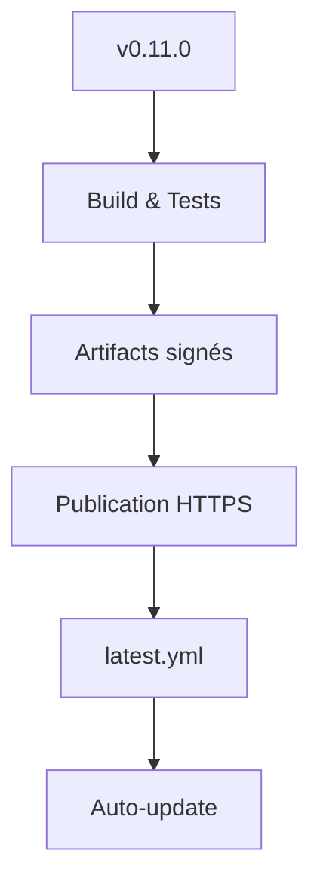
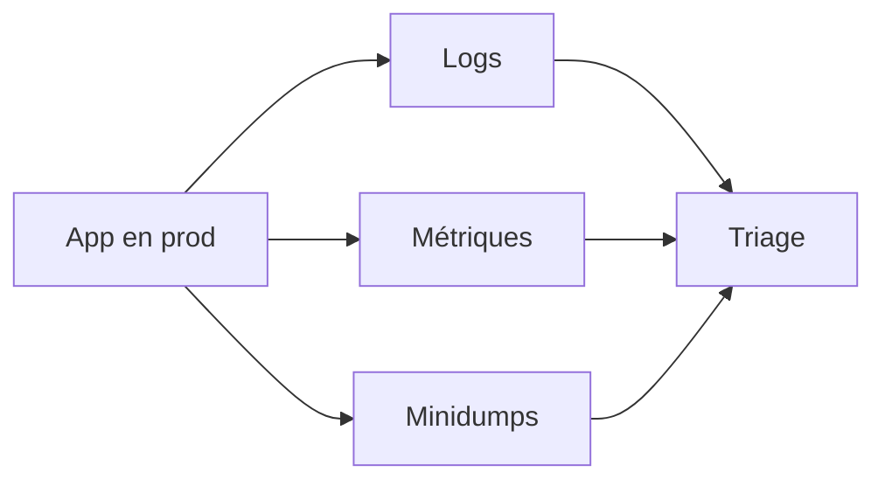

# 📘 18. Déploiement & maintenance (CI/CD, releases, crash reporting)

> 🎯 **Objectif du chapitre**  
> Mettre en place une **chaîne de déploiement fiable** et des **opérations** durables : **CI/CD** multi‑OS, **versionnage SemVer**, **notes de version**, **staged rollout** (latest/beta/canary), **crash reporting** (minidumps), **observabilité** (logs/métriques), **support & triage**, **migrations/backup**, **plans de rollback**, et **sécurité** (secrets/signatures).

---

## 🧩 18.1 Versionnage & releases (SemVer)

- **SemVer** : `MAJOR.MINOR.PATCH`.  
- **Règles** : 
  - **PATCH** (corrections) sans breaking.  
  - **MINOR** (features, compatibilité ascendante).  
  - **MAJOR** (breaking changes).  
- **Changelog** lisible : titres, sections `Added/Changed/Fixed/Removed`.  
- **Notes de version** : résument nouveautés, impacts et **risques**.

**Formule (Markdown) — squelette de release**
```md
## v0.11.0 — 2025-01-10
### Added
- Nouveau panneau Preview Markdown.
### Fixed
- Correction latence IPC > 50 ms lors de la sauvegarde.
```

---

## 🧩 18.2 CI/CD multi‑OS (GitHub Actions)

- **Objectif** : build/test **Windows & macOS**, publier artifacts signés (chap. 10) et générer `latest.yml` (chap. 11).

**`/.github/workflows/release.yml` (exemple minimal)**
```yaml
name: Release
on:
  push:
    tags:
      - 'v*.*.*'
jobs:
  build-matrix:
    runs-on: ${{ matrix.os }}
    strategy:
      matrix:
        os: [macos-latest, windows-latest]
    steps:
      - uses: actions/checkout@v4
      - uses: actions/setup-node@v4
        with: { node-version: '20.x' }
      - name: Install deps
        run: npm ci
      - name: Unit tests
        run: npm run test:unit
      - name: E2E tests
        run: npm run test:e2e
      - name: Build app bundles
        run: npm run build
      - name: Dist artifacts
        env:
          CSC_LINK: ${{ secrets.CSC_LINK }}
          CSC_KEY_PASSWORD: ${{ secrets.CSC_KEY_PASSWORD }}
          APPLE_ID: ${{ secrets.APPLE_ID }}
          APPLE_APP_SPECIFIC_PASSWORD: ${{ secrets.APPLE_APP_SPECIFIC_PASSWORD }}
        run: npm run dist
      - name: Upload artifacts
        uses: actions/upload-artifact@v4
        with:
          name: ${{ runner.os }}-artifacts
          path: dist/**
```

> ⚠️ **Secrets** : stockez **certificats** et **mots de passe** dans `secrets` GitHub Actions; **ne jamais** les committer.

---

## 🧩 18.3 Publication & canaux (staged rollout)

- **Canaux** : `latest` (stable), `beta` (pré‑release), `alpha`/`canary` (expérimental).  
- **Stratégie** : publier d’abord en `beta`, recueillir **feedback/crashs**, promouvoir en `latest`.  
- **Gradation** : déployer à **10% → 50% → 100%** des utilisateurs.

**Formule (JSON) — métadonnées de déploiement**
```json
{
  "channel": "beta",
  "rollout": 0.5,
  "build": "0.11.0-beta.2"
}
```

---

## 🧩 18.4 Crash reporting (Electron crashReporter + minidumps)

- **`crashReporter.start()`** : collecte **minidumps** locaux (chap. 13).  
- **Envoi** volontaire : avec consentement, via **HTTPS**, vers un **endpoint** ou un service (ex. Sentry minidumps).  
- **Symboles** : conservez les **debug symbols** pour interpréter les dumps.

**Formule (JS) — démarrage crashReporter (prod)**
```javascript
const { crashReporter, app } = require('electron');
crashReporter.start({
  companyName: 'MiniObsidian',
  submitURL: 'https://updates.example.com/minidumps',
  uploadToServer: false // true seulement si consentement explicite
});
app.on('render-process-gone', (e, details)=> {
  console.error('[crash]', details); // journaliser cause
});
```

---

## 🧩 18.5 Observabilité : logs & métriques

- **Logs** : niveaux `info/warn/error`, **pas de secrets**; rotation; horodatage.  
- **Métriques** : TTRS, latence IPC, taille mémoire; **envoyer** agrégats anonymisés (**opt‑in**).

**Formule (JS) — compteur simple**
```javascript
const metrics = { ttrs: [], ipcMs: [] };
function record(name, value){ (metrics[name]||[]).push(Number(value)); }
function p95(arr){ const s=[...arr].sort((a,b)=>a-b); const i=Math.floor(0.95*s.length); return s[i]||0; }
```

---

## 🧩 18.6 Support & triage (processus)

- **Sources** : issues GitHub, tickets interne, emails.  
- **Triage** : classer **critique/haut/moyen/bas**, lier à une **release**.  
- **SLA** internes : temps de **première réponse**, **résolution**.

**Schéma (Mermaid) — file de triage**
```mermaid
flowchart TD
  New[Ticket nouveau] --> Classify[Classer (priorité)]
  Classify --> Assign[Assigner]
  Assign --> Fix[Corriger]
  Fix --> Verify[Tester]
  Verify --> Release[Inclure en release]
```

---

## 🧩 18.7 Migrations & backup

- **Migrations de schéma** : bump **version** dans `config.json`, appliquer `migrateConfig()` (chap. 9).  
- **Backup** : créer `.bak.json` avant écriture; documenter **restore**.

**Formule (JS) — garde‑fou migration**
```javascript
function migrateConfig(cfg){
  if (Number(cfg.version) === 1){ return { ...cfg, version: 2, editor: { fontSize: 14 } }; }
  return cfg;
}
```

---

## 🧩 18.8 Rollback

- **Déclencheurs** : crashs massifs, bug critique, perf dégradée.  
- **Plan** : retirer `latest.yml` fautif, republier **version précédente** avec patch **supérieur** (`x.y.(z+1)`), communiquer.

**Formule (JS) — drapeau de désactivation**
```javascript
const FLAGS = { disableFeatureX: true }; // activé via fichier distant JSON
```

---

## 🧩 18.9 Sécurité des secrets & conformité

- **Stockage** : `secrets` CI, **Keychain** (macOS), **Credential Locker** (Windows).  
- **Rotation** : régénérer clés régulièrement.  
- **Conformité** : vérifier **licences** dépendances, conserver **attributions**.

---

## 🛠️ 18.10 Atelier pas‑à‑pas

1. **Configurer** GitHub Actions (matrix Windows/macOS), secrets de **signature**.  
2. **Tagger** `v0.11.0` → pipeline **build/tests/dist**.  
3. **Publier** artifacts + `latest.yml` sur HTTPS.  
4. **Activer** crashReporter (upload **opt‑in**) + conserver **symboles**.  
5. **Définir** backlog **triage** & **SLA** internes.  
6. **Préparer** un **plan de rollback**.

---

## 🖼️ 18.11 Schémas (Mermaid)

**Pipeline CI/CD**


**Observabilité & triage**


---

## 🧪 18.12 (Aperçu) Tests & validation

- **CI** : jobs matrix OK, artifacts présents.  
- **Signatures** : installateurs acceptés par OS.  
- **Auto‑update** : cycle check → download → install OK.  
- **Crashes** : minidumps générés + interprétables (symboles).  
- **Rollout** : changement de channel **effectif**.

```javascript
// Pseudo-tests
console.assert(typeof p95 === 'function', 'p95 disponible');
```

---

## 🔚 18.13 Résumé — Points essentiels

- **Releases** : SemVer + changelog + notes claires.  
- **CI/CD** : matrix Windows/macOS, secrets sécurisés, artifacts signés.  
- **Canaux** : staged rollout (latest/beta/canary).  
- **Crashs & observabilité** : minidumps, logs, métriques **opt‑in**.  
- **Support** : triage structuré, SLA interne.  
- **Migrations/rollback** : garde‑fous et plan d’action.  
- **Conformité & sécurité** : licences, rotation des secrets.

---

> ✅ **Livrable** : `19-deploiement-maintenance.md` (ce fichier), prêt pour Obsidian.
