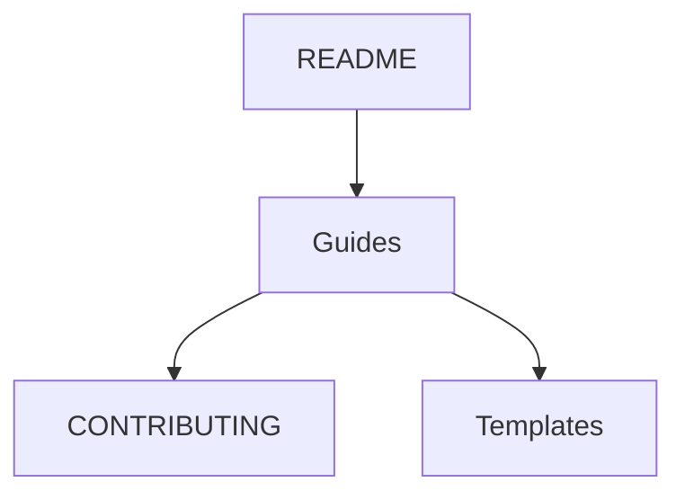

# 📝 Chapitre 3 — Markdown & bonnes pratiques de documentation

> **Objectif pédagogique :** maîtriser **Markdown** (syntaxe, extensions GitHub/Obsidian), structurer une **documentation professionnelle** (README, CONTRIBUTING, templates d'issues/PR), utiliser **icônes** et **callouts**, intégrer des **schémas ASCII** et **Mermaid**, et appliquer des **bonnes pratiques** pour la lisibilité, la maintenabilité et la collaboration.

---

## 🧠 Résumé rapide (à garder en tête)
- **Markdown** = langage de balisage **léger** pour écrire des docs lisibles en texte brut et rendues joliment sur GitHub/Obsidian.
- **README** sert de **point d’entrée** (pourquoi, comment, usage, développement, licence).
- **Templates** (Issues/PR) rendent la collaboration **prévisible** et **efficace**.
- **Bonnes pratiques** : titres cohérents, sections courtes, exemples, liens, schémas, badges, checklist, normes de style.

---

## 📚 Markdown — définitions & fondamentaux

### 🔹 Définition précise
**Markdown** est un **langage de balisage minimaliste** conçu pour être **facile à lire et écrire** en texte brut, tout en produisant une **mise en forme** cohérente (titres, listes, liens, images, code). Les implémentations courantes suivent **CommonMark**, avec des **extensions** (GitHub Flavored Markdown, Obsidian).

### 🔹 Pourquoi Markdown ?
- **Lisibilité brute** (dans un terminal, un éditeur).
- **Diffs Git** compréhensibles (modif ligne par ligne). 
- **Interopérabilité** (GitHub, GitLab, Obsidian, docs générées).
- **Simplicité** → moins de friction qu’HTML plein.

---

## 🔤 Syntaxe de base (rappels structurés)

### 🏷️ Titres
```md
# Titre 1
## Titre 2
### Titre 3
#### Titre 4
```

### 🧾 Paragraphes & emphases
```md
Texte normal.

**Gras** et *italique*.

> Citation / Callout simple (style quote).
```

### 🔢 Listes
```md
- Liste à puces
  - Sous-élément
  - Sous-élément

1. Liste ordonnée
2. Étapes
```

### 🔗 Liens & images
```md
[Lien vers Git](https://git-scm.com)


```

### 💻 Code & blocs
```md
Inline `code`.

```js
// Bloc de code avec coloration
console.log('Hello');
```
```

> **Astuce** : indique toujours la **langue** du bloc (ex.: `js`, `bash`) pour la coloration et les linters.

---

## 🧩 Extensions utiles — GitHub & Obsidian

### 📎 Tables (GitHub Flavored Markdown)
```md
| Section | Description |
|--------|-------------|
| README | Page d’accueil |
| CI     | Intégration continue |
```

### 📌 Checklists
```md
- [ ] Tâche à faire
- [x] Tâche terminée
```

### 🗂️ Callouts (Obsidian)
```md
> [!note]
> Ceci est une note.

> [!warning]
> Attention aux secrets dans les fichiers.
```

### 🧭 Liens internes & embeds (Obsidian)
```md
Voir [[01-chapitre-1-pourquoi-git-et-github]]

![[assets/diagram.png]]  
```

### 🧠 Références de bloc (Obsidian)
```md
Paragraphe important ^ref-id

On peut citer ce bloc ailleurs avec ^ref-id
```

### 📈 Schémas Mermaid (support GitHub/Obsidian)


---

## 🧭 Schéma ASCII — arborescence de docs

```text
📁 docs/
 ├─ README.md
 ├─ CONTRIBUTING.md
 ├─ CODE_OF_CONDUCT.md
 ├─ .github/
 │   ├─ ISSUE_TEMPLATE/
 │   │   ├─ bug_report.md
 │   │   └─ feature_request.md
 │   └─ PULL_REQUEST_TEMPLATE.md
 └─ assets/
     ├─ diagrams/
     └─ images/
```

---

## 📘 README — structure professionnelle

### 🎯 Rôle
Le **README** est la **porte d’entrée** de ton dépôt : il dit **quoi**, **pourquoi**, **comment** et **où aller**.

### 🧱 Modèle (à adapter)
```md
# Nom du projet 🚀

> Une phrase de valeur claire (problème résolu + public visé).

## Sommaire
- [Installation](#installation)
- [Usage rapide](#usage-rapide)
- [Documentation](#documentation)
- [Développement](#développement)
- [Tests](#tests)
- [CI/CD](#cicd)
- [Contribuer](#contribuer)
- [Licence](#licence)

## Badges


## Installation
```bash
npm install
```

## Usage rapide
```bash
npm run start
```

## Documentation
- Guides détaillés: [docs/](./docs/)

## Développement
```bash
npm run dev
```

## Tests
```bash
npm test
```

## CI/CD
- Voir `.github/workflows/ci.yml`.

## Contribuer
- Lire [CONTRIBUTING.md](./CONTRIBUTING.md).

## Licence
MIT © 2025 TonNom
```

> **Bonnes pratiques** : phrase de valeur, sommaire, badges pertinents, exemples minimums, liens internes corrects, sections courtes.

---

## 🤝 CONTRIBUTING — règles de collaboration

### 🎯 Objectifs
- **Clarifier** comment ouvrir une issue/PR.
- **Standardiser** les messages de commit et le style.
- **Définir** la qualité minimale (tests, lint, docs).

### 🧱 Modèle
```md
# Contribuer 🤝

Merci de votre intérêt !

## Prérequis
- Node >= 18
- npm >= 9

## Branches
- `main` : stable
- `feat/*` : fonctionnalités
- `fix/*` : corrections

## Commits
Suivre **Conventional Commits** :
- `feat(ui): ajouter bouton primaire`
- `fix(api): corriger pagination`
- `docs(readme): clarifier installation`

## Tests & lint
```bash
npm run lint && npm test
```

## Pull Requests
- Décrire le **pourquoi** + **comment**.
- Cocher la **checklist** (docs, tests, screenshots si UI).
- Lier l’issue : `Closes #123`.
```

---

## 🗂️ Templates — Issues & PR

### 🐞 Bug report
```md
---
name: Bug report
about: Signaler un bug
labels: bug
---

## Description
Comportement observé.

## Reproduction
Étapes précises.

## Comportement attendu
...

## Environnement
- OS:
- Version:
```

### 💡 Feature request
```md
---
name: Feature request
about: Proposer une idée
labels: enhancement
---

## Problème
...

## Solution proposée
...

## Alternatives
...
```

### 🔁 Pull Request template
```md
---
name: Pull Request
about: Soumettre une modification
---

## Description
Pourquoi + comment.

## Checklist
- [ ] Lint/Tests OK
- [ ] Docs mises à jour
- [ ] Screenshots (si UI)

## Liens
Closes #...
```

> Place ces fichiers dans `.github/ISSUE_TEMPLATE/` et `.github/PULL_REQUEST_TEMPLATE.md`.

---

## 🎨 Style & lisibilité
- **Titres hiérarchisés** (ne saute pas de `##` à `####` sans `###`).
- **Paragraphes courts** et **verbes d’action**.
- **Tableaux** uniquement pour des **données tabulaires**.
- **Code fences** avec **langue**.
- **Images** compressées, **alt text** descriptif.
- **Liens relatifs** et stables.

---

## ⚠️ Encadré risques & hygiène
- **Secrets** : ne jamais commit des clés API, `.env` → utilise `.gitignore` et des secrets GitHub.
- **Liens cassés** : vérifier les chemins relatifs lors de refactors.
- **EOL & encodage** : rester en **UTF‑8** et normaliser **LF** via `.gitattributes`.
- **Badges trompeurs** : garder la **véracité** (CI verte ↔ tests réellement verts).

---

## 🧪 Exercices pratiques
1. **Créer un README pro** pour ton dépôt fil rouge (inclure badges, sommaire, sections clé).  
2. **Ajouter** `CONTRIBUTING.md` et un **template de PR**, puis ouvrir une PR de test.  
3. **Configurer** `.github/ISSUE_TEMPLATE/bug_report.md` et `feature_request.md`.  
4. **Intégrer** un schéma **Mermaid** montrant le flux *issue → PR → CI → merge*.  
5. **Valider** que tous les liens internes fonctionnent (**Obsidian** : `[[...]]`).

---

## 🧑‍🏫 Théorie en **JavaScript** (illustrations)

### 1) Générer un sommaire (TOC) depuis des titres Markdown
```js
function extractHeadings(md) {
  const lines = md.split(/\r?\n/);
  const headings = [];
  for (const line of lines) {
    const m = /^(#{1,6})\s+(.*)$/.exec(line);
    if (m) headings.push({ level: m[1].length, text: m[2] });
  }
  return headings;
}

function toTOC(headings) {
  return headings.map(h => `${'  '.repeat(h.level - 1)}- [${h.text}](#${slugify(h.text)})`).join('\n');
}

function slugify(text) {
  return text.toLowerCase().replace(/[^a-z0-9\s-]/g, '').trim().replace(/\s+/g, '-');
}
```

### 2) Calculer la progression d’une checklist
```js
function checklistProgress(md) {
  const done = (md.match(/\- \[x\]/gi) || []).length;
  const total = (md.match(/\- \[(?:\s|x)\]/gi) || []).length;
  const pct = total ? Math.round((done / total) * 100) : 0;
  return { done, total, pct };
}
```

### 3) Vérifier les liens relatifs d’images
```js
function validateImageLinks(md) {
  const paths = [...md.matchAll(/!\[[^\]]*\]\(([^)]+)\)/g)].map(m => m[1]);
  return paths.map(p => ({ path: p, isRelative: !/^https?:\/\//.test(p) }));
}
```

---

## 📎 Glossaire (sélection)
- **CommonMark** : spécification standard de Markdown.
- **GFM** : GitHub Flavored Markdown (tables, task lists, mentions, etc.).
- **Front matter** : entête YAML au début d’un fichier (métadonnées).
- **Callout** : bloc d’info stylé (Obsidian) via `> [!type]`.
- **Mermaid** : DSL pour diagrammes dans des blocs code.

---

## 📚 Ressources officielles
- CommonMark : https://commonmark.org/help/  
- GitHub Markdown Guide : https://docs.github.com/en/get-started/writing-on-github  
- Obsidian (callouts, liens internes) : https://help.obsidian.md/  
- Mermaid : https://mermaid.js.org/

---

## 🧾 Résumé des points essentiels — Chapitre 3
- **Markdown** : syntaxe simple, lisible, extensible (GFM/Obsidian).  
- **README** : claire valeur, sommaire, badges, exemples, liens.  
- **CONTRIBUTING & templates** : collaboration structurée et prédictible.  
- **Schémas** : ASCII/Mermaid pour expliquer rapidement.  
- **Hygiène** : liens valides, pas de secrets, normalisation EOL/UTF‑8.  
- **JS outillage** : TOC, progression de checklist, validation des images.

---

> 🔜 **Prochain chapitre** : [[04-chapitre-4-le-modele-interne-git-index-head-objets]] (sera fourni après validation).
