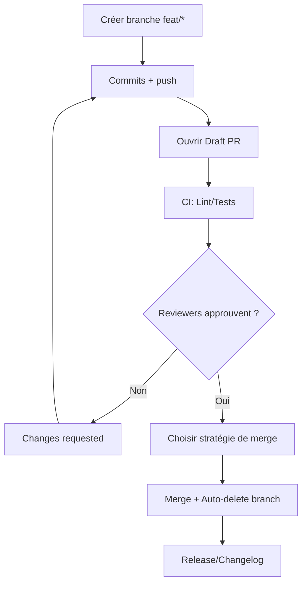

# 🤝 Chapitre 11 — Forks, Pull Requests & code review

> **Objectif pédagogique :** maîtriser les **workflows de collaboration** sur GitHub : **forks**, **branches de fonctionnalités**, **Pull Requests** (PR), **revue de code** (rôles, etiquette, décisions), **règles de protection** (required reviews, status checks) et **stratégies de fusion** (merge, squash, rebase). À la fin, tu sauras **ouvrir**, **réviser**, **faire évoluer** et **fusionner** une PR proprement, en solo et en équipe.

---

## 🧠 Résumé rapide (à garder en tête)
- **Fork** : copie d’un dépôt sur ton compte (lecture/écriture), avec **multi‑remotes** (`origin` ta copie, `upstream` l’original).
- **PR** : proposition d’intégration de changements ; contient **diff**, **discussion**, **checks**, **reviewers**, **labels** et **liens d’issues**.
- **Review** : actes **constructifs** (requests changes, comments, approve), avec **checklist**, **tests**, **screenshots** et respect.
- **Protection** : branches protégées (`main`) avec **required reviews**, **status checks**, **signed commits** et **no force‑push**.
- **Fusion** : `Merge commit`, `Squash`, `Rebase & merge` — choisis selon l’historique souhaité.

---

## 📚 Définitions & concepts

### 🔹 Forks
Un **fork** est une **copie distante** d’un dépôt sur ton compte GitHub. On configure deux remotes :
- `origin` → **ton fork** (écriture),
- `upstream` → **dépôt original** (lecture).

**Mise en place (rappel)** :
```bash
git remote add upstream git@github.com:<org>/<repo>.git
git fetch upstream
git switch main
git pull --rebase upstream main
# Pousser sur ton fork
git push origin main
```

> **Pratique** : dans une PR depuis un fork, coche **Allow edits from maintainers** pour autoriser la maintenance par les responsables.

### 🔹 Pull Request (PR)
Une **PR** compare une **branche source** (ex. `feat/login`) à une **branche cible** (ex. `main`), affiche le **diff**, les **commentaires**, et déclenche la **CI**.

**Éléments clés** :
- **Description** claire (problème, solution, impacts),
- **Liens** vers issues (`Closes #123`),
- **Checklist** (tests, docs, screenshots),
- **Labels** (`bug`, `enhancement`, `docs`, etc.),
- **Reviewers** (humains, CODEOWNERS),
- **Status checks** (CI verte, lint),
- **Draft PR** pour débuter sans fusion.

### 🔹 Code review
La **revue** vise **qualité**, **sécurité**, **maintenabilité** et **connaissance partagée**. Elle se matérialise par :
- **Comments** ciblés (in‑line),
- **Suggestions** (patchs proposés),
- **Request changes** (bloquant),
- **Approve** (OK pour fusion).

---

## 💡 Analogies
- **PR = proposition éditoriale** : tu soumets un **article** à relecture ; corrections, annotations et **publication** (merge) ensuite.
- **Code review = pair programming asynchrone** : on raisonne ensemble, **pas** pour blâmer mais pour **améliorer**.

---

## 🧭 Schémas — Fork & flux PR

### ASCII — Fork + multi‑remotes
```text
Ton fork (origin)                 Dépôt original (upstream)
   ┌───────────────┐              ┌──────────────────────┐
   │  refs/heads/* │   PR  ─────► │  refs/heads/main     │
   └───────────────┘              └──────────────────────┘
        ▲      
        │ push/pull
        ▼
   local repo
```

### Mermaid — Flux d’une PR


---

## 🔧 Ouvrir une PR (GUI & CLI)

### Interface GitHub (GUI)
1. Pousser ta **branche** (`feat/login`) sur `origin`.
2. Cliquer **Compare & pull request**.
3. Remplir **titre/description**, ajouter **labels**, **reviewers**, **liens d’issues** (`Closes #123`).
4. Marquer **Draft** si non prêt.

### GitHub CLI (`gh`)
```bash
# Installer GitHub CLI puis s'authentifier (gh auth login)
# Créer une PR depuis la branche courante
gh pr create --title "feat(login): formulaire" \
  --body "Ajoute le formulaire de connexion" \
  --base main --head feat/login --draft

# Voir l'état
gh pr status

# Demander une review
gh pr edit --add-reviewer <user>
```

---

## 🧩 Qualité d’une PR — checklist
- **Titre** clair : `feat(login): formulaire d’authentification`.
- **Description** : *contexte* → *solution* → *impacts* → *risques*.
- **Tests** : unitaires/e2e, snapshots à jour.
- **Lint/format** : CI verte, pas de warnings.
- **Docs** : README/CHANGELOG, captures d’écran si UI.
- **Performance & accessibilité** : mesures (Lighthouse…), alt text, roles ARIA.
- **Sécurité** : pas de secrets, dépendances vérifiées.
- **Liens** : `Closes #id`, mention des discussions.

---

## 🛡️ Branches protégées & règles
- **Protected branches** : empêchent push direct, exigent PR.
- **Required reviews** : nombre minimal d’**approvals**.
- **Status checks requis** : lint/tests/build **doivent** passer.
- **Require linear history** : interdit les merge commits (si souhaité).
- **CODEOWNERS** : assigne **automatiquement** des reviewers selon paths.

**Exemples de fichiers :**
```ini
# CODEOWNERS (à la racine ou .github/)
# Chaque ligne: <path> <@owner>
src/components/*  @team-ui
src/api/*         @team-back
```

```yaml
# .github/workflows/ci.yml (extrait minimal)
name: CI
on: [push, pull_request]
jobs:
  test:
    runs-on: ubuntu-latest
    steps:
      - uses: actions/checkout@v4
      - uses: actions/setup-node@v4
        with: { node-version: 20 }
      - run: npm ci
      - run: npm run lint && npm test
```

---

## 🔀 Stratégies de fusion
- **Merge commit** : conserve la **structure** (commit M). Avantage : trace des intégrations ; Inconvénient : log **ramifié**.
- **Squash & merge** : fusionne tous les commits de la PR en **un** commit ; Avantage : log **propre** ; Inconvénient : perte de granularité.
- **Rebase & merge** : rejoue les commits sur la base ; Avantage : **linéaire** ; Inconvénient : **hashes** réécrits.

> **Recommandation front (petites équipes)** : **Squash** pour features courtes + **PR obligatoire** sur `main`. (Les variantes sont débattues ; ajuste selon ton contexte.)

---

## 🔎 Réviser efficacement — bonnes pratiques
- Lis le **diff** par **petits blocs** ; commente **localement**.
- Préfère des **questions** et **suggestions** à des injonctions.
- Demande **tests** quand nécessaire ; vérifie la CI.
- Pense **accessibilité** et **i18n** si UI.
- Cherche les **effets de bord** (imports, styles globaux).
- **Approuve** quand c’est prêt ; sinon **request changes** avec liste claire.

---

## ⚠️ Encadré risques & hygiène
- **PR énormes** : difficiles à relire → **découpe** en petites PR.
- **Pas de description** : manque de contexte → **bloquant**.
- **Fusion sans CI** : risque de casse → **status checks requis**.
- **Force‑push sur PR partagée** : **coordination** et `--force-with-lease`.
- **Secrets** dans le diff : stop, régénère la clé et nettoie l’historique.

---

## 🧪 Exercices pratiques
1. **Ouvrir une Draft PR** depuis `feat/login`, ajouter description/labels/reviewers, lier l’issue **Closes #1**.
2. **Code review** : faire 3 commentaires **constructifs**, proposer une **suggestion** de patch.
3. **Statuts & protection** : activer **required reviews=1** et **CI** sur PR ; tenter un push direct sur `main` (doit échouer).
4. **Fusion** : tester `Squash & merge` puis **auto‑delete branch**.
5. **CODEOWNERS** : ajouter un fichier et constater l’assignation auto.

---

## 💻 VS Code & outils utiles
- **GitHub Pull Requests & Issues** (extension VS Code) : créer/éditer PR, review in‑editor.
- **GitLens** : navigation de commits, liens vers PR.
- **CLI `gh`** : `gh pr create`, `gh pr review --approve`, `gh pr merge --squash`.

---

## 🧑‍🏫 Théorie & modélisation en **JavaScript**

### 1) État d’une PR (machine à états)
```js
const PR_STATES = {
  DRAFT: 'draft', READY: 'ready', CHANGES: 'changes_requested', APPROVED: 'approved', MERGED: 'merged', CLOSED: 'closed'
};

function nextState(current, action){
  switch(action){
    case 'mark_ready': return current === PR_STATES.DRAFT ? PR_STATES.READY : current;
    case 'request_changes': return PR_STATES.CHANGES;
    case 'approve': return PR_STATES.APPROVED;
    case 'merge': return current === PR_STATES.APPROVED ? PR_STATES.MERGED : current;
    case 'close': return PR_STATES.CLOSED;
    default: return current;
  }
}
```

### 2) Approuvés requis (règle simple)
```js
function canMerge(approvals, required=1, ciGreen=true){
  return approvals >= required && ciGreen;
}
console.log(canMerge(1,1,true)); // true
console.log(canMerge(0,1,true)); // false
```

### 3) Choix de stratégie de merge (heuristique simplifiée)
```js
function pickMergeStrategy(commitsCount, prefersLinear=true){
  if(commitsCount > 5) return 'squash';
  if(prefersLinear) return 'rebase-merge';
  return 'merge-commit';
}
```

---

## 📎 Glossaire (sélection)
- **Fork** : copie distante d’un dépôt sur ton compte.
- **PR (Pull Request)** : proposition d’intégration d’une branche dans une autre.
- **Draft PR** : PR non prête à fusionner.
- **Code owners** : mapping path → reviewers auto.
- **Protected branch** : branche avec restrictions (push, reviews, checks).
- **Status checks** : résultats CI (tests, lint) associés à la PR.
- **Squash/Rebase/Merge commit** : stratégies de fusion.

---

## 📚 Ressources officielles
- PRs : https://docs.github.com/en/pull-requests  
- Reviews : https://docs.github.com/en/pull-requests/collaborating-on-pull-requests  
- Protected branches : https://docs.github.com/en/repositories/configuring-branches-and-merges-in-your-repository  
- CODEOWNERS : https://docs.github.com/en/repositories/managing-your-repositorys-settings-and-features/customizing-your-repository/about-code-owners  
- GitHub CLI : https://cli.github.com/

---

## 🧾 Résumé des points essentiels — Chapitre 11
- **Forks** : organise `origin`/`upstream` et autorise **edits by maintainers**.
- **PR** : description, labels, reviewers, **CI verte**, **Draft** si non prêt.
- **Code review** : constructive, tests, suggestions ; décisions **approve/changes**.
- **Protection** : branches protégées, **required reviews**, **checks**, **CODEOWNERS**.
- **Fusion** : choisis **merge/squash/rebase** selon lisibilité et besoin.

---

> 🔜 **Prochain chapitre** : [[12-chapitre-12-issues-projects-discussions-templates]] (sera fourni après validation).
