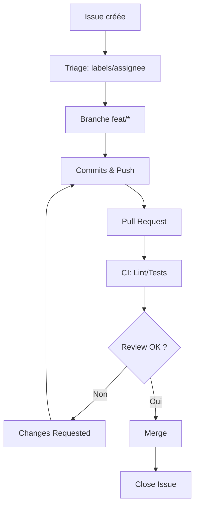

# 🗂️ Chapitre 12 — Issues, Projects, Discussions & Templates

> **Objectif pédagogique :** maîtriser la **gestion du travail** sur GitHub : **Issues** (types, labels, assignees, milestones), **Projects (Kanban)**, **Discussions** pour l’idéation/Q&A, et **Templates** (Issues/PR/Community). Tu sauras **organiser**, **prioriser**, **standardiser** la collaboration, et **mesurer** la progression.

---

## 🧠 Résumé rapide (à garder en tête)
- **Issues** = tickets : titre, description, labels, assignees, milestones, liens PR.
- **Projects** = tableaux **Kanban** (To‑Do → In Progress → Done), champs personnalisés, vues.
- **Discussions** = espace **social** (idéation, annonces) distinct des issues.
- **Templates** = formulaires normalisés (YAML Issue Forms) pour **qualité** & **triage rapide**.
- **Bonnes pratiques** : labels **cohérents**, checklist, liens (PR/Commits), automatisations simples.

---

## 📚 Définitions & concepts

### 🔹 Issues
Une **issue** est un **ticket** pour suivre un **problème**, une **amélioration**, une **question**, ou une **tâche**. Elle possède :
- **Titre & description** (Markdown),
- **Labels** (catégorie, priorité, type),
- **Assignees** (responsables),
- **Milestones** (jalons / versions),
- **Liens** (`Closes #id`, PR associées),
- **Checklist** et **captures**.

### 🔹 Projects (tableaux Kanban)
Un **Project** (GitHub Projects) regroupe issues/PR dans des **vues** (board/table), avec **champs** (statut, priorité, sprint, estimation), **filtres**, **automations** (move on state).

### 🔹 Discussions
Les **Discussions** sont des fils **ouverts** (idéation, FAQ, annonces, RFC) — utiles pour **explorer** avant de créer une **issue**.

### 🔹 Templates
Les **Templates** définissent la **structure** des tickets/PR (Issue Forms en YAML ou Markdown simple) pour **collecter les informations essentielles** dès le départ.

---

## 💡 Analogies
- **Issues = cartes de tâches** : comme des cartes dans un tableau Kanban avec **tags** (labels) et **personnes** (assignees).
- **Projects = panneau de contrôle** : vue d’ensemble des cartes avec **colonnes**, **filtres** & **metrics**.
- **Discussions = brainstorming** : un **salon** pour discuter d’idées avant formalisation.
- **Templates = formulaires** : **guides d’entrée** pour éviter les tickets incomplets.

---

## 🧭 Schémas — organisation & labels

### ASCII — Taxonomie de labels (exemple front‑end)
```text
Labels
 ├─ Type
 │   ├─ bug
 │   ├─ enhancement
 │   ├─ docs
 │   └─ chore
 ├─ Priorité
 │   ├─ P0 (critique)
 │   ├─ P1
 │   └─ P2
 ├─ Domaine
 │   ├─ ui
 │   ├─ api
 │   ├─ perf
 │   └─ accessibility
 └─ Statut
     ├─ needs-triage
     ├─ blocked
     └─ good-first-issue
```

### Mermaid — Flux Issue → PR → Merge


---

## 🔧 Issues — bonnes pratiques & commandes

### 🎯 Rédiger une issue utile (structure)
```md
# Problème / Contexte

# État attendu

# Étapes de reproduction / Scénario

# Environnement
- OS/Browser
- Version

# Preuves
- Logs / captures

# Checklist
- [ ] Tests reproduits
- [ ] Logs fournis
- [ ] Labels ajoutés
```

### 🔖 Liens & mentions
- Lier une PR : `Closes #123` dans la description de la PR.
- Mentionner des personnes/équipes : `@Eric`, `@team-ui`.

### 🔁 Automatisations simples (Actions)
```yaml
# .github/workflows/label-triage.yml
name: Auto label triage
on:
  issues:
    types: [opened]
jobs:
  add_label:
    runs-on: ubuntu-latest
    steps:
      - uses: actions-ecosystem/action-add-labels@v1
        with:
          github_token: ${{ secrets.GITHUB_TOKEN }}
          labels: needs-triage
```

---

## 🗂️ Projects — démarrer un Kanban efficace

### 🧱 Colonnes minimales
- **To‑Do** : backlog trié par priorité.
- **In Progress** : WIP limité (ex.: max 3 par dev).
- **Review** : en attente de revue/CI.
- **Done** : terminé, lié à release/milestone.

### ⚙️ Champs personnalisés & filtres
- **Priority** (P0/P1/P2), **Sprint**, **Estimate**, **Status**.
- **Filtres** : `status:In Progress AND priority:P1`.

### 🔁 Automations (Projects)
- **Move on PR merged** → item va en **Done**.
- **Limit WIP** par colonne (via discipline + scripts externes si besoin).

---

## 💬 Discussions — quand & comment
- **Idéation** : partager une idée avant issue.
- **RFC** : débat de design (argumentation, alternatives).
- **Questions** : support communautaire.
- **Annonces** : release notes, roadmap.

> Bonne pratique : **étiqueter** (categorie Discussion) et **résumer** les décisions en **issue**/PR.

---

## 🧩 Templates — Issue Forms (YAML) & PR

### 🐞 Bug report (Issue Form)
```yaml
# .github/ISSUE_TEMPLATE/bug_report.yml
name: Bug report
description: Signaler un bug
labels: [bug, needs-triage]
body:
  - type: textarea
    id: description
    attributes:
      label: Description
      description: Décris le comportement observé
      placeholder: Steps, logs, screenshots
    validations:
      required: true
  - type: input
    id: version
    attributes:
      label: Version
      placeholder: v1.2.3
    validations:
      required: true
  - type: textarea
    id: steps
    attributes:
      label: Étapes de reproduction
      placeholder: 1. …
    validations:
      required: true
  - type: dropdown
    id: priority
    attributes:
      label: Priorité
      options:
        - P0
        - P1
        - P2
    validations:
      required: true
  - type: checkboxes
    id: checklist
    attributes:
      label: Checklist
      options:
        - label: Logs fournis
        - label: Screenshots ajoutés
        - label: Tests reproduits
```

### 💡 Feature request (Issue Form)
```yaml
# .github/ISSUE_TEMPLATE/feature_request.yml
name: Feature request
description: Proposer une amélioration
labels: [enhancement]
body:
  - type: textarea
    id: value
    attributes:
      label: Valeur utilisateur
      description: Quel problème l’amélioration résout‑elle ?
    validations:
      required: true
  - type: textarea
    id: solution
    attributes:
      label: Solution proposée
      description: Décris la solution et les alternatives
  - type: input
    id: scope
    attributes:
      label: Scope/domaine
      placeholder: ui | api | perf | accessibility
  - type: checkboxes
    id: impacts
    attributes:
      label: Impacts
      options:
        - label: Docs à mettre à jour
        - label: Tests à écrire
        - label: Migration nécessaire
```

### 🔁 Pull Request template (Markdown)
```md
---
name: Pull Request
about: Soumettre une modification
---

## Description
- Contexte & solution

## Checklist
- [ ] Lint/Tests OK
- [ ] Docs mises à jour
- [ ] Screenshots (si UI)

## Liens
Closes #...
```

### 👥 Community health files
- `.github/CODE_OF_CONDUCT.md` — cadre de respect.
- `.github/CONTRIBUTING.md` — comment contribuer.
- `.github/SECURITY.md` — signaler vulnérabilités.
- `.github/SUPPORT.md` — canaux de support.

---

## 💻 VS Code & outils utiles
- **GitHub Pull Requests & Issues** : gérer issues/PR depuis VS Code.
- **GitHub Projects** (web) : créer colonnes/champs, filtres.
- **GitLens** : liens rapides commits ↔ issues.

---

## ⚠️ Encadré risques & hygiène
- **Labels incohérents** : rendent le triage difficile → adopte une **taxonomie stable**.
- **Issues pauvres** : manque de contexte → impose des **Issue Forms**.
- **WIP non limité** : surcharge → applique une **limite** par dev/colonne.
- **Discussions non suivies** : décisions **perdues** → résume en **issue/PR**.

---

## 🧪 Exercices pratiques
1. **Créer une taxonomie** de labels (Type/Priorité/Domaine/Statut) et l’appliquer sur 5 issues.
2. **Configurer Projects** (To‑Do/In Progress/Review/Done) + champs Priority/Sprint.
3. **Créer Issue Forms** (bug/feature) et ouvrir 2 issues via les formulaires.
4. **Ouvrir une Discussion** pour une idée d’amélioration ; transformer le consensus en **issue**.
5. **Automatiser** : action qui ajoute `needs-triage` à chaque issue ouverte.

---

## 🧑‍🏫 Théorie & modélisation en **JavaScript**

### 1) WIP limit par colonne (simulation)
```js
class KanbanColumn {
  constructor(name, limit){ this.name=name; this.limit=limit; this.cards=[]; }
  canAdd(){ return this.cards.length < this.limit; }
  add(card){ if(this.canAdd()){ this.cards.push(card); return true; } return false; }
}
const inProgress = new KanbanColumn('In Progress', 3);
console.log(inProgress.add('ISSUE-1')); // true
console.log(inProgress.add('ISSUE-2')); // true
console.log(inProgress.add('ISSUE-3')); // true
console.log(inProgress.add('ISSUE-4')); // false (limite)
```

### 2) Throughput (cartes complétées/semaine)
```js
function throughput(completedPerDay){
  // completedPerDay: tableau de nombres (7 jours)
  const total = completedPerDay.reduce((a,b)=>a+b,0);
  return Math.round((total/7)*10)/10; // moyenne journalière ~ par semaine
}
console.log(throughput([0,1,0,2,1,0,3])); // 1.0
```

### 3) Validation simple de labels
```js
const VALID_TYPES = new Set(['bug','enhancement','docs','chore']);
function validateLabels(labels){
  return labels.every(l => VALID_TYPES.has(l) || /^(P[0-2]|ui|api|perf|accessibility|needs-triage|blocked|good-first-issue)$/.test(l));
}
console.log(validateLabels(['bug','P1','ui'])); // true
console.log(validateLabels(['unknown'])); // false
```

---

## 📎 Glossaire (sélection)
- **Issue** : ticket de suivi (problème, amélioration, tâche).
- **Labels** : étiquettes de classification.
- **Assignee** : personne responsable.
- **Milestone** : jalon (release/version).
- **Project** : tableau Kanban avec vues/champs/automations.
- **Discussion** : fil social pour idéation/Q&A.
- **Issue Forms** : templates YAML interactifs.

---

## 📚 Ressources officielles
- Issues : https://docs.github.com/en/issues  
- Projects : https://docs.github.com/en/issues/planning-and-tracking-with-projects  
- Discussions : https://docs.github.com/en/discussions  
- Issue Forms : https://docs.github.com/en/communities/using-templates-to-encourage-useful-issues-and-pull-requests  
- Community health files : https://docs.github.com/en/communities/setting-up-your-project-for-healthy-contributions

---

## 🧾 Résumé des points essentiels — Chapitre 12
- **Issues** bien rédigées + labels cohérents = triage **rapide** et suivi **clair**.
- **Projects** (Kanban) avec WIP limit & champs → **visibilité** et **prévisibilité**.
- **Discussions** pour idéation/RFC/annonces → décisions **documentées**.
- **Templates** (Issue Forms/PR) → qualité **standardisée** et gain de temps. 
- **Automatisation** simple (Actions) pour le triage & le mouvement.

---

> 🔜 **Prochain chapitre** : [[13-chapitre-13-tags-releases-et-versioning-semantique]] (sera fourni après validation).
