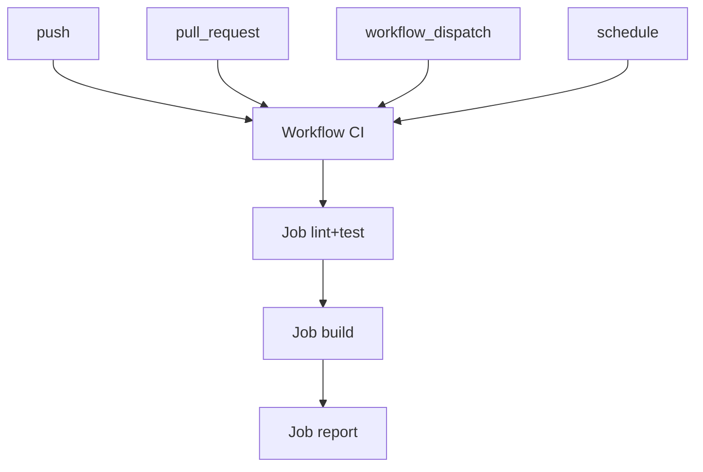

# ⚙️ Chapitre 14 — GitHub Actions (CI/CD) — bases

> **Objectif pédagogique :** comprendre la **mécanique de GitHub Actions** (workflows, jobs, steps, runners), configurer des **triggers** (`push`, `pull_request`, `workflow_dispatch`), utiliser une **matrice**, le **cache npm**, les **secrets**, les **artifacts**, les **permissions** et la **concurrency**, et mettre en place un **pipeline Node.js** (lint + tests + build) pour les PR.

---

## 🧠 Résumé rapide (à garder en tête)
- **Workflow** (YAML) déclenché par des **évènements** : `push`, `pull_request`, `schedule`, `workflow_dispatch`.
- **Job** = suite de **steps** exécutés sur un **runner** (`runs-on: ubuntu-latest`). Les jobs peuvent **dépendre** (`needs`) et s’exécuter en **parallèle**.
- **Matrice** (`strategy.matrix`) pour tester plusieurs **versions de Node**/**OS**.
- **Cache** (`actions/cache`) pour accélérer `npm ci`.
- **Secrets** (`secrets.GITHUB_TOKEN`, secrets projet) pour authentifier en sécurité.
- **Artifacts** (upload/download) pour partager des **builds** et **rapports** entre jobs.
- **Concurrency** & **permissions** pour éviter les runs redondants, appliquer le **least privilege**.

---

## 📚 Définitions & concepts

### 🔹 Workflow
Un **workflow** est un fichier **YAML** dans `.github/workflows/` qui décrit **quand** et **comment** exécuter des jobs.

### 🔹 Job
Un **job** regroupe des **steps**. Chaque job s’exécute sur un **runner** (Linux/macOS/Windows), avec `runs-on` et éventuellement `needs`.

### 🔹 Step
Un **step** peut **utiliser une action** (`uses`) ou **exécuter une commande** (`run`). Les steps partagent le même workspace.

### 🔹 Runner
Machine éphémère fournie par GitHub (`ubuntu-latest`, `windows-latest`, `macos-latest`) ou **self-hosted**.

---

## 💡 Analogies
- **Workflow = recette globale** ; **jobs = plats** ; **steps = étapes de cuisson** ; **runner = cuisine**.
- **Matrice = dégustation multi-variantes** (Node 18/20, Linux/Windows) pour s’assurer que tout passe partout.

---

## 🧭 Schémas — vue d’ensemble

### ASCII — Dépendances de jobs
```text
          ┌──────────────┐
          │  lint_test   │  (matrix)
          └───────┬──────┘
                  │ needs
          ┌───────▼──────┐
          │    build     │
          └───────┬──────┘
                  │ needs
          ┌───────▼──────┐
          │   report     │ (agrège artifacts)
          └──────────────┘
```

### Mermaid — Triggers courants


---

## 🔧 Anatomie d’un workflow (Node.js, PR)

```yaml
# .github/workflows/ci.yml
name: CI
on:
  pull_request:
    branches: [ main ]
    paths:
      - '**/*.ts'
      - '**/*.js'
      - '**/*.json'
      - '!docs/**'
  push:
    branches: [ main ]
  workflow_dispatch:

permissions:
  contents: read
  pull-requests: write

concurrency:
  group: ci-${{ github.ref }}
  cancel-in-progress: true

jobs:
  lint_test:
    name: Lint & Test (Node ${{ matrix.node }} • ${{ matrix.os }})
    runs-on: ${{ matrix.os }}
    strategy:
      fail-fast: false
      matrix:
        os: [ubuntu-latest]
        node: [18, 20]
    steps:
      - name: Checkout
        uses: actions/checkout@v4

      - name: Setup Node
        uses: actions/setup-node@v4
        with:
          node-version: ${{ matrix.node }}
          cache: 'npm'

      - name: Install deps
        run: npm ci

      - name: Lint
        run: npm run lint

      - name: Test
        run: npm test -- --ci --reporters=default --colors

      - name: Upload coverage artifact
        uses: actions/upload-artifact@v4
        if: always()
        with:
          name: coverage-${{ matrix.node }}
          path: coverage/

  build:
    name: Build
    runs-on: ubuntu-latest
    needs: [lint_test]
    steps:
      - uses: actions/checkout@v4
      - uses: actions/setup-node@v4
        with:
          node-version: 20
          cache: 'npm'
      - name: Install deps
        run: npm ci
      - name: Build
        run: npm run build
      - name: Upload build artifact
        uses: actions/upload-artifact@v4
        with:
          name: dist
          path: dist/

  report:
    name: Report
    runs-on: ubuntu-latest
    needs: [build]
    steps:
      - name: Download coverage (Node18)
        uses: actions/download-artifact@v4
        with:
          name: coverage-18
          path: cov18
      - name: Download coverage (Node20)
        uses: actions/download-artifact@v4
        with:
          name: coverage-20
          path: cov20
      - name: Download build
        uses: actions/download-artifact@v4
        with:
          name: dist
          path: dist
      - name: Summarize
        run: |
          echo "## Rapport CI" >> $GITHUB_STEP_SUMMARY
          echo "- Coverage Node18: $(ls cov18 | wc -l) fichiers" >> $GITHUB_STEP_SUMMARY
          echo "- Coverage Node20: $(ls cov20 | wc -l) fichiers" >> $GITHUB_STEP_SUMMARY
          echo "- Bundle: $(ls dist | wc -l) fichiers" >> $GITHUB_STEP_SUMMARY
```

**Points clés :**
- `permissions` → **least privilege** (lecture du code ; écrire sur PR pour commentaire/summary).
- `concurrency` → annule les runs en cours pour la même ref (évite file d’attente inutile).
- `paths` → déclenche seulement si des fichiers **pertinents** changent.
- `actions/setup-node@v4` avec `cache: 'npm'` → cache **automatique**.
- `upload-artifact` / `download-artifact` → partage d’artefacts entre jobs.
- `$GITHUB_STEP_SUMMARY` → **rapport** lisible directement dans GitHub.

---

## 🧩 Cache npm — clés & restauration

### Exemple avancé avec `actions/cache`
```yaml
- name: Cache node_modules
  uses: actions/cache@v4
  with:
    path: ~/.npm
    key: npm-${{ runner.os }}-${{ hashFiles('**/package-lock.json') }}
    restore-keys: |
      npm-${{ runner.os }}-
```

> **Astuce** : `setup-node` gère déjà le cache npm ; `actions/cache` est utile pour **dossier custom** ou **pnpm/yarn**.

---

## 🔐 Secrets & variables

- **`secrets.GITHUB_TOKEN`** : jeton fourni automatiquement (droits selon `permissions`).
- **Secrets projet** : `Settings → Secrets and variables → Actions` ; consommer via `${{ secrets.MY_TOKEN }}`.
- **Masquage** : les secrets sont **maskés** dans les logs.

### Exemple d’usage
```yaml
- name: Publish to registry
  run: npm publish
  env:
    NODE_AUTH_TOKEN: ${{ secrets.NPM_TOKEN }}
```

---

## 📦 Artifacts — partager builds et rapports

- **Upload** (`actions/upload-artifact`) pour stocker **coverage**, **dist**, **logs**.
- **Download** pour les regrouper ou les consommer dans un job ultérieur.

---

## 🧯 Concurrency & annulation des doublons

- `concurrency.group` basé sur `github.ref` ou `github.workflow`.
- `cancel-in-progress: true` pour **annuler** les runs obsolètes (nouvelles pushes sur la PR).

---

## 🛡️ Permissions minimales

- Définis `permissions` au plus **restrictif** ; augmente **au cas par cas** si un job doit écrire (`contents: write`, `packages: write`).

```yaml
permissions:
  contents: read
  pull-requests: write
```

---

## 🔁 Reusable workflows (optionnel)

- `workflow_call` pour factoriser la CI ; un dépôt peut **réutiliser** le workflow d’un autre.

```yaml
# .github/workflows/reusable.yml
on:
  workflow_call:
    inputs:
      node-version:
        required: true
        type: string
jobs:
  run-tests:
    runs-on: ubuntu-latest
    steps:
      - uses: actions/checkout@v4
      - uses: actions/setup-node@v4
        with: { node-version: ${{ inputs.node-version }} }
      - run: npm ci && npm test
```

---

## 💻 VS Code & outils utiles
- **GitHub Actions** (onglet dans GitHub) : logs détaillés, artifacts à télécharger.
- **Actions marketplace** : recherche d’actions officielles (`checkout`, `setup-node`, `upload-artifact`).
- **VS Code** : terminal intégré pour simuler les scripts `npm` localement.

---

## ⚠️ Encadré risques & hygiène
- **Runs redondants** : utilise `paths`/`concurrency` pour limiter.
- **Secrets exposés** : ne `echo` jamais un secret ; privilégie des **env**.
- **Cache cassé** : invalide la clé sur **lockfile** et OS ; évite cache sur `node_modules` directement.
- **Matrix trop large** : temps & coût → commence **petit**, étends si nécessaire.
- **Permissions excessives** : applique **least privilege**.

---

## 🧪 Exercices pratiques
1. **Initialiser** `.github/workflows/ci.yml` avec `pull_request` sur `main` et `paths` ciblés.
2. **Ajouter** une **matrice** (Node 18/20) et observer le **parallelisme**.
3. **Activer** `cache: 'npm'` et mesurer le **gain** sur `npm ci`.
4. **Uploader** un **coverage** et le **download** dans un job `report` qui écrit sur `$GITHUB_STEP_SUMMARY`.
5. **Configurer** `concurrency` et vérifier l’**annulation** de runs lors d’un push successif.
6. **Créer** un **secret** (`NPM_TOKEN`) et tester une commande simulée (sans publier réellement).

---

## 🧑‍🏫 Théorie & modélisation en **JavaScript**

### 1) Expansion de **matrice** (concept)
```js
function expandMatrix(matrix){
  const keys = Object.keys(matrix);
  let combos = [{}];
  for(const k of keys){
    const values = matrix[k];
    combos = combos.flatMap(c => values.map(v => ({...c, [k]: v})));
  }
  return combos; // liste de permutations (ex.: 2 x 1 => 2 combos)
}
console.log(expandMatrix({ os:['ubuntu-latest'], node:[18,20] }));
```

### 2) Cache key — hachage simplifié
```js
function toyHash(str){ let h=0; for(const c of str) h=(h*31+c.charCodeAt(0))>>>0; return h.toString(16); }
function cacheKey(os, lockfile){
  return `npm-${os}-${toyHash(lockfile)}`;
}
console.log(cacheKey('ubuntu-latest', 'package-lock.json content...'));
```

### 3) Ordonnancement des jobs en DAG
```js
function topoOrder(jobs){
  // jobs: {name:{needs:[...]}}
  const indeg = new Map();
  const children = new Map();
  for(const [name, cfg] of Object.entries(jobs)){
    indeg.set(name, indeg.get(name)||0);
    for(const n of (cfg.needs||[])){
      children.set(n, (children.get(n)||new Set()).add(name));
      indeg.set(name, (indeg.get(name)||0)+1);
      indeg.set(n, indeg.get(n)||0);
    }
  }
  const queue = [...[...indeg.entries()].filter(([,d])=>d===0).map(([n])=>n)];
  const order = [];
  while(queue.length){
    const x = queue.shift(); order.push(x);
    for(const ch of (children.get(x)||[])){
      indeg.set(ch, indeg.get(ch)-1);
      if(indeg.get(ch)===0) queue.push(ch);
    }
  }
  return order; // parents avant enfants
}
console.log(topoOrder({ lint_test:{}, build:{needs:['lint_test']}, report:{needs:['build']} }));
```

---

## 📎 Glossaire (sélection)
- **Workflow** : fichier YAML d’automatisation.
- **Job** : groupe de steps sur un runner.
- **Step** : action (`uses`) ou commande (`run`).
- **Runner** : machine d’exécution.
- **Matrix** : exécutions paramétriques multi-env.
- **Cache** : réutilisation de dépendances.
- **Secrets** : variables sensibles pour actions.
- **Artifacts** : fichiers produits par les jobs.
- **Concurrency** : politique d’annulation de runs.
- **Permissions** : droits du `GITHUB_TOKEN`.

---

## 📚 Ressources officielles
- Workflows & événements : https://docs.github.com/en/actions/using-workflows/about-workflows  
- Jobs & runners : https://docs.github.com/en/actions/using-jobs/using-jobs-in-a-workflow  
- Matrices & stratégie : https://docs.github.com/en/actions/using-jobs/using-a-matrix-for-your-jobs  
- Cache : https://github.com/actions/setup-node  
- Secrets & permissions : https://docs.github.com/en/actions/security-guides/  
- Artifacts : https://github.com/actions/upload-artifact  
- Concurrency : https://docs.github.com/en/actions/using-jobs/using-concurrency  

---

## 🧾 Résumé des points essentiels — Chapitre 14
- **Workflows** déclenchés par **évènements** ; **jobs** paramétrés, **steps** reproductibles.
- **Matrix** pour la robustesse multi‑environnements.
- **Cache npm**, **artifacts**, **summary** pour des runs rapides & lisibles.
- **Secrets** & **permissions** pour une CI **sécurisée**.
- **Concurrency** & **paths** pour des runs **efficaces**.

---

> 🔜 **Prochain chapitre** : [[15-chapitre-15-github-pages-et-documentation]] (sera fourni après validation).
