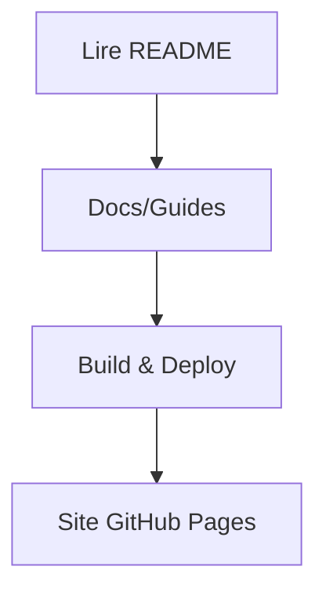

# 🗺️ Chapitre 15 — GitHub Pages & documentation

> **Objectif pédagogique :** publier un **site statique** de documentation avec **GitHub Pages**, structurer un espace **docs/** propre, configurer un **workflow Actions** de déploiement, gérer un **domaine personnalisé**, et appliquer des **bonnes pratiques** (SEO, accessibilité, liens, images, arborescence).

---

## 🧠 Résumé rapide (à garder en tête)
- **GitHub Pages** sert à **héberger** gratuitement un **site statique** depuis ton dépôt.
- Trois voies courantes : **Branch `gh-pages`**, **répertoire `docs/` (Jekyll)**, ou **déploiement via GitHub Actions** (recommandé).
- Publie le contenu **compilé** (ex.: `dist/`) ; configure **CNAME** pour le domaine.
- Ajoute un **workflow Pages** (upload artifact + deploy) ; protège la publication via **environment**.
- Soigne la **documentation** : arborescence claire, liens internes, assets optimisés, **SEO** & **a11y** basiques.

---

## 📚 Définitions & concepts

### 🔹 GitHub Pages
Service d’hébergement **statique** associé à un dépôt GitHub. Il peut servir des fichiers HTML/CSS/JS **directement**, ou bâtir un site via **Jekyll**.

### 🔹 Docs statiques
Un site statique est un ensemble de **fichiers** (HTML/CSS/JS/images) **sans server‑side**. Idéal pour **guides**, **API docs**, **notes**. Le build peut venir d’outils comme **Vite**, **Webpack**, **VuePress**, **Docusaurus** ou **Jekyll**.

### 🔹 Stratégies de publication
1. **Branche `gh-pages`** : on pousse le contenu final dans cette branche (simple, manuel ou scripté).  
2. **Répertoire `docs/`** : Pages sert **directement** le contenu `docs/` (Jekyll actif par défaut).  
3. **Actions (recommandé)** : un **workflow CI** génère le **site** (ex. `dist/`) et le **déploie** automatiquement.

---

## 🧭 Schémas — flux de publication

### ASCII — Build & Deploy (Actions)
```text
main: commits → CI build (dist/) → upload artifact → deploy Pages → site en ligne
```

### Mermaid — Déploiement
```mermaid
flowchart TD
A[Commit sur main] --> B[Build (npm run build)]
B --> C[Upload Pages Artifact]
C --> D[Deploy Pages]
D --> E[Site publié]
```

---

## 🧱 Arborescence de documentation (exemple)

```text
📁 docs/
 ├─ index.md
 ├─ getting-started.md
 ├─ guides/
 │   ├─ installation.md
 │   └─ configuration.md
 ├─ assets/
 │   ├─ images/
 │   │   └─ architecture.png
 │   └─ diagrams/
 │       └─ flow.mmd
 └─ styles/
     └─ docs.css
```

> **Conseil** : garde des **liens relatifs** (`./guides/installation.md`) et référence les images via `./assets/images/...`.

---

## 🚀 Publication via **GitHub Actions** (recommandé)

### 1) Activer GitHub Pages (réglages)
- Va dans **Settings → Pages** et choisis **Source: GitHub Actions**.

### 2) Workflow minimal (Node build → Pages)

```yaml
# .github/workflows/pages.yml
name: Deploy to GitHub Pages
on:
  push:
    branches: [ main ]
  workflow_dispatch:

permissions:
  contents: read
  pages: write
  id-token: write

concurrency:
  group: pages
  cancel-in-progress: true

jobs:
  build:
    runs-on: ubuntu-latest
    steps:
      - uses: actions/checkout@v4
      - uses: actions/setup-node@v4
        with:
          node-version: 20
          cache: 'npm'
      - name: Install
        run: npm ci
      - name: Build
        run: npm run build
      - name: Upload artifact
        uses: actions/upload-pages-artifact@v3
        with:
          path: ./dist

  deploy:
    runs-on: ubuntu-latest
    needs: build
    environment:
      name: github-pages
      url: ${{ steps.deployment.outputs.page_url }}
    steps:
      - name: Deploy to GitHub Pages
        id: deployment
        uses: actions/deploy-pages@v5
```

**Points clés :** `permissions` (**pages**, **id‑token**), **artifact** via `upload-pages-artifact`, étape **deploy** avec `deploy-pages`, et **environment** `github-pages` pour l’URL finale.

---

## 🔁 Publication via branche **`gh-pages`** (alternative)

```bash
# Générer le site
npm run build
# Pousser le contenu dist/ sur gh-pages
git subtree push --prefix dist origin gh-pages
# (ou) utiliser un outil dédié comme gh-pages (npm)
```

> Dans **Settings → Pages**, choisis **Branch: gh-pages**.

---

## 🧩 Publication depuis **`docs/`** (Jekyll)

- Place tes fichiers dans `docs/` et sélectionne **Source: Branch → main → /docs**.  
- Ajoute un `index.md` ou `index.html`.  
- Pour **désactiver Jekyll** (servir tel quel), crée un fichier vide **`.nojekyll`** à la racine.

---

## 🌐 Domaine personnalisé (CNAME)

1. Ajoute un fichier **`CNAME`** à la racine du **site publié** (par ex. `dist/CNAME`) avec le **domaine** :
   ```
   docs.exemple.com
   ```
2. Configure un **DNS** `A/AAAA` ou **CNAME** vers l’infrastructure Pages (voir aide GitHub).  
3. Vérifie le **certificat HTTPS** (GitHub gère le TLS en général).

---

## 🎨 Thème & styles
- Ajoute une **feuille de style** dédiée (ex. `docs/styles/docs.css`).  
- Prévois une **navigation** (sidebar, table des matières).  
- Utilise des **schémas** (Mermaid) et **ASCII** pour clarifier.

### Exemple Mermaid (inclusion)


---

## 🔎 Qualité : SEO & Accessibilité

### SEO basique
- **Title & meta description** sur chaque page.  
- **URL stables** ; utilise des **liens relatifs**.  
- **Sitemap** (optionnel) : génère une liste des pages.  
- **Robots** : fichier `robots.txt` si nécessaire (laissable par défaut).

### Accessibilité (a11y)
- **Alt text** explicites pour images.  
- **Titres hiérarchisés** (`h1 → h2 → h3`).  
- **Contrastes** suffisants ; pas seulement la couleur pour signifier.  
- **Liens** : distinguer visuellement, éviter les "Cliquez ici".

---

## 🔐 Sécurité & hygiène
- **Secrets** (non nécessaires pour Pages standard) : si tu publies vers **registries**, stocke dans **Settings → Secrets**.  
- **Branches protégées** : exige **PR + CI** avant déploiement.  
- **Taille d’assets** : compresse images (PNG/JPEG/WebP) et minifie CSS/JS.

---

## 🧪 Exercices pratiques
1. **Activer Pages** avec **Actions** et déployer `dist/`.  
2. **Ajouter `CNAME`** et mettre à jour le DNS ; vérifier HTTPS.  
3. **Créer `docs/`** avec 3 pages (index + guide + configuration) et une **sidebar** simple.  
4. **Inclure Mermaid** pour décrire le flux dev → build → deploy.  
5. **Contrôler a11y/SEO** : alt text, titres corrects, meta description sur `index.html`.  
6. **Vérifier les liens** (outil CLI ou manuel) et corriger les **404**.

---

## 🧑‍🏫 Théorie & utilitaires en **JavaScript**

### 1) Générer une **sidebar** depuis des titres Markdown
```js
function extractHeadings(md){
  return md.split(/\r?\n/).map(l=>/^(#{1,6})\s+(.*)$/.exec(l)).filter(Boolean).map(m=>({level:m[1].length,text:m[2]}));
}
function tocList(headings){
  const slug = s => s.toLowerCase().replace(/[^a-z0-9\s-]/g,'').trim().replace(/\s+/g,'-');
  return headings.map(h=>`${'  '.repeat(h.level-1)}- [${h.text}](#${slug(h.text)})`).join('\n');
}
```

### 2) Détecter **liens cassés** (simplifié)
```js
function findBrokenLinks(html){
  const links=[...html.matchAll(/href=\"([^\"]+)\"/g)].map(m=>m[1]);
  return links.filter(l=>l.startsWith('#') && !html.includes(`id=\"${l.slice(1)}\"`));
}
```

### 3) Router **SPA** ultra‑léger pour docs
```js
function miniRouter(){
  function navigate(){
    const path = location.hash.slice(1)||'index';
    fetch(`./${path}.html`).then(r=>r.text()).then(html=>{ document.getElementById('app').innerHTML=html; });
  }
  window.addEventListener('hashchange', navigate);
  navigate();
}
// miniRouter(); // à appeler dans index.html
```

---

## 📎 Glossaire (sélection)
- **GitHub Pages** : hébergement statique lié à un dépôt.
- **CNAME** : fichier indiquant le domaine personnalisé.
- **Artifact** : archive du site construite par la CI.
- **Jekyll** : générateur de site statique supporté nativement par Pages.
- **Environment** : cible de déploiement avec URL et protection.

---

## 📚 Ressources officielles
- GitHub Pages — Guide : https://docs.github.com/en/pages  
- Déploiement via Actions : https://docs.github.com/en/pages/quickstart  
- Personnaliser un domaine (CNAME) : https://docs.github.com/en/pages/configuring-a-custom-domain-for-your-github-pages-site  
- Jekyll & Pages : https://docs.github.com/en/pages/setting-up-a-github-pages-site-with-jekyll

---

## 🧾 Résumé des points essentiels — Chapitre 15
- **Actions** : flow **build → artifact → deploy** avec permissions adéquates.
- **Alternatives** : `gh-pages` branch ou `docs/` (Jekyll, `.nojekyll`).
- **Domaine** : fichier **CNAME** + configuration DNS → HTTPS.
- **Docs propres** : arborescence, liens, assets, **SEO/a11y**.

---

> 🔜 **Prochain chapitre** : [[16-chapitre-16-strategies-de-branches-gitflow-vs-trunk-based]] (sera fourni après validation).
