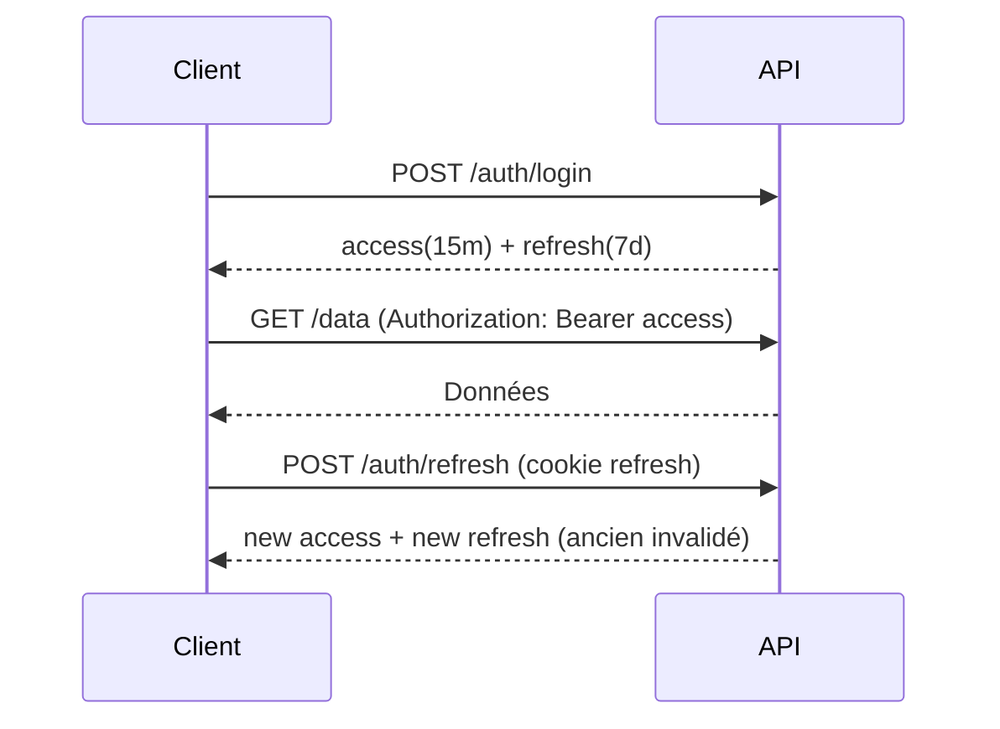

# Chapitre 7 — Authentification (Node.js/Express)

> **Objectif** : Concevoir une authentification **sûre**, **maintenable** et **adaptée** (sessions/cookies, JWT, OAuth2/OpenID Connect), avec stockage de mots de passe robuste, protections CSRF/XSS et intégration de MFA.

---

## 1) Panorama des approches

### 1.1 Sessions côté serveur (cookie de session)
- Le serveur crée une **session** après login et envoie un **cookie** contenant un identifiant de session (ex: `connect.sid`). Les données de session restent **côté serveur**. citeturn9search290turn9search293
- Sécurisez le cookie avec : `Secure`, `HttpOnly`, `SameSite`, et des préfixes `__Host-`/`__Secure-` quand pertinent. citeturn9search302
- Avantages : simplicité, invalidation centralisée ; Inconvénients : nécessite un store (Redis, DB) pour la scalabilité. citeturn9search290

### 1.2 JWT (stateless) pour API
- Un **JWT** porte des *claims* (ex: `sub`, `exp`) et est signé selon la RFC 7519. citeturn9search344
- Points clés: algorithmes (RS256/ES256), **expiration courte** pour les access tokens, **refresh token** avec rotation. citeturn9search346turn9search362
- Stockage côté navigateur : **cookies HttpOnly** (souvent plus sûrs contre XSS) vs `localStorage` (plus exposé). Le choix dépend du modèle de menace et de la protection CSRF (SameSite + token). citeturn9search360turn9search356

### 1.3 OAuth 2.0 / OpenID Connect (OIDC)
- OAuth 2.0 est un **cadre d’autorisation** (flux code + **PKCE** pour SPA/mobile). citeturn9search284
- **OpenID Connect** ajoute une **couche identité** (ID Token + UserInfo), standardisée et publiée également comme ISO/IEC 26131. citeturn9search308turn9search311

> **Règle d’or** : commencez par le **plus simple qui couvre vos besoins** (sessions ou JWT), et passez à OAuth/OIDC pour la fédération/SSO.

---

## 2) Stockage des mots de passe

### 2.1 Choix d’algorithme
- **Argon2id** recommandé (mémoire importante, itérations, parallélisme) ; à défaut **scrypt** ; **bcrypt** reste acceptable avec *cost* ≥ 10 et attention à la limite 72 octets. citeturn9search332
- Si conformité FIPS requise : **PBKDF2** (HMAC‑SHA‑256, ≥ 600 000 itérations). citeturn9search332

### 2.2 Node : exemples
**Argon2 (recommandé)**
```js
// npm i argon2
import argon2 from 'argon2';

export async function hashPassword(pwd) {
  return argon2.hash(pwd, {
    type: argon2.argon2id,
    memoryCost: 19 * 1024, // ~19 MiB
    timeCost: 2,
    parallelism: 1,
  });
}
export async function verifyPassword(hash, pwd) {
  return argon2.verify(hash, pwd);
}
```
> Le module `argon2` (node‑argon2) offre Argon2id et options mémoire/temps/parallélisme. citeturn9search326turn9search328

**bcrypt (fallback)**
```js
// npm i bcrypt
import bcrypt from 'bcrypt';
const COST = 12; // ≥10 recommandé

export async function hashPassword(pwd) {
  return bcrypt.hash(pwd, COST);
}
export async function verifyPassword(hash, pwd) {
  return bcrypt.compare(pwd, hash);
}
```
> Attention : versions < 5.0.0 souffraient d’un **wrap‑around bug** (>255 octets) et bcrypt n’utilise que **les 72 premiers octets** d’un secret. Utilisez ≥ 5.0.0. citeturn9search410turn9search409

---

## 3) Sessions Express sécurisées

### 3.1 `express-session`
```js
// npm i express express-session
import express from 'express';
import session from 'express-session';

const app = express();
app.set('trust proxy', 1); // si derrière un reverse proxy

app.use(session({
  name: '__Host.sid',
  secret: process.env.SESSION_SECRET,
  resave: false,
  saveUninitialized: false,
  cookie: {
    path: '/',
    httpOnly: true,
    secure: true, // HTTPS uniquement
    sameSite: 'lax', // ou 'strict' selon vos besoins
    maxAge: 1000 * 60 * 60, // 1h
  },
}));
```
- Le **cookie** transporte *uniquement* l’ID de session ; les données restent côté serveur. N’utilisez pas **MemoryStore** en production. citeturn9search290turn9search293
- Configurez `Secure`/`HttpOnly`/`SameSite`, éventuellement préfixe `__Host-` (domain vide, path `/`, Secure) pour renforcer la politique. citeturn9search302

### 3.2 Headers de sécurité (Helmet)
```js
// npm i helmet
import helmet from 'helmet';
app.use(helmet()); // HSTS, X-Frame-Options, CSP, etc.
```
> `helmet` applique des **en-têtes** (HSTS, CSP, X-Content-Type-Options, etc.) utiles contre XSS/clickjacking et impose HTTPS. citeturn9search417turn9search419

### 3.3 Limiter les abus (rate limiting)
```js
// npm i express-rate-limit
import { rateLimit } from 'express-rate-limit';

const loginLimiter = rateLimit({
  windowMs: 15 * 60 * 1000,
  limit: 10, // 10 tentatives / 15 min par IP
  standardHeaders: 'draft-8',
  legacyHeaders: false,
});
app.post('/login', loginLimiter, loginHandler);
```
> `express-rate-limit` protège les endpoints sensibles (login, reset). citeturn9search411turn9search412

---

## 4) JWT bien faits

### 4.1 Création/validation (Node)
```js
// npm i jsonwebtoken
import jwt from 'jsonwebtoken';
const ACCESS_TTL = '15m';

export function signAccess(user) {
  return jwt.sign(
    { sub: user.id, role: user.role },
    process.env.ACCESS_PRIVATE_KEY, // RS256: clé privée
    { algorithm: 'RS256', expiresIn: ACCESS_TTL, issuer: 'your-api' }
  );
}

export function verifyAccess(token) {
  return jwt.verify(token, process.env.ACCESS_PUBLIC_KEY, {
    algorithms: ['RS256'], issuer: 'your-api'
  });
}
```
> Spécifiez **explicitement** l’algorithme accepté et utilisez RS256/ES256 pour les architectures distribuées. citeturn9search369turn9search346

### 4.2 Refresh tokens & **rotation**
- **Access token** court (ex: 15 min) + **refresh token** plus long (ex: 7 jours) ; **rotations** à chaque utilisation et invalidation de l’ancien pour réduire les risques de *replay*. citeturn9search362turn9search366
- Stocker le refresh en **cookie HttpOnly** `SameSite=Lax/Strict` et limiter son scope. citeturn9search360

### 4.3 Où stocker le token ?
- **Cookies HttpOnly** : forte protection contre XSS ; nécessite protection **CSRF** (SameSite + token). citeturn9search302turn9search361
- `localStorage`/mémoire : simple mais exposé aux XSS ; à éviter pour refresh tokens. citeturn9search356

---

## 5) CSRF : comprendre et se protéger

- CSRF exploite l’envoi automatique des **cookies** par le navigateur ; protégez tous les **requêtes qui modifient l’état** par **token anti‑CSRF** (Synchronizer/Double Submit) et **SameSite**. citeturn9search378turn9search302
- Le paquet historique `csurf` est **archivé** ; utilisez le fork maintenu `@dr.pogodin/csurf` si vous avez besoin d’un middleware Express. citeturn9search314turn9search316

**Exemple avec `@dr.pogodin/csurf`**
```js
// npm i @dr.pogodin/csurf cookie-parser
import csrf from '@dr.pogodin/csurf';
import cookieParser from 'cookie-parser';

app.use(cookieParser());
app.use(csrf({ cookie: { key: '_csrf', httpOnly: true, secure: true, sameSite: 'lax' } }));

app.get('/form', (req, res) => {
  res.send(`<form method="POST" action="/submit">
    <input type="hidden" name="_csrf" value="${req.csrfToken()}">
    <input name="name" />
    <button>Envoyer</button>
  </form>`);
});
```
> OWASP recommande **token‑based mitigation** et rappelle que **XSS peut contourner n’importe quelle défense CSRF** : combinez CSP, Helmet, validation d’input et SameSite. citeturn9search378

> **Note** : Le pattern *double submit cookie* a des limites (fixation/HTTP MitM). Si vous l’utilisez, liez cryptographiquement le token à la session et activez HSTS + préfixe `__Host-`. citeturn9search387turn9search384

---

## 6) OAuth 2.0 + OpenID Connect avec Passport

### 6.1 Passport et stratégies
- **Passport** fournit des stratégies modulaires : `passport-local`, `passport-openidconnect`, `passport-oauth2`, `passport-jwt`. citeturn9search296

**Local + sessions**
```js
// npm i passport passport-local express-session
import passport from 'passport';
import { Strategy as LocalStrategy } from 'passport-local';

passport.use(new LocalStrategy(async (username, password, done) => {
  const user = await findUserByUsername(username);
  if (!user) return done(null, false);
  const ok = await verifyPassword(user.passwordHash, password);
  return ok ? done(null, user) : done(null, false);
}));

passport.serializeUser((user, done) => done(null, user.id));
passport.deserializeUser(async (id, done) => done(null, await findUserById(id)));
```
> Stratégies Passport : configuration + *verify function* pour lier le credential à l’utilisateur. citeturn9search296

**OIDC (SSO)**
- Implémentez le **Authorization Code + PKCE** avec `passport-openidconnect` ou utilisez un IdP (Azure AD, Auth0, Okta). OIDC renvoie un **ID Token** (JWT) et un **Access Token**. citeturn9search308turn9search284

---

## 7) MFA (OTP/TOTP)
- Ajoutez une **seconde preuve** : OTP par email/SMS ou mieux **TOTP** (RFC 6238) via une appli d’authentification ; tolérance au décalage d’horloge ±1 intervalle, codes 6 chiffres / 30 s. citeturn9search399turn9search400

---

## 8) Bonnes pratiques clés
- **Toujours HTTPS** + HSTS (via Helmet). citeturn9search417
- Validez/sanisez **toutes** les entrées (et appliquez CSP). citeturn9search417
- Journalisez les **événements de sécurité** (logins, échecs, refresh, révocations).
- Implémentez **logout** invalide session/tokens et **invalidez tous les refresh** après changement de mot de passe. citeturn9search320turn9search324

---

## 9) Exercices pratiques

1. **Sessions sûres** :
   - Créez `/login` avec `express-session` et protégez `/profile`.
   - Vérifiez au DevTools que le cookie est `Secure`, `HttpOnly`, `SameSite=Lax`. citeturn9search290turn9search302

2. **JWT + rotation** :
   - Écrivez `/auth/login` qui émet `access` (15 min) et `refresh` (7 jours, en cookie HttpOnly). Implémentez `/auth/refresh` avec **rotation**. citeturn9search362

3. **CSRF** :
   - Ajoutez `@dr.pogodin/csurf` sur un endpoint POST, et testez qu’une requête cross‑site échoue sans token. citeturn9search316

4. **OIDC** :
   - Intégrez `passport-openidconnect` contre un IdP de test et récupérez le **ID Token**, affichez les *claims*. citeturn9search308

5. **MFA TOTP** :
   - Générez un secret Base32, affichez un QR code, validez un code **TOTP** (±30 s). citeturn9search399

---

## 10) Fiche mémo (check‑list)
- [ ] Hash: Argon2id (ou bcrypt ≥ 5.0.0) avec cost adapté. citeturn9search332turn9search410
- [ ] Cookies: `Secure` + `HttpOnly` + `SameSite`. Préfixe `__Host-` si possible. citeturn9search302
- [ ] JWT: RS256/ES256, `exp` court, `iss/aud` vérifiés, **rotation** des refresh. citeturn9search344turn9search346turn9search362
- [ ] CSRF: token sur requêtes qui modifient l’état + SameSite. citeturn9search378
- [ ] Headers: Helmet (HSTS, CSP, etc.). citeturn9search417
- [ ] Rate limiting sur login/reset. citeturn9search411
- [ ] MFA: OTP/TOTP pour comptes sensibles. citeturn9search399

---

## 11) Annexes — schémas (Mermaid)

### A) Session
```mermaid
sequenceDiagram
  participant U as Utilisateur
  participant S as Serveur
  U->>S: POST /login (identifiants)
  S-->>U: Set-Cookie: __Host.sid=...; Secure; HttpOnly; SameSite=Lax
  U->>S: GET /profile (cookie auto)
  S-->>U: Données du profil
```

### B) JWT + refresh


---

### Références principales
- OWASP Cheat Sheets (Password Storage, Session Management, CSRF, JWT, REST Security, Authentication). citeturn9search332turn9search320turn9search378turn9search350turn9search354turn9search391
- MDN — cookies sécurisés (Secure, HttpOnly, SameSite, préfixes). citeturn9search302
- Express — `express-session`. citeturn9search290turn9search293
- Helmet — en‑têtes de sécurité. citeturn9search417
- `express-rate-limit`. citeturn9search411
- RFC 7519 (JWT), RFC 6749 (OAuth 2.0), OpenID Connect Core. citeturn9search344turn9search284turn9search308
- Auth0 — Refresh Token Rotation. citeturn9search362
- `@dr.pogodin/csurf` (fork maintenu). citeturn9search316
- Argon2 / bcrypt (npm & GitHub). citeturn9search326turn9search328turn9search409

