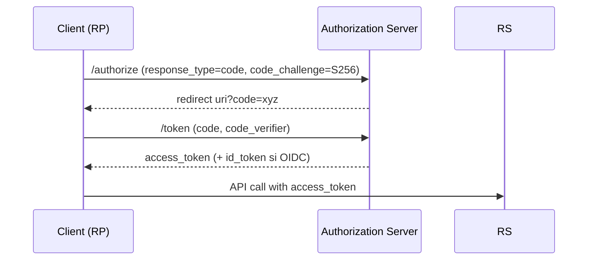
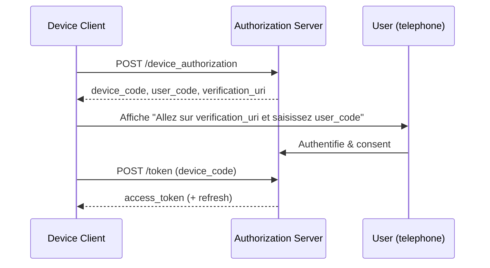

# Chapitre 8 — OAuth 2.0 & OpenID Connect (OIDC)

> **Objectif** : Maîtriser les flux OAuth 2.0 (Authorization Code + PKCE, Device Code), comprendre les meilleures pratiques *BCP* (RFC 9700), et intégrer **OIDC** (ID Token, Discovery) dans une appli Node.js via `openid-client` ou `passport-openidconnect`.

---

## 1) Rappels & terminologie
- **OAuth 2.0** (RFC 6749) : cadre d’**autorisation** pour obtenir des **access tokens** et accéder à une API au nom d’un utilisateur. Rôles : *Resource Owner*, *Client*, *Authorization Server*, *Resource Server*. citeturn9search284
- **OpenID Connect (OIDC)** : couche **identité** au-dessus d’OAuth 2.0, ajoutant l’**ID Token** (JWT) et l’endpoint **UserInfo** ; spécifications Core et publication ISO/IEC 26131 en 2024. citeturn9search308turn9search311

---

## 2) Flux principaux

### 2.1 Authorization Code + **PKCE** (recommandé)
- Protége les **clients publics** (SPA/mobile) contre l’**interception** du code en liant l’échange à un `code_verifier` / `code_challenge` (méthode S256). citeturn10search423turn10search426
- **Meilleure pratique 2025 (RFC 9700)** : utiliser PKCE pour **tous** les clients, éviter l’**Implicit** et **ROPC** (dépréciés), valider strictement les **redirect URIs**, protéger contre CSRF/mix‑up. citeturn10search441turn10search446

**Séquence simplifiée**


### 2.2 **Device Authorization Grant** (RFC 8628)
- Pour TV/IoT/CLI sans navigateur : l’app affiche un **user_code** et une **verification_uri** à ouvrir sur un autre appareil ; pendant ce temps le client **poll** le token endpoint. citeturn10search435turn10search440
- Support documenté par Microsoft Entra, ZITADEL, etc. citeturn10search436turn10search437

---

## 3) OIDC : ID Token & Discovery
- **ID Token** (JWT) : contient des *claims* (ex: `iss`, `sub`, `aud`, `nonce`, `exp`) et doit être **validé** (signature, audience, issuer). citeturn9search308
- **Discovery** (`/.well-known/openid-configuration`) et **Dynamic Client Registration** simplifient l’intégration. citeturn9search308

---

## 4) Meilleures pratiques (RFC 9700)
- **Évitez** : *Implicit*, *ROPC* ; préférez **Authorization Code + PKCE**. citeturn10search441
- **Rotation** des refresh tokens et détection de réutilisation ; tokens à **portée minimale** et **durée courte** ; **sender‑constrained tokens** (DPoP/MTLS) pour empêcher le *replay*. citeturn10search441turn10search442
- **Validation stricte** des `redirect_uri` ; **CSRF** via `state`/PKCE ; **mix‑up** via *issuer identification* & URIs distincts. citeturn10search446

---

## 5) Intégration Node.js

### 5.1 Avec **openid-client** (conseillé)
```js
// npm i openid-client
import { Issuer, generators } from 'openid-client';

// 1) Découverte
const issuer = await Issuer.discover('https://your-idp/.well-known/openid-configuration');
const client = new issuer.Client({
  client_id: process.env.CLIENT_ID,
  client_secret: process.env.CLIENT_SECRET, // pour client confidentiel
  redirect_uris: ['https://localhost:3000/callback'],
  response_types: ['code']
});

// 2) Redirection vers /authorize
const code_verifier = generators.codeVerifier();
const code_challenge = generators.codeChallenge(code_verifier);
const authUrl = client.authorizationUrl({
  scope: 'openid profile email',
  code_challenge,
  code_challenge_method: 'S256'
});

// 3) Callback & échange de code
const params = client.callbackParams(req);
const tokenSet = await client.callback('https://localhost:3000/callback', params, { code_verifier });
console.log(tokenSet.id_token, tokenSet.access_token);
const userinfo = await client.userinfo(tokenSet);
```
> `openid-client` est certifié OIDC, supporte **PKCE**, Device Grant, DPoP, PAR/JAR, etc. citeturn10search447turn10search449

### 5.2 Avec **passport-openidconnect**
```js
// npm i passport passport-openidconnect
import passport from 'passport';
import { Strategy as OpenIDConnectStrategy } from 'passport-openidconnect';

passport.use(new OpenIDConnectStrategy({
  issuer: 'https://server.example.com',
  authorizationURL: 'https://server.example.com/authorize',
  tokenURL: 'https://server.example.com/token',
  userInfoURL: 'https://server.example.com/userinfo',
  clientID: process.env.CLIENT_ID,
  clientSecret: process.env.CLIENT_SECRET,
  callbackURL: 'https://localhost:3000/cb'
}, (issuer, profile, cb) => {
  // Associer le profil OIDC à un user de l’app…
  cb(null, { id: profile.id, name: profile.displayName });
}));
```
> Stratégie **Passport** officielle pour OIDC, avec verify callback et récupération du **UserInfo**. citeturn10search429turn10search432

---

## 6) Exemple d’implémentation **Device Code** (schéma)

> Spécification RFC 8628 ; guides Microsoft/Zitadel/WorkOS. citeturn10search435turn10search436turn10search437turn10search438

---

## 7) Checklist d’intégration
- [ ] Enregistrer des **redirect URIs** exactes (pas de wildcard), TLS partout. citeturn10search446
- [ ] Utiliser **PKCE** (S256), `state` et `nonce` (OIDC). citeturn10search423
- [ ] Valider **ID Token** (`iss`, `aud`, signature, `exp`) et utiliser **Discovery**. citeturn9search308
- [ ] **Rotation** des refresh, scopes minimaux, tokens courts ; envisager **DPoP/MTLS**. citeturn10search441
- [ ] Désactiver **Implicit**/**ROPC** ; protéger contre CSRF/mix‑up. citeturn10search441turn10search446

---

## 8) Exercices
1. **OIDC avec openid-client** : implémentez le *code + PKCE* contre un IdP (Auth0/Okta/GitHub) et affichez les *claims* de l’ID Token. citeturn10search447
2. **Passport-OIDC** : branchez la stratégie sur votre mini-projet Express et protégez un endpoint `GET /whoami` avec la session. citeturn10search429
3. **Device Code** : simulez la saisie du `user_code` et le polling du token (mock) selon RFC 8628. citeturn10search435

---

### Références
- RFC 6749 (OAuth 2.0) ; RFC 7636 (PKCE) ; RFC 8628 (Device Grant). citeturn9search284turn10search423turn10search435
- RFC 9700 (Best Current Practice pour OAuth 2.0). citeturn10search441
- OpenID Connect Core + publication ISO. citeturn9search308turn9search311
- `openid-client` (npm/GitHub), Passport OIDC. citeturn10search447turn10search449turn10search429
