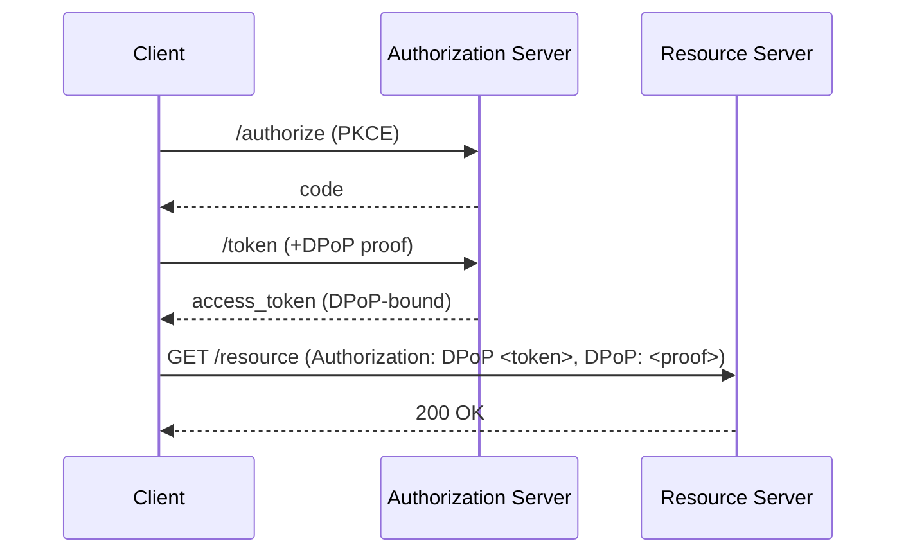

# Chapitre 9 — Autorisation des APIs (Scopes, RBAC/ABAC), validation JWT & DPoP

> **Objectif** : savoir protéger une API Express en vérifiant des **Access Tokens** (JWT, RS256),
> appliquer des **autorisations** avec **scopes** OAuth et **RBAC/ABAC**, et comprendre les
> **sender‑constrained tokens** via **DPoP** (proof‑of‑possession), conformément aux meilleures
> pratiques **RFC 9700**. citeturn13search533

---

## 1) Rappels JWT & claims
- Les Access Tokens émis par un AS (ex : Auth0) sont souvent des **JWT** (JWS) avec des *claims* standard `iss`, `sub`, `aud`, `exp`, `nbf`, `iat`. Référence **RFC 7519**. citeturn13search511turn13search512
- En API, on privilégie **RS256** (signature asymétrique) et on récupère la **clé publique** via l’endpoint **JWKS** de l’émetteur pour vérifier la signature. citeturn13search506

---

## 2) Valider les tokens côté **Resource Server** (Express)

### Option A — Middleware prêt à l’emploi : `express-oauth2-jwt-bearer`
Ce SDK Auth0 simplifie la protection d’une API Express en vérifiant automatiquement : **signature**, **issuer**, **audience** et expose `req.auth.payload`. citeturn13search517turn13search520

```js
// npm i express-oauth2-jwt-bearer
import express from 'express';
import { auth, requiredScopes } from 'express-oauth2-jwt-bearer';

const app = express();

// Protéger toute l’API avec tokens d’un issuer + audience
app.use(auth({
  issuerBaseURL: 'https://<tenant>.us.auth0.com', // Domain Auth0
  audience: 'https://api.example.com'             // API Identifier
}));

// Exiger un scope spécifique sur une route
app.get('/messages', requiredScopes('read:messages'), (req, res) => {
  res.json({ ok: true, user: req.auth.payload.sub });
});
```
> Le SDK inclut **requiredScopes** et supporte **DPoP (early access)** ; recommande d’ajouter **helmet**. citeturn13search517

### Option B — Bas niveau : `jwks-rsa` + `jsonwebtoken`
Pour apprendre “à la main”, on peut récupérer la clé via **JWKS** puis vérifier le JWT avec `jsonwebtoken`. citeturn13search508turn13search510

```js
import express from 'express';
import jwt from 'jsonwebtoken';
import jwksRsa from 'jwks-rsa';

const app = express();
const jwks = jwksRsa({ jwksUri: 'https://<tenant>.us.auth0.com/.well-known/jwks.json', cache: true });

async function verifyJwt(token) {
  const { header } = jwt.decode(token, { complete: true });
  const key = await jwks.getSigningKey(header.kid);
  const pubKey = key.getPublicKey();
  return jwt.verify(token, pubKey, { algorithms: ['RS256'], issuer: 'https://<tenant>.us.auth0.com/', audience: 'https://api.example.com' });
}

function requireBearer(req, res, next) {
  const h = req.headers.authorization || '';
  const t = h.startsWith('Bearer ') ? h.slice(7) : null;
  if (!t) return res.status(401).json({ error: 'Missing Bearer token' });
  verifyJwt(t).then(payload => { req.auth = { payload, token: t }; next(); })
              .catch(() => res.status(401).json({ error: 'Invalid token' }));
}

app.get('/me', requireBearer, (req, res) => {
  res.json({ sub: req.auth.payload.sub, aud: req.auth.payload.aud });
});
```
> Voir l’article **RS256 vs HS256** (avantages d’RS256 + JWKS). citeturn13search506

---

## 3) Scopes OAuth vs **RBAC**/**ABAC** (et comment les combiner)
- **Scopes OAuth** : permissions portées par le **token** (ex. `read:messages`) — idéales pour autoriser **des actions d’API** à court terme côté client/3rd‑party. citeturn13search531
- **RBAC** : permissions associées à des **rôles** (ex. `admin`, `staff`) — pratiques pour les **systèmes internes** et la gestion durable des droits. citeturn13search529turn13search532
- **ABAC** : décisions basées sur des **attributs** (utilisateur, ressource, action), utiles pour des règles **contextuelles** fines. citeturn13search526
- **Pattern hybride** : vérifie **scope(s)** dans le token **ET** applique RBAC/ABAC côté serveur (middleware) pour une défense en profondeur. citeturn13search530

### Exemple RBAC/ABAC avec **Casbin** (côté serveur)
```js
// npm i casbin
import { newEnforcer } from 'casbin';
const enforcer = await newEnforcer('rbac_model.conf', 'rbac_policy.csv');

function requirePermission(sub, obj, act) {
  return async (req, res, next) => {
    const ok = await enforcer.enforce(sub(req), obj(req), act(req));
    if (!ok) return res.status(403).json({ error: 'Forbidden' });
    next();
  };
}

// Exemple: protéger /admin/delete
app.delete('/admin/delete/:id', requireBearer, requirePermission(
  (req) => req.auth.payload.sub,           // subject depuis le token
  (req) => ({ id: req.params.id, owner: 'alice' }), // ABAC: objet avec attributs
  (req) => 'delete'
), (req, res) => res.json({ ok: true }));
```
> **Casbin** fournit RBAC, ABAC, modèles et stockage multiplateforme. citeturn13search523turn13search524

### Exemple **OPA** (policy as code)
OPA permet de déléguer les décisions d’autorisation à un **policy engine** (Rego) via API. citeturn13search535

```rego
# policy.rego
package api.authz

default allow := false

allow {
  input.action == "read"
  input.resource.owner == input.user.id
}
```
> On interroge OPA depuis Node (REST) pour obtenir `allow/deny`. citeturn13search540

---

## 4) DPoP — Sender‑constrained tokens (anti‑replay)
- **DPoP** lie le token à une **clé du client** (preuve dans l’en‑tête `DPoP: <JWT>`),
  empêchant la **rejouabilité** des tokens volés. Norme **RFC 9449**. citeturn13search499turn13search503
- Certains SDKs (ex. Auth0 **express‑oauth2‑jwt‑bearer**) proposent un support **Early Access**
  pour **exiger DPoP** ou accepter Bearer/DPoP. citeturn13search517

**Schéma simplifié**

> DPoP documente format du **proof JWT** et sa vérification côté RS. citeturn13search499

---

## 5) Meilleures pratiques (RFC 9700) à appliquer
- **Éviter Implicit/ROPC**, préférer Code + **PKCE** ; **valider redirect URIs** ; protéger contre **CSRF/mix‑up**. citeturn13search533turn13search534
- **Limiter les privilèges** (scopes minimaux), tokens **courts**, et utiliser des tokens **sender‑constrained** (DPoP/MTLS) pour réduire le **replay**. citeturn13search533
- **Rotation des refresh tokens** et **détection de réutilisation** côté AS. citeturn11search467

---

## 6) Exercices
1. **Protect‑all** : ajoute `express-oauth2-jwt-bearer` à ton mini‑projet et protège `/api/*` ; expose `/api/me` qui renvoie `req.auth.payload`. citeturn13search517
2. **Scopes** : crée une route `/messages` qui exige `read:messages` via `requiredScopes`. citeturn13search517
3. **JWKS manuel** : remplace le middleware par `jwks-rsa` + `jsonwebtoken` et journalise le `kid`/`iss`/`aud`. citeturn13search508
4. **RBAC** : utilise **Casbin** pour interdire `delete` à tous sauf rôle `admin`. citeturn13search523
5. **ABAC** : autorise `read` si `resource.owner == user.id` (Casbin ou OPA). citeturn13search526turn13search540
6. **DPoP (optionnel)** : active le mode DPoP dans le SDK et mesure l’impact (iat leeway). citeturn13search517

---

## 7) Références
- **JWT** : [RFC 7519](https://www.rfc-editor.org/rfc/rfc7519) ; registre des *claims* IANA ; outils jwt.io. citeturn13search511turn13search512turn13search515
- **Validation RS256/JWKS** : blog Auth0 + `jwks-rsa` (npm), exemple Express. citeturn13search506turn13search508turn13search510
- **Protection API Express** : `express-oauth2-jwt-bearer` (npm/GitHub/docs). citeturn13search517turn13search519turn13search520
- **Scopes/RBAC/ABAC** : comparatifs et bonnes pratiques (DreamFactory, CloudToggle, OsoHQ). citeturn13search531turn13search529turn13search532
- **Casbin** : site officiel & npm. citeturn13search524turn13search525
- **OPA** : docs officielles & tutoriels HTTP API. citeturn13search535turn13search540
- **DPoP** : [RFC 9449] & résumés. citeturn13search499turn13search500
- **BCP OAuth 2.0** : [RFC 9700] & synthèse WorkOS. citeturn13search533turn13search534
