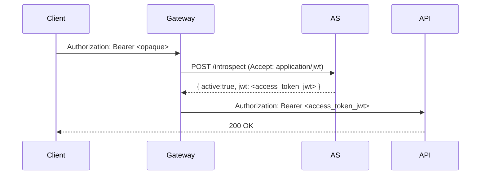

# Chapitre 19 — **Token Exchange (RFC 8693)**, **JWT Access Token Profile (RFC 9068)**,
# **Downscoping** & **Phantom Token**

> **Objectif** : maîtriser les **échanges de jetons** (impersonation/delegation, audience/scopes),
> le **profil JWT pour access tokens**, la **réduction de privilèges** (downscoping) et le **pattern
> Phantom Token** côté API gateway.

---

## 1) **Token Exchange** (RFC 8693)
Le **Token Exchange** définit un **STS** HTTP/JSON permettant d’**obtenir un nouveau token** à partir d’un **token sujet** (`subject_token`), optionnellement avec un **acteur** (`actor_token`), tout en ajustant **audience**/**scope** et en supportant **impersonation** et **delegation**. citeturn24search1100

- **Requête** : `grant_type=urn:ietf:params:oauth:grant-type:token-exchange`, avec `subject_token`, `subject_token_type`, et éventuellement `audience`, `resource`, `scope`, `requested_token_type`. Le RFC précise les relations entre **resource/audience/scope** et introduit la claim **`act`** pour l’**acteur**. citeturn24search1100
- **Usages clés** : *API→API* en **microservices** (propager le **contexte utilisateur** à un service aval), **changement d’audience**, **downscoping/upscoping**, **fédération** (traduire des tokens entre domaines). citeturn24search1141turn24search1137
- **Implémentations** : **Keycloak 26.2** supporte officiellement le **Standard Token Exchange** (V2) conforme au RFC ; la doc compare V1 (preview) et V2 et explique le flux et les cas pris en charge. citeturn24search1148turn24search1149turn24search1150
- **OBO (On‑Behalf‑Of)** : variante de **délégation** (ex. Microsoft Entra ID) pour conserver le **contexte utilisateur** dans des appels en chaîne vers APIs aval. citeturn24search1136turn24search1140

> **Conseil** : préférer **delegation** (l’agent agit « au nom de ») à **impersonation** (l’agent devient l’utilisateur) pour auditabilité et séparation des identités ; le RFC formalise ces sémantiques. citeturn24search1100turn24search1105

---

## 2) **JWT Access Token Profile** (RFC 9068)
Le RFC 9068 standardise un **format JWT** pour les **access tokens** : en‑tête `type=at+jwt`, claims **obligatoires** (`iss`, `sub`, `aud`, `exp`, `iat`, `jti`, `client_id`), plus `scope`, `groups`, `roles`, `entitlements` selon les besoins. citeturn24search1142

- **Bénéfices** : validation **locale** par le resource server (signature JWKS) sans **introspection**, interopérabilité et profil commun des claims. citeturn24search1142turn24search1144
- **Trade‑offs** : **révocation** en temps réel difficile (tokens valides jusqu’à `exp`), exposition de données si les claims sont trop verbeux (préférer chiffrement **JWE** si nécessaire). citeturn24search1143
- **Écosystème** : certains fournisseurs exposent un **profil RFC 9068** en option (ex. Auth0 liste les différences de claims). citeturn24search1147

---

## 3) **Downscoping** & contrôle de privilèges
- **Token Exchange** permet de **réduire** (`downscope`) ou **adapter** `audience`/`scope` pour un appel interne (principe de moindre privilège). citeturn24search1141
- Dans certains écosystèmes (ex. **Google Cloud**), la **réduction de privilèges** se fait via **Credential Access Boundaries** et **échange** de jetons courts ; pattern « **token broker** ». citeturn24search1118turn24search1121

---

## 4) **Phantom Token** : concilier **opaque** & **JWT**
Le **Phantom Token** garde un **opaque token** côté client et fait **introspection** au **gateway** pour obtenir un **JWT** interne (souvent via `Accept: application/jwt`), que le gateway **forward** à l’API — on obtient **revocation/PII** côté opaque et **performance** côté JWT. citeturn24search1106turn24search1108

- Plugins et exemples existent pour **AWS API Gateway**, **Kong**, **NGINX**, **Zuplo**. citeturn24search1107turn24search1109turn24search1108turn24search1111

---

## 5) **Opaque vs JWT** : choisir selon **revocation**, **perf**, **privacy**
- **Opaque** : introspection obligatoire, **révocable** finement, **contenu privé**. citeturn24search1130turn24search1132
- **JWT** : validation locale, **performance** en microservices, mais **revocation** difficile et risque **exposition** des claims. citeturn24search1131
- **Phantom** = hybride : **opaque à l’extérieur**, **JWT interne**. citeturn24search1106

---

## 6) Implémentation Node/TS (avec **oauth4webapi**)
### 6.1 **Token Exchange**
```ts
import * as oauth from 'oauth4webapi';

// Exchanger: le service intermédiaire (API1) veut un token pour API2
const res = await oauth.genericTokenEndpointRequest(as, client, {
  grant_type: 'urn:ietf:params:oauth:grant-type:token-exchange',
  subject_token: userAccessToken, // token reçu du client (API1)
  subject_token_type: 'urn:ietf:params:oauth:token-type:access_token',
  audience: 'https://api2.example.com',
  scope: 'read:orders',
});
const exchanged = await oauth.processGenericTokenEndpointResponse(as, client, res);
// exchanged.access_token → token audience API2 avec scopes réduits
```
> Pattern **on‑behalf‑of** : API1 échange le token utilisateur pour un **nouveau token** destiné à **API2**, tout en gardant le **contexte** de l’utilisateur. citeturn24search1136turn24search1138

### 6.2 **JWT access tokens** (profil RFC 9068)
```ts
// Côté RS : valider localement un AT JWT (RFC9068)
import { createRemoteJWKSet, jwtVerify } from 'jose';
const jwks = createRemoteJWKSet(new URL(as.jwks_uri));
const { payload, protectedHeader } = await jwtVerify(accessToken, jwks, {
  issuer: as.issuer,
  audience: 'https://api.example.com',
  typ: 'at+jwt',
});
// Vérifier iss/sub/aud/exp/iat/jti/client_id/scope
```
> Le profil **RFC 9068** impose `type=at+jwt` et des **claims** standard pour interopérer. citeturn24search1142

### 6.3 **Phantom Token** (schéma)

> Le **gateway** convertit l’opaque en **JWT interne** via introspection (pattern **Phantom Token**). citeturn24search1106

---

## 7) Bonnes pratiques
1. **Documenter** les politiques de **Token Exchange** (qui peut échanger quoi, vers quelles audiences/scopes). citeturn24search1148
2. **Downscoping** systématique vers les APIs aval (principe de moindre privilège). citeturn24search1141turn24search1123
3. **Choisir le format de token** par **contexte** (opaque externe, JWT interne, ou RFC 9068 total si révocation non critique). citeturn24search1142turn24search1130
4. **Sécuriser le gateway** Phantom : cache contrôlé, vérif des scopes, et TLS côté introspection. citeturn24search1106
5. **Auditabilité** : préférer **delegation** (trace act/sub via `act`) ; limiter **impersonation**. citeturn24search1100

---

## 8) Exercices
1. **OBO** : implémente un exchange API1→API2 (audience + scope réduits) et logge `sub`/`act`. citeturn24search1136
2. **JWT AT (RFC 9068)** : fais émettre un `at+jwt` et valide localement iss/aud/jti ; compare perf vs introspection. citeturn24search1142
3. **Phantom Token** : configure un gateway (Kong/NGINX/AWS Lambda authorizer) pour introspecter et forwarder **JWT**. citeturn24search1109turn24search1108turn24search1107

---

## 9) Références
- **RFC 8693** Token Exchange (impersonation/delegation, `act` claim, audience/scope). citeturn24search1100
- **RFC 9068** JWT Access Token Profile (type `at+jwt`, claims standard). citeturn24search1142
- **Keycloak** Token Exchange (support officiel V2, doc & guide). citeturn24search1148turn24search1149turn24search1150
- **OBO** (Microsoft/Okta) pour délégation API→API. citeturn24search1136turn24search1138
- **Phantom Token** (Curity, NGINX, plugins). citeturn24search1106turn24search1108
- **Opaque vs JWT** (comparatifs & choix). citeturn24search1130turn24search1131
- **Downscoping** (Google CAB). citeturn24search1118turn24search1121
