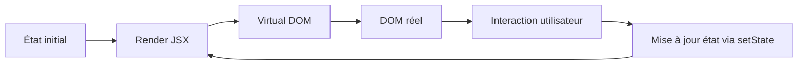

# 📦 **Chapitre 2 — Props et État**

> 🎯 **Objectif** : Maîtriser le passage de données via **props**, comprendre la gestion de l’état avec **useState**, et savoir distinguer leurs rôles respectifs.

---

## 🧠 1) **Props** : données transmises par le parent

### 📚 Définition
Les **props** (propriétés) sont des **valeurs** transmises par un **composant parent** à un **composant enfant**. Elles sont **immutables** dans le composant qui les reçoit.

### 🤔 Pourquoi des props ?
- **Communication descendante** : le parent contrôle l’enfant.
- **Réutilisabilité** : un composant peut afficher des données différentes selon les props.

### 🧩 Analogie
Imaginez un **formulaire pré-rempli** : le parent fournit les informations, l’enfant les affiche sans les modifier.

### 🔧 Exemple simple
```jsx
function Bonjour({ prenom }) {
  return <h1>Bonjour, {prenom} !</h1>;
}

export default function App() {
  return <Bonjour prenom="Eric" />;
}
```

### ✅ Bonnes pratiques
- Ne **muter** jamais les props.
- Fournir des **valeurs par défaut** si nécessaire (`defaultProps` ou valeurs par défaut ES6).

---

## 🔐 2) **État (State)** : données locales et évolutives

### 📚 Définition
L’**état** est une **donnée interne** au composant, qui peut **changer au cours du temps**. Chaque changement d’état déclenche un **nouveau rendu**.

### 🤔 Pourquoi un état ?
- Pour gérer des **interactions** (clics, saisies).
- Pour stocker des **valeurs dynamiques** (compteur, formulaire).

### 🧩 Différence clé avec props
- **Props** : données **externes**, fournies par le parent.
- **State** : données **internes**, gérées par le composant lui-même.

### 🔧 Exemple avec `useState`
```jsx
import { useState } from 'react';

export default function Compteur() {
  const [count, setCount] = useState(0);

  return (
    <div>
      <p>Valeur : {count}</p>
      <button onClick={() => setCount(count + 1)}>Incrémenter</button>
    </div>
  );
}
```

### 🧩 Analogie
Imaginez un **tableau blanc** dans une salle : le parent fournit la salle (props), mais le contenu du tableau (state) change selon les interactions.

---

## 🛠️ 3) Hook `useState` en détail

### 📚 Syntaxe
```jsx
const [valeur, setValeur] = useState(valeurInitiale);
```
- `valeur` : état actuel.
- `setValeur` : fonction pour mettre à jour l’état.

### 🔍 Points clés
- Chaque appel à `setValeur` **déclenche un rendu**.
- Les mises à jour sont **asynchrones** (batching).

### 🧪 Exemple avec plusieurs états
```jsx
export default function Profil() {
  const [nom, setNom] = useState('Eric');
  const [age, setAge] = useState(30);

  return (
    <div>
      <p>{nom}, {age} ans</p>
      <button onClick={() => setAge(age + 1)}>Vieillir</button>
    </div>
  );
}
```

---

## 🧮 4) Théorie simplifiée : cycle de rendu



### Formule JS (simulation du batching)
```js
let state = 0;
function setState(update) {
  // Simulation simplifiée
  state = typeof update === 'function' ? update(state) : update;
}

setState(prev => prev + 1);
setState(prev => prev + 1);
console.log(state); // 2 (après batch)
```

---

## 🧪 5) Exercices pratiques

1. Créez un composant `Toggle` qui affiche "ON" ou "OFF" selon un état booléen.
2. Créez un composant `Formulaire` avec un champ texte contrôlé par `useState`.
3. Combinez props et state : un composant `Carte` reçoit un titre (prop) et gère un compteur interne.

---

## ✅ Bonnes pratiques
- Initialiser l’état avec une **valeur cohérente**.
- Grouper les états liés dans un **objet** si nécessaire.
- Éviter les mises à jour basées sur des valeurs obsolètes (utiliser la **fonction de mise à jour**).

---

## 🧾 **Résumé des points essentiels (Chapitre 2)**

- **Props** : données **externes**, immuables, fournies par le parent.
- **State** : données **internes**, évolutives, gérées par le composant.
- `useState` : hook pour déclarer et mettre à jour l’état.
- Chaque mise à jour d’état déclenche un **nouveau rendu**.

---

## ✅ **Checklist de fin de chapitre**

- [ ] Je sais passer des **props** à un composant.
- [ ] Je sais créer un état avec `useState`.
- [ ] Je comprends la différence entre **props** et **state**.
- [ ] Je sais mettre à jour l’état sans muter directement.

---

> ⏭️ **Prochain chapitre** : [[Chapitre 3 - Événements et Formulaires]]
