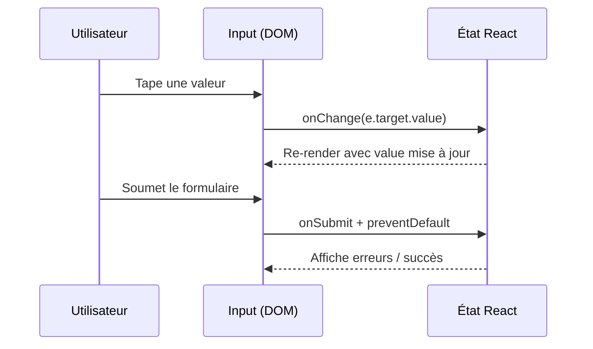

# 🖱️ **Chapitre 3 — Événements et Formulaires**

> 🎯 **Objectif** : Savoir **réagir aux interactions** (clics, clavier, souris, focus), implémenter des **formulaires contrôlés**, comprendre les **modèles non contrôlés**, gérer la **validation** et l’**accessibilité**.

---

## 🔌 1) Système d’événements dans React

### 📚 Définition
Le **système d’événements** de React fournit des **props d’événements** (ex. `onClick`, `onChange`, `onSubmit`) qui déclenchent des **fonctions de rappel** (handlers). Les noms sont en **camelCase**, et les handlers reçoivent un **objet événement**.

### 🤔 Pourquoi un système d’événements ?
- **API unifiée** multi-navigateurs.
- **Performance** via gestion centralisée et mise à jour déclarative de l’UI.

### 🧩 Principaux événements
- **Souris** : `onClick`, `onDoubleClick`, `onMouseEnter`, `onMouseLeave`
- **Clavier** : `onKeyDown`, `onKeyUp`, `onKeyPress`
- **Focus** : `onFocus`, `onBlur`
- **Formulaire** : `onChange`, `onInput`, `onSubmit`

### ❗ Particularités
- `onChange` sur un `<input>` texte se déclenche **à chaque frappe** (comportement proche de `input`).
- Les handlers **retournent rien** pour empêcher le re-rendu ; utilisez **l’état**.

---

## 🧭 2) Écrire des handlers clairs

### 🧱 Règles de base
- **Nommer** les handlers par action : `handleClick`, `handleSubmit`.
- **Ne pas** écrire de logique lourde dans le JSX : extraire dans des fonctions.
- **Empêcher** le comportement par défaut (soumission) avec `event.preventDefault()`.

### 🔧 Exemple (clic + clavier)
```jsx
export default function BoutonInteractif() {
  function handleClick() {
    console.log('Bouton cliqué');
  }
  function handleKeyDown(e) {
    if (e.key === 'Enter') console.log('Validation via Entrée');
  }
  return (
    <button onClick={handleClick} onKeyDown={handleKeyDown}>
      Action
    </button>
  );
}
```

---

## 📝 3) Formulaires contrôlés

### 📚 Définition
Un **formulaire contrôlé** est un input dont la **valeur affichée** est **pilotée par l’état React** (`useState`). Le **source of truth** est dans React.

### 🤔 Pourquoi contrôlé ?
- **Validation en direct**, **formatage**, **masques** (ex. numéro de tel).
- **Synchronisation** entre champs et composants.

### 🔧 Exemple (champ texte)
```jsx
import { useState } from 'react';

export default function ChampTexte() {
  const [value, setValue] = useState('');
  function handleChange(e) { setValue(e.target.value); }
  return (
    <label>
      Nom
      <input value={value} onChange={handleChange} />
    </label>
  );
}
```

### 🔧 Exemple (formulaire + submit)
```jsx
import { useState } from 'react';

export default function FormulaireLogin() {
  const [email, setEmail] = useState('');
  const [password, setPassword] = useState('');
  const [error, setError] = useState(null);

  function handleSubmit(e) {
    e.preventDefault();
    if (!email.includes('@')) return setError('Email invalide');
    if (password.length < 8) return setError('Mot de passe trop court');
    setError(null);
    console.log({ email, password });
  }

  return (
    <form onSubmit={handleSubmit} noValidate>
      <label htmlFor="email">Email</label>
      <input id="email" type="email" value={email} onChange={e => setEmail(e.target.value)} />

      <label htmlFor="pwd">Mot de passe</label>
      <input id="pwd" type="password" value={password} onChange={e => setPassword(e.target.value)} />

      {error && <p role="alert" aria-live="assertive">{error}</p>}
      <button type="submit">Se connecter</button>
    </form>
  );
}
```

---

## 🎛️ 4) Formulaires non contrôlés (refs)

### 📚 Définition
Un **formulaire non contrôlé** stocke la valeur **dans le DOM** (input) et on y accède via une **ref**.

### 🤔 Pourquoi non contrôlé ?
- **Simplicité** pour des formulaires ponctuels.
- **Performance** quand on évite des re-rendus à chaque frappe.

### 🔧 Exemple (useRef)
```jsx
import { useRef } from 'react';

export default function Newsletter() {
  const emailRef = useRef(null);
  function handleSubmit(e) {
    e.preventDefault();
    const email = emailRef.current?.value || '';
    console.log('Inscription:', email);
  }
  return (
    <form onSubmit={handleSubmit}>
      <input ref={emailRef} type="email" placeholder="Votre email" />
      <button type="submit">S'inscrire</button>
    </form>
  );
}
```

---

## 🧮 5) Performance et ergonomie

### 🧠 Principes
- **Debounce/Throttle** les handlers coûteux.
- **Limiter** les re-rendus en regroupant l’état ou en utilisant `useMemo`/`useCallback` (cf. chapitre 8).

### Formule JS (debounce)
```js
function debounce(fn, delay = 300) {
  let t;
  return (...args) => {
    clearTimeout(t);
    t = setTimeout(() => fn(...args), delay);
  };
}

const log = debounce((v) => console.log('Saisie:', v), 250);
// À appeler depuis onChange: onChange={e => log(e.target.value)}
```

---

## ♿ 6) Accessibilité des formulaires

### ✅ Bonnes pratiques
- Associer `label` et `input` avec `htmlFor`/`id`.
- Utiliser `role="alert"` et `aria-live` pour les erreurs.
- Respecter le **focus** (ordre tabulation), utiliser `onFocus`/`onBlur`.

---

## 🧭 7) Schéma : flux d’un formulaire contrôlé



---

## 🧪 8) Exercices ciblés

1. **Validation progressive** : un champ qui affiche un message si la longueur < 3.
2. **Sélecteur** : un `<select>` contrôlé + affichage de l’option choisie.
3. **Ref vs contrôlé** : implémentez deux versions d’un champ email, comparez le code.

---

## ❌ 9) Anti-patterns à éviter
- Mettre toute la logique dans le handler au lieu d’utiliser l’état.
- Oublier `preventDefault()` sur `onSubmit`.
- Utiliser des **clés instables** dans les listes de champs.

---

## 🧾 **Résumé des points essentiels (Chapitre 3)**

- Les **événements** se gèrent via des props `onXxx` et des **handlers**.
- Les **formulaires contrôlés** font de l’état React le **source of truth**.
- Les **non contrôlés** stockent la valeur dans le **DOM** via **refs**.
- Pensez **accessibilité**, **validation**, **performance** (debounce).

---

## ✅ **Checklist de fin de chapitre**

- [ ] Je peux écrire un **handler** clair pour `onClick`, `onChange`, `onSubmit`.
- [ ] Je sais créer un **champ contrôlé** avec `useState`.
- [ ] Je comprends quand utiliser une **ref** pour des champs non contrôlés.
- [ ] J’applique des **bonnes pratiques** d’accessibilité et de validation.

---

> ⏭️ **Prochain chapitre** : [[Chapitre 4 - `useEffect` et Effets de Bord]]
