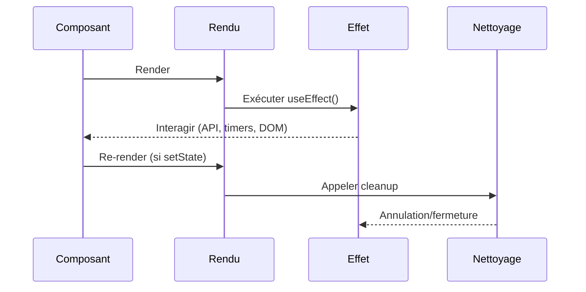
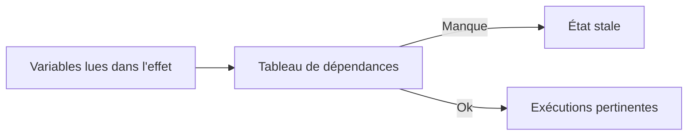

# 🔄 **Chapitre 4 — `useEffect` et Effets de Bord**

> 🎯 **Objectif** : Comprendre **ce qu’est un effet de bord**, savoir utiliser **`useEffect`** en maîtrisant les **dépendances** et le **nettoyage**, éviter les **pièges** (boucles de rendu, dépendances manquantes), et appliquer des **bonnes pratiques** pour les **appels API**, **timers** et **subscriptions**.

---

## 🧠 1) Effet de bord : définition et enjeux

### 📚 Définition
Un **effet de bord** est une **opération externe au rendu** : accès réseau (API), timers, manipulation du DOM, stockage local, logs, subscriptions (WebSocket), etc. Ces opérations **ne décrivent pas l’UI** mais **interagissent avec l’extérieur**.

### 🤔 Pourquoi les isoler dans `useEffect` ?
- **Prévisibilité** : séparer le **rendu pur** (fonction du state/props) des **interactions externes**.
- **Nettoyage** : éviter fuites mémoire et états orphelins.
- **Synchronisation** : déclencher l’effet **quand l’état ou les props changent**.

---

## 🧰 2) `useEffect` : syntaxe et cycle de vie

### 🔧 Syntaxe de base
```jsx
import { useEffect } from 'react';

useEffect(() => {
  // Code de l'effet (après le rendu)
  return () => {
    // Nettoyage (avant re-exécution de l'effet / avant démontage)
  };
}, [/* dépendances */]);
```

### ⏱️ Quand l’effet s’exécute ?
- **Après chaque rendu** si **pas de tableau** de dépendances.
- **Après le premier rendu uniquement** si tableau **vide** `[]`.
- **Après le rendu + quand une dépendance change** si `[dep1, dep2]`.

### ♻️ Nettoyage
La **fonction retournée** par l’effet est appelée **avant** la ré-exécution de l’effet et **avant** le **démontage** du composant.

---

## 🔍 3) Dépendances : penser "sources de données"

### 📚 Règle d’or
Le tableau de dépendances doit contenir **toutes les valeurs lues** à l’intérieur de l’effet **qui peuvent varier dans le temps** (state, props, variables dérivées).

### ❗ Pièges courants
- **Oublier une dépendance** ➜ état **stale**.
- **Ajouter une fonction recréée à chaque rendu** ➜ **re-exécutions inutiles**. Solution : **`useCallback`** ou déplacer la logique **dans** l’effet.

### 🧮 Mini-formule JS : détecter dépendances manquantes (pédagogique)
```js
// Simule une vérification: variables lues vs tableau de deps
function depsCheck(variablesLues, deps) {
  const missing = variablesLues.filter(v => !deps.includes(v));
  return missing.length ? missing : 'OK';
}
console.log(depsCheck(['query', 'page'], ['query'])); // => ['page']
```

---

## 🌐 4) Appels API : modèle robuste

### 🔧 Exemple avec `fetch` + `AbortController`
```jsx
import { useEffect, useState } from 'react';

export default function UsersList({ query }) {
  const [users, setUsers] = useState([]);
  const [loading, setLoading] = useState(false);
  const [error, setError] = useState(null);

  useEffect(() => {
    const ctrl = new AbortController();
    const { signal } = ctrl;
    let mounted = true;
    setLoading(true);
    setError(null);

    fetch(`/api/users?q=${encodeURIComponent(query)}`, { signal })
      .then(r => {
        if (!r.ok) throw new Error('HTTP ' + r.status);
        return r.json();
      })
      .then(data => {
        if (mounted) setUsers(data);
      })
      .catch(err => {
        if (err.name !== 'AbortError') setError(err.message);
      })
      .finally(() => {
        if (mounted) setLoading(false);
      });

    return () => {
      mounted = false;     // Empêche setState après démontage
      ctrl.abort();        // Annule la requête en cours
    };
  }, [query]);

  // ...rendu
}
```

### ✅ Bonnes pratiques
- **Annuler** les requêtes lors du **nettoyage**.
- **Gérer** `loading`/`error`/données pour une **UI fiable**.
- **Encoder** les paramètres (`encodeURIComponent`).

---

## ⏲️ 5) Timers et intervals

### 🔧 Exemple
```jsx
import { useEffect, useState } from 'react';

export default function Horloge() {
  const [time, setTime] = useState(Date.now());
  useEffect(() => {
    const id = setInterval(() => setTime(Date.now()), 1000);
    return () => clearInterval(id); // Nettoyage
  }, []);
  return <p>{new Date(time).toLocaleTimeString()}</p>;
}
```

### ❗ Piège
Ne pas nettoyer ➜ **multiplication des timers** et **fuite mémoire**.

---

## 📡 6) Subscriptions (WebSocket, event listeners)

### 🔧 Exemple WebSocket
```jsx
import { useEffect, useState } from 'react';

export default function Notifications() {
  const [messages, setMessages] = useState([]);
  useEffect(() => {
    const ws = new WebSocket('wss://example.com/socket');
    ws.onmessage = (ev) => setMessages(m => [...m, ev.data]);
    return () => ws.close();
  }, []);
  return <ul>{messages.map((m,i) => <li key={i}>{m}</li>)}</ul>;
}
```

### 🔧 Exemple event listener DOM
```jsx
useEffect(() => {
  function onResize() { console.log(window.innerWidth); }
  window.addEventListener('resize', onResize);
  return () => window.removeEventListener('resize', onResize);
}, []);
```

---

## 🧭 7) Schémas : cycle d’un effet et nettoyage





---

## 🧪 8) Pièges et solutions

### ⚠️ Boucle infinie
```jsx
useEffect(() => {
  setCount(count + 1); // ❌ lit count, mais ne l'a pas en deps
}, []); // Dépendances incorrectes ➜ boucle vs stale
```
**Solution** : inclure `count` dans `[count]` ou utiliser la **fonction de mise à jour**.
```jsx
useEffect(() => {
  setCount(c => c + 1);
}, []); // S'exécute une fois, pas de boucle
```

### ⚠️ Fonctions en dépendances
Les fonctions recréées à chaque rendu provoquent des **re-exécutions**.
**Solutions** : `useCallback` ou **déplacer** la logique dans l’effet.

### ⚠️ Références instables (objets/arrays)
Mettre `{ opt: true }` dans deps ➜ re-renders.
**Solution** : **mémoïser** (`useMemo`) ou **stabiliser** la valeur.

### ⚠️ Strict Mode (dev) et double appel
En mode développement (React 18), certains effets peuvent être **montés/démontés** deux fois pour détecter des **effets non idempotents**. **Toujours** prévoir un **cleanup** sûr.

---

## 🧱 9) `useEffect` vs `useLayoutEffect`

- **`useEffect`** : s’exécute **après** le rendu **peint** (non bloquant) ➜ idéal pour **API**, **timers**.
- **`useLayoutEffect`** : s’exécute **avant** que le navigateur peigne l’écran ➜ utile pour **mesures DOM** et **ajustements synchrones** (peut **bloquer** le rendu).

**Bonne pratique** : commencer par **`useEffect`** ; n’utiliser `useLayoutEffect` qu’en cas de **nécessité** de mesure/ajustement.

---

## 🧩 10) Créer un hook personnalisé (ex. `useWindowSize`)

```jsx
import { useEffect, useState } from 'react';

export function useWindowSize() {
  const [size, setSize] = useState({ w: window.innerWidth, h: window.innerHeight });
  useEffect(() => {
    function onResize() {
      setSize({ w: window.innerWidth, h: window.innerHeight });
    }
    window.addEventListener('resize', onResize);
    return () => window.removeEventListener('resize', onResize);
  }, []);
  return size;
}
```

---

## 🧮 11) Petites formules JS utiles

### 🧮 Anti-requêtes concurrentes : séquenceur
```js
// Séquencer des promesses pour eviter les courses
function sequence(tasks) {
  return tasks.reduce((p, task) => p.then(task), Promise.resolve());
}
```

### 🧮 Stabilité de référence
```js
// Mémoisation simple pour stabiliser une référence (pédagogique)
function memoizeLast(fn) {
  let lastArg; let lastRes;
  return (arg) => {
    if (arg === lastArg) return lastRes;
    lastArg = arg; lastRes = fn(arg);
    return lastRes;
  };
}
```

---

## 🧪 12) Exercices

1. **API + Abort** : implémentez un composant qui charge des posts avec `AbortController`.
2. **Interval** : créez un compteur qui incrémente toutes les 500ms avec nettoyage.
3. **Resize hook** : factorisez l’exemple `useWindowSize` en hook réutilisable et testez-le.

---

## ✅ Bonnes pratiques récap
- Mettre **toutes les dépendances** qui varient.
- Toujours **nettoyer** (timers, listeners, sockets, requêtes).
- Éviter les **boucles de rendu** et les **fonctions instables** dans deps.
- **Commencer** par `useEffect`, réserver `useLayoutEffect` aux mesures.

---

## 🧾 **Résumé des points essentiels (Chapitre 4)**

- `useEffect` permet d’orchestrer les **effets de bord** (API, timers, subscriptions) **après le rendu**.
- Le **tableau de dépendances** détermine **quand** l’effet s’exécute ; inclure **toutes** les valeurs lues.
- Le **nettoyage** évite fuites et comportements indésirables.
- Préférer `useEffect` ; `useLayoutEffect` seulement pour **mesures DOM synchrones**.

---

## ✅ **Checklist de fin de chapitre**

- [ ] Je sais écrire un effet avec **dépendances** et **nettoyage**.
- [ ] Je sais **annuler** une requête réseau en cours.
- [ ] Je comprends la différence entre **`useEffect`** et **`useLayoutEffect`**.
- [ ] Je reconnais et évite les **pièges** (boucles, deps manquantes, refs instables).

---

> ⏭️ **Prochain chapitre** : [[Chapitre 5 - Organisation et Architecture]]
