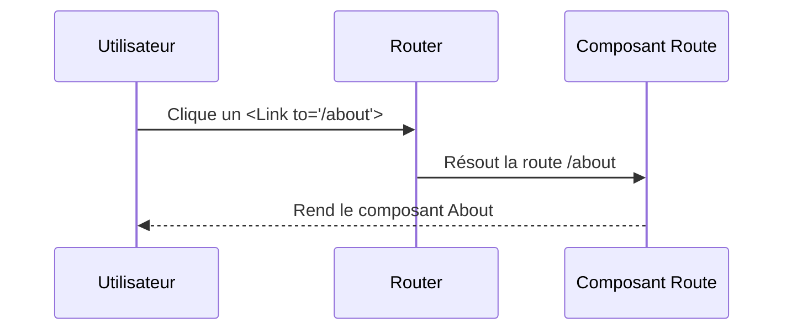
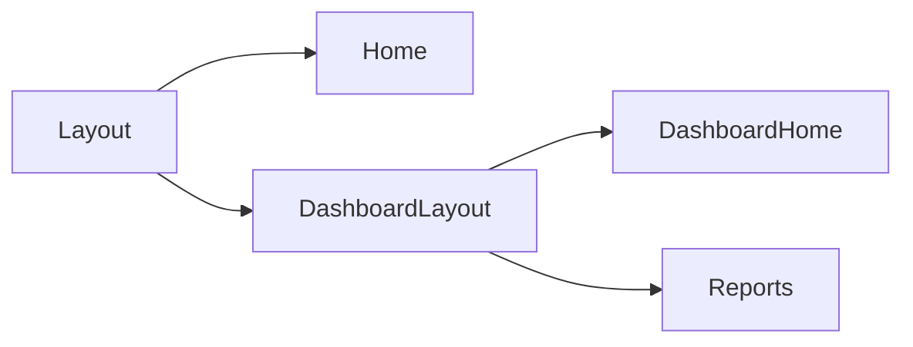

# 🛣️ **Chapitre 6 — Navigation avec React Router**

> 🎯 **Objectif** : Construire une **SPA** (Single Page Application) complète avec **React Router** : définir des **routes**, créer des **liens**, gérer la **navigation programmatique**, les **paramètres**, les **routes imbriquées** et **layouts**, ainsi que les **data routers** (loaders/actions), **lazy loading**, **erreurs**, et **routes protégées**.

---

## 📦 1) Installation et concepts clés

### 📚 Installation
```
npm install react-router-dom
```

### 🧠 Concepts
- **Route** : associe un **chemin** (path) à un **élément**.
- **Link/NavLink** : balises pour la **navigation** sans rechargement.
- **Router** : composant racine qui **orchestre** la navigation.
- **Data Router** : routes avec **loaders/actions** pour charger/traiter des données.

---

## 🚏 2) Configuration de base (BrowserRouter)

### 🔧 Setup minimal
```jsx
import { createRoot } from 'react-dom/client';
import { BrowserRouter, Routes, Route } from 'react-router-dom';
import App from './App';
import Home from './pages/Home';
import About from './pages/About';

createRoot(document.getElementById('root')).render(
  <BrowserRouter>
    <Routes>
      <Route path="/" element={<App />}> 
        <Route index element={<Home />} />
        <Route path="about" element={<About />} />
      </Route>
    </Routes>
  </BrowserRouter>
);
```

### 🧩 Layout avec `<Outlet />`
```jsx
import { Outlet, Link } from 'react-router-dom';
export default function App() {
  return (
    <div>
      <nav>
        <Link to="/">Accueil</Link> | <Link to="/about">À propos</Link>
      </nav>
      <main>
        <Outlet /> {/* Rend la route enfant correspondante */}
      </main>
    </div>
  );
}
```

---

## 🔗 3) Liens et navigation programmatique

### 🔗 `Link` vs `NavLink`
- **`Link`** : navigation simple.
- **`NavLink`** : ajoute une **classe active** selon la route.

```jsx
import { NavLink } from 'react-router-dom';
<NavLink to="/about" className={({ isActive }) => isActive ? 'active' : ''}>À propos</NavLink>
```

### 🧭 Navigation programmatique (`useNavigate`)
```jsx
import { useNavigate } from 'react-router-dom';
function Go() {
  const navigate = useNavigate();
  return <button onClick={() => navigate('/about')}>Aller à propos</button>;
}
```

---

## 🔑 4) Paramètres de route (`useParams`) et query

### 🧭 Paramètres
```jsx
// Déclaration
<Route path="users/:id" element={<User />} />

// Utilisation
import { useParams } from 'react-router-dom';
function User() {
  const { id } = useParams();
  return <p>Utilisateur #{id}</p>;
}
```

### 🧭 Query params (`useSearchParams`)
```jsx
import { useSearchParams } from 'react-router-dom';
function Filtered() {
  const [sp, setSp] = useSearchParams();
  const q = sp.get('q') || '';
  return (
    <>
      <input value={q} onChange={e => setSp({ q: e.target.value })} />
      <p>Recherche: {q}</p>
    </>
  );
}
```

---

## 🧱 5) Routes imbriquées et layouts

### 🧩 Exemple de hiérarchie
```jsx
<Routes>
  <Route path="/" element={<Layout />}>
    <Route index element={<Home />} />
    <Route path="dashboard" element={<DashboardLayout />}>
      <Route index element={<DashboardHome />} />
      <Route path="reports" element={<Reports />} />
    </Route>
  </Route>
</Routes>
```

### 🧰 Alternative moderne : **Data Router**
```jsx
import { createBrowserRouter, RouterProvider } from 'react-router-dom';

const router = createBrowserRouter([
  {
    path: '/', element: <Layout />,
    children: [
      { index: true, element: <Home /> },
      { path: 'about', element: <About /> },
    ]
  }
]);

<RouterProvider router={router} />
```

---

## 🗂️ 6) Data routers : `loader` et `action`

### 🔧 Charger des données (loader)
```jsx
import { createBrowserRouter } from 'react-router-dom';

async function postsLoader() {
  const r = await fetch('/api/posts');
  if (!r.ok) throw new Response('Erreur', { status: r.status });
  return r.json();
}

function Posts() {
  const posts = useLoaderData();
  return <ul>{posts.map(p => <li key={p.id}>{p.title}</li>)}</ul>;
}

const router = createBrowserRouter([
  { path: '/', element: <Layout />, children: [
    { path: 'posts', element: <Posts />, loader: postsLoader },
  ] }
]);
```

### 🔧 Traiter des actions (action)
```jsx
async function createPostAction({ request }) {
  const formData = await request.formData();
  const payload = Object.fromEntries(formData);
  const r = await fetch('/api/posts', { method: 'POST', body: JSON.stringify(payload) });
  if (!r.ok) throw new Response('Création échouée', { status: r.status });
  return r.json();
}

<Route path="new" action={createPostAction} element={<NewPostForm />} />
```

### 🧭 Lecture des données
```jsx
import { useLoaderData, useNavigation } from 'react-router-dom';
const data = useLoaderData();
const nav = useNavigation(); // pour l'état de chargement global
```

---

## 💤 7) Lazy loading des routes

```jsx
import { lazy, Suspense } from 'react';
const About = lazy(() => import('./pages/About'));

<Route path="about" element={
  <Suspense fallback={<p>Chargement...</p>}>
    <About />
  </Suspense>
} />
```

---

## 🛡️ 8) Routes protégées (auth)

```jsx
function RequireAuth({ children }) {
  const isAuth = useAuth();
  return isAuth ? children : <Navigate to="/login" replace />;
}

<Route path="/dashboard" element={<RequireAuth><Dashboard /></RequireAuth>} />
```

---

## ❌ 9) Gestion des erreurs : `errorElement` et 404

```jsx
const router = createBrowserRouter([
  {
    path: '/', element: <Layout />, errorElement: <ErrorPage />,
    children: [
      { index: true, element: <Home /> },
      { path: 'about', element: <About /> },
      { path: '*', element: <NotFound /> },
    ]
  }
]);
```

---

## ♿ 10) Accessibilité et navigation

### ✅ Bonnes pratiques
- Utiliser des **liens** (`<Link>`) au lieu de boutons pour la navigation.
- Fournir un **indicateur actif** (`NavLink`) et des **titres de page** (mise à jour via `useEffect`).
- Gérer le **focus** lors des changements de page.

---

## 🧮 11) Mini-formule JS : construire un breadcrumb
```js
function buildBreadcrumb(pathname) {
  const parts = pathname.split('/').filter(Boolean);
  let acc = '/';
  return parts.map(p => (acc += (acc === '/' ? '' : '/') + p, { label: p, href: acc }));
}
console.log(buildBreadcrumb('/dashboard/reports'));
```

---

## 🧭 12) Schémas Mermaid

### Flow de navigation


### Hiérarchie imbriquée


---

## 🧪 13) Exercices

1. Créez une app avec **Home/About** et un layout avec `<Outlet/>`.
2. Ajoutez une page **Users/:id** et affichez l’ID via `useParams`.
3. Passez à un **Data Router** avec un **loader** qui récupère des posts.
4. Ajoutez une **route protégée** `/admin` avec redirection.

---

## ✅ Bonnes pratiques récap
- Utiliser **layouts** + **routes imbriquées** pour structurer la SPA.
- Préférer **Data Router** lorsque vos routes **chargent/traitent** des données.
- Soigner **accessibilité** (focus, liens, titres) et **lazy loading**.
- Centraliser la **gestion d’erreurs** avec `errorElement` et routes 404.

---

## 🧾 **Résumé des points essentiels (Chapitre 6)**

- **React Router** gère la **navigation** sans recharger la page.
- Les **layouts** et **routes imbriquées** permettent des architectures claires.
- Les **data routers** ajoutent **loaders/actions** pour les données.
- La **navigation programmatique**, les **params**, la **protection** et les **erreurs** complètent la SPA.

---

## ✅ **Checklist de fin de chapitre**

- [ ] Je sais configurer **BrowserRouter** et `Routes`/`Route`.
- [ ] Je sais utiliser `Link`, `NavLink`, `useNavigate`.
- [ ] Je comprends **params** (`useParams`) et **query** (`useSearchParams`).
- [ ] Je sais créer un **Data Router** avec **loader/action**.
- [ ] Je sais implémenter une **route protégée** et une **gestion d’erreurs**.

---

> ⏭️ **Prochain chapitre** : [[Chapitre 7 - Gestion avancée de l’état]]
