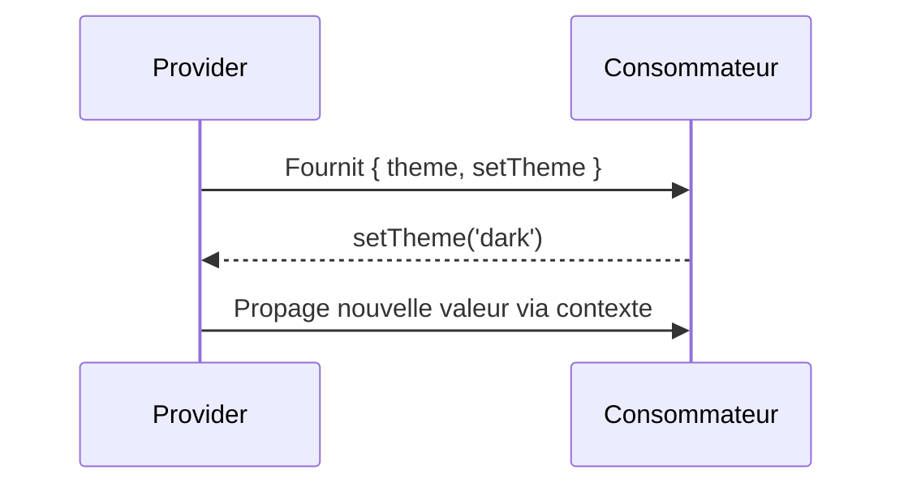

# 🧠 **Chapitre 7 — Gestion avancée de l’état (Context & Redux)**

> 🎯 **Objectif** : Savoir **partager un état global** avec le **Context API**, éviter les pièges de performance, et **introduire Redux** pour des **flux de données prévisibles** dans des applications plus complexes.

---

## 🌍 1) Pourquoi un **état global** ?

### 📚 Définition
Un **état global** est une **source de données partagée** par plusieurs composants éloignés (thème, utilisateur connecté, préférences, panier, etc.).

### 🤔 Pourquoi en avoir besoin ?
- Évite le **props drilling** sur de nombreuses couches.
- Centralise des **règles métier** communes.

### 🧩 Analogie
Pensez à un **tableau d’affichage** au centre d’un bureau : tout le monde peut **lire** les informations, certains rôles peuvent **les mettre à jour**.

---

## 🧩 2) **Context API** — Rappels et approfondissement

### 📚 Définition
Le **Context API** permet de **fournir** (`Provider`) une **valeur** et de la **consommer** (`useContext`) dans l’arbre **sans props** intermédiaires.

### 🔧 Mise en place complète (thème)
```jsx
import { createContext, useContext, useState, useMemo } from 'react';

const ThemeContext = createContext();

export function ThemeProvider({ children }) {
  const [theme, setTheme] = useState('light');
  const value = useMemo(() => ({ theme, setTheme }), [theme]);
  return <ThemeContext.Provider value={value}>{children}</ThemeContext.Provider>;
}

export function useTheme() { return useContext(ThemeContext); }
```

### 🧭 Consommation
```jsx
function SwitchThemeButton() {
  const { theme, setTheme } = useTheme();
  const next = theme === 'light' ? 'dark' : 'light';
  return <button onClick={() => setTheme(next)}>Passer en mode {next}</button>;
}
```

### ✅ Bonnes pratiques Context
- **Mémoïser** la valeur de contexte (`useMemo`) pour **éviter les re-rendus**.
- Découper en **plusieurs contexts** (ex. `ThemeContext` / `AuthContext`) pour limiter l’impact.
- Ne pas mettre des **objets instables** ou des **fonctions recréées** sans mémoïsation.

---

## ⚡ 3) Performance : propagation des re-rendus

### 📚 Problème
Chaque **update** d’une valeur de contexte **re-rend** *tous* les composants **consommateurs**.

### 🔧 Techniques d’atténuation
- **Context par domaine** (thème vs auth).
- **`useMemo`** sur la valeur fournie.
- **Séparation** : composant parent qui consomme le contexte et **passe des props** mémorisées à ses enfants.

### 🧮 Mini-formule JS (coût de propagation, pédagogique)
```js
// Estimation simple: coût = nb_consommateurs * fréquence_mises_a_jour
function coutPropagation(nb, freq) { return nb * freq; }
console.log(coutPropagation(20, 5)); // 100 "unités"
```

---

## 🧱 4) **Redux** — Introduction structurée

### 📚 Concepts clés
- **Store** : objet unique qui contient l’**état global**.
- **Action** : objet `{ type, payload }` décrivant *ce qui se passe*.
- **Reducer** : fonction pure `(state, action) => newState`.
- **Dispatch** : envoie une action au store.

### 🤔 Pourquoi Redux ?
- **Prédictibilité** : état contrôlé par des **reducers purs**.
- **Traçabilité** : historique des actions (devtools).
- **Écosystème** : Redux Toolkit, RTK Query.

### 🧩 Analogie
Imaginez un **bureau des réclamations** centralisé : tout changement passe par un **formulaire** (action), traité par une **procédure** standard (reducer), et l’**affichage** est mis à jour.

---

## 🧰 5) Mise en place avec **Redux Toolkit** (recommandé)

> 💡 **Redux Toolkit (RTK)** simplifie la configuration et réduit le code boilerplate.

### 🔧 Store + slice
```jsx
import { configureStore, createSlice } from '@reduxjs/toolkit';

const counterSlice = createSlice({
  name: 'counter',
  initialState: { value: 0 },
  reducers: {
    increment: (state) => { state.value += 1; },
    decrement: (state) => { state.value -= 1; },
    addBy: (state, action) => { state.value += action.payload; },
  }
});

export const { increment, decrement, addBy } = counterSlice.actions;

export const store = configureStore({
  reducer: { counter: counterSlice.reducer }
});
```

### 🔧 Provider + usage dans React
```jsx
import { Provider, useSelector, useDispatch } from 'react-redux';
import { store, increment, decrement, addBy } from './store';

function Counter() {
  const value = useSelector(state => state.counter.value);
  const dispatch = useDispatch();
  return (
    <div>
      <p>Valeur: {value}</p>
      <button onClick={() => dispatch(increment())}>+1</button>
      <button onClick={() => dispatch(decrement())}>-1</button>
      <button onClick={() => dispatch(addBy(5))}>+5</button>
    </div>
  );
}

export default function App() {
  return (
    <Provider store={store}>
      <Counter />
    </Provider>
  );
}
```

### ✅ Points forts
- Mutations **immutables** gérées par **Immer** (via RTK).
- **Sélecteurs** (`useSelector`) pour **lire** l’état.
- **Actions** et **reducers** centralisés et typables (TS).

---

## 🔗 6) Context vs Redux : quand choisir quoi ?

### 🧭 Guide de décision
- **Context** : idéal pour **petits états globaux** (thème, langue, auth basique), faible fréquence de mise à jour.
- **Redux** : préférable pour **états complexes**, **fréquence élevée** de mises à jour, **nombreux consommateurs**, besoin de **traçabilité** et d’outils.

### 📋 Tableau mental
- **Taille du projet** : petite → Context ; moyenne/grande → Redux.
- **Complexité des règles** : simple → Context ; élaborée → Redux.

---

## 🧮 7) Sélecteurs et mémoïsation

### 📚 Définition
Un **sélecteur** extrait une **partie de l’état** et peut être **mémoïsé** pour éviter des calculs/rendus inutiles.

### 🔧 Exemple (mémoïsation locale)
```js
function makeSumSelector() {
  let lastArr = null, lastRes = 0;
  return (arr) => {
    if (arr === lastArr) return lastRes;
    lastArr = arr; lastRes = arr.reduce((a,b) => a+b, 0);
    return lastRes;
  };
}
const sumSelector = makeSumSelector();
```

### 🔧 Exemple (RTK + Reselect)
```js
import { createSelector } from '@reduxjs/toolkit';
const selectTodos = state => state.todos.items;
export const selectCompleted = createSelector(
  [selectTodos],
  (todos) => todos.filter(t => t.done)
);
```

---

## 🧭 8) Schémas Mermaid

### Flux Context


### Flux Redux
```mermaid
flowchart LR
  A[UI] --> B[dispatch(action)]
  B --> C[Reducer]
  C --> D[Store]
  D --> A[useSelector]
```

---

## 🧪 9) Exercices

1. Créez un **ThemeProvider** avec `ThemeContext` et un bouton pour basculer clair/sombre.
2. Implémentez un **counter** avec **Redux Toolkit**, puis ajoutez une action `reset`.
3. Créez un **sélecteur mémoïsé** pour calculer le nombre de tâches terminées dans un tableau de `todos`.

---

## ❌ 10) Anti-patterns et pièges
- Mettre **trop de choses** dans un seul contexte (privilégier le découpage).
- Oublier la **mémoïsation** de la valeur de contexte.
- Dans Redux : faire des **reducers non purs** (effets de bord).
- **Sélecteurs non mémoïsés** pour des listes volumineuses.

---

## ✅ Bonnes pratiques récap
- Utiliser **Context** pour le **partage simple** et **stabiliser** ses valeurs.
- Choisir **Redux Toolkit** pour **états complexes** et **outillage**.
- Écrire des **reducers purs**, **sélecteurs mémoïsés**, et **tests**.

---

## 🧾 **Résumé des points essentiels (Chapitre 7)**

- **Context API** : partage de valeurs globales sans props ; attention à la **propagation des re-rendus**.
- **Redux** : **store** unique, **actions** et **reducers** pour un flux **prédictible** ; **RTK** simplifie la mise en place.
- **Choix** : Context pour simple/globaux à faible fréquence ; Redux pour **complexes**, **fréquents** et **traçables**.
- **Performance** : mémoïsation des valeurs et **sélecteurs** pour limiter les calculs.

---

## ✅ **Checklist de fin de chapitre**

- [ ] Je sais créer un **Provider** et consommer un **Context**.
- [ ] Je comprends l’impact des **updates de contexte** sur les re-rendus.
- [ ] Je sais configurer **Redux Toolkit** et utiliser `useSelector`/`useDispatch`.
- [ ] Je sais **choisir** entre **Context** et **Redux** selon les besoins.
- [ ] J’applique la **mémoïsation** sur valeurs de contexte et **sélecteurs**.

---

> ⏭️ **Prochain chapitre** : [[Chapitre 8 - Bonnes pratiques & Optimisation]]
