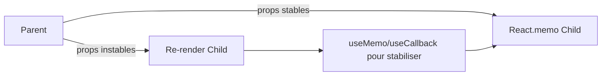
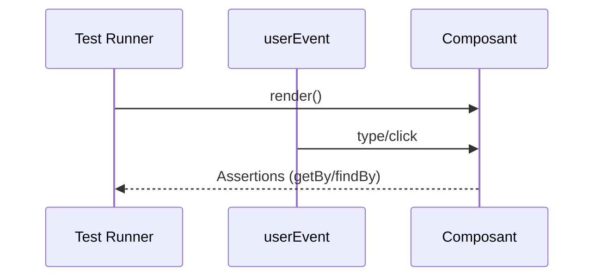

# ⚡ **Chapitre 8 — Bonnes pratiques & Optimisation**

> 🎯 **Objectif** : Apprendre à écrire du **code React efficace et fiable** : clés pour les listes, **mémoïsation** (`React.memo`, `useCallback`, `useMemo`), **profiling**, **pièges courants**, et **tests unitaires** avec **Jest** + **React Testing Library**.

---

## 🧩 1) Clés pour les listes (keys) — fondements de la reconciliation

### 📚 Définition
Une **key** est une **étiquette unique et stable** pour chaque élément d’une **liste**. Elle aide React à **associer** les éléments avant/après un rendu et à **appliquer seulement les différences**.

### 🤔 Pourquoi des keys stables ?
- **Précision** de la **reconciliation** (moins de DOM mutations).
- **Préservation** de l’**état local** des éléments (inputs, focus).

### ❗ À éviter
- Utiliser l’**index** du tableau comme key pour des listes **dynamiques** (insertions/suppressions/mutations).

### 🔧 Exemple : bon vs mauvais
```jsx
// ❌ Mauvais: keys instables
{items.map((it, idx) => (
  <li key={idx}>{it.label}</li>
))}

// ✅ Bon: key stable (id unique)
{items.map((it) => (
  <li key={it.id}>{it.label}</li>
))}
```

---

## 🧠 2) Mémoïsation : `React.memo`, `useCallback`, `useMemo`

### 📚 Définitions
- **`React.memo(Component)`** : mémorise le **résultat** du rendu d’un **composant fonctionnel** et **évite** de le re-rendre si **ses props n’ont pas changé** (comparaison **shallow**).
- **`useCallback(fn, deps)`** : renvoie une **référence stable** de la **fonction** entre les rendus si les **dépendances** n’ont pas changé.
- **`useMemo(factory, deps)`** : mémorise le **résultat** d’un **calcul** coûteux si les **dépendances** n’ont pas changé.

### 🤔 Pourquoi les utiliser ?
- **Réduire** les **re-rendus** inutiles.
- **Stabiliser** des **références** passées en props.
- **Éviter** des **calculs** répétés coûteux.

### 🧩 Analogie
Pensez à un **tampon de cache** : si l’entrée n’a pas changé, on **réutilise** le **résultat** précédent au lieu de recalculer ou re-peindre.

### 🔧 Exemple combiné
```jsx
import React, { useCallback, useMemo } from 'react';

const Row = React.memo(function Row({ item, onSelect }) {
  console.log('render Row', item.id);
  return (
    <li>
      <button onClick={() => onSelect(item.id)}>{item.label}</button>
    </li>
  );
});

export default function List({ items }) {
  const expensive = useMemo(() => items.reduce((a, b) => a + b.value, 0), [items]);
  const handleSelect = useCallback((id) => {
    // ... logique de sélection
  }, []);

  return (
    <section>
      <p>Total: {expensive}</p>
      <ul>
        {items.map((it) => (
          <Row key={it.id} item={it} onSelect={handleSelect} />
        ))}
      </ul>
    </section>
  );
}
```

### ⚠️ Pièges
- **Sur-mémoïsation** : ajouter `useMemo`/`useCallback` partout peut **complexifier** sans gain.
- **Comparaison shallow** : si une prop est un **objet/array recréé** à chaque rendu, `React.memo` ne suffit → **stabiliser** la prop (`useMemo`).

---

## 🧮 3) Mesurer et raisonner — petite formule JS

> 🧠 **Idée pédagogique** : estimer le **coût** d’un composant en fonction du **temps de rendu** et du **nombre de rendus**.
```js
// Coût approximatif: coût_total = temps_par_rendu_ms * nb_rendus
function coutTotal(tempsMsParRendu, nbRendus) {
  return tempsMsParRendu * nbRendus;
}

// Gain de mémoïsation (si on évite k rendus sur n)
function gainMemo(tempsMsParRendu, n, k) {
  return tempsMsParRendu * k; // ms économisées
}

console.log(coutTotal(4, 120));    // 480 ms
console.log(gainMemo(4, 120, 40)); // 160 ms économisées
```

---

## 🧭 4) Profiling et observation

### 🧰 Outils
- **React DevTools** (onglet **Profiler**) pour **mesurer** les rendus et identifier les **points chauds**.
- **Console**/logs contrôlés (`console.time`, `console.timeEnd`) pour mesurer des **calculs**.

### 🔧 Exemple de profilage ciblé
```jsx
function Heavy({ data }) {
  console.time('heavy');
  const res = data.map(/* ...calcul... */);
  console.timeEnd('heavy');
  return <div>{res.length}</div>;
}
```

---

## ❌ 5) Pièges de performance courants

- **Keys instables** (`index` comme key sur listes dynamiques) ➜ *perte d’état*, *DOM inutilement remplacé*.
- **Calculs lourds dans le rendu** (sans `useMemo`) ➜ *blocage UI*.
- **Props instables** (objets/arrays/fonctions recréés) ➜ *re-rendus en cascade*.
- **État placé trop haut** ➜ *trop de consommateurs re-rendus*. **Co-localiser** l’état.
- **Contexte unique massif** ➜ *propagation coûteuse*. **Context par domaine** + **mémoïsation**.
- **Effets qui déclenchent re-rendu en boucle** (deps manquantes) ➜ cf. **Chapitre 4**.

---

## 🧱 6) Patterns d’optimisation

### ✅ Co-localiser l’état
Mettre l’état **au plus près** du composant qui en a besoin.

### ✅ Découper en sous-composants
Isoler la partie qui **change** ; mémoïser le reste.

### ✅ Virtualiser les longues listes
Utiliser la **virtualisation** (ex. `react-window`) pour **afficher seulement** les éléments visibles.

### ✅ Initialisation paresseuse de `useState`
```jsx
const [data, setData] = useState(() => expensiveInit()); // appelle la fonction 1 seule fois
```

### ✅ `startTransition` pour les mises à jour non urgentes
```jsx
import { startTransition } from 'react';
startTransition(() => {
  // mise à jour qui peut être différée (filtrage lourd, navigation)
});
```

---

## 🧪 7) Tests unitaires — Jest + React Testing Library

### 🎯 Principes
- Tester **le comportement observable** (texte, rôles, interactions) **plutôt que l’implémentation**.
- Préférer des **queries accessibles** (`getByRole`, `getByLabelText`).

### 📦 Installation (indicative)
```
npm i -D jest babel-jest @testing-library/react @testing-library/jest-dom @testing-library/user-event
```

### ⚙️ Config minimale
**`package.json`**
```json
{
  "scripts": { "test": "jest" }
}
```

**`jest.config.js`** (projet Babel)
```js
module.exports = {
  testEnvironment: 'jsdom',
  setupFilesAfterEnv: ['<rootDir>/setupTests.js']
};
```

**`setupTests.js`**
```js
import '@testing-library/jest-dom';
```

### 🔧 Exemple de test (compteur)
```jsx
// Counter.jsx
import { useState } from 'react';
export default function Counter() {
  const [n, setN] = useState(0);
  return (
    <div>
      <p>Valeur: {n}</p>
      <button onClick={() => setN(n + 1)}>+1</button>
    </div>
  );
}
```

```jsx
// Counter.test.jsx
import { render, screen } from '@testing-library/react';
import userEvent from '@testing-library/user-event';
import Counter from './Counter';

test('incrémente la valeur au clic', async () => {
  render(<Counter />);
  const btn = screen.getByRole('button', { name: '+1' });
  await userEvent.click(btn);
  expect(screen.getByText(/Valeur: 1/)).toBeInTheDocument();
});
```

### 🔧 Test formulaire (asynchrone)
```jsx
// Login.jsx
import { useState } from 'react';
export default function Login({ onSubmit }) {
  const [email, setEmail] = useState('');
  const [pwd, setPwd] = useState('');
  const [error, setError] = useState(null);
  async function handle(e) {
    e.preventDefault();
    if (!email.includes('@')) return setError('Email invalide');
    setError(null);
    await onSubmit({ email, pwd });
  }
  return (
    <form onSubmit={handle} noValidate>
      <label htmlFor="e">Email</label>
      <input id="e" value={email} onChange={e=>setEmail(e.target.value)} />
      <label htmlFor="p">Mot de passe</label>
      <input id="p" type="password" value={pwd} onChange={e=>setPwd(e.target.value)} />
      {error && <p role="alert">{error}</p>}
      <button type="submit">Se connecter</button>
    </form>
  );
}
```

```jsx
// Login.test.jsx
import { render, screen } from '@testing-library/react';
import userEvent from '@testing-library/user-event';
import Login from './Login';

test('valide et appelle onSubmit', async () => {
  const user = userEvent.setup();
  const spy = jest.fn(async () => {});
  render(<Login onSubmit={spy} />);

  await user.type(screen.getByLabelText('Email'), 'eric@example.com');
  await user.type(screen.getByLabelText('Mot de passe'), 'secret123');
  await user.click(screen.getByRole('button', { name: 'Se connecter' }));

  expect(screen.queryByRole('alert')).toBeNull();
  expect(spy).toHaveBeenCalledWith({ email: 'eric@example.com', pwd: 'secret123' });
});
```

### ✅ Bonnes pratiques de test
- Utiliser `userEvent` pour **simuler des interactions réalistes** (clavier, clic, tab).
- Préférer `findBy...` pour des **résultats asynchrones** (chargements, API).
- Éviter les **snapshots** massifs pour l’UI dynamique.

---

## 🧭 8) Schémas Mermaid

### Flux de mémoïsation et props


### Cycle test utilisateur


---

## 🧪 9) Exercices d’optimisation

1. **Listes longues** : remplacez des keys `index` par des `id` et mesurez la différence au profiling.
2. **Composants lourds** : encapsulez un calcul dans `useMemo` et comparez le temps.
3. **Props instables** : stabilisez un callback avec `useCallback` et observez l’impact sur les enfants mémoïsés.
4. **Tests** : écrivez un test RTL pour un formulaire avec validation et soumission asynchrone.

---

## ✅ Bonnes pratiques récap
- Des **keys stables** pour des listes fiables.
- Utiliser **`React.memo`** pour éviter des **re-rendus** ; **stabiliser** les **props** avec `useMemo`/`useCallback` si nécessaire.
- **Mesurer avant d’optimiser** (Profiler, console).
- **Co-localiser** l’état et **découper** les composants.
- Tester l’**UI observable** avec **RTL** et des **queries accessibles**.

---

## 🧾 **Résumé des points essentiels (Chapitre 8)**

- Les **keys** pilotent la **reconciliation** ; éviter `index` pour des listes dynamiques.
- La **mémoïsation** (`React.memo`, `useMemo`, `useCallback`) **réduit les re-rendus** et **stabilise** les références.
- Les **pièges courants** incluent props instables, calculs lourds dans le rendu, contexte massif.
- Les **tests** avec **Jest + RTL** valident le **comportement utilisateur** realiste.

---

## ✅ **Checklist de fin de chapitre**

- [ ] Je sais choisir des **keys** stables.
- [ ] J’emploie **`React.memo`** et je **stabilise** les props si besoin.
- [ ] Je mesure les performances avant d’optimiser.
- [ ] Je sais écrire des **tests RTL** pour interactions et validations.

---

> ⏭️ **Prochain chapitre** : [[Chapitre 9 - Déploiement]]
