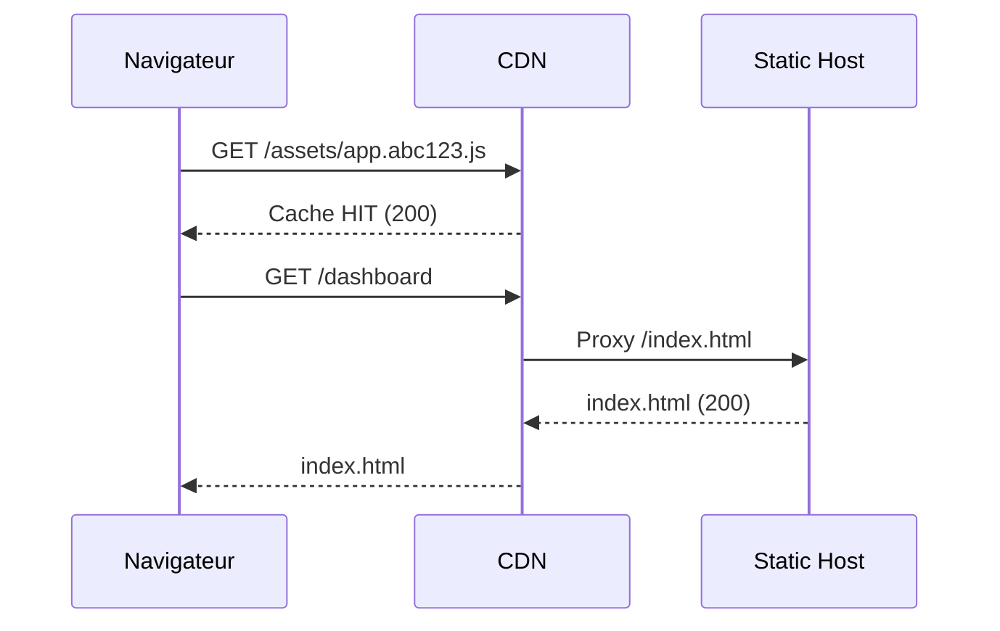

# 🚀 **Chapitre 9 — Déploiement**

> 🎯 **Objectif** : Savoir **construire le build de production**, configurer les **variables d’environnement**, gérer les **redirections SPA**, déployer sur **Netlify** et **Vercel**, mettre en place une **CI/CD**, et appliquer les **optimisations** indispensables pour la production (code splitting, caching, images, sécurité). 

---

## 🧰 1) Pré-requis et build de production

### 📦 Outils
- **Node.js + npm/yarn** (version LTS recommandée)
- **Vite** (ou CRA legacy) — nous utiliserons **Vite** par défaut.

### 🔧 Commandes de build
```bash
# Installation des dépendances
npm install

# Build de production
npm run build
```

> Le build **Vite** génère un dossier `dist/` avec **minification**, **tree-shaking**, **hashing** des fichiers (`app.abc123.js`) pour faciliter le **cache busting**.

---

## 🔐 2) Variables d’environnement (prod)

### 🧭 Fichiers `.env`
- `.env` (général)
- `.env.development`
- `.env.production`

### 📄 Utilisation avec Vite
Les variables doivent **commencer par** `VITE_` pour être **exposées au client**.
```js
// Exemple
console.log(import.meta.env.VITE_API_URL);
```

> ⚠️ Les **secrets** ne doivent **pas** être exposés côté client. Utiliser un **backend** ou des **fonctions serverless** pour les opérations sensibles.

---

## 🔄 3) SPA et redirections (fallback)

Une SPA doit **rediriger** toutes les routes vers `index.html` pour que **React Router** résolve la page côté client.

### 🔧 Netlify (`netlify.toml`)
```toml
[[redirects]]
  from = "/*"
  to = "/index.html"
  status = 200
```

### 🔧 Vercel (`vercel.json`)
```json
{
  "rewrites": [{ "source": "/(.*)", "destination": "/index.html" }]
}
```

---

## 🌐 4) Déployer sur **Netlify**

### 🚀 Méthode 1 : connecteur Git (UI Netlify)
1. Créez un site sur Netlify et **connectez** votre dépôt GitHub.
2. **Build command** : `npm run build`  
   **Publish directory** : `dist`
3. Configurez les **variables d’environnement** dans **Site Settings → Environment variables**.

### 🧰 Méthode 2 : CLI Netlify
```bash
npm i -g netlify-cli
netlify login
netlify init             # associer le site
netlify deploy --build   # build + déploiement
netlify deploy --prod    # déploiement en production
```

### ✅ Points clés Netlify
- Fichier **`netlify.toml`** pour redirections et headers.
- **Préviews** automatiques sur les **pull requests**.

---

## ☁️ 5) Déployer sur **Vercel**

### 🚀 Méthode 1 : connecteur Git (UI Vercel)
1. Importez votre projet depuis GitHub/GitLab.
2. **Framework** : *Other* (ou *Vite* détecté).  
   **Build command** : `npm run build`  
   **Output** : `dist`
3. Ajoutez vos **env vars** dans **Settings → Environment Variables** (Development/Preview/Production).

### 🧰 Méthode 2 : CLI Vercel
```bash
npm i -g vercel
vercel           # premier déploiement (preview)
vercel --prod    # déploiement en production
```

### ✅ Points clés Vercel
- **Preview** par branche/PR avec **URLs uniques**.
- Fichier **`vercel.json`** pour **rewrites** et **headers**.

---

## 🤖 6) CI/CD (intégration et déploiement continus)

### 🔧 Pipeline GitHub Actions (build + artefact)
```yaml
# .github/workflows/build.yml
name: build
on:
  push:
    branches: [ main ]
jobs:
  build:
    runs-on: ubuntu-latest
    steps:
      - uses: actions/checkout@v4
      - uses: actions/setup-node@v4
        with: { node-version: 'lts/*' }
      - run: npm ci
      - run: npm run build
      - uses: actions/upload-artifact@v4
        with:
          name: dist
          path: dist
```

> Pour **Netlify**/**Vercel**, il est généralement **inutile** de pousser l’artefact : la **plateforme reconstruit** à partir du dépôt. Connectez votre repo pour des **déploiements automatiques**.

### 🧭 Schéma CI/CD


---

## ⚙️ 7) Optimisation production (frontend)

### 🧩 Code splitting & lazy loading
- `React.lazy` + `Suspense` pour charger **à la demande**.
- Import **dynamiques** : `import('./module')`.

### 🧠 Caching & hash filenames
- Fichiers versionnés (`app.abc123.js`) pour **cache busting**.
- **Cache-Control** long sur assets statiques (`max-age`, `immutable`).

### 🖼️ Images et assets
- Préférer **WebP/AVIF**; servir des **tailles adaptées**.
- **`<link rel="preload">`** pour les ressources critiques.

### 🧪 Mesurer (Lighthouse, Web Vitals)
- Auditer avec **Lighthouse** (Performance/Best Practices/SEO/Accessibility).
- Capturer **Web Vitals** via la lib `web-vitals`.

```js
import { onCLS, onFID, onLCP } from 'web-vitals';
onCLS(console.log); onFID(console.log); onLCP(console.log);
```

### 🧱 CSS & JS
- **Minification** et **purge** de CSS inutilisé (outils post-build).
- Éviter les **librairies lourdes**; préférer alternatives **light**.

---

## 🛡️ 8) Sécurité et headers

### 🔧 Netlify (`netlify.toml`)
```toml
[[headers]]
  for = "/*"
  [headers.values]
    Content-Security-Policy = "default-src 'self'; img-src 'self' data: https:; script-src 'self'; style-src 'self' 'unsafe-inline'"
    Strict-Transport-Security = "max-age=63072000; includeSubDomains; preload"
    X-Content-Type-Options = "nosniff"
    Referrer-Policy = "no-referrer-when-downgrade"
```

### 🔧 Vercel (`vercel.json`)
```json
{
  "headers": [
    {
      "source": "/(.*)",
      "headers": [
        { "key": "X-Content-Type-Options", "value": "nosniff" },
        { "key": "Strict-Transport-Security", "value": "max-age=63072000; includeSubDomains; preload" }
      ]
    }
  ]
}
```

> ⚠️ Adapter **CSP** selon les **dépendances** (fonts, analytics). Tester en **mode strict** avant production.

---

## 📊 9) Observabilité post-déploiement

- **Logs** (console, monitoring serveur si API).
- **Erreurs** client : capturer via `window.onerror` ou services externes.
- **Trafic & CDN** : dashboard Netlify/Vercel.

---

## 🧮 10) Petites formules JS utiles

### ⏱️ Estimation du temps de téléchargement
```js
// temps (ms) ≈ (taille_octets / bande_passante_octets_par_ms)
function dlTimeMs(bytes, bandwidthBytesPerMs) { return Math.round(bytes / bandwidthBytesPerMs); }
console.log(dlTimeMs(500_000, 50)); // ~10000 ms (10 s)
```

### 📦 TTL de cache simplifié
```js
// TTL (s) ≈ base * (1 - prob_de_changement)
function ttl(baseSeconds, changeProbability) { return Math.round(baseSeconds * (1 - changeProbability)); }
console.log(ttl(86400, 0.2)); // ~69120 s
```

---

## 🧭 11) Schémas Mermaid

### Flux requête SPA derrière CDN


### Architecture déploiement
```mermaid
flowchart LR
  A[Repo Git] --> B[Platform (Netlify/Vercel)]
  B --> C[Build Vite]
  C --> D[CDN]
  D --> E[Users]
```

---

## 🧪 12) Exercices

1. **Netlify** : configurez `netlify.toml` (redirects + headers), déployez via **connecteur Git**.
2. **Vercel** : ajoutez un `vercel.json` avec **rewrites** et **headers**, déployez via **CLI**.
3. **Mesures** : lancez **Lighthouse** et **Web Vitals**, notez les scores avant/après **lazy loading**.
4. **CI/CD** : créez un workflow GitHub Actions qui build et lance les tests.

---

## ✅ Bonnes pratiques récap
- **Build** propre (`npm run build`) et artefacts **hashés**.
- **Variables d’environnement** sécurisées (ne pas exposer les **secrets**).
- **Redirects SPA** pour toutes les routes.
- **Optimisations** : code splitting, caching, images adaptées.
- **Headers** de sécurité adaptés ; auditer avec **Lighthouse**.
- **CI/CD** automatique pour fiabilité.

---

## 🧾 **Résumé des points essentiels (Chapitre 9)**

- Construire un **build de production** avec **Vite** (minification, hashing, tree-shaking).
- Configurer les **env vars** par **environnement** et protéger les **secrets**.
- Déployer sur **Netlify/Vercel** avec **redirects SPA** et **headers**.
- Mettre en place une **CI/CD** et **mesurer/optimiser** la performance.
- Surveiller la **sécurité** et l’**observabilité** après déploiement.

---

## ✅ **Checklist de fin de chapitre**

- [ ] J’ai un **build** fonctionnel dans `dist/`.
- [ ] Mes **env vars** sont configurées et sécurisées.
- [ ] Mes **routes SPA** redirigent vers `index.html`.
- [ ] Mon site est **déployé** sur Netlify/Vercel.
- [ ] J’ai mesuré la **performance** (Lighthouse, Web Vitals).
- [ ] Ma chaîne **CI/CD** fonctionne.

---

> 🧭 **Cours terminé (base)**. Tu peux revenir à [[index]] pour naviguer et compléter/approfondir.
