# 🧱 **Chapitre 4 — Les Objets 3D**

> 👨‍🏫 *Objectif :* maîtriser la création et la manipulation des **objets 3D** dans Three.js : 
> géométries (simples et avancées), matériaux (du basique au PBR), **mesh** (composition forme+apparence), 
> transformations (position, rotation, quaternion, échelle), **hiérarchie (scene graph)**, **instancing** pour la performance, 
> et **bounding volumes/frustum culling**. Vous partirez avec un **exemple complet** et des exercices progressifs.

---

## 🧩 1. Panorama des objets 3D

- **📘 Définition**
  - **`THREE.Mesh`** : objet **solide** rendu à partir d’une *géométrie* et d’un *matériau*.
  - **`THREE.Line` / `THREE.LineSegments`** : lignes (fils), utiles pour wireframes et helpers.
  - **`THREE.Points`** : nuages de points (particules).
  - **`THREE.Group`** : conteneur de nœuds (hiérarchie, parentage).

- **❓ Pourquoi ces classes ?**
  - Elles couvrent les **besoins usuels** : solides réalistes, lignes techniques, effets particulaires, et organisation de scène.

- **🔶 Analogie**
  - Pensez à une **maquette** : des **volumes** (Mesh), des **arêtes** (Line), des **points de repère** (Points), et des **boîtes** pour organiser (Group).

---

## 📐 2. Géométries : des primitives aux géométries sur mesure

### 2.1 Primitives courantes

- **BoxGeometry** `new THREE.BoxGeometry(w, h, d, ws, hs, ds)`
- **SphereGeometry** `new THREE.SphereGeometry(r, wSeg, hSeg)`
- **PlaneGeometry** `new THREE.PlaneGeometry(w, h, wSeg, hSeg)`
- **CylinderGeometry**, **ConeGeometry**, **TorusGeometry**, **TorusKnotGeometry**
- **CircleGeometry**, **RingGeometry**, **TubeGeometry**, **LatheGeometry**
- **Polyhedra** : `Icosahedron`, `Octahedron`, `Dodecahedron`, `Tetrahedron`

> ℹ️ Les *segments* contrôlent la finesse : plus de segments = plus de triangles = **plus beau mais plus coûteux**.

**Exemple**
```js
const box = new THREE.BoxGeometry(1, 1, 1, 1, 1, 1); // cube simple
const sphere = new THREE.SphereGeometry(0.75, 32, 16); // sphère lisse
```

### 2.2 `BufferGeometry` : aller au cœur des données

- **📘 Définition**
  - Structure de bas niveau qui stocke des **attributs** (typed arrays) : `position`, `normal`, `uv`, `color`, etc., et éventuellement un **index** (faces réutilisées).

- **❓ Pourquoi ?**
  - Contrôle **fin** sur la forme, indispensable pour géométries générées procéduralement, import de données, **optimisation mémoire**.

- **🔶 Analogie**
  - Comme un **tableur** : chaque colonne = un attribut (positions, normales…), chaque ligne = un **sommet**.

#### Créer un triangle à la main
```js
const positions = new Float32Array([
  // 3 sommets (x,y,z)
   0, 0, 0,
   1, 0, 0,
   0, 1, 0
]);
const geometry = new THREE.BufferGeometry();
geometry.setAttribute('position', new THREE.BufferAttribute(positions, 3));

// Calcul des normales via produit vectoriel
const a = new THREE.Vector3(0,0,0);
const b = new THREE.Vector3(1,0,0);
const c = new THREE.Vector3(0,1,0);
const ab = b.clone().sub(a);
const ac = c.clone().sub(a);
const normal = new THREE.Vector3().crossVectors(ab, ac).normalize();

const normals = new Float32Array([
  normal.x, normal.y, normal.z,
  normal.x, normal.y, normal.z,
  normal.x, normal.y, normal.z,
]);
geometry.setAttribute('normal', new THREE.BufferAttribute(normals, 3));

const material = new THREE.MeshStandardMaterial({ color: 0xff8844 });
const triangle = new THREE.Mesh(geometry, material);
scene.add(triangle);
```

#### Indices (réutiliser des sommets)
```js
// Carré composé de 2 triangles avec index
const positions = new Float32Array([
  -1, -1, 0,
   1, -1, 0,
   1,  1, 0,
  -1,  1, 0,
]);
const indices = new Uint16Array([
  0, 1, 2,  // premier triangle
  0, 2, 3   // deuxième triangle
]);
const geo = new THREE.BufferGeometry();
geo.setAttribute('position', new THREE.BufferAttribute(positions, 3));
geo.setIndex(new THREE.BufferAttribute(indices, 1));
geo.computeVertexNormals(); // calcule les normales automatiquement
```

#### Attributs UV & couleurs de sommets
```js
// UV pour texturer (0..1)
const uvs = new Float32Array([
  0,0, 1,0, 1,1, 0,1
]);
geo.setAttribute('uv', new THREE.BufferAttribute(uvs, 2));

// Couleurs par sommet
const colors = new Float32Array([
  1,0,0,  0,1,0,  0,0,1,  1,1,0 // RGBA non, ici RGB ; 4 sommets
]);
geo.setAttribute('color', new THREE.BufferAttribute(colors, 3));
const mat = new THREE.MeshStandardMaterial({ vertexColors: true });
```

### 2.3 Géométrie paramétrique

- **Principe** : définir une fonction `(u,v) -> (x,y,z)`.
```js
function surface(u, v, target) {
  // u,v in [0,1]
  const R = 1.0;
  const theta = u * 2*Math.PI;
  const phi = (v - 0.5) * Math.PI; // -pi/2..pi/2
  const x = R * Math.cos(theta) * Math.cos(phi);
  const y = R * Math.sin(phi);
  const z = R * Math.sin(theta) * Math.cos(phi);
  target.set(x, y, z);
}
const paramGeo = new THREE.ParametricGeometry(surface, 64, 32);
```

---

## 🎨 3. Matériaux : apparence et lumière

### 3.1 Familles de matériaux

- **`MeshBasicMaterial`** : *non éclairé* (couleur fixe) — utile pour UI et debug.
- **`MeshLambertMaterial`** : éclairage diffus (Lambert) — simple, peu coûteux.
- **`MeshPhongMaterial`** : ajout de spéculaire (reflets) — plus brillant.
- **`MeshStandardMaterial`** : **PBR** (roughness/metalness) — réaliste et recommandé.
- **`MeshPhysicalMaterial`** : PBR avancé (clearcoat, transmission…).
- **`MeshToonMaterial`** : rendu cartoon (bandes de tons).
- **`MeshMatcapMaterial`** : shading via texture *matcap* (rapide, sans lumière).
- **Spécifiques** : `PointsMaterial`, `LineBasicMaterial`, `LineDashedMaterial`.

### 3.2 Propriétés courantes

- `color`, `emissive`, `roughness`, `metalness`
- `map`, `normalMap`, `roughnessMap`, `metalnessMap`, `aoMap`, `envMap`
- `transparent`, `opacity`, `side` (Front/Back/Double)
- `wireframe`, `vertexColors`, `depthTest`, `depthWrite`, `blending`

**Exemples**
```js
const matBasic = new THREE.MeshBasicMaterial({ color: 0x2194f3, wireframe: false });
const matPhong = new THREE.MeshPhongMaterial({ color: 0xffcc00, shininess: 60, specular: 0x222222 });
const matStd   = new THREE.MeshStandardMaterial({ color: 0x88c0d0, roughness: 0.5, metalness: 0.2 });
```

- **❓ Pourquoi PBR (Standard/Physical) ?**
  - Meilleure **cohérence** visuelle, interactions crédibles avec la lumière, **compatibilité** avec assets modernes (GLTF).

### 3.3 Côté face et transparence
```js
const matDouble = new THREE.MeshStandardMaterial({ color: 0xffffff, side: THREE.DoubleSide, transparent: true, opacity: 0.6 });
```

> 💡 Les doubles faces peuvent **coûter** en perf (deux faces dessinées) et créer des artefacts de profondeur — utilisez avec discernement.

---

## 🧠 4. Mesh = Géométrie + Matériau

- **📘 Définition** : `new THREE.Mesh(geometry, material)` → objet **rendu**.
- **❓ Pourquoi ?** Séparer **forme** et **apparence** : réutiliser une même géométrie avec plusieurs matériaux ; réduire la mémoire.

**Exemple**
```js
const geometry = new THREE.BoxGeometry(1,1,1);
const material = new THREE.MeshStandardMaterial({ color: 0x00c853 });
const cube = new THREE.Mesh(geometry, material);
scene.add(cube);
```

---

## 🔧 5. Transformations : position, rotation (Euler & quaternion), échelle

### 5.1 Position & échelle
```js
mesh.position.set(1.5, 0.25, -2.0);
mesh.scale.set(1.0, 2.0, 0.5);
```

### 5.2 Rotation (Euler)

- **Ordre des axes** (`mesh.rotation.order = 'XYZ'` par défaut) : l’ordre impacte le résultat.
```js
mesh.rotation.x = Math.PI / 4; // 45°
mesh.rotation.y = Math.PI / 6; // 30°
```

### 5.3 Quaternion (évite l’**effet de cardan**)

- **📘 Définition** : représentation de rotation sans singularité (`THREE.Quaternion`).
- **Formules JS (axe-angle → quaternion)**
```js
function quatFromAxisAngle(axis, angle) {
  const s = Math.sin(angle/2);
  return new THREE.Quaternion(axis.x*s, axis.y*s, axis.z*s, Math.cos(angle/2));
}
const axis = new THREE.Vector3(0,1,0);
const q = quatFromAxisAngle(axis.normalize(), Math.PI/4);
mesh.quaternion.multiply(q); // compose la rotation
```

- **Formules JS (Euler → quaternion)**
```js
function quatFromEuler(x, y, z, order = 'XYZ') {
  const cx = Math.cos(x/2), sx = Math.sin(x/2);
  const cy = Math.cos(y/2), sy = Math.sin(y/2);
  const cz = Math.cos(z/2), sz = Math.sin(z/2);
  let qx = new THREE.Quaternion(sx, 0, 0, cx);
  let qy = new THREE.Quaternion(0, sy, 0, cy);
  let qz = new THREE.Quaternion(0, 0, sz, cz);
  const mult = (a,b)=> new THREE.Quaternion(
    a.x*b.w + a.w*b.x + a.y*b.z - a.z*b.y,
    a.y*b.w + a.w*b.y + a.z*b.x - a.x*b.z,
    a.z*b.w + a.w*b.z + a.x*b.y - a.y*b.x,
    a.w*b.w - a.x*b.x - a.y*b.y - a.z*b.z
  );
  let q = new THREE.Quaternion(0,0,0,1);
  for (const c of order) q = mult(q, c==='X'?qx: c==='Y'?qy:qz);
  return q;
}
```

### 5.4 Pivot & hiérarchie

- Déplacer le **pivot** en utilisant un **`THREE.Group`** parent.
```js
const pivot = new THREE.Group();
pivot.position.set(0, 0, 0);
pivot.add(mesh); // mesh tourne autour du pivot
scene.add(pivot);
```

---

## 🌳 6. Scene graph (hiérarchie) : local vs monde

- **📘 Définition** : chaque objet a une **transformation locale** (par rapport au parent). La transformation **monde** est la composition parent → enfant.
- **❓ Pourquoi ?** Permet de **lier** des parties (ex. bras et avant-bras), déplacer/rotations **cohérentes**.

**Schéma (Mermaid)**

```mermaid
flowchart TD
  A[Scene] --> B[Group: Bras]
  B --> C[Mesh: Épaule]
  B --> D[Group: Avant-bras]
  D --> E[Mesh: Coude]
  D --> F[Mesh: Main]
```


**Exemple**
```js
const arm = new THREE.Group();
const shoulder = new THREE.Mesh(new THREE.BoxGeometry(0.4,0.8,0.4), new THREE.MeshStandardMaterial());
const forearm = new THREE.Group();
const elbow = new THREE.Mesh(new THREE.SphereGeometry(0.2, 16, 16), new THREE.MeshStandardMaterial());
const hand = new THREE.Mesh(new THREE.BoxGeometry(0.3,0.2,0.5), new THREE.MeshStandardMaterial());
forearm.add(elbow, hand);
arm.add(shoulder, forearm);
scene.add(arm);
```

---

## 📏 7. Bounding volumes & frustum culling

- **📘 Définition**
  - **Bounding box/sphere** : volumes englobants simplifiés.
  - **Frustum culling** : ne pas dessiner les objets **hors caméra**.

- **❓ Pourquoi ?** 
  - Réduit les **draw calls** et améliore la **performance**.

**Exemples**
```js
geometry.computeBoundingBox();
geometry.computeBoundingSphere();

// Désactiver temporairement l'object
mesh.visible = false;
```

> ℹ️ Three.js effectue déjà un culling basique sur la **bounding sphere**. Des géométries dynamiques peuvent nécessiter de **recalculer**.

---

## ⚡ 8. Performance : `InstancedMesh`

- **📘 Définition** : dessiner **N** instances d’une **même géométrie + matériau** avec **1 draw call**.
- **❓ Pourquoi ?** Essentiel pour **grands nombres** d’objets (forêt d’arbres, particules solides…).

**Exemple : grille de cubes instanciés**
```js
const count = 1000;
const geometry = new THREE.BoxGeometry(0.2, 0.2, 0.2);
const material = new THREE.MeshStandardMaterial({ color: 0x66bb6a });
const instanced = new THREE.InstancedMesh(geometry, material, count);

const dummy = new THREE.Object3D();
let i = 0;
for (let x = -10; x <= 10; x++) {
  for (let z = -10; z <= 10; z++) {
    dummy.position.set(x*0.3, 0, z*0.3);
    dummy.rotation.y = (x+z) * 0.1;
    dummy.scale.set(1, 1, 1);
    dummy.updateMatrix();
    instanced.setMatrixAt(i++, dummy.matrix);
  }
}
instanced.instanceMatrix.needsUpdate = true;
scene.add(instanced);
```

> 🔍 On peut aussi définir des **couleurs par instance** (`setColorAt`) et les lire en shader.

---

## 🧰 9. Helpers utiles

```js
const axes = new THREE.AxesHelper(2); // X rouge, Y vert, Z bleu
const grid = new THREE.GridHelper(10, 10);
scene.add(axes, grid);
```

---

## 🧪 10. Exemple guidé : scène d’objets variés

> 🎯 *But :* comparer **plusieurs géométries** et **matériaux** dans une même scène, avec helpers et rotation animée.

### Variante CDN
```html
<!DOCTYPE html>
<html lang=\"fr\">
<head>
  <meta charset=\"UTF-8\" />
  <meta name=\"viewport\" content=\"width=device-width, initial-scale=1.0\" />
  <title>Three.js — Objets 3D</title>
  <style> html, body { margin:0; height:100%; } canvas { display:block; } </style>
</head>
<body>
<script src=\"https://unpkg.com/three@latest/build/three.min.js\"></script>
<script>
  const scene = new THREE.Scene();
  scene.background = new THREE.Color(0x0f0f13);
  const camera = new THREE.PerspectiveCamera(60, innerWidth/innerHeight, 0.1, 100);
  camera.position.set(0, 1.5, 5);

  const renderer = new THREE.WebGLRenderer({ antialias:true });
  renderer.setSize(innerWidth, innerHeight);
  renderer.setPixelRatio(Math.min(devicePixelRatio, 2));
  renderer.shadowMap.enabled = true;
  document.body.appendChild(renderer.domElement);

  const axes = new THREE.AxesHelper(2);
  const grid = new THREE.GridHelper(10, 10);
  scene.add(axes, grid);

  const light = new THREE.DirectionalLight(0xffffff, 1.1);
  light.position.set(2, 3, 2);
  light.castShadow = true;
  scene.add(light);

  const gPlane = new THREE.Mesh(new THREE.PlaneGeometry(10,10), new THREE.MeshStandardMaterial({ color:0x1b1b29 }));
  gPlane.rotation.x = -Math.PI/2; gPlane.position.y = -0.6; gPlane.receiveShadow = true; scene.add(gPlane);

  const matStd = new THREE.MeshStandardMaterial({ color:0x2194f3, roughness:0.5, metalness:0.2 });
  const matPhong = new THREE.MeshPhongMaterial({ color:0xffcc00, shininess:60, specular:0x222222 });
  const matBasic = new THREE.MeshBasicMaterial({ color:0xffffff, wireframe:true });

  const cube = new THREE.Mesh(new THREE.BoxGeometry(1,1,1), matStd); cube.position.set(-1.5,0,0); cube.castShadow = true; scene.add(cube);
  const sphere = new THREE.Mesh(new THREE.SphereGeometry(0.7,32,16), matPhong); sphere.position.set(0,0,0); sphere.castShadow = true; scene.add(sphere);
  const torus = new THREE.Mesh(new THREE.TorusGeometry(0.5,0.2,16,64), matBasic); torus.position.set(1.5,0,0); scene.add(torus);

  const clock = new THREE.Clock();
  function animate() {
    const dt = Math.min(clock.getDelta(), 0.05);
    cube.rotation.y += 0.8*dt;
    sphere.rotation.y += 0.6*dt;
    torus.rotation.x += 0.7*dt;
    renderer.render(scene, camera);
    requestAnimationFrame(animate);
  }
  animate();

  addEventListener('resize', ()=>{
    camera.aspect = innerWidth/innerHeight; camera.updateProjectionMatrix();
    renderer.setSize(innerWidth, innerHeight);
    renderer.setPixelRatio(Math.min(devicePixelRatio, 2));
  });
</script>
</body>
</html>
```

### Variante ES Modules
```html
<!DOCTYPE html>
<html lang=\"fr\">
<head>
  <meta charset=\"UTF-8\" />
  <meta name=\"viewport\" content=\"width=device-width, initial-scale=1.0\" />
  <title>Three.js — Objets 3D (Modules)</title>
  <style> html, body { margin:0; height:100%; } canvas { display:block; } </style>
</head>
<body>
<script type=\"module\">
  import * as THREE from 'https://esm.run/three@latest';

  const scene = new THREE.Scene();
  scene.background = new THREE.Color(0x121218);
  const camera = new THREE.PerspectiveCamera(60, innerWidth/innerHeight, 0.1, 100);
  camera.position.set(0, 1.5, 5);

  const renderer = new THREE.WebGLRenderer({ antialias:true });
  renderer.setSize(innerWidth, innerHeight);
  renderer.setPixelRatio(Math.min(devicePixelRatio, 2));
  renderer.shadowMap.enabled = true;
  document.body.appendChild(renderer.domElement);

  const axes = new THREE.AxesHelper(2);
  const grid = new THREE.GridHelper(10, 10);
  scene.add(axes, grid);

  const light = new THREE.DirectionalLight(0xffffff, 1.0);
  light.position.set(2, 3, 2);
  light.castShadow = true;
  scene.add(light);

  const gPlane = new THREE.Mesh(new THREE.PlaneGeometry(10,10), new THREE.MeshStandardMaterial({ color:0x1b1b29 }));
  gPlane.rotation.x = -Math.PI/2; gPlane.position.y = -0.6; gPlane.receiveShadow = true; scene.add(gPlane);

  const matStd = new THREE.MeshStandardMaterial({ color:0x00c853, roughness:0.5, metalness:0.2 });
  const matPhong = new THREE.MeshPhongMaterial({ color:0xff7043, shininess:70, specular:0x222222 });
  const matBasic = new THREE.MeshBasicMaterial({ color:0xffffff, wireframe:true });

  const cube = new THREE.Mesh(new THREE.BoxGeometry(1,1,1), matStd); cube.position.set(-1.5,0,0); cube.castShadow = true; scene.add(cube);
  const sphere = new THREE.Mesh(new THREE.SphereGeometry(0.7,32,16), matPhong); sphere.position.set(0,0,0); sphere.castShadow = true; scene.add(sphere);
  const torus = new THREE.Mesh(new THREE.TorusGeometry(0.5,0.2,16,64), matBasic); torus.position.set(1.5,0,0); scene.add(torus);

  const clock = new THREE.Clock();
  function animate() {
    const dt = Math.min(clock.getDelta(), 0.05);
    cube.rotation.y += 0.8*dt;
    sphere.rotation.y += 0.6*dt;
    torus.rotation.x += 0.7*dt;
    renderer.render(scene, camera);
    requestAnimationFrame(animate);
  }
  animate();

  addEventListener('resize', ()=>{
    camera.aspect = innerWidth/innerHeight; camera.updateProjectionMatrix();
    renderer.setSize(innerWidth, innerHeight);
    renderer.setPixelRatio(Math.min(devicePixelRatio, 2));
  });
</script>
</body>
</html>
```

---

## 🧪 11. Exercices

1. **Créer une géométrie paramétrique** (ex. surface en selle) et l’afficher.
2. **Activer `vertexColors`** sur un mesh et colorer les sommets selon leur hauteur (`y`).
3. **Construire une hiérarchie** (bras/avant-bras) et animer l’articulation avec un quaternion.
4. **Générer 1000 cubes** via `InstancedMesh` et ajouter une **couleur par instance**.
5. **Mesurer l’impact des segments** : augmenter `SphereGeometry(…, 16, 8)` → `64, 32` et observer le FPS.

---

## 🧰 12. Bonnes pratiques

- Réutilisez **géométries** et **matériaux** ; évitez les créations à chaque frame.
- Ajustez la **complexité** (segments) selon l’échelle à l’écran (règle d’or : inutile d’avoir 1M triangles pour un objet minuscule).
- Préférez **`MeshStandardMaterial`** pour cohérence avec les assets PBR (GLTF).
- Utilisez des **helpers** (Axes/Grid) pour rester orienté.
- Exploitez **`InstancedMesh`** pour les scènes avec milliers d’objets.
- Recalculez les **bounding volumes** si vous modifiez la géométrie dynamiquement.

---

## ✅ 13. Résumé des points essentiels (Chapitre 4)

- Les **objets 3D** se déclinent en Mesh, Line, Points et Group.
- Les **géométries** vont des primitives aux `BufferGeometry` sur mesure (attributs `position`, `normal`, `uv`, `color`, index).
- Les **matériaux** contrôlent l’apparence ; **PBR** (Standard/Physical) = plus crédible.
- Un **mesh** = **géométrie** + **matériau** ; manipulateur via **position**, **rotation** (Euler/quaternion), **échelle**.
- La **hiérarchie** (scene graph) permet des mouvements cohérents parent→enfant.
- La **performance** se gagne avec **InstancedMesh**, culling et réutilisation des ressources.

---

## 🔭 14. Prochaines étapes

- **Chapitre 5 : Lumières et Ombres** — types de lumières, configuration des shadows, réglages pour un rendu crédible.

