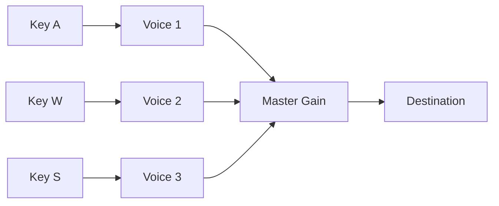

# 📘 03 — Oscillateurs et synthèse de base

> 🎯 **Objectif du chapitre** : Maîtriser `OscillatorNode` (types d’onde, fréquence, détune), le **démarrage/arrêt** précis, les **modulations** (LFO, portamento), l’**enveloppe de volume** (aperçu ADSR), et créer des **formes d’onde personnalisées** avec `PeriodicWave`. Tu sauras aussi gérer une **mini-polyphonie** (clavier) et éviter les principaux pièges.

---

## 🧠 `OscillatorNode` : définition et rôle

- **Définition** : `OscillatorNode` est une **source périodique** de signal audio. Il génère des formes d’onde de base (**sine**, **square**, **sawtooth**, **triangle**) ou une forme personnalisée via `PeriodicWave`.
- **Pourquoi** : C’est la brique **fondamentale** de la synthèse soustractive et additive; il produit la matière première (un signal riche ou simple) que l’on **façonne** avec des enveloppes, filtres et effets.
- **Propriétés clés** :
  - `osc.type` : `'sine' | 'square' | 'sawtooth' | 'triangle' | 'custom'`.
  - `osc.frequency` : **AudioParam** (Hz) — contrôlable et modulable.
  - `osc.detune` : **AudioParam** (cents, 1/100 de demi-ton) — utile pour **chorus**/**battements**.
  - Méthodes : `osc.start(when?)`, `osc.stop(when?)`, `osc.setPeriodicWave(periodicWave)`.

---

## 🧠 Fréquence, détune, transposition (formules JS)

### 🔢 Transposition par demi-tons
```js
// f: fréquence, n: demi-tons (positif: plus aigu, négatif: plus grave)
function transposeHz(baseFreq, semitones) {
  return baseFreq * Math.pow(2, semitones / 12);
}
```

### 🔢 Détune en cents (1200 cents = 12 demi-tons)
```js
function detuneCents(baseFreq, cents) {
  return baseFreq * Math.pow(2, cents / 1200);
}
```

### 🔢 MIDI → Hz (rappel)
```js
function midiToHz(m) { // m: numéro MIDI (A4=69)
  return 440 * Math.pow(2, (m - 69) / 12);
}
```

> 💡 **Astuce** : Pour un **chorus** simple, utilise deux oscillateurs proches: `440 Hz` et `detuneCents(440, +10)`.

---

## 🧪 Démarrage, arrêt et scheduling précis

- **Autoplay Policy** : l’audio doit démarrer suite à un **geste utilisateur** (click, keydown). Utilise `ctx.resume()` avant `start()`.
- **Start/Stop** :
  - `osc.start(time)` : planifie le démarrage à `time` (secondes **dans l’horloge audio**, `ctx.currentTime`).
  - `osc.stop(time)` : arrête **définitivement**. Un `OscillatorNode` **ne peut pas** redémarrer après `stop()` → recrée un node.
- **Exemple** — Note courte programmée :
```js
const ctx = new AudioContext();
const osc = ctx.createOscillator();
const gain = ctx.createGain();
gain.gain.value = 0; // démarrer silencieux (évite clic)
osc.connect(gain).connect(ctx.destination);

const now = ctx.currentTime;
osc.frequency.value = 440;
// mini-enveloppe (5 ms rise / 200 ms hold / 100 ms fall)
gain.gain.setValueAtTime(0, now);
gain.gain.linearRampToValueAtTime(0.8, now + 0.005);
gain.gain.setValueAtTime(0.8, now + 0.205);
gain.gain.linearRampToValueAtTime(0, now + 0.305);

osc.start(now);
osc.stop(now + 0.31);
```

> ⚠️ **Attention** : `exponentialRampToValueAtTime` **n’accepte pas** `0` (valeur strictement positive). Rapproche-toi de zéro avec une petite valeur (`1e-4`) ou préfère `linearRampToValueAtTime`.

---

## 🧠 Modulations : LFO, vibrato, portamento

### 🎛️ LFO (Low Frequency Oscillator) → vibrato
```js
const ctx = new AudioContext();
const osc = ctx.createOscillator(); osc.frequency.value = 440;
const lfo = ctx.createOscillator(); lfo.frequency.value = 5; // 5 Hz
const lfoDepth = ctx.createGain(); lfoDepth.gain.value = 8;  // profondeur en Hz

lfo.connect(lfoDepth).connect(osc.frequency);
osc.connect(ctx.destination);
// Sur geste utilisateur: ctx.resume(); lfo.start(); osc.start();
```

### 🎚️ Portamento (glide de hauteur)
```js
function glideTo(ctx, osc, targetHz, glideTime = 0.15) {
  const now = ctx.currentTime;
  osc.frequency.cancelScheduledValues(now);
  osc.frequency.setValueAtTime(osc.frequency.value, now);
  osc.frequency.linearRampToValueAtTime(targetHz, now + glideTime);
}
```

> 💡 **Astuce** : Pour un glide plus “naturel” (exponentiel), utilise `exponentialRampToValueAtTime(targetHz, now + t)` **avec** des fréquences strictement > 0.

---

## 🧠 Formes d’onde et contenu harmonique

- **Sine** : son **pur**, sans harmoniques → utile pour test, basses propres.
- **Square** : seulement harmoniques **impaires** (1, 3, 5, …), amplitude ∝ 1/n.
- **Sawtooth** : tous les harmoniques (1, 2, 3, …), amplitude ∝ 1/n.
- **Triangle** : seulement impaires, amplitude ∝ 1/n² (plus doux).
- **Pourquoi** : le **timbre** dépend de l’équilibre des harmoniques; les formes “riches” (**saw**, **square**) nécessitent prudence face à l’**aliasing** (chap. 1).

### 🧩 Schéma (Mermaid) — LFO vers AudioParam
```mermaid
graph LR
  LFO[Oscillator 5 Hz] --> Depth[Gain (depth)] --> Freq[AudioParam: osc.frequency]
  Osc[Oscillator 440 Hz] --> Vol[Gain] --> Out[Destination]
```

---

## 🧠 `PeriodicWave` : formes personnalisées

- **Définition** : `PeriodicWave` permet de définir une **onde arbitraire** via ses **coefficients de Fourier** (tables `real[]` et `imag[]`).
- **Pourquoi** : pour créer des timbres **sur mesure** (PWM, ondes asymétriques, additive). 

### 🔧 Création d’une onde additive (ex. saw approx)
```js
const ctx = new AudioContext();
const osc = ctx.createOscillator();

const harmonics = 32; // nombre d’harmoniques
const real = new Float32Array(harmonics + 1); // index 0 ignoré par la spec
const imag = new Float32Array(harmonics + 1);

// Sawtooth additive: imag[n] = 1/n (sinus) ; real[n] = 0 (cosinus)
for (let n = 1; n <= harmonics; n++) {
  real[n] = 0;
  imag[n] = 1 / n;
}
const wave = ctx.createPeriodicWave(real, imag, { disableNormalization: false });
osc.setPeriodicWave(wave);
osc.connect(ctx.destination);
// osc.start();
```

> ⚠️ **Attention** : `setPeriodicWave()` n’est **pas** fait pour des mises à jour **audio-rate** (PWM dynamique). Pour une modulation continue de la forme, préférer **AudioWorklet** ou une approche **additive** avec plusieurs oscillateurs.

### 🎛️ PWM (Pulse Width Modulation) — idée simple
- **Principe** : la largeur d’impulsion modifie fortement les harmoniques.
- **Approche** (pédagogique) : combiner **deux saw** légèrement **décalées** et contrôler leur **phase** via un LFO (approximation). Pour un PWM strict, générer une forme custom via **PeriodicWave** **recalculée** à cadence modérée (contrôle), pas audio-rate.

---

## 🧠 Mini-synth mono : note + enveloppe (aperçu ADSR)

> ℹ️ Les enveloppes sont détaillées au **Chapitre 4**; voici un **aperçu** pour éviter les clics.

```js
const ctx = new AudioContext();
const osc = ctx.createOscillator(); osc.type = 'sawtooth';
const amp = ctx.createGain(); amp.gain.value = 0; // commence à 0
osc.connect(amp).connect(ctx.destination);

function noteOn(freq, {A=0.01, D=0.15, S=0.4, R=0.2} = {}) {
  const now = ctx.currentTime;
  osc.frequency.setValueAtTime(freq, now);
  amp.gain.cancelScheduledValues(now);
  amp.gain.setValueAtTime(0, now);
  amp.gain.linearRampToValueAtTime(1, now + A);
  amp.gain.linearRampToValueAtTime(S, now + A + D);
}

function noteOff({R=0.2} = {}) {
  const now = ctx.currentTime;
  amp.gain.cancelScheduledValues(now);
  amp.gain.setValueAtTime(amp.gain.value, now);
  amp.gain.linearRampToValueAtTime(0, now + R);
}

// Sur geste: ctx.resume(); osc.start();
// noteOn(440); setTimeout(() => noteOff(), 500);
```

> 💡 **Astuce** : démarrer l’oscillateur **une fois** et jouer les notes en modifiant la **fréquence** + **enveloppe**. Pour des percussions très courtes, on peut créer/stopper un node par note.

---

## 🧠 Mini-clavier (polyphonie) — gestion des voix

- **Principe** : 1 voix = 1 oscillateur + 1 gain. À l’**appui** d’une touche, **créer** une voix et `start()`; à la **relâche**, **enveloppe de sortie** puis `stop()`.
- **Pièges** :
  - **Ne jamais** appeler `start()` **deux fois** sur le **même** oscillateur.
  - Après `stop()`, **recréer** l’oscillateur.

```js
const ctx = new AudioContext();
const master = ctx.createGain(); master.gain.value = 0.7; master.connect(ctx.destination);
const voices = new Map(); // key -> {osc, gain}

function createVoice(freq) {
  const osc = ctx.createOscillator(); osc.type = 'triangle'; osc.frequency.value = freq;
  const gain = ctx.createGain(); gain.gain.value = 0;
  osc.connect(gain).connect(master);
  return { osc, gain };
}

function startVoice(key, freq) {
  if (voices.has(key)) return; // déjà en cours
  const v = createVoice(freq);
  const now = ctx.currentTime;
  v.gain.gain.setValueAtTime(0, now);
  v.gain.gain.linearRampToValueAtTime(0.9, now + 0.02);
  v.osc.start(now);
  voices.set(key, v);
}

function stopVoice(key) {
  const v = voices.get(key); if (!v) return;
  const now = ctx.currentTime;
  v.gain.gain.cancelScheduledValues(now);
  v.gain.gain.setValueAtTime(v.gain.gain.value, now);
  v.gain.gain.linearRampToValueAtTime(0, now + 0.15);
  v.osc.stop(now + 0.16);
  voices.delete(key);
}

// Exemple de mapping QWERTY autour de A4
const keyMap = {
  KeyA: 440, // A4
  KeyW: 466.16, // A#4
  KeyS: 493.88, // B4
  KeyD: 523.25, // C5
};

window.addEventListener('keydown', async (e) => {
  await ctx.resume();
  const f = keyMap[e.code]; if (!f) return;
  startVoice(e.code, f);
});

window.addEventListener('keyup', (e) => stopVoice(e.code));
```

> 💡 **Astuce** : pour une **vraie polyphonie**, gère un **pool** de voix et évite de dépasser un nombre maximal (ex. 8–16 voix).

---

## 🔧 Exercices (progressifs)

1. **Vibrato réglable** : ajoute un contrôle de **profondeur** et **vitesse** (Hz) du LFO via des sliders.
2. **Glide** : implémente `glideTo()` pour passer d’une note à l’autre avec `linearRamp` et `exponentialRamp`.
3. **PeriodicWave** : crée une onde **asymétrique** (plus d’harmoniques impaires) et compare son timbre à `square`/`triangle`.
4. **PWM approchée** : combine deux saw + LFO pour simuler une modulation de largeur d’impulsion.
5. **Mini-synth** : assemble **osc → gain → filtre** (chap. 5) et ajoute un LFO sur `filter.frequency`.
6. **Polyphonie** : étends le mini-clavier à **6 touches** avec un **pool** de voix.

---

## 💡 Astuces & bonnes pratiques

- **Démarrer** `AudioContext` sur un **geste** utilisateur, sinon le navigateur bloque l’audio.
- **Ne pas redémarrer** un oscillateur après `stop()` : **recréez**-le.
- **Éviter les clics** : enveloppe de gain pour les **attaques**/**releases**.
- **Limiter l’aliasing** : préférer des formes **band-limitées** (voir chap. 1) ou filtrer les très hautes fréquences.
- **Moduler via `AudioParam`** (LFO/automation) plutôt que recalculer au CPU côté main.

---

## ⚠️ Pièges fréquents

- **Clipping** : gain > 1 → saturation. Surveillez avec un `AnalyserNode`.
- **`exponentialRampToValueAtTime(0)`** : interdit. Utiliser `linearRamp` vers `0`.
- **`setPeriodicWave()` audio-rate** : pas prévu; éviter les mises à jour très rapides.
- **Doubles `start()`** sur le même node : erreur silencieuse/comportement indéfini.

---

## 🧩 Schémas Mermaid

### LFO de fréquence + enveloppe d’amplitude
```mermaid
graph LR
  LFO[Osc 5 Hz] --> Depth[Gain depth]
  Depth --> FreqParam[AudioParam: osc.frequency]
  Osc[Osc signal] --> Amp[Gain (ADSR)] --> Out[Destination]
```

### Mini-clavier (polyphonie)


---

## 🧾 Résumé du chapitre (points clés)

- **`OscillatorNode`** produit des ondes périodiques. Types : sine/square/saw/triangle/custom.
- **Fréquence & détune** : transposition (× `2^(n/12)`), cents (× `2^(cents/1200)`).
- **Start/Stop & scheduling** : planifier au `currentTime`; après `stop()`, recréer.
- **Modulations** : LFO (vibrato), glide (portamento) via ramp sur `frequency`.
- **PeriodicWave** : formes personnalisées via coefficients de Fourier.
- **Mini-synth & polyphonie** : voix = oscillateur + gain; gestion clavier avec mapping.
- **Bonnes pratiques** : enveloppes anti-clic, limites de gain, prudence aliasing.

---

> ✅ **Prochaines étapes** : **Chapitre 4 — Gain, enveloppes, et automatisations** pour construire des enveloppes **ADSR** précises, moduler des paramètres et programmer des évolutions dans le temps.
