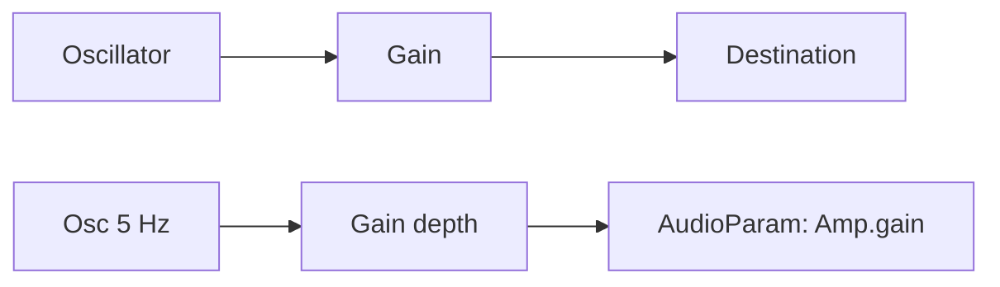

# 📘 04 — Gain, enveloppes (ADSR) et automatisations temporelles

> 🎯 **Objectif du chapitre** : Maîtriser le **contrôle d’amplitude** avec `GainNode`, construire des **enveloppes ADSR** robustes, et utiliser les **automations temporelles** des `AudioParam` (`setValueAtTime`, `linearRampToValueAtTime`, `exponentialRampToValueAtTime`, `setTargetAtTime`, `setValueCurveAtTime`). Tu sauras déclencher des notes **sans clics**, créer du **tremolo**, gérer la **velocity**, et planifier proprement **note-on/note-off**.

---

## 🧠 `GainNode` et `AudioParam` : définitions & pourquoi

- **`GainNode`** : nœud de **multiplication** du signal. Si l’entrée est `x(t)` et le gain est `g(t)`, la sortie est `y(t) = g(t) · x(t)`.
- **`gain.gain`** : c’est un **`AudioParam`** — il accepte une **valeur scalaire**, des **automations**, ou un **signal** (ex. un LFO pour du tremolo).
- **Pourquoi** : l’amplitude commande le **volume**, la forme temporelle (enveloppe) influence le **caractère** (attaque percussive, sustain, release doux). En synthèse, l’enveloppe est **aussi importante** que le timbre.

### 🔢 Modèle JS — sortie d’un GainNode
```js
// y[n] = g[n] * x[n] (modèle discret)
function applyGainFrame(x, g) { return g * x; }
```

---

## 🧠 Automations des `AudioParam` : API et comportement

- `setValueAtTime(value, time)` : fixe une valeur **instantanée** à `time`.
- `linearRampToValueAtTime(value, time)` : crée une **rampe linéaire** de la valeur **courante** jusqu’à `value` à `time`.
- `exponentialRampToValueAtTime(value, time)` : crée une **rampe exponentielle** ; **valeurs strictement > 0**.
- `setTargetAtTime(target, startTime, timeConstant)` : approche **exponentielle** vers `target` à partir de `startTime`.
- `setValueCurveAtTime(curve, startTime, duration)` : suit un **tableau de valeurs** échantillonnées sur `duration`.
- `cancelScheduledValues(time)` : efface les automations **à partir** de `time`.

### 📎 Formule (JS) — `setTargetAtTime`
```js
// Modèle: y(t) = target + (y0 - target) * exp(-(t - start) / tau)
function setTargetModel(y0, target, t, start, tau){
  if (t < start) return y0;
  return target + (y0 - target) * Math.exp(-(t - start) / tau);
}
```

> 💡 **Astuce** : L’oreille perçoit le volume de façon **logarithmique**; des **ramps exponentielles** donnent souvent une sensation **plus naturelle** qu’une ramp linéaire.

---

## 🧠 Enveloppe **ADSR** (Attack, Decay, Sustain, Release)

- **Définition** : Profil d’amplitude typique d’une note.
  - **Attack (A)** : montée initiale (0 → 1).
  - **Decay (D)** : descente vers le **Sustain**.
  - **Sustain (S)** : niveau maintenu tant que la note est appuyée.
  - **Release (R)** : descente à 0 après relâche.
- **Pourquoi** : donne la **signature temporelle** (percussif, doux, pad…).

### 🔧 Fonctions utilitaires (JS) — planification ADSR
```js
function scheduleADSR(ctx, gainParam, {
  attack=0.01, decay=0.15, sustain=0.6, release=0.2,
  peak=1.0, epsilon=1e-4
}={}, startTime=ctx.currentTime) {
  // Phase Attack: 0 -> peak
  gainParam.cancelScheduledValues(startTime);
  gainParam.setValueAtTime(0, startTime);
  // Attack: exponentiel vers peak (éviter 0 avec epsilon)
  gainParam.setValueAtTime(epsilon, startTime + epsilon);
  gainParam.exponentialRampToValueAtTime(Math.max(epsilon, peak), startTime + attack);
  // Decay: vers sustain
  const decayStart = startTime + attack;
  const sustainTime = decayStart + decay;
  gainParam.exponentialRampToValueAtTime(Math.max(epsilon, sustain), sustainTime);
  // On reste au sustain: aucune automation supplémentaire ici
  return { decayStart, sustainTime };
}

function scheduleRelease(ctx, gainParam, {release=0.2, epsilon=1e-4}={}, releaseTime=ctx.currentTime) {
  // Part de la valeur courante, descend vers ~0
  gainParam.cancelScheduledValues(releaseTime);
  gainParam.setValueAtTime(Math.max(epsilon, gainParam.value), releaseTime);
  gainParam.exponentialRampToValueAtTime(epsilon, releaseTime + release);
  gainParam.setValueAtTime(0, releaseTime + release + epsilon);
}
```

> ⚠️ **Attention** : `exponentialRampToValueAtTime` n’accepte pas `0`. On place un **epsilon** (>0) et on **force** `0` juste après la fin de la rampe.

---

## 🧪 Exemple complet — Note avec ADSR & anti-clic
```js
const ctx = new AudioContext();
const osc = ctx.createOscillator(); osc.type = 'sawtooth';
const amp = ctx.createGain(); amp.gain.value = 0;
osc.connect(amp).connect(ctx.destination);

async function noteOn(freq){
  await ctx.resume();
  const now = ctx.currentTime;
  osc.frequency.setValueAtTime(freq, now);
  scheduleADSR(ctx, amp.gain, { attack:0.02, decay:0.2, sustain:0.5 }, now);
  // Démarrer l’oscillateur une fois
  try { osc.start(now); } catch(e) { /* déjà démarré */ }
}

function noteOff(){
  const now = ctx.currentTime;
  scheduleRelease(ctx, amp.gain, { release:0.25 }, now);
}
```

---

## 🧠 Tremolo (modulation d’amplitude) avec LFO

- **Principe** : LFO (0.5–10 Hz) modulant `gain.gain`.

```js
const ctx = new AudioContext();
const src = ctx.createOscillator(); src.frequency.value = 220;
const amp = ctx.createGain(); amp.gain.value = 0.8;

const lfo = ctx.createOscillator(); lfo.frequency.value = 5; // vitesse
const depth = ctx.createGain(); depth.gain.value = 0.4;      // profondeur

lfo.connect(depth).connect(amp.gain);
src.connect(amp).connect(ctx.destination);
// Sur geste: ctx.resume(); src.start(); lfo.start();
```

> 💡 **Astuce** : pour un **tremolo carré**, utilise `lfo.type = 'square'`. Pour un **tremolo doux**, `sine` et profondeur faible.

---

## 🧠 Velocity (intensité de frappe)

- **Définition** : en MIDI, `velocity` ∈ [0..127]. On la mappe à un **niveau** de sustain ou un **peak**.

### 🔢 Mappage simple (linéaire → dB → linéaire)
```js
function velocityToGain(vel){
  // Map 0..127 -> -40..0 dB (exemple)
  const db = -40 + (vel/127) * 40;
  return Math.pow(10, db / 20);
}
```

> 💡 **Pourquoi** : une échelle en **dB** reflète mieux la **perception**.

---

## 🧠 Courbes custom — `setValueCurveAtTime`

- **Principe** : dessiner une enveloppe **arbitraire** (ex. courbe de percussion) via un tableau de points.

```js
function scheduleCurve(ctx, param, curve, start, dur){
  // curve: Float32Array, ex. courbe de décroissance exponentielle rapide
  param.cancelScheduledValues(start);
  param.setValueCurveAtTime(curve, start, dur);
}

// Ex. construire une courbe exponentielle rapide
function expDecayCurve(len=128, alpha=6){
  const c = new Float32Array(len);
  for(let i=0;i<len;i++){
    const t = i/(len-1);
    c[i] = Math.exp(-alpha * t); // 1 -> ~0
  }
  return c;
}
```

---

## 🧠 Planification de notes (note-on/note-off) au tempo

- **Idée** : calculer `noteTime = ctx.currentTime + stepIndex * (60/bpm)` pour déclencher à l’avance.

```js
function scheduleNote(ctx, osc, amp, freq, when, {A=0.01,D=0.1,S=0.5,R=0.2}={}){
  osc.frequency.setValueAtTime(freq, when);
  amp.gain.setValueAtTime(0, when);
  amp.gain.linearRampToValueAtTime(1, when + A);
  amp.gain.linearRampToValueAtTime(S, when + A + D);
}

function scheduleNoteOff(ctx, amp, when, R=0.2){
  amp.gain.setValueAtTime(amp.gain.value, when);
  amp.gain.linearRampToValueAtTime(0, when + R);
}
```

> ⚠️ **Bonnes pratiques** : planifier **en avance**; éviter `setTimeout` pour lancer le son (utiliser l’horloge audio).

---

## 🧠 Nettoyage & cycle de vie

- **Annuler proprement** : `cancelScheduledValues(now)` avant de poser une nouvelle enveloppe.
- **Éviter les clics** : commence à `0` et fais une **petite montée** (quelques ms).
- **Stop** : après le **release**, `osc.stop(when)` si tu utilises un oscillateur par note.

---

## 🛠️ (Optionnel) Version TypeScript — utilitaires ADSR
```ts
// adsr.ts
export type ADSR = { attack:number; decay:number; sustain:number; release:number; };
export function scheduleADSR(ctx: AudioContext, param: AudioParam, env: ADSR, startTime = ctx.currentTime) {
  const { attack, decay, sustain } = env;
  param.cancelScheduledValues(startTime);
  param.setValueAtTime(0, startTime);
  param.setValueAtTime(1e-4, startTime + 1e-4);
  param.exponentialRampToValueAtTime(Math.max(1e-4, 1), startTime + attack);
  param.exponentialRampToValueAtTime(Math.max(1e-4, sustain), startTime + attack + decay);
}
export function scheduleRelease(ctx: AudioContext, param: AudioParam, env: ADSR, releaseTime = ctx.currentTime) {
  const { release } = env;
  param.cancelScheduledValues(releaseTime);
  param.setValueAtTime(Math.max(1e-4, param.value), releaseTime);
  param.exponentialRampToValueAtTime(1e-4, releaseTime + release);
  param.setValueAtTime(0, releaseTime + release + 1e-4);
}
```

---

## 🔧 Exercices (progressifs)

1. **Anti-clic** : crée une note courte **sans clics** avec une montée de 3–5 ms.
2. **ADSR musical** : teste 3 presets (percussif, pad, lead) et compare la sensation.
3. **Tremolo** : ajoute un LFO de 7 Hz avec profondeur variable (slider).
4. **Velocity** : mappe `velocity` MIDI à `peak`/`sustain` et écoute l’effet.
5. **Courbe custom** : dessine une enveloppe de percussion via `setValueCurveAtTime`.
6. **Scheduler** : programme 8 notes au tempo (bpm) en advance.

---

## 💡 Astuces & bonnes pratiques

- **Exponential vs Linear** : l’**exponentiel** est plus naturel pour l’amplitude.
- **Échelle en dB** : utile pour mapper des contrôles UI à l’oreille humaine.
- **Toujours** planifier sur l’horloge audio (`currentTime`).
- **Éviter les gros sauts** de gain: petites montées/descentes → pas de clics.

---

## ⚠️ Pièges fréquents

- **`exponentialRampToValueAtTime(0)`** : interdit → utiliser `epsilon`.
- **Enveloppes qui se chevauchent** : oublier `cancelScheduledValues()` → artefacts.
- **`setTimeout`** pour le timing audio : jitter → préférer `currentTime`.

---

## 🧩 Schémas Mermaid

### ADSR sur le gain et tremolo en parallèle


### Note-on / Note-off planifiés
```mermaid
graph LR
  Plan[Scheduler] -->|noteOn(t)| EnvA[Attack/Decay]
  EnvA --> Sustain[Sustain]
  Plan -->|noteOff(t)| EnvR[Release]
  Sustain --> EnvR --> Out[Destination]
```

---

## 🧾 Résumé du chapitre (points clés)

- **`GainNode`** contrôle l’amplitude: sortie `y = g · x`.
- **Automations** : `setValueAtTime`, `linearRampToValueAtTime`, `exponentialRampToValueAtTime`, `setTargetAtTime`, `setValueCurveAtTime`.
- **ADSR** : Attack/Decay/Sustain/Release — profil fondamental d’une note.
- **Anti-clic** : petites rampes, éviter les sauts.
- **Tremolo** : LFO → `gain.gain`.
- **Velocity** : mapper en dB pour une sensation naturelle.
- **Scheduler** : déclencher au `currentTime` + offset (tempo).

---

> ✅ **Prochaines étapes** : **Chapitre 5 — Filtres (EQ) et modelage du timbre)** : nous verrons `BiquadFilterNode`, les types de filtres, la résonance (`Q`) et des sweeps contrôlés.
