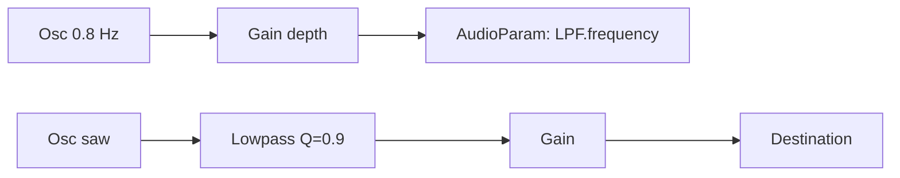
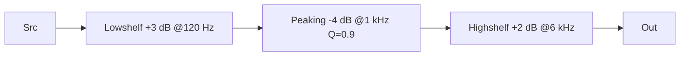

# 📘 05 — Filtres (EQ) et modelage du timbre

> 🎯 **Objectif du chapitre** : Comprendre et utiliser `BiquadFilterNode` pour **sculpter le timbre** : types de filtres (low/high/bandpass, notch, peaking, shelves, allpass), paramètres (`frequency`, `Q`, `gain`, `detune`), **balayages** (LFO), **wah** et **auto-wah** (suivi d’enveloppe), presets d’**EQ** musical, et bonnes pratiques d’anti-aliasing/niveaux.

---

## 🧠 Pourquoi filtrer ? (définition, pourquoi, analogie)

- **Définition** : Un **filtre** modifie le **contenu spectral** d’un signal en **amplifiant** ou **atténuant** des **bandes de fréquences**.
- **Pourquoi** : Modeler le **timbre** (enlever des aigus agressifs, renforcer des graves, sélectionner une bande), résoudre des **problèmes** (bruit, sifflements, DC offset), et créer des **effets** (wah, telephone, auto-wah).
- **Analogie** : Comme des **lunettes de couleur** pour la lumière : un filtre audio colore/masque certaines composantes fréquentielles.

---

## 🧠 `BiquadFilterNode` : types et paramètres

### 🔧 Types disponibles
- `lowpass` (passe-bas) — laisse passer **grave** et coupe **aigu**.
- `highpass` (passe-haut) — laisse passer **aigu** et coupe **grave**.
- `bandpass` — laisse passer une **bande** centrée autour de `frequency`.
- `notch` (band-stop) — **évide** une bande (utile contre un larsen/ronflette).
- `peaking` (bell) — **boost/cut** d’une bande autour de `frequency` via `gain`.
- `lowshelf`, `highshelf` — **étagères** qui boost/cut sous/au-dessus d’un seuil.
- `allpass` — passe tout mais **modifie la phase** (délais de groupe).

### 🎛️ Paramètres clés
- `filter.frequency` (**AudioParam**, Hz) — fréquence de coupure/centre.
- `filter.Q` (**AudioParam**, sans unité) — **sélectivité/résonance**. Plus grand → bande **étroite** / **résonance** accentuée.
- `filter.gain` (**AudioParam**, dB) — actif pour `peaking`, `lowshelf`, `highshelf`.
- `filter.detune` (**AudioParam**, **cents**) — décale `frequency` :
  ```js
  // Applique detune (cents) sur frequency (Hz)
  const effectiveFreq = filter.frequency.value * Math.pow(2, filter.detune.value / 1200);
  ```

> 💡 **Repères** : `Q ≈ 0.707` (Butterworth, sans bosse); `Q > 10` très sélectif (risque de **ringing**).

---

## 🧠 Formules utiles (JS) — bandes & conversions

- **Bande passante approx.** (bandpass/notch) :
  ```js
  // largeur ~ f0 / Q (approx. pédagogique)
  function bandwidthApproxHz(f0, Q){ return f0 / Q; }
  ```
- **Transposition de fréquence** par **cents** (detune) :
  ```js
  function centsToRatio(cents){ return Math.pow(2, cents/1200); }
  function detunedFreq(f, cents){ return f * centsToRatio(cents); }
  ```
- **EQ peaking** — gain linéaire depuis dB :
  ```js
  const lin = Math.pow(10, db/20);
  ```

> ℹ️ Les `BiquadFilterNode` implémentent des structures **IIR** de 2ᵉ ordre. Le détail des coefficients dépasse ce chapitre; retiens les **effets perceptifs** des paramètres.

---

## 🧪 Balayage de filtre (sweep) avec LFO

```js
const ctx = new AudioContext();
const osc = ctx.createOscillator(); osc.type = 'sawtooth'; osc.frequency.value = 110;
const amp = ctx.createGain(); amp.gain.value = 0.6;
const lpf = ctx.createBiquadFilter(); lpf.type = 'lowpass'; lpf.Q.value = 0.9; lpf.frequency.value = 400;

const lfo = ctx.createOscillator(); lfo.type = 'sine'; lfo.frequency.value = 0.8; // 0.8 Hz
const lfoDepth = ctx.createGain(); lfoDepth.gain.value = 800; // amplitude en Hz ajoutée

lfo.connect(lfoDepth).connect(lpf.frequency); // signal de contrôle audio-rate
osc.connect(lpf).connect(amp).connect(ctx.destination);
// Sur geste utilisateur: ctx.resume(); lfo.start(); osc.start();
```

> 💡 **Note** : La valeur audio-rate **s’ajoute** à `frequency.value`. Ici, base = `400 Hz`, modulation ±`800 Hz` (selon lFO).

---

## 🧠 Effet **wah** (balayage résonant)

- **Principe** : `bandpass` (ou `lowpass` avec Q élevé) dont `frequency` **balaye** rapidement → vocal “wah”.

```js
const ctx = new AudioContext();
const src = ctx.createOscillator(); src.type = 'sawtooth'; src.frequency.value = 220;
const wah = ctx.createBiquadFilter(); wah.type = 'bandpass'; wah.Q.value = 5; wah.frequency.value = 500;

const lfo = ctx.createOscillator(); lfo.type = 'triangle'; lfo.frequency.value = 2.0; // 2 Hz
const depth = ctx.createGain(); depth.gain.value = 1500; // largeur du balayage en Hz

lfo.connect(depth).connect(wah.frequency);
src.connect(wah).connect(ctx.destination);
// Sur geste: ctx.resume(); src.start(); lfo.start();
```

---

## 🧠 **Auto-wah** (suivi d’enveloppe)

- **Idée** : la **fréquence** du filtre suit l’**amplitude** du signal (enveloppe). Chaîne de contrôle simple : **rectification** (valeurs positives), puis **lissage** (lowpass), puis **mise à l’échelle** vers Hz.

```js
const ctx = new AudioContext();
const src = ctx.createOscillator(); src.type = 'sawtooth'; src.frequency.value = 110;
const band = ctx.createBiquadFilter(); band.type = 'bandpass'; band.Q.value = 6; band.frequency.value = 400;

// Contrôle: rectifier + smooth
const rect = ctx.createWaveShaper();
// courbe: y = |x|
const curve = new Float32Array(256);
for (let i = 0; i < curve.length; i++) {
  const x = (i / (curve.length - 1)) * 2 - 1; // -1..1
  curve[i] = Math.abs(x);
}
rect.curve = curve;

const smooth = ctx.createBiquadFilter(); smooth.type = 'lowpass'; smooth.frequency.value = 8; // très lent (< 10 Hz)
const scale = ctx.createGain(); scale.gain.value = 1800; // map vers Hz
const bias = ctx.createConstantSource(); bias.offset.value = 300; // base en Hz

src.connect(rect).connect(smooth).connect(scale).connect(band.frequency);
bias.connect(band.frequency);

src.connect(band).connect(ctx.destination);
// Sur geste: ctx.resume(); src.start(); bias.start();
```

> ⚠️ **Attention** : Les `AudioParam` additionnent les contributions de contrôle (ici **bias** + **signal**). Ajuste `scale.gain` et `bias.offset` pour la plage désirée.

---

## 🧠 Presets d’**EQ** musical (peaking / shelves)

> 🎛️ Exemples concrets de réglages de départ.

```js
function makeEQ(ctx){
  const lows = ctx.createBiquadFilter(); lows.type = 'lowshelf'; lows.frequency.value = 120; lows.gain.value = 3; // +3 dB sous 120 Hz
  const mid = ctx.createBiquadFilter(); mid.type = 'peaking'; mid.frequency.value = 1000; mid.Q.value = 0.9; mid.gain.value = -4; // -4 dB à 1 kHz
  const highs = ctx.createBiquadFilter(); highs.type = 'highshelf'; highs.frequency.value = 6000; highs.gain.value = 2; // +2 dB au-dessus de 6 kHz
  return { lows, mid, highs };
}

// Chaînage: src -> lows -> mid -> highs -> destination
const ctx = new AudioContext();
const src = ctx.createOscillator(); src.type = 'sawtooth'; src.frequency.value = 220;
const eq = makeEQ(ctx);
src.connect(eq.lows).connect(eq.mid).connect(eq.highs).connect(ctx.destination);
// Sur geste: ctx.resume(); src.start();
```

> 💡 **Astuce** : Place les **shelves** aux extrémités du spectre et le **peaking** pour “sculpter” le médium.

---

## 🧠 Filtrage utilitaire (nettoyage)

- **Highpass léger** (`20–40 Hz`) : retire le **rumble** et les **DC offset**.
- **Notch** ciblé : atténue une **fréquence** de larsen ou **ronflette** (ex. 50/60 Hz). 
- **Allpass** : rarement utilisé seul; utile pour **aligner la phase** en traitements avancés.

```js
const hp = ctx.createBiquadFilter(); hp.type = 'highpass'; hp.frequency.value = 30; hp.Q.value = 0.707;
const notch = ctx.createBiquadFilter(); notch.type = 'notch'; notch.frequency.value = 60; notch.Q.value = 10;
```

---

## 🧩 Schémas Mermaid

### Sweep LFO → lowpass


### Auto-wah (envelope follower)
```mermaid
graph LR
  Src[Osc saw] --> Rect[WaveShaper |x|] --> Smooth[LPF <10 Hz]
  Smooth --> Scale[Gain *1800]
  Scale --> FreqParam[AudioParam: Band.frequency]
  Bias[Constant 300 Hz] --> FreqParam
  Src --> Band[Bandpass Q=6] --> Out[Destination]
```

### EQ 3 bandes (lowshelf → peaking → highshelf)


---

## 🔧 Exercices (progressifs)

1. **Sweep** : implémente un balayage lowpass avec LFO; teste différentes `Q`.
2. **Wah** : crée un wah bandpass (Q=5–8); teste `triangle` vs `sine` comme LFO.
3. **Auto-wah** : ajuste `smooth.frequency`, `scale.gain` et `bias.offset` pour qu’il “parle” selon la dynamique.
4. **EQ** : bâtis une chaîne **lowshelf → peaking → highshelf** et fais 3 presets (clair, sombre, médium creusé).
5. **Notch** : crée un notch fin (Q≥10) à 60 Hz et constate l’effet.
6. **Nettoyage** : ajoute un highpass doux (30–40 Hz) pour supprimer le rumble.

---

## 💡 Astuces & bonnes pratiques

- **Q** élevé = **résonance** : surveiller les **niveaux** (peut amplifier).
- **Band-limited** : les formes **riches** (saw/square) + fortes résonances → aliasing; filtre **après** oscillateur et éviter `frequency` > `fs/2`.
- **Gain en dB** : penser en **dB** pour les shelves/peaking; ajuster finement.
- **Automation audio-rate** : connecter LFO directement sur `AudioParam` quand possible (plus fluide qu’un `setInterval`).

---

## ⚠️ Pièges fréquents

- **`exponentialRampToValueAtTime(0)`** sur `frequency`/`Q` : interdit; utiliser **epsilon**.
- **`Q` très élevé** : **ringing** ou **sifflement**; démarrer avec `Q ≈ 0.7–1.4`.
- **Boosts lourds** (shelf/peaking) : risque de **clipping** — compresseur ou **baisser master**.
- **Fréquences irréalistes** : `frequency` > `sampleRate/2` n’a pas de sens (aliasing/détermination). Rester **< Nyquist** (chap. 1).

---

## 🛠️ (Optionnel) TypeScript — service de filtre & EQ
```ts
// filter-service.ts
export class FilterService {
  constructor(private ctx: AudioContext) {}

  makeWah(type: BiquadFilterType = 'bandpass', Q = 6, base = 400, lfoHz = 2, depthHz = 1500) {
    const src = this.ctx.createOscillator(); src.type = 'sawtooth'; src.frequency.value = 220;
    const filt = this.ctx.createBiquadFilter(); filt.type = type; filt.Q.value = Q; filt.frequency.value = base;
    const lfo = this.ctx.createOscillator(); lfo.type = 'triangle'; lfo.frequency.value = lfoHz;
    const depth = this.ctx.createGain(); depth.gain.value = depthHz;
    lfo.connect(depth).connect(filt.frequency);
    src.connect(filt).connect(this.ctx.destination);
    return { src, filt, lfo, depth } as const;
  }

  makeEQ3(){
    const lows = this.ctx.createBiquadFilter(); lows.type = 'lowshelf'; lows.frequency.value = 120; lows.gain.value = 3;
    const mid = this.ctx.createBiquadFilter(); mid.type = 'peaking'; mid.frequency.value = 1000; mid.Q.value = 0.9; mid.gain.value = -4;
    const highs = this.ctx.createBiquadFilter(); highs.type = 'highshelf'; highs.frequency.value = 6000; highs.gain.value = 2;
    return { lows, mid, highs } as const;
  }
}
```

---

## 🧾 Résumé du chapitre (points clés)

- **`BiquadFilterNode`** offre `low/high/bandpass`, `notch`, `peaking`, `shelves`, `allpass`.
- **Paramètres** : `frequency` (Hz), `Q` (sélectivité), `gain` (dB), `detune` (cents).
- **Balayages** : LFO → `frequency`; **wah** = bandpass résonant qui balaye; **auto-wah** = suivi d’enveloppe.
- **EQ** pratique** : shelves aux extrêmes + peaking au médium.
- **Bonnes pratiques** : surveiller niveaux/résonance; rester < Nyquist; modulation audio-rate pour la fluidité.

---

> ✅ **Prochaines étapes** : **Chapitre 6 — Temps et scheduling précis** : programmation d’événements audio sur l’horloge, séquenceur au tempo et stratégies de lookahead.
