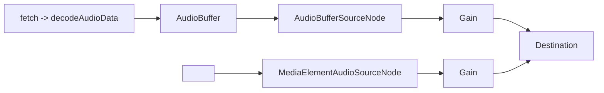
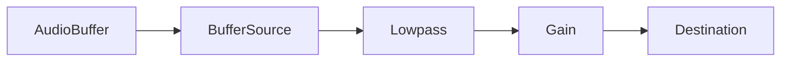

# 📘 07 — Fichiers audio, buffers et lecture

> 🎯 **Objectif du chapitre** : Charger et lire des sons avec la Web Audio API. Tu vas apprendre à récupérer des fichiers via `fetch`, à les **décoder** en `AudioBuffer` avec `decodeAudioData`, à déclencher des lectures **précises** avec `AudioBufferSourceNode` (`start(when, offset, duration)`, `stop(when)`, `loop`, `playbackRate`, `detune`), à comprendre la différence avec `MediaElementAudioSourceNode` (lecture via `<audio>`), et à gérer **mémoire**, **CORS** et **polyphonie**.

---

## 🧠 Deux approches de lecture : `AudioBufferSourceNode` vs `<audio>`

- **`AudioBufferSourceNode`** (buffer en mémoire)
  - **Pour quoi** : déclenchements **très précis** (one‑shot, drum pads, sampler), scheduling via `start(when)` sur l’horloge audio, boucles, transposition via `playbackRate`/`detune`.
  - **Contraintes** : chaque **source** est **jetable** (une seule lecture → recréer pour rejouer), nécessite **charger** et **décoder** (mémoire).
- **`MediaElementAudioSourceNode`** (via `<audio>`)
  - **Pour quoi** : lecture **streaming** longue (musique de fond), contrôles natifs (play/pause/volume), formats pris en charge par le navigateur.
  - **Contraintes** : moins de précision pour le **scheduling** (horloge element), pas de `start(when, offset, duration)` de la Web Audio API.

### 🧩 Schéma (Mermaid) — Deux pipelines


---

## 🧠 Charger et décoder des fichiers audio

> 💡 **Formats** : WAV/MP3/OGG/FLAC selon support du navigateur. Les fichiers doivent être **accessibles** (CORS si hébergés ailleurs).

```js
const ctx = new AudioContext();

async function loadAudioBuffer(url){
  const res = await fetch(url, { mode: 'cors' }); // CORS si distant
  if (!res.ok) throw new Error('HTTP ' + res.status);
  const arrayBuf = await res.arrayBuffer();
  const audioBuf = await ctx.decodeAudioData(arrayBuf); // Promise
  return audioBuf; // AudioBuffer
}
```

### 🔎 Inspecter un `AudioBuffer`
```js
function inspectBuffer(buf){
  console.log('channels:', buf.numberOfChannels);
  console.log('sampleRate:', buf.sampleRate, 'Hz');
  console.log('length:', buf.length, 'frames');
  console.log('duration:', buf.duration, 's');
  // accéder aux samples du canal 0
  const ch0 = buf.getChannelData(0); // Float32Array
  console.log('first 5 samples:', ch0.slice(0,5));
}
```

---

## 🧠 Lire un buffer : `AudioBufferSourceNode`

- **Création** : `const src = ctx.createBufferSource(); src.buffer = audioBuf;`
- **Lecture** : `src.start(when, offset, duration)`
  - `when` (s, horloge audio) : **quand** démarrer.
  - `offset` (s) : **où** commencer dans le buffer.
  - `duration` (s) : **combien** de temps lire.
- **Boucle** : `src.loop = true; src.loopStart = ...; src.loopEnd = ...;`
- **Transposition** :
  - `src.playbackRate` (**AudioParam**) — *ratio* (ex. 2.0 = 1 octave ↑, 0.5 = 1 octave ↓).
  - `src.detune` (**AudioParam**, **cents**) — décalage fin.

```js
function playOneShot(buf, when = ctx.currentTime + 0.05){
  const src = ctx.createBufferSource();
  src.buffer = buf;
  src.connect(ctx.destination);
  src.start(when); // one-shot
}

function playLoop(buf, loopStart = 0.0, loopEnd = buf.duration, when = ctx.currentTime){
  const src = ctx.createBufferSource();
  src.buffer = buf; src.loop = true;
  src.loopStart = loopStart; src.loopEnd = loopEnd;
  src.connect(ctx.destination);
  src.start(when);
  return src; // tu peux src.stop(t) plus tard
}

function playWithRate(buf, rate = 1.0, when = ctx.currentTime){
  const src = ctx.createBufferSource(); src.buffer = buf;
  src.playbackRate.value = rate; // change pitch + durée
  src.connect(ctx.destination);
  src.start(when);
}

function playSemitones(buf, semitones = +7, when = ctx.currentTime){
  const ratio = Math.pow(2, semitones/12);
  const src = ctx.createBufferSource(); src.buffer = buf;
  src.playbackRate.value = ratio;
  src.connect(ctx.destination);
  src.start(when);
}
```

> ⚠️ **Attention** : `playbackRate` change **pitch ET durée**. Un vrai **time‑stretch** (pitch constant) nécessite des **algorithmes** dédiés (AudioWorklet/WASM), hors du périmètre de base.

---

## 🧠 Déclencher au tempo (offset/duration)

```js
function scheduleClip(buf, when, offset, dur){
  const src = ctx.createBufferSource();
  src.buffer = buf; src.connect(ctx.destination);
  src.start(when, offset, dur);
}

// Exemple: jouer 1 mesure d’un loop à 120 BPM
const bpm = 120, spb = 60/bpm; // 0.5 s
// 1 mesure 4/4 = 4 battements => 2 s
// scheduleClip(buf, ctx.currentTime + 1.0, 0.0, 2.0);
```

---

## 🧠 Pipeline avec gain et effets

```js
function playThroughChain(buf, {gain=0.8, lpHz=1200}={}){
  const src = ctx.createBufferSource(); src.buffer = buf;
  const amp = ctx.createGain(); amp.gain.value = gain;
  const lpf = ctx.createBiquadFilter(); lpf.type = 'lowpass'; lpf.frequency.value = lpHz;
  src.connect(lpf).connect(amp).connect(ctx.destination);
  src.start(ctx.currentTime + 0.05);
}
```

### 🧩 Schéma (Mermaid) — Chaîne de lecture


---

## 🧠 Mémoire, CORS, et gestion des sources

- **Mémoire** : les `AudioBuffer` résident en **RAM** (Float32), éviter de charger **trop** de samples lourds simultanément.
- **Réutiliser le buffer** : **Oui** — charger **une fois** et rejouer via **nouvelles sources**.
- **Source à usage unique** : un `AudioBufferSourceNode` **ne rejoue pas** après `stop()` — recréer.
- **CORS** : pour `fetch` depuis un **domaine tiers**, le serveur doit envoyer les **headers** CORS. Sinon, `fetch`/`decodeAudioData` échouent.
- **Sample rate** : si `buf.sampleRate` ≠ `ctx.sampleRate`, le moteur **resample** (transparent). `duration = buf.length / buf.sampleRate`.

---

## 🧠 Sampler simple (polyphonie) — gestion des voix

```js
class Sampler {
  constructor(ctx, buf){ this.ctx = ctx; this.buf = buf; this.voices = new Set(); }
  trigger(when = this.ctx.currentTime, semitones = 0, gainVal = 0.8){
    const src = this.ctx.createBufferSource(); src.buffer = this.buf;
    const amp = this.ctx.createGain(); amp.gain.value = gainVal;
    const ratio = Math.pow(2, semitones/12);
    src.playbackRate.value = ratio;
    src.connect(amp).connect(this.ctx.destination);
    src.start(when);
    src.onended = () => { this.voices.delete(src); };
    this.voices.add(src);
    return src;
  }
  stopAll(){ for (const src of this.voices) try { src.stop(); } catch{} this.voices.clear(); }
}
```

---

## 🧠 Lecture via `<audio>` + Web Audio (streaming)

```html
<audio id="music" src="music.mp3" crossorigin="anonymous" controls></audio>
<script>
const ctx = new AudioContext();
const el = document.getElementById('music');
const mes = ctx.createMediaElementSource(el);
const master = ctx.createGain(); master.gain.value = 0.9;
mes.connect(master).connect(ctx.destination);
// UI natifs: el.play(), el.pause(), el.currentTime, el.loop
// Respecter l’autoplay: attendre un geste, puis ctx.resume(); el.play();
</script>
```

> 💡 **Astuce** : `<audio>` est idéal pour **pistes longues** (musique de fond), **contrôles UI natifs**, et **streaming**. Utilise `BufferSource` pour des **événements** au milliseconde près.

---

## 🧠 Lecture régionale et slicing

```js
function slicePlay(buf, startSec, endSec, when = ctx.currentTime){
  const dur = Math.max(0, endSec - startSec);
  const src = ctx.createBufferSource(); src.buffer = buf;
  src.start(when, startSec, dur);
}
```

---

## 🧩 Schémas Mermaid supplémentaires

### Buffer → Source (loop) → Effets → Destination
```mermaid
graph LR
  B[AudioBuffer] --> S[BufferSource (loopStart/loopEnd)]
  S --> FX1[BiquadFilter]
  FX1 --> FX2[Delay]
  FX2 --> M[Master Gain]
  M --> Out
```

### `<audio>` → Source → Destination
```mermaid
graph LR
  HTML[<audio> (controls, streaming)] --> MES[MediaElementAudioSource]
  MES --> Out[Destination]
```

---

## 🔧 Exercices (progressifs)

1. **One‑shot** : charge un sample de caisse claire et déclenche au **tempo**.
2. **Boucle** : crée un lecteur de **loop** avec `loopStart`/`loopEnd` et un bouton **Start/Stop**.
3. **Transpose** : ajoute un slider **semitones** (−12..+12) -> `playbackRate`.
4. **Slicing** : joue plusieurs **tranches** d’un long fichier via `offset`/`duration` (type sampler).
5. **Streaming** : connecte un `<audio>` et applique un **EQ** (chap. 5) dessus.
6. **Mémoire** : charge **3 samples** lourds et mesure l’impact; implémente un bouton **Unload** (nullifier références).

---

## 💡 Astuces & bonnes pratiques

- **Pré‑charger** les samples nécessaires et **réutiliser** les buffers.
- **Créer une source par lecture** (jetable) et nettoyer (`onended` → `disconnect`).
- **CORS** : configurer `crossorigin="anonymous"` sur `<audio>` et serveurs distants.
- **Limiter mémoire** : éviter de garder des buffers inutiles en références.
- **Planifier** via `currentTime` pour démarrages précis.

---

## ⚠️ Pièges fréquents

- **Rejouer le même `AudioBufferSourceNode`** → ne fonctionne pas (node jetable).
- **Oublier CORS** → `fetch` refuse / `decodeAudioData` échoue.
- **`playbackRate` extrême** → artefacts (pitch & durée). Rester dans des plages réalistes (0.5..2×).
- **Niveaux** trop forts à la sortie → clipping. Chaîner via `GainNode`.

---

## 🧾 Résumé du chapitre (points clés)

- **Deux approches** : `BufferSource` (précision, one‑shot) vs `<audio>` (streaming, UI natifs).
- **Chargement** via `fetch` + `decodeAudioData` → `AudioBuffer` (RAM), inspectable (`channels`, `sampleRate`, `duration`).
- **Lecture** : `start(when, offset, duration)` ; **boucle** via `loopStart/loopEnd` ; **transpose** via `playbackRate` ou `detune`.
- **Mémoire/CORS** : réutiliser les buffers, créer une source par lecture, configurer CORS.
- **Sampler** : gestion simple de voix pour polyphonie; `<audio>` pour longue lecture.

---

> ✅ **Prochaines étapes** : **Chapitre 8 — Analyse et visualisation (FFT)** : mesure du signal en temps réel avec `AnalyserNode`, oscilloscope et spectre sur Canvas.
