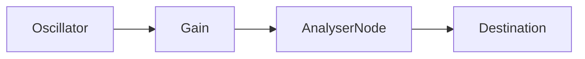
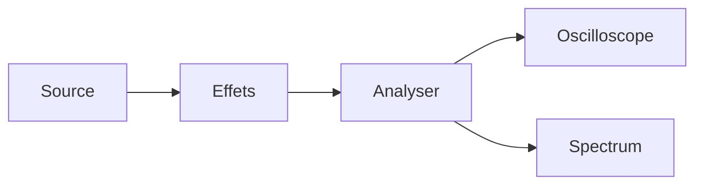

# 📘 08 — Analyse et visualisation (FFT, Oscilloscope, Spectre)

> 🎯 **Objectif du chapitre** : Utiliser `AnalyserNode` pour **mesurer** et **visualiser** un signal audio **en temps réel** : **oscilloscope** (domaine temporel), **spectre** (domaine fréquentiel) et **spectrogramme** (évolution du spectre dans le temps). Tu apprendras les paramètres clés de `AnalyserNode` (`fftSize`, `smoothingTimeConstant`, `minDecibels`, `maxDecibels`) et les **formules** pour convertir **indice de bin ↔ fréquence**.

---

## 🧠 `AnalyserNode` : définitions et paramètres

- **Définition** : `AnalyserNode` calcule en continu une **analyse** du signal audio connecté, accessible via **buffers** (time-domain et frequency-domain), pour alimenter des **visualisations** en Canvas/WebGL.
- **Paramètres clés** :
  - `fftSize` (puissance de 2, ex. 512, 1024, 2048, …) → taille de la FFT interne.
  - `frequencyBinCount = fftSize / 2` → nombre de **bins** fréquentiels disponibles.
  - `smoothingTimeConstant` (0..1) → **lissage** temporel de l’analyse de **fréquences** (EMA).
  - `minDecibels` / `maxDecibels` (ex. −100..−30 dB) → bornes des valeurs du **spectre**.
- **Méthodes de lecture** :
  - `getFloatTimeDomainData(Float32Array)` → échantillons **−1..+1**.
  - `getByteTimeDomainData(Uint8Array)` → échantillons **0..255** (offset au milieu).
  - `getFloatFrequencyData(Float32Array)` → **dB** (entre `minDecibels` et `maxDecibels`).
  - `getByteFrequencyData(Uint8Array)` → **0..255** mappé depuis `min/maxDecibels`.

---

## 🧠 Fréquences ↔ bins (formules JS)

- **Indice de bin → fréquence** :
```js
function binToFreq(i, sampleRate, fftSize){
  return (i * sampleRate) / fftSize; // i ∈ [0 .. fftSize/2)
}
```
- **Fréquence → bin (arrondi)** :
```js
function freqToBin(f, sampleRate, fftSize){
  return Math.round((f * fftSize) / sampleRate);
}
```
- **Résolution fréquentielle** :
```js
const df = sampleRate / fftSize; // largeur d’un bin en Hz
```
- **Lissage (EMA, intuition)** :
```js
// y_n = (1 - a) * x_n + a * y_{n-1},  a ∈ [0..1] ~ smoothingTimeConstant
function ema(yPrev, x, a){ return (1 - a) * x + a * yPrev; }
```

> 💡 **Repères** : Grand `fftSize` → **meilleure résolution** fréquentielle mais **latence** et **coût CPU** plus élevés. `smoothingTimeConstant ≈ 0.8` donne un spectre **stable**.

---

## 🛠️ Mise en place : chaîne audio + analyseur

```js
const ctx = new AudioContext();
const osc = ctx.createOscillator(); osc.type = 'sawtooth'; osc.frequency.value = 220;
const amp = ctx.createGain(); amp.gain.value = 0.3;
const analyser = ctx.createAnalyser();

// Réglages
analyser.fftSize = 2048; // 2048 -> 1024 bins
analyser.smoothingTimeConstant = 0.8; // spectre plus stable
analyser.minDecibels = -100;
analyser.maxDecibels = -30;

// Graphe: osc -> amp -> analyser -> destination
osc.connect(amp).connect(analyser).connect(ctx.destination);
// Sur geste utilisateur: ctx.resume(); osc.start();
```

### 🧩 Schéma (Mermaid) — Graphe


---

## 🧪 Oscilloscope (Canvas 2D)

```js
function makeOscilloscope(analyser, canvas){
  const w = canvas.width, h = canvas.height;
  const ctx2d = canvas.getContext('2d');
  const buf = new Float32Array(analyser.fftSize); // time-domain size = fftSize

  function draw(){
    analyser.getFloatTimeDomainData(buf);
    ctx2d.clearRect(0, 0, w, h);
    ctx2d.strokeStyle = '#1f77b4';
    ctx2d.lineWidth = 2;
    ctx2d.beginPath();
    for(let i=0;i<buf.length;i++){
      const x = (i / (buf.length - 1)) * w;
      const y = (h/2) - buf[i] * (h/2 - 10);
      if(i===0) ctx2d.moveTo(x,y); else ctx2d.lineTo(x,y);
    }
    ctx2d.stroke();
    requestAnimationFrame(draw);
  }
  requestAnimationFrame(draw);
}
```

> 💡 **Astuce** : pour **verrouiller** la phase (trace stable), utilise un **déclenchement** (trigger) : repère l’indice où `buf[i]` croise zéro (montant) puis commence le tracé à partir de là.

---

## 🧪 Spectre (FFT en dB → Canvas)

```js
function makeSpectrum(analyser, canvas){
  const w = canvas.width, h = canvas.height;
  const ctx2d = canvas.getContext('2d');
  const bins = new Float32Array(analyser.frequencyBinCount);
  const sr = analyser.context.sampleRate;
  const fft = analyser.fftSize;

  function draw(){
    analyser.getFloatFrequencyData(bins); // dB in [min,max]
    ctx2d.clearRect(0,0,w,h);
    // Axe (optionnel)
    ctx2d.strokeStyle = '#ccc';
    ctx2d.beginPath(); ctx2d.moveTo(30, h-20); ctx2d.lineTo(w-10, h-20); ctx2d.stroke();
    // Courbe du spectre
    ctx2d.strokeStyle = '#d62728';
    ctx2d.lineWidth = 2;
    ctx2d.beginPath();
    for(let i=0;i<bins.length;i++){
      const f = binToFreq(i, sr, fft);
      const x = Math.log10(1 + f) / Math.log10(1 + sr/2); // mapping log
      const px = 30 + x * (w - 40);
      // Map dB -> y (min..max)
      const dB = bins[i];
      const t = (dB - analyser.minDecibels) / (analyser.maxDecibels - analyser.minDecibels);
      const py = (h - 20) - t * (h - 40);
      if(i===0) ctx2d.moveTo(px, py); else ctx2d.lineTo(px, py);
    }
    ctx2d.stroke();
    requestAnimationFrame(draw);
  }
  requestAnimationFrame(draw);
}
```

> 💡 **Astuce** : un **axe logarithmique** (approx. ci-dessus) rend la lecture du spectre plus **musicale** (octaves alignées).

---

## 🧪 Spectrogramme (colonne → temps)

```js
function makeSpectrogram(analyser, canvas){
  const w = canvas.width, h = canvas.height;
  const ctx2d = canvas.getContext('2d');
  const bins = new Uint8Array(analyser.frequencyBinCount);
  const image = ctx2d.createImageData(1, h); // colonne de 1 px

  function draw(){
    analyser.getByteFrequencyData(bins); // 0..255
    // Décaler l’image à gauche
    const old = ctx2d.getImageData(1, 0, w-1, h);
    ctx2d.putImageData(old, 0, 0);
    // Dessiner la nouvelle colonne à droite
    for(let y=0;y<h;y++){
      const bin = Math.floor((y / h) * bins.length);
      const v = bins[bins.length - 1 - bin]; // haut = aigu
      const base = (y * 4);
      image.data[base+0] = v;       // R
      image.data[base+1] = 255 - v; // G
      image.data[base+2] = 120;     // B
      image.data[base+3] = 255;     // A
    }
    ctx2d.putImageData(image, w-1, 0);
    requestAnimationFrame(draw);
  }
  requestAnimationFrame(draw);
}
```

> ⚠️ **Performance** : copier l’image à chaque frame peut être coûteux; utilise un **offscreen canvas** ou WebGL pour des spectrogrammes lourds.

---

## 🧠 Mesures utiles : VU, crête, RMS (rappel)

```js
function computeRMS(samples){
  let acc = 0;
  for(let i=0;i<samples.length;i++) acc += samples[i]*samples[i];
  return Math.sqrt(acc / samples.length);
}
function computePeak(samples){
  let peak = 0;
  for(let i=0;i<samples.length;i++) peak = Math.max(peak, Math.abs(samples[i]));
  return peak; // 0..1
}
```

> 💡 **Astuce** : Pour un **VU-mètre**, lis `getFloatTimeDomainData`, calcule **RMS**, et dessine une barre avec **lissage** (EMA) pour éviter les bonds.

---

## 🧠 Ajuster `AnalyserNode` correctement

- **`fftSize`** : 1024–2048 pour un spectre musical fluide; 512 pour **latence** plus faible.
- **`smoothingTimeConstant`** : 0.7–0.9 (spectre stable). 0 pour **instantané**.
- **`minDecibels/maxDecibels`** : adapter à ta source (ex. −100..−30 dB pour saw; −90..−20 pour musique).
- **Chaîne** : place l’analyseur **après** les effets si tu veux **visualiser** le rendu final.

---

## 🧩 Schémas Mermaid supplémentaires

### Oscilloscope + Spectre en parallèle


### Spectrogramme (défilement)
```mermaid
graph LR
  An[Analyser] --> Col[Colonne (bins)] --> Img[Collage image]
  Img --> Canvas[Canvas principal]
```

---

## 🔧 Exercices (progressifs)

1. **Oscilloscope** : visualise `sine`, `square`, `triangle`, `saw` et compare les tracés.
2. **Spectre** : applique un **lowpass** (chap. 5) et observe la courbe; change `Q`.
3. **Spectrogramme** : mets un **delay** et regarde l’évolution dans le temps.
4. **RMS/VU** : calcule le **RMS** et affiche une barre **lissée** via EMA.
5. **Trigger** : implémente un **zéro‑crossing** pour stabiliser l’oscilloscope.
6. **Performance** : teste `fftSize` = 512, 1024, 2048 et mesure l’impact CPU.

---

## 💡 Astuces & bonnes pratiques

- **Éviter le sur‑dessin** : utilise `requestAnimationFrame`; ajuste la fréquence de rafraîchissement.
- **Canvas dimension** : fixe `canvas.width/height` (pas seulement via CSS) pour éviter flou.
- **Log freq** : mapping **logarithmique** facilite l’interprétation musicale.
- **Placement** : analyser **après** la chaîne d’effets pour voir le **résultat**.

---

## ⚠️ Pièges fréquents

- **Confondre** `getByte*` (0..255 mappé) et `getFloat*` (valeurs **réelles**).
- **Indices** : `frequencyBinCount = fftSize/2` — ne pas itérer jusqu’à `fftSize`.
- **Résolution** : petit `fftSize` → largeur de bin trop grande → spectre peu détaillé.
- **Min/Max dB** : mauvais réglage → spectre illisible (trop écrasé).

---

## 🧾 Résumé du chapitre (points clés)

- **`AnalyserNode`** fournit **buffers** temps réel : **time-domain** et **frequency-domain**.
- **Paramètres** : `fftSize`, `frequencyBinCount`, `smoothingTimeConstant`, `min/maxDecibels`.
- **Formules** : `binToFreq(i) = i·sr/fftSize`, `df = sr/fftSize`.
- **Visualisations** : oscilloscope (tracé d’échantillons), spectre (dB par bin), spectrogramme (colonnes successives).
- **Pratique** : placer l’analyseur au bon endroit, régler dB/smoothing, optimiser Canvas.

---

> ✅ **Prochaines étapes** : **Chapitre 9 — Spatialisation et panorama** : `StereoPannerNode`, `PannerNode` (HRTF), position/distance et scènes 2D/3D.
