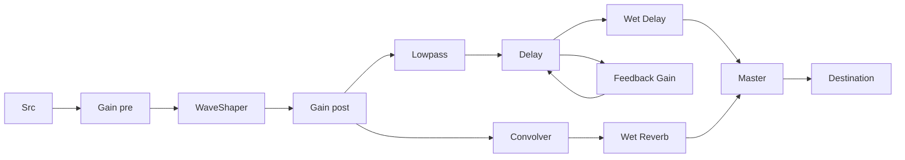

# 📘 10 — Effets (Delay, Reverb, Distorsion, Compresseur)

> 🎯 **Objectif du chapitre** : Construire une **chaîne d’effets** (pedalboard) complète avec `DelayNode`, `ConvolverNode` (reverb), `WaveShaperNode` (distorsion) et `DynamicsCompressorNode` (compresseur). Tu verras les **paramètres** et les **modèles** utiles (feedback, dry/wet, IR, oversampling, threshold/ratio/attack/release) avec **formules en JavaScript**, des **schémas Mermaid**, des **exercices**, et des **bonnes pratiques**.

---

## 🧠 Panorama des effets : définitions & pourquoi

- **Delay** : ajoute des **répétitions** du signal (échos) grâce à un **retard** et une **rétroaction** (feedback).
- **Reverb** : simule l’**acoustique** d’un espace (salle, église) via **convolution** avec une **impulsion** (IR).
- **Distorsion** : modifie le **timbre** en appliquant une **courbe non linéaire** (saturation, clipping), génère des **harmoniques**.
- **Compresseur** : réduit la **dynamique**; rend le niveau **plus homogène** (contrôle des pics, glue du mix).

---

## 🧠 Delay : temps, feedback, dry/wet

### 🔢 Modèle discret (pédagogique)
```js
// y[n] = dry*x[n] + wet*(x[n-d] + g*y[n-d])
// d: retard en échantillons, g: feedback (0..1)
function delayStep(xn, past, {dry=0.6, wet=0.4, g=0.35}={}){
  const xDelayed = past.xd;     // x[n-d]
  const yDelayed = past.yd;     // y[n-d]
  return dry*xn + wet*(xDelayed + g*yDelayed);
}
```

### 🔧 `DelayNode` en pratique (avec feedback)
```js
const ctx = new AudioContext();
const src = ctx.createOscillator(); src.frequency.value = 220;

const delay = ctx.createDelay();
delay.delayTime.value = 0.35;   // 350 ms

const feedback = ctx.createGain(); feedback.gain.value = 0.4; // rétroaction
const wet = ctx.createGain(); wet.gain.value = 0.5;
const dry = ctx.createGain(); dry.gain.value = 0.8;

src.connect(dry).connect(ctx.destination);      // voie directe
src.connect(delay).connect(wet).connect(ctx.destination); // voie retardée
// boucle feedback: sortie du delay -> feedback -> entrée du delay
delay.connect(feedback).connect(delay);

// Sur geste: ctx.resume(); src.start();
```

> ⚠️ **Stabilité** : `feedback.gain.value` **< 1** pour éviter la divergence; ajouter un **low-pass** dans la boucle pour adoucir.

### 🔧 Avec **damping** (tone control dans la boucle)
```js
const lpf = ctx.createBiquadFilter(); lpf.type = 'lowpass'; lpf.frequency.value = 1500;
delay.connect(feedback).connect(lpf).connect(delay);
```

---

## 🧠 Reverb : `ConvolverNode` et Impulse Response (IR)

- **Principe** : sortie = **convolution** du signal avec l’**IR** d’un lieu. L’IR capture les **réflexions** et la **queue** de réverbération.
- **Chargement d’IR** : via `fetch` + `decodeAudioData` → `convolver.buffer`.

```js
const ctx = new AudioContext();
const convolver = ctx.createConvolver();

async function loadIR(url){
  const res = await fetch(url, { mode: 'cors' });
  const buf = await res.arrayBuffer();
  const ir = await ctx.decodeAudioData(buf);
  convolver.buffer = ir; // Assigne l’IR
}
```

### 🔧 IR synthétique (exponentielle bruitée)
```js
function makeExponentialIR(ctx, seconds=2, decay=3){
  const rate = ctx.sampleRate;
  const len = Math.floor(seconds * rate);
  const ir = ctx.createBuffer(2, len, rate);
  for(let ch=0; ch<2; ch++){
    const data = ir.getChannelData(ch);
    for(let i=0; i<len; i++){
      const t = i / rate;
      const env = Math.exp(-decay * t);     // enveloppe exp
      data[i] = (Math.random()*2-1) * env; // bruit blanc décayé
    }
  }
  return ir;
}
// Utilisation
convolver.buffer = makeExponentialIR(ctx, 2.2, 2.5);
```

### 🔧 Mix **dry/wet** pour reverb
```js
const src = ctx.createOscillator(); src.frequency.value = 330;
const dry = ctx.createGain(); dry.gain.value = 0.7;
const wet = ctx.createGain(); wet.gain.value = 0.5;

src.connect(dry).connect(ctx.destination);
src.connect(convolver).connect(wet).connect(ctx.destination);
```

> 💡 **Astuce** : place la reverb souvent sur un **bus aux** partagé; ajuste le **send** par piste.

---

## 🧠 Distorsion : `WaveShaperNode` et courbes

- **Principe** : appliquer une **fonction non linéaire** au signal (ex. `tanh`, `arctan`, hard clip), crée des **harmoniques**.
- **Paramètres** : `curve` (Float32Array), `oversample` (`'none'|'2x'|'4x'`).

### 🔢 Courbes courantes (JS)
```js
function makeCurveArctan(amount=2, len=1024){
  const c = new Float32Array(len);
  for(let i=0;i<len;i++){
    const x = i/(len-1)*2 - 1;     // -1..1
    c[i] = Math.atan(amount * x) / Math.atan(amount);
  }
  return c;
}

function makeCurveTanh(amount=2.5, len=1024){
  const c = new Float32Array(len);
  for(let i=0;i<len;i++){
    const x = i/(len-1)*2 - 1;
    c[i] = Math.tanh(amount * x);
  }
  return c;
}

function makeCurveHardClip(th=0.6, len=1024){
  const c = new Float32Array(len);
  for(let i=0;i<len;i++){
    const x = i/(len-1)*2 - 1;
    c[i] = Math.max(-th, Math.min(th, x)) / th;
  }
  return c;
}
```

### 🔧 Chaîne de distorsion (pré/post gain, oversampling)
```js
const ctx = new AudioContext();
const src = ctx.createOscillator(); src.frequency.value = 110;
const pre = ctx.createGain(); pre.gain.value = 3.0;   // pré‑gain (drive)
const dist = ctx.createWaveShaper(); dist.curve = makeCurveArctan(3.5); dist.oversample = '4x';
const post = ctx.createGain(); post.gain.value = 0.5; // post‑gain (output)

src.connect(pre).connect(dist).connect(post).connect(ctx.destination);
// Sur geste: ctx.resume(); src.start();
```

> ⚠️ **Aliasing** : la distorsion génère des **harmoniques** hautes → risque d’aliasing. L’**oversampling** et un **lowpass** post‑distorsion aident.

---

## 🧠 Compresseur : `DynamicsCompressorNode`

- **Paramètres** :
  - `threshold` (dB) — niveau où la compression démarre.
  - `knee` (dB) — douceur autour du seuil (transition progressive).
  - `ratio` — rapport de compression (ex. 4:1).
  - `attack` (s) — temps avant action.
  - `release` (s) — temps pour relâcher.

### 🔢 Modèle statique (pédagogique)
```js
// Sortie (dB) pour entrée au-dessus du seuil (approx.)
function compressDB(inputDB, {threshold=-24, ratio=4, knee=6}={}){
  if (inputDB < threshold - knee/2) return inputDB; // en-dessous: pas de compression
  // zone knee (douce): approximation simple
  if (inputDB < threshold + knee/2){
    const x = (inputDB - (threshold - knee/2)) / knee; // 0..1
    const comp = (inputDB - threshold) / ratio;        // target compressée
    const dry = inputDB;                              // target non compressée
    return dry*(1 - x) + comp*x;                      // interp. progressive
  }
  // au-dessus du seuil + knee/2
  return threshold + (inputDB - threshold) / ratio;
}
```

### 🔧 Utilisation pratique
```js
const ctx = new AudioContext();
const comp = ctx.createDynamicsCompressor();
comp.threshold.value = -24;
comp.knee.value = 6;
comp.ratio.value = 4;
comp.attack.value = 0.003;
comp.release.value = 0.25;

// Chaîne: src -> comp -> out
const src = ctx.createOscillator(); src.frequency.value = 220;
src.connect(comp).connect(ctx.destination);
// Sur geste: ctx.resume(); src.start();
```

> 💡 **Astuce** : place un compresseur sur le **master** pour contrôler les **pics**; surveille le **gain reduction** (via DevTools/inspection ou métrologie maison).

---

## 🧠 Pedalboard : chaînage et bus aux

### 🔧 Chaîne **série** (dist → EQ → delay → reverb → master)
```js
const ctx = new AudioContext();

// Source (ex. buffer ou osc)
const src = ctx.createOscillator(); src.type = 'sawtooth'; src.frequency.value = 110;

// Distorsion
const pre = ctx.createGain(); pre.gain.value = 2.5;
const dist = ctx.createWaveShaper(); dist.curve = makeCurveTanh(3.0); dist.oversample = '4x';
const post = ctx.createGain(); post.gain.value = 0.6;

// EQ simple (lowpass)
const lpf = ctx.createBiquadFilter(); lpf.type = 'lowpass'; lpf.frequency.value = 5000;

// Delay + wet
const delay = ctx.createDelay(); delay.delayTime.value = 0.28;
const fb = ctx.createGain(); fb.gain.value = 0.35;
const wetDelay = ctx.createGain(); wetDelay.gain.value = 0.35;

// Reverb (convolver) + wet
const rev = ctx.createConvolver(); rev.buffer = makeExponentialIR(ctx, 2.5, 2.2);
const wetRev = ctx.createGain(); wetRev.gain.value = 0.4;

// Master
const master = ctx.createGain(); master.gain.value = 0.8;

// Routage série
src.connect(pre).connect(dist).connect(post)
   .connect(lpf)
   .connect(delay).connect(wetDelay).connect(master)
// boucle feedback delay
delay.connect(fb).connect(delay);
// branche reverb en parallèle depuis post (post‑dist EQ)
post.connect(rev).connect(wetRev).connect(master);
// sortie
master.connect(ctx.destination);
// Sur geste: ctx.resume(); src.start();
```

### 🧩 Schéma (Mermaid) — Pedalboard


> 💡 **Dry/Wet** : pour un contrôle global, tu peux aussi splitter la chaîne avant effets et mixer **dry** + **wet** sur un bus.

---

## 🧠 Mesures & monitoring (VU, peak)

```js
const analyser = ctx.createAnalyser(); analyser.fftSize = 1024;
master.connect(analyser);
const buf = new Float32Array(analyser.fftSize);
function meter(){
  analyser.getFloatTimeDomainData(buf);
  let peak = 0; let acc = 0;
  for(let i=0;i<buf.length;i++){ peak = Math.max(peak, Math.abs(buf[i])); acc += buf[i]*buf[i]; }
  const rms = Math.sqrt(acc/buf.length);
  console.log('peak', peak.toFixed(3), 'rms', rms.toFixed(3));
  requestAnimationFrame(meter);
}
requestAnimationFrame(meter);
```

---

## 🔧 Exercices (progressifs)

1. **Delay** : ajoute un **lowpass** dans la boucle feedback et écoute l’adoucissement.
2. **Reverb** : charge une **IR réelle** (hall/church) et compare avec l’IR synthétique.
3. **Distorsion** : teste `arctan`, `tanh`, `hard clip` + oversampling; ajoute un **lowpass** post‑dist.
4. **Compresseur** : ajuste `threshold`/`ratio`/`attack`/`release` et observe l’effet sur le **rms/peak**.
5. **Pedalboard** : crée un **toggle** pour bypasser chaque effet; implémente un **mix Dry/Wet global**.
6. **Aux bus** : mets la reverb en **aux** partagé; contrôle un **potard de send** par piste.

---

## 💡 Astuces & bonnes pratiques

- **Feedback < 1** pour le delay; ajouter **damping** pour naturel.
- **IR** : préférer des **IR stéréo** pour une reverb riche; attention à la **taille** (mémoire/CPU).
- **Distorsion** : éviter les **prégains extrêmes**; filtrer après pour limiter les **aigus** durs.
- **Compressor** : viser un **gain reduction** modéré (ex. −3..−6 dB) pour garder la **musicalité**.
- **Ordre des effets** : typique en guitare : dist → EQ → delay → reverb ; en mix bus : EQ/comp → delay/rev.
- **Niveaux** : surveiller le **clipping**; utiliser un **master < 1.0**.

---

## ⚠️ Pièges fréquents

- **Boucle sans latence** (feedback direct) → comportement indéterminé; toujours via `DelayNode`.
- **IR mal calibrée** (gain trop haut) → **saturation**; baisser le **wet**.
- **WaveShaper sans oversampling** → aliasing marqué; activer `'2x'/'4x'` si disponible.
- **Compression trop forte** → son **pompé**/**écrasé**; monter `attack`/`release` et réduire `ratio`.

---

## 🛠️ (Optionnel) TypeScript — mini service Pedalboard
```ts
// pedalboard.ts
export class Pedalboard {
  readonly ctx: AudioContext;
  readonly pre: GainNode;
  readonly dist: WaveShaperNode;
  readonly post: GainNode;
  readonly lpf: BiquadFilterNode;
  readonly delay: DelayNode;
  readonly fb: GainNode;
  readonly wetDelay: GainNode;
  readonly rev: ConvolverNode;
  readonly wetRev: GainNode;
  readonly master: GainNode;

  constructor(ctx = new AudioContext()){
    this.ctx = ctx;
    this.pre = ctx.createGain(); this.pre.gain.value = 2.0;
    this.dist = ctx.createWaveShaper(); this.dist.curve = makeCurveTanh(3.0); this.dist.oversample = '4x';
    this.post = ctx.createGain(); this.post.gain.value = 0.6;
    this.lpf = ctx.createBiquadFilter(); this.lpf.type = 'lowpass'; this.lpf.frequency.value = 5000;
    this.delay = ctx.createDelay(); this.delay.delayTime.value = 0.28;
    this.fb = ctx.createGain(); this.fb.gain.value = 0.35;
    this.wetDelay = ctx.createGain(); this.wetDelay.gain.value = 0.35;
    this.rev = ctx.createConvolver(); this.rev.buffer = makeExponentialIR(ctx, 2.5, 2.2);
    this.wetRev = ctx.createGain(); this.wetRev.gain.value = 0.4;
    this.master = ctx.createGain(); this.master.gain.value = 0.8;

    // routage
    this.pre.connect(this.dist).connect(this.post).connect(this.lpf)
      .connect(this.delay).connect(this.wetDelay).connect(this.master);
    this.delay.connect(this.fb).connect(this.delay);
    this.post.connect(this.rev).connect(this.wetRev).connect(this.master);
    this.master.connect(ctx.destination);
  }

  attachSource(src: AudioNode){ src.connect(this.pre); }
  get output(){ return this.master; }
}
```

---

## 🧾 Résumé du chapitre (points clés)

- **Delay** : `DelayNode` + feedback (<1), dry/wet; **damping** possible.
- **Reverb** : `ConvolverNode` avec **IR** réelle ou synthétique; placer en **aux**.
- **Distorsion** : `WaveShaperNode` + **courbe** (`tanh`, `arctan`, clip), **oversample** pour limiter l’aliasing.
- **Compresseur** : `DynamicsCompressorNode` — `threshold`, `ratio`, `attack`, `release`, `knee`.
- **Pedalboard** : chaînage en **série** + **bus aux**, contrôles **dry/wet**.
- **Bonnes pratiques** : surveiller niveaux, limiter aliasing, calibrer IR, compression modérée.

---

> ✅ **Prochaines étapes** : **Chapitre 11 — Microphone et traitement en temps réel** : `getUserMedia`, entrée **live**, VU‑mètre, et gate/filtre en direct.
