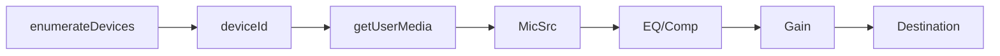

# 📘 11 — Microphone et traitement en temps réel

> 🎯 **Objectif du chapitre** : Obtenir l’entrée **micro** du navigateur via `getUserMedia`, créer un `MediaStreamAudioSourceNode`, traiter le son **en direct** (VU‑mètre, gate simple, EQ), gérer **latence/écho** et **permissions**, choisir la **source d’entrée** et nettoyer correctement les **tracks**.

---

## 🧠 Prérequis & sécurité

- **HTTPS requis** pour accéder aux périphériques (micro/caméra).
- **Permission utilisateur** : le navigateur affiche un **prompt**. Respecter le geste utilisateur et **expliquer** l’usage.
- **Autoplay & micro** : l’acquisition micro n’est pas soumise à l’autoplay, mais la **lecture** (loopback) l’est; utiliser `ctx.resume()` sur geste.

---

## 🧠 Obtenir le flux micro : `getUserMedia`

### 🎛️ Contraintes utiles
- `echoCancellation: true` — réduit le **larsen**/écho (pour le chat).
- `noiseSuppression: true` — atténue le **bruit** ambiant.
- `autoGainControl: false` — éviter les variations de niveau automatiques.
- `latency` (hint) — cible de latence si disponible.

```js
async function getMicStream(constraints = {
  audio: {
    echoCancellation: true,
    noiseSuppression: true,
    autoGainControl: false,
    channelCount: 1,        // mono conseillé
    sampleRate: 44100,      // hint, pas garanti
    latency: 0              // hint (faible latence)
  }
}){
  try {
    const stream = await navigator.mediaDevices.getUserMedia(constraints);
    return stream;
  } catch (err) {
    console.error('getUserMedia error:', err.name, err.message);
    throw err;
  }
}
```

---

## 🧠 Créer la source audio du graph : `MediaStreamAudioSourceNode`

```js
const ctx = new AudioContext();
const stream = await getMicStream();
const mic = ctx.createMediaStreamSource(stream);

// Exemple de chaîne: mic -> analyser -> destination (loopback)
const analyser = ctx.createAnalyser(); analyser.fftSize = 1024;
const master = ctx.createGain(); master.gain.value = 0.0; // par défaut, pas de loopback

mic.connect(analyser);
analyser.connect(master).connect(ctx.destination);

// Sur geste utilisateur: await ctx.resume();
```

> ⚠️ **Loopback** (écouter sa propre voix) peut créer un **larsen** sans casque. Utiliser `echoCancellation: true` et **baisser** `master.gain`.

---

## 🧪 VU‑mètre en temps réel (RMS + peak)

```js
function attachVUMeter(analyser, canvas){
  const ctx2d = canvas.getContext('2d');
  const w = canvas.width, h = canvas.height;
  const buf = new Float32Array(analyser.fftSize);
  let ema = 0; const alpha = 0.85; // lissage EMA

  function draw(){
    analyser.getFloatTimeDomainData(buf);
    // RMS
    let acc = 0, peak = 0;
    for(let i=0;i<buf.length;i++){ acc += buf[i]*buf[i]; peak = Math.max(peak, Math.abs(buf[i])); }
    const rms = Math.sqrt(acc / buf.length);
    // EMA pour stabilité visuelle
    ema = (1-alpha) * rms + alpha * ema;

    ctx2d.clearRect(0,0,w,h);
    // Barre RMS
    ctx2d.fillStyle = '#1f77b4';
    ctx2d.fillRect(10, h-20, (w-20) * Math.min(ema, 1), 10);
    // Pic
    ctx2d.fillStyle = '#d62728';
    ctx2d.fillRect(10 + (w-20) * Math.min(peak, 1), h-35, 2, 25);

    requestAnimationFrame(draw);
  }
  requestAnimationFrame(draw);
}
```

---

## 🧠 Gate simple (ouverture/fermeture sur seuil)

> 💡 **Idée** : si `RMS` < **seuil**, on coupe la sortie (via `GainNode`). On lisse l’ouverture/fermeture avec `setTargetAtTime`.

```js
function attachGate(analyser, outGain, {threshold=0.02, openTau=0.03, closeTau=0.15}={}){
  const buf = new Float32Array(analyser.fftSize);
  let isOpen = false;

  function tick(){
    analyser.getFloatTimeDomainData(buf);
    let acc = 0; for(let i=0;i<buf.length;i++) acc += buf[i]*buf[i];
    const rms = Math.sqrt(acc / buf.length);
    const now = outGain.context.currentTime;
    if (!isOpen && rms >= threshold){
      isOpen = true;
      outGain.gain.setTargetAtTime(1, now, openTau);
    } else if (isOpen && rms < threshold){
      isOpen = false;
      outGain.gain.setTargetAtTime(0, now, closeTau);
    }
    requestAnimationFrame(tick);
  }
  requestAnimationFrame(tick);
}

// Utilisation
const gateOut = ctx.createGain(); gateOut.gain.value = 0;
mic.connect(analyser);
analyser.connect(gateOut).connect(ctx.destination);
attachGate(analyser, gateOut, { threshold: 0.025 });
```

> ⚠️ **Note** : Ce gate est **basique** et sensible au **bruit**; pour meilleure performance, préférer **AudioWorklet** pour un traitement audio‑rate.

---

## 🧠 Choisir l’entrée (device) & permissions

```js
// Lister devices (après une première permission accordée)
const devices = await navigator.mediaDevices.enumerateDevices();
const inputs = devices.filter(d => d.kind === 'audioinput');
console.table(inputs.map(d => ({label: d.label, deviceId: d.deviceId})));

// Sélectionner un device spécifique
async function getMicByDeviceId(deviceId){
  return await navigator.mediaDevices.getUserMedia({ audio: { deviceId, echoCancellation: true } });
}
```

> 💡 **Astuce** : Les **labels** des devices ne sont accessibles **qu’après** autorisation.

---

## 🧠 Latence, sample rate & stabilité

- **Latence** : dépend du **matériel** et du navigateur; viser un **buffer court** (Web Audio est interne).
- **Sample rate** : `ctx.sampleRate` (souvent 44.1 kHz/48 kHz). Le flux micro peut être **resamplé**.
- **Suspension** : `ctx.suspend()` met l’audio en pause (l’horloge n’avance plus). Reprendre avec `ctx.resume()`.
- **Nettoyage** : `stream.getTracks().forEach(t => t.stop())` pour **libérer** le micro; `node.disconnect()` pour le graphe.

```js
function stopMic(stream){ stream.getTracks().forEach(t => t.stop()); }
```

---

## 🧩 Schémas Mermaid

### Micro → Gate → Destination (avec VU)
```mermaid
graph LR
  Mic[MediaStreamAudioSource] --> An[Analyser]
  An --> Gate[Gain (gate)]
  Gate --> Out[Destination]
```

### Sélection d’entrée & Loopback contrôlé


---

## 🔧 Exercices (progressifs)

1. **VU‑mètre** : ajoute un slider de **lissage** (alpha) et observe la réactivité.
2. **Gate** : ajuste `threshold/openTau/closeTau` pour un environnement **bruyant**/**silencieux**.
3. **EQ live** : place un `BiquadFilter` (chap. 5) après le micro et balaye la fréquence.
4. **Comp live** : ajoute un `DynamicsCompressorNode` pour contrôler les **pics**.
5. **Sélection device** : liste les `audioinput` et propose un menu **select** pour choisir la source.
6. **Nettoyage** : implémente un bouton **Stop** qui appelle `stopMic(stream)` et `disconnect()`.

---

## 💡 Astuces & bonnes pratiques

- **Casque** recommandé pour éviter **larsen** en loopback.
- **Réglages** : commencer avec `echoCancellation`/`noiseSuppression` **activés** pour la voix.
- **UI** : afficher l’état **permission accordée/refusée** et **device sélectionné**.
- **Performance** : limiter les **visualisations** coûteuses; utiliser `requestAnimationFrame`.

---

## ⚠️ Pièges fréquents

- **Oublier** `HTTPS` → `getUserMedia` échoue.
- **Labels vides** : sans permission, `enumerateDevices()` ne donne pas de labels.
- **Loopback trop fort** : feedback; baisser `master.gain` ou activer `echoCancellation`.
- **Ne pas stopper** les tracks → micro reste allumé.

---

## 🧾 Résumé du chapitre (points clés)

- **Micro** via `getUserMedia` (contraintes de réduction de bruit/écho).
- **Source** `MediaStreamAudioSourceNode` dans le **graph** Web Audio.
- **VU‑mètre** en **temps réel** (RMS + peak) et **gate** basique.
- **Devices** : `enumerateDevices` → choisir `deviceId`.
- **Latence & nettoyage** : surveiller `ctx.state`, stopper les **tracks** proprement.

---

> ✅ **Prochaines étapes** : **Chapitre 12 — AudioWorklet (processing custom) & WASM (intro)** : créer un processeur sur le thread audio et préparer des DSP plus avancés.
