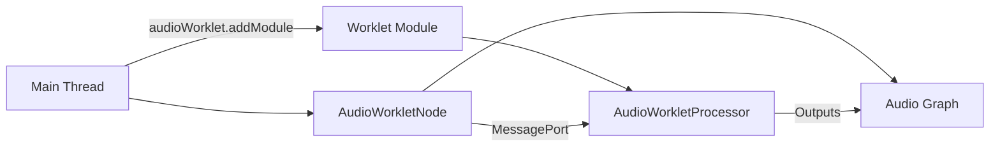

# 📘 12 — AudioWorklet (processing custom) & WASM (intro)

> 🎯 **Objectif du chapitre** : Écrire des **processeurs audio personnalisés** côté **thread audio** avec **AudioWorklet** (DSP en JavaScript) : structure `AudioWorkletProcessor`, `AudioWorkletNode`, **paramètres** (`a-rate`/`k-rate`), **messagerie** (port), règles de **performance**, et **introduction WASM** (pour DSP intensif). Tu construiras un **gain custom**, un **LFO interne**, et verras comment **échanger des données** efficacement.

---

## 🧠 Pourquoi AudioWorklet ?

- **Définition** : **AudioWorklet** permet d’exécuter du **DSP** (traitement du signal) **dans le thread audio** — isolé du main — avec **latence minimale** et **timing déterministe**.
- **Pourquoi** : Les APIs côté main (ex. `ScriptProcessorNode`, obsolète) subissent le **jank** du UI. AudioWorklet garantit que `process()` est appelé **à chaque quantum** (souvent **128 frames**) sans blocages visuels.
- **Analogie** : Imagine une **cuisine** (main thread) et une **station automatique** (audio thread). Tu donnes des **instructions** à la station; elle produit les **frames audio** sans attendre que la cuisine serve les clients.

---

## 🧠 Architecture (Node ↔ Processor) & cycle

### 📌 Concepts
- **`AudioWorkletProcessor`** (fichier module) : classe qui fournit `process(inputs, outputs, parameters)`.
- **`AudioWorkletNode`** (côté main) : crée le **nœud** qu’on connecte dans le graphe et qui instancie le processeur.
- **`audioWorklet.addModule(url)`** : charge le **module** (JS) **séparé** qui contient `registerProcessor()`.
- **Horloge audio** côté worklet : **globaux** `currentFrame`, `currentTime`, `sampleRate`. Un **quantum** = typiquement **128 frames**.

### 🧩 Schéma (Mermaid)


---

## 🧠 Paramètres (`AudioParam`) : `a-rate` vs `k-rate`

- **`parameterDescriptors`** : décrit les **AudioParam** exposés par le processeur.
- **`automationRate`** :
  - **`'a-rate'`** : **une valeur par frame** (tableau de longueur = quantum, ex. 128). Idéal pour **modulations rapides**.
  - **`'k-rate'`** : **une valeur par bloc** (constante sur le quantum). Suffisant pour **contrôles lents**.

```js
// worklet-processor.js
class MyGainProcessor extends AudioWorkletProcessor {
  static get parameterDescriptors() {
    return [
      { name: 'gain', defaultValue: 1.0, minValue: 0, maxValue: 4, automationRate: 'a-rate' },
      { name: 'lfoFreq', defaultValue: 0.0, minValue: 0, maxValue: 20, automationRate: 'k-rate' },
    ];
  }
  constructor(){ super(); this.phase = 0; }
  process(inputs, outputs, parameters) {
    const input = inputs[0];
    const output = outputs[0];
    const sr = sampleRate; // global côté worklet
    const gainBlock = parameters.gain;
    const lfoFreqBlock = parameters.lfoFreq;
    const lfoHz = lfoFreqBlock.length === 1 ? lfoFreqBlock[0] : lfoFreqBlock[0];
    const twoPi = 2 * Math.PI;
    for (let ch = 0; ch < output.length; ch++) {
      const inCh = input[ch] || input[0];
      const outCh = output[ch];
      for (let i = 0; i < outCh.length; i++) {
        const lfo = lfoHz > 0 ? Math.sin(this.phase) * 0.5 + 0.5 : 1.0;
        const g = (gainBlock.length === 1 ? gainBlock[0] : gainBlock[i]) * lfo;
        outCh[i] = inCh ? inCh[i] * g : 0;
        this.phase += twoPi * (lfoHz / sr);
        if (this.phase > twoPi) this.phase -= twoPi;
      }
    }
    return true; // continuer
  }
}
registerProcessor('my-gain-processor', MyGainProcessor);
```

---

## 🧪 Utilisation côté main (`AudioWorkletNode`)

```js
const ctx = new AudioContext();
await ctx.audioWorklet.addModule('worklet-processor.js');

// Crée le node à partir du nom enregistré
const node = new AudioWorkletNode(ctx, 'my-gain-processor', {
  numberOfInputs: 1,
  numberOfOutputs: 1,
  outputChannelCount: [1],
  parameterData: { gain: 0.9, lfoFreq: 3.0 },
});

// Exemple: osc -> node -> destination
const osc = ctx.createOscillator(); osc.type = 'sawtooth'; osc.frequency.value = 110;
osc.connect(node).connect(ctx.destination);
// Sur geste: await ctx.resume(); osc.start();
```

> 💡 **Astuce** : `parameterData` fixe les **valeurs initiales**. Tu peux ensuite automatiser via `node.parameters.get('gain')` comme n’importe quel `AudioParam`.

---

## 🧠 Messagerie (`MessagePort`) : échanger des données

- **Ports** : `node.port` (main) ↔ `this.port` (processor). 
- **Usage** : envoyer des **commandes** (preset, bypass), des **états**, ou des **blocs** (petits) de données.

```js
// main
node.port.onmessage = (e) => console.log('from processor:', e.data);
node.port.postMessage({ type: 'preset', value: 'bright' });

// processor
class MyProc extends AudioWorkletProcessor {
  constructor(){
    super();
    this.port.onmessage = (e) => {
      const msg = e.data;
      if (msg.type === 'preset') {
        // appliquer preset ...
        this._preset = msg.value;
      }
    };
  }
  process(inputs, outputs){ /* ... */ return true; }
}
registerProcessor('my-proc', MyProc);
```

> ⚠️ **Performance** : éviter les **gros objets** ou allocations fréquentes dans `process()`. Préférer des **flags** pré‑calculés via messages.

---

## 🧠 Bonnes pratiques **DSP** en AudioWorklet

- **Zéro allocation** dans `process()` : réutiliser tableaux, éviter `new`/`concat`/`map`.
- **Maths simples** : éviter trigonométrie coûteuse si possible (lut, approximations).
- **Pas de logs** dans le thread audio.
- **Limiter** le nombre de nœuds worklet; partager via **bus** quand c’est possible.
- **Tester** hors temps réel (chap. 13 — offline) pour valider algos.

---

## 🧠 Exemple : **soft‑clip** dans un processeur

```js
// worklet-softclip.js
class SoftClip extends AudioWorkletProcessor {
  static get parameterDescriptors(){
    return [{ name:'drive', defaultValue: 1.0, minValue: 0.1, maxValue: 5, automationRate:'a-rate' }];
  }
  process(inputs, outputs, parameters){
    const input = inputs[0];
    const output = outputs[0];
    const drive = parameters.drive;
    for (let ch = 0; ch < output.length; ch++) {
      const inCh = input[ch] || input[0];
      const outCh = output[ch];
      for (let i = 0; i < outCh.length; i++) {
        const d = drive.length === 1 ? drive[0] : drive[i];
        const x = inCh ? inCh[i] * d : 0;
        outCh[i] = Math.tanh(x); // soft saturation
      }
    }
    return true;
  }
}
registerProcessor('soft-clip', SoftClip);
```

---

## 🧠 Chaînage & routing avec worklet

```js
await ctx.audioWorklet.addModule('worklet-softclip.js');
const clip = new AudioWorkletNode(ctx, 'soft-clip');
clip.parameters.get('drive').value = 2.5;

const src = ctx.createOscillator(); src.frequency.value = 220;
const lpf = ctx.createBiquadFilter(); lpf.type = 'lowpass'; lpf.frequency.value = 3000;

src.connect(clip).connect(lpf).connect(ctx.destination);
// Sur geste: await ctx.resume(); src.start();
```

---

## 🧠 (Intro) **WASM** pour DSP intensif

- **Pourquoi WASM** : exécuter du DSP **plus rapide** (code C/C++/Rust compilé), **prévisible**, souvent **vectorisé**.
- **Intégration** : main charge le **module WASM** → passe les **pointeurs/buffers** ou **paramètres** au processeur via **port**; le processeur appelle les **exports** WASM pour traiter chaque block.
- **Cross‑origin isolation** : pour **`SharedArrayBuffer`**, la page doit être **isolée** (en-têtes **COOP** & **COEP**). Sans cela, préférer des **messages** ou des **copies**.

### 🔧 Chargement d’un module WASM (côté main)
```js
// wasm-init.js (main thread)
let wasm;
async function initWasm(url){
  const res = await fetch(url);
  const buf = await res.arrayBuffer();
  const mod = await WebAssembly.instantiate(buf, {});
  wasm = mod.instance.exports; // ex.: wasm.process(ptr, len)
}
await initWasm('dsp.wasm');
```

### 🔧 Liaison avec AudioWorklet (message port)
```js
// main
await ctx.audioWorklet.addModule('worklet-wasm.js');
const node = new AudioWorkletNode(ctx, 'wasm-proc');
node.port.postMessage({ type:'wasm-ready' });

// worklet-wasm.js
class WasmProc extends AudioWorkletProcessor {
  constructor(){
    super();
    this.port.onmessage = (e) => {
      if (e.data.type === 'wasm-ready') {
        // ici, tu peux initialiser des buffers, etc.
      }
    };
  }
  process(inputs, outputs){
    // Appeler wasm.process(...) si exposé via global/capturé
    return true;
  }
}
registerProcessor('wasm-proc', WasmProc);
```

> ⚠️ **Remarques** : partager des **buffers** entre main et worklet est délicat; pour de vraies perf, vise **SharedArrayBuffer** (nécessite **isolation**), sinon **copie** par messages.

---

## 🧠 Tests & debugging spécifiques

- **Structure des buffers** : `inputs[port][channel][frame]`. Vérifier **longueurs** et **canaux**.
- **Silence** : si `input[ch]` est `undefined`, la source est **absente**; retourne **0**.
- **Retour `false`** : arrête le processeur (et le node) quand tu n’as plus besoin.
- **DevTools** : onglet **Sources** pour le module worklet; ajouter des **breakpoints** hors `process()` (éviter logs en temps réel).

---

## 🧩 Schémas Mermaid

### Node ↔ Processor ↔ Graph
```mermaid
graph LR
  App[Main] --> addModule[addModule(url)]
  addModule --> Mod[Worklet Module]
  Mod --> Proc[AudioWorkletProcessor]
  App --> Node[AudioWorkletNode]
  Node --> Port[MessagePort]
  Port --> Proc
  Node --> Graph[Audio Graph]
  Proc --> Graph
```

### Paramètres `a-rate` vs `k-rate`
```mermaid
graph LR
  aRate[a-rate (valeur par frame)] --> Fast[Modulations rapides]
  kRate[k-rate (valeur par bloc)] --> Slow[Contrôles lents]
```

---

## 🔧 Exercices (progressifs)

1. **Gain custom** : implémente `MyGainProcessor` avec `gain (a-rate)` et un LFO `k-rate`.
2. **Soft‑clip** : ajoute un paramètre `drive` et protège des **valeurs extrêmes**.
3. **Ring mod** : multiplie l’entrée par `sin(2πf·t)` avec `f` paramétrable (`k-rate`).
4. **WASM mock** : simule un appel `wasm.process(buffer)` dans `process()`; plus tard, remplace par un vrai module.
5. **MessagePort** : envoie un message `preset` et applique un set de paramètres côté processeur.
6. **Perf** : mesure le **CPU** en changeant la complexité et le nombre de nœuds worklet.

---

## 💡 Astuces & bonnes pratiques

- **Files distincts** : le **module worklet** doit être un **fichier séparé** chargé avec `addModule()`.
- **Bundler** : exporte le module worklet comme **asset** accessible (et non inliné) pour le charger par URL.
- **Paramètres** : choisis `a-rate` seulement si nécessaire (coût plus élevé).
- **Isolation** : pour **SharedArrayBuffer**, configure **COOP/COEP**; sinon utilise **postMessage**.
- **Retour `false`** quand le nœud doit s’arrêter; libère les références.

---

## ⚠️ Pièges fréquents

- **Allocations** dans `process()` → **GC** et **glitches**.
- **Logs** dans le thread audio → **jank**.
- **Modules** introuvables (`addModule`) → vérifier **chemins**/CORS.
- **Param mal décrit** → `parameters.name` `undefined`; toujours fournir `parameterDescriptors`.

---

## 🧾 Résumé du chapitre (points clés)

- **AudioWorklet** = DSP côté **thread audio** via `AudioWorkletProcessor` + `AudioWorkletNode`.
- **Paramètres** : `a-rate` (par frame) vs `k-rate` (par bloc); déclarer via `parameterDescriptors`.
- **Messagerie** : `MessagePort` pour commandes/états; éviter grosses charges.
- **WASM (intro)** : accélérer DSP; pour partage mémoire → **COOP/COEP**.
- **Perf** : zéro allocation, pas de logs, limiter complexité et nombre de worklets.

---

> ✅ **Prochaines étapes** : **Chapitre 13 — OfflineAudioContext (rendu hors temps réel)** : mixdown, normalisation et export.
