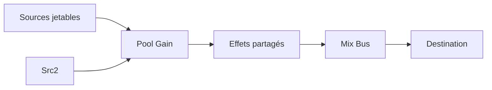

# 📘 14 — Performance, mémoire, et robustesse

> 🎯 **Objectif du chapitre** : Te donner une **méthodologie concrète** pour profiler et **optimiser** tes graphes Web Audio, **éviter les fuites** mémoire, dimensionner la **latence** et rendre ton application **robuste** (comportements prévisibles, gestion d’erreurs, nettoyage). Tu utiliseras des **modèles JS** (temps par quantum, budgets CPU), des **patterns de pool**, et des **checklists** prêtes pour la prod.

---

## 🧠 Comprendre le budget temps d’un rendu audio

- **Quantum audio** : le thread audio traite des **blocs** de `N` frames (souvent `N = 128`). Le temps réel disponible par bloc dépend du **sampleRate**.

### 🔢 Formule JS — temps par quantum
```js
function quantumTime(sampleRate, blockSize = 128){
  return blockSize / sampleRate; // secondes par bloc
}
// Exemples:
// 44.1 kHz -> ~2.902 ms; 48 kHz -> ~2.667 ms
```

> 💡 **Implication** : Tout traitement **par bloc** (AudioWorklet `process()`) doit **terminer** en moins de ce temps — sinon **glitches**.

---

## 🧠 Mesurer (indicatif) sans instrumentation audio

> ℹ️ On ne peut pas chronométrer directement dans le **thread audio**; on **approxime** côté main.

```js
// Approx. d’un budget CPU en observant la régularité du scheduling côté main
let last = performance.now();
function monitorUiJank(){
  const now = performance.now();
  const dt = now - last; // ms entre frames UI
  // si dt >> 16.7 ms (60 fps), l’UI est chargée -> risque si lookahead trop court
  console.log('UI frame dt ~', dt.toFixed(2), 'ms');
  last = now;
  requestAnimationFrame(monitorUiJank);
}
requestAnimationFrame(monitorUiJank);
```

> 💡 **Astuce** : augmente la **fenêtre de lookahead** (chap. 6) si l’UI est parfois bloquée.

---

## 🧠 Latence du contexte

- `AudioContext.baseLatency` : estimateur (s) de la **latence minimale** du pipeline.

```js
const ctx = new AudioContext();
console.log('baseLatency ~', ctx.baseLatency, 's');
```

> ⚠️ **Note** : `baseLatency` est **indicatif** et peut varier selon le navigateur/plateforme.

---

## 🧠 Principes d’optimisation

1. **Planifier à l’avance** (horloge audio) et **éviter** `setTimeout` pour déclencher.
2. **Réduire les re‑connexions** dans le hot‑path : construire le graphe, puis **moduler** via `AudioParam`.
3. **Limiter les nœuds lourds** : `AnalyserNode` à `fftSize` raisonnable; `ConvolverNode` avec IR adaptées.
4. **Pré‑allouer** / **réutiliser** : **pool** de nœuds (surtout `GainNode`, `OscillatorNode` pour courts sons).
5. **AudioWorklet** : traiter en DSP côté audio, **zéro allocation** dans `process()`.
6. **Simplifier le routing** : fan‑in/fan‑out maîtrisés, **bus** clairs.
7. **Limiter les automations** avec granularity inutile : privilégier `k-rate` pour les contrôles lents.

---

## 🧠 Pool de nœuds (pattern)

> 💡 **But** : éviter de **créer/détruire** des dizaines de nœuds par seconde.

```js
class GainPool {
  constructor(ctx, size = 16){
    this.ctx = ctx;
    this.free = [];
    this.busy = new Set();
    for(let i=0;i<size;i++){ const g = ctx.createGain(); g.gain.value = 0; this.free.push(g); }
  }
  acquire(){ const g = this.free.pop() || this.ctx.createGain(); this.busy.add(g); return g; }
  release(g){ try { g.disconnect(); } catch{} g.gain.value = 0; this.busy.delete(g); this.free.push(g); }
}

// Usage: jouer un one‑shot
function playClick(ctx, pool, when){
  const osc = ctx.createOscillator(); osc.type = 'square'; osc.frequency.value = 1000;
  const gain = pool.acquire();
  osc.connect(gain).connect(ctx.destination);
  gain.gain.setValueAtTime(0, when);
  gain.gain.linearRampToValueAtTime(0.8, when + 0.005);
  gain.gain.linearRampToValueAtTime(0, when + 0.02);
  osc.start(when); osc.stop(when + 0.03);
  osc.onended = () => pool.release(gain);
}
```

> ⚠️ **Attention** : Les **sources** (`AudioBufferSourceNode`, `OscillatorNode`) **ne sont pas réutilisables**; seules les **cibles** (gain, filtres, bus) le sont.

---

## 🧠 Nettoyage & cycle de vie (checklist)

- **Sources jetables** : recréer pour chaque lecture (`AudioBufferSourceNode`, `OscillatorNode`).
- **`onended`** : **hook** pour `disconnect()` et libérer **références**.
- **`disconnect()`** systématique en fin d’usage.
- **Buffers** : `src.buffer = null` après lecture si tu ne réutilises pas l’objet.
- **Streams** : `stream.getTracks().forEach(t => t.stop())` (chap. 11).
- **Contexte** : **un seul** `AudioContext` si possible; `ctx.close()` seulement à la fin.

```js
function safePlayBuffer(ctx, buf, when = ctx.currentTime){
  const src = ctx.createBufferSource(); src.buffer = buf;
  const gain = ctx.createGain(); gain.gain.value = 0.8;
  src.connect(gain).connect(ctx.destination);
  src.start(when);
  src.onended = () => { try { src.disconnect(); gain.disconnect(); } catch{} };
}
```

---

## 🧠 Surveiller les fuites (approche pratique)

> ℹ️ En prod, utilise une **stratégie** de comptage (debug) pour vérifier que le nombre de nœuds **stabilise**.

```js
class NodeCounter {
  constructor(){ this.counts = new Map(); }
  track(type){ this.counts.set(type, (this.counts.get(type) || 0) + 1); }
  untrack(type){ this.counts.set(type, (this.counts.get(type) || 1) - 1); }
  dump(){ console.table([...this.counts.entries()].map(([k,v])=>({type:k,count:v}))); }
}
// Exemple: wrapper de création
function createGainTracked(ctx, counter){ counter.track('GainNode'); return ctx.createGain(); }
```

---

## 🧠 Optimiser `AnalyserNode`

- **Choisir `fftSize`** adapté (512–2048); au‑delà, le **coût** augmente.
- **`smoothingTimeConstant`** : lissage **visuel** sans recalculs graphiques excessifs.
- **Rafraîchissement** : limiter les **dessins** (ex. 30 fps au lieu de 60).

```js
function drawSpectrumAtFps(analyser, canvas, fps = 30){
  const bins = new Float32Array(analyser.frequencyBinCount);
  const ctx2d = canvas.getContext('2d');
  let last = 0;
  function loop(ts){
    if (!last || (ts - last) >= (1000/fps)){
      analyser.getFloatFrequencyData(bins);
      // ...dessiner les bins...
      last = ts;
    }
    requestAnimationFrame(loop);
  }
  requestAnimationFrame(loop);
}
```

---

## 🧠 AudioWorklet — performances & zero‑allocation

- **Inner loop** : éviter `new`, `Array.prototype.map`, captures lourdes.
- **Paramètres** : `a-rate` seulement si nécessaire; sinon `k-rate`.
- **Math** : tables/LUT pour sin/cos si besoin.

```js
class EfficientProc extends AudioWorkletProcessor {
  static get parameterDescriptors(){ return [{ name:'gain', defaultValue:1, automationRate:'a-rate' }]; }
  process(inputs, outputs, parameters){
    const input = inputs[0]; const output = outputs[0]; const gain = parameters.gain;
    for (let ch=0; ch<output.length; ch++){
      const inCh = input[ch] || input[0]; const outCh = output[ch];
      for (let i=0;i<outCh.length;i++){
        const g = gain.length === 1 ? gain[0] : gain[i];
        outCh[i] = inCh ? inCh[i] * g : 0;
      }
    }
    return true;
  }
}
registerProcessor('efficient-proc', EfficientProc);
```

---

## 🧠 Réduire la complexité du graphe

- **Regrouper** les effets en **bus** communs (reverb aux) plutôt que une reverb par piste.
- **Éviter** les **chaînes profondes** — chaque nœud ajoute du coût.
- **Faire du **offline** pour les traitements lourds (chap. 13).**

---

## 🧠 Robustesse (erreurs, états, UI)

- **Autoplay** : toujours démarrer suite à un **geste utilisateur**.
- **États** du contexte : gérer `running/suspended/closed`; bouton **Play/Pause** fiable.
- **Exceptions** : `start()` deux fois sur une source → erreur; encapsuler `try/catch`.
- **Suspension** : recalculer `nextNoteTime` après `suspend()` (chap. 6).

```js
async function ensureStart(ctx, src){
  await ctx.resume();
  try { src.start(ctx.currentTime + 0.01); } catch { /* déjà démarré */ }
}
```

---

## 🧩 Schémas Mermaid

### Pool et mix bus


### Robustesse du transport
```mermaid
graph LR
  UI[UI Play/Pause] --> Resume[ctx.resume()]
  Resume --> Plan[Recalcule nextNoteTime]
  Plan --> Start[start(when)]
```

---

## 🔧 Exercices (progressifs)

1. **Pool** : implémente un pool de `GainNode` et mesure la diff. vs création/destroy.
2. **Analyser** : compare `fftSize` 512/1024/2048 et cadre le **fps** du dessin.
3. **Worklet** : transforme un processeur en **zéro‑allocation** (profiling visuel).
4. **Bus aux** : partage une **reverb** pour 4 pistes, compare CPU.
5. **Transport** : teste **suspend/resume** et vérifie l’absence de **ratés** (notes planifiées).
6. **Leaks** : crée un compteur de nœuds, assure la **stabilisation** après une session.

---

## 💡 Astuces & bonnes pratiques

- **Un seul `AudioContext`** par appli si possible.
- **Limiter** les **reverbs**/convolvers lourds; préférer bus aux.
- **Dessins** Canvas à **fps** maîtrisé; pas besoin de 60 fps pour un spectre.
- **Toujours** `disconnect()` et **libérer** les références.
- **Automations** : utiliser `k-rate` quand la haute résolution n’est pas nécessaire.

---

## ⚠️ Pièges fréquents

- **Rejouer** une source **jetable** (`AudioBufferSourceNode`) — **ne marche pas**.
- **Boucles feedback sans `DelayNode`** — comportement indéterminé.
- **Oublier** `onended` → nœuds restent connectés.
- **`exponentialRampToValueAtTime(0)`** — interdit; utiliser un **epsilon**.

---

## 🧾 Résumé du chapitre (points clés)

- **Budget audio** : temps par quantum ~ `128/sampleRate` s.
- **Optimisation** : planification à l’avance, moduler via `AudioParam`, pool de nœuds, limiter nœuds lourds.
- **Mémoire** : sources jetables; `onended` + `disconnect()`; libérer buffers & streams.
- **Worklet** : **zéro allocation**, `k-rate` pour contrôles lents.
- **Robustesse** : gérer états du contexte, exceptions, recalcul du transport.

---

> ✅ **Prochaines étapes** : **Chapitre 15 — Politiques, accessibilité, UX et mobile** : autoplay, gestes utilisateur, A11y, et pièges spécifiques au mobile.
