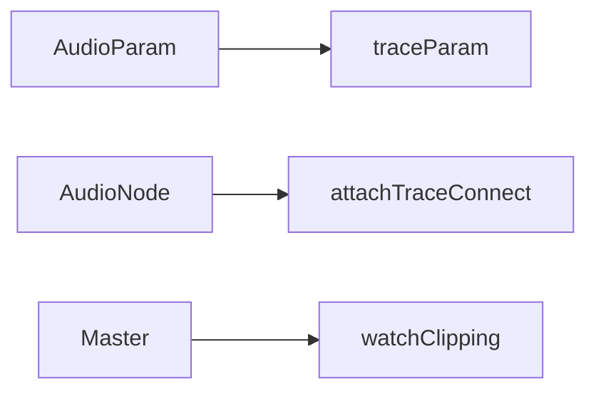

# 📘 16 — Tests et debugging

> 🎯 **Objectif du chapitre** : Mettre en place une **stratégie de tests** et des **outils de debug** pour des applications Web Audio fiables : **tests unitaires** (logiques pures : conversions, scheduling), **tests d’intégration** (stubs/mocks d’`AudioParam`/nœuds), **tests end‑to‑end** (geste utilisateur, transport), vérification par **OfflineAudioContext**, et **traces** utiles (automation, connexions, clipping).

---

## 🧠 Pourquoi tester ? (définition, pourquoi, analogie)

- **Définition** : Tester Web Audio consiste à **valider la logique musicale** (tempo, planning), **l’orchestration du graphe**, et les **contrats d’API** (Automation, start/stop) sans nécessairement produire du son réel en CI.
- **Pourquoi** : éviter les **ratés** de scheduling, les **fuites** de nœuds, les **clippings** en sortie; garantir une **UX prévisible**.
- **Analogie** : Comme un **chef d’orchestre** qui vérifie la **partition** et le **placement** des instruments avant le concert.

---

## 🧠 Périmètre des tests

- **Unitaires (logique pure)** : conversions **BPM ↔ secondes**, **notes ↔ Hz**, **ADSR** calculé, **fenêtre de lookahead**.
- **Intégration (API simulée)** : stubs d’`AudioParam` et de nœuds (gain, filtre) pour **enregistrer** les automations/connexions.
- **End‑to‑end** : geste utilisateur → `resume()` → démarrage du transport; vérification d’états UI.
- **Validation de rendu** : **OfflineAudioContext** pour produire un `AudioBuffer` et **mesurer** RMS/peak/durée.

---

## 🧠 Unitaires (logique pure)

### 🔢 Conversions et tempo (JS)
```js
export function secondsPerBeat(bpm){ return 60 / bpm; }
export function secondsPerStep(bpm, stepsPerBeat = 4){ return (60 / bpm) / stepsPerBeat; }
export function midiToHz(m){ return 440 * Math.pow(2, (m - 69) / 12); }
```

### 🔧 Test minimal (sans framework)
```js
function assertApprox(name, actual, expected, eps = 1e-6){
  if (Math.abs(actual - expected) > eps) throw new Error(`${name}: ${actual} != ${expected}`);
}

// Exemples:
assertApprox('spb@120', secondsPerBeat(120), 0.5);
assertApprox('hz@A4', midiToHz(69), 440);
```

### 🔢 Fenêtre de lookahead
```js
export function nextTimes(currentTime, sp, horizon){
  const out = [];
  let t = currentTime;
  while (t < currentTime + horizon){ t += sp; out.push(t); }
  return out;
}
```

---

## 🧠 Intégration : stubs/mocks pour `AudioParam` et nœuds

> 💡 **Idée** : Simuler l’API pour **capturer** automations & connexions et **affirmer** leurs propriétés (ordre, valeurs, temps).

### 🔧 `StubAudioParam` (capture des automations)
```js
export class StubAudioParam {
  constructor(){ this.events = []; this.value = 0; }
  setValueAtTime(v, t){ this.events.push({ type:'set', v, t }); this.value = v; }
  linearRampToValueAtTime(v, t){ this.events.push({ type:'lin', v, t }); this.value = v; }
  exponentialRampToValueAtTime(v, t){ this.events.push({ type:'exp', v, t }); this.value = v; }
  setTargetAtTime(v, t, tau){ this.events.push({ type:'target', v, t, tau }); this.value = v; }
  cancelScheduledValues(t){ this.events.push({ type:'cancel', t }); }
}
```

### 🔧 `StubGainNode` & `StubNode`
```js
export class StubNode {
  constructor(name){ this.name = name; this.outputs = new Set(); }
  connect(node){ this.outputs.add(node); return node; }
  disconnect(){ this.outputs.clear(); }
}

export class StubGainNode extends StubNode {
  constructor(name = 'Gain'){ super(name); this.gain = new StubAudioParam(); }
}
```

### 🔧 Assertion utilitaire
```js
export function assertEventsSequential(param, types){
  const seq = param.events.map(e => e.type).join(',');
  const expected = types.join(',');
  if (seq !== expected) throw new Error(`events: ${seq} != ${expected}`);
}
```

### 🧪 Exemple : programmer une ADSR sur un stub
```js
import { StubGainNode, assertEventsSequential } from './stubs.js';

function scheduleADSR(currentTime, gainParam, {A=0.01,D=0.2,S=0.5}={}){
  const now = currentTime;
  gainParam.cancelScheduledValues(now);
  gainParam.setValueAtTime(0, now);
  gainParam.linearRampToValueAtTime(1, now + A);
  gainParam.linearRampToValueAtTime(S, now + A + D);
}

const gain = new StubGainNode();
scheduleADSR(10.0, gain.gain, {A:0.02, D:0.2, S:0.5});
assertEventsSequential(gain.gain, ['cancel','set','lin','lin']);
```

---

## 🧠 End‑to‑end minimal : geste utilisateur & transport

### 🔧 Bouton d’activation + transport (test manuel)
```html
<button id="enable">Activer</button>
<button id="play">Play</button>
<button id="pause">Pause</button>
<script>
const ctx = new AudioContext();
let running = false;

enable.onclick = async () => { await ctx.resume(); running = true; };
play.onclick = async () => { if (ctx.state !== 'running') await ctx.resume(); /* démarrer sources */ };
pause.onclick = async () => { await ctx.suspend(); /* arrêter timers */ };
</script>
```

> ⚠️ **Conseil** : vérifie que **aucun son** ne démarre **sans** activation; que la reprise **recalcule** bien les planifications (chap. 6).

---

## 🧠 Validation par OfflineAudioContext

> 💡 **But** : rendre hors temps réel et **mesurer**.

### 🔧 Rendu + mesures
```js
async function measureOffline(seconds = 1.0){
  const sr = 44100; const len = Math.floor(sr * seconds);
  const ctx = new OfflineAudioContext(1, len, sr);
  const osc = ctx.createOscillator(); osc.frequency.value = 440;
  const amp = ctx.createGain(); amp.gain.value = 0.5;
  osc.connect(amp).connect(ctx.destination);
  osc.start(0); osc.stop(seconds);
  const buf = await ctx.startRendering();
  let acc=0, peak=0; const x = buf.getChannelData(0);
  for(let i=0;i<x.length;i++){ acc += x[i]*x[i]; peak = Math.max(peak, Math.abs(x[i])); }
  const rms = Math.sqrt(acc/x.length);
  return { duration: buf.duration, peak, rms };
}
```

### 🔧 Assertion
```js
measureOffline(1.0).then(m => {
  if (Math.abs(m.duration - 1.0) > 1e-3) throw new Error('duration mismatch');
  if (m.peak <= 0) throw new Error('silent render');
});
```

---

## 🧠 Traces & outils de debug maison

### 🔧 Tracer les connexions (graph)
```js
export function attachTraceConnect(){
  const orig = AudioNode.prototype.connect;
  AudioNode.prototype.connect = function(target){
    console.log(`[connect] ${this.constructor.name} -> ${target.constructor.name}`);
    return orig.call(this, target);
  };
}
```

### 🔧 Tracer les automations
```js
export function traceParam(param, label){
  const wrap = (fn, type) => function(...args){
    console.log(`[param:${label}] ${type}`, ...args);
    return fn.apply(this, args);
  };
  param.setValueAtTime = wrap(param.setValueAtTime, 'set');
  param.linearRampToValueAtTime = wrap(param.linearRampToValueAtTime, 'lin');
  param.exponentialRampToValueAtTime = wrap(param.exponentialRampToValueAtTime, 'exp');
  param.setTargetAtTime = wrap(param.setTargetAtTime, 'target');
}
```

### 🔧 Détecter clipping (AnalyserNode)
```js
export function watchClipping(analyser){
  const buf = new Float32Array(analyser.fftSize);
  function loop(){
    analyser.getFloatTimeDomainData(buf);
    let clip = false;
    for(let i=0;i<buf.length;i++){ if (buf[i] >= 0.999 || buf[i] <= -0.999) { clip = true; break; } }
    if (clip) console.warn('CLIPPING detected');
    requestAnimationFrame(loop);
  }
  requestAnimationFrame(loop);
}
```

---

## 🧠 Patterns de conception pour testabilité

- **Service Audio** (façade) : encapsule `AudioContext`, expose des méthodes (**playNote**, **connectEffect**). Permet d’**injecter** des stubs en tests.
- **Séparation** **logiciel/audio** : fonctions de tempo/planning **pures** sans dépendances.
- **Adaptateurs** : objets qui traduisent une **API** (param) en **événements testables**.

### 🔧 Exemple de façade simplifiée
```js
export class AudioEngine {
  constructor(ctx = new AudioContext()){
    this.ctx = ctx;
    this.master = ctx.createGain(); this.master.gain.value = 0.8;
    this.master.connect(ctx.destination);
  }
  async ensureRunning(){ if (this.ctx.state !== 'running') await this.ctx.resume(); }
  playBeep(freq = 440, length = 0.1){
    const osc = this.ctx.createOscillator(); const g = this.ctx.createGain();
    osc.frequency.value = freq; g.gain.value = 0;
    osc.connect(g).connect(this.master);
    const t = this.ctx.currentTime; g.gain.setValueAtTime(0, t); g.gain.linearRampToValueAtTime(0.8, t+0.005);
    g.gain.linearRampToValueAtTime(0, t+length);
    osc.start(t); osc.stop(t+length+0.01);
    return { osc, g };
  }
}
```

---

## 🧩 Schémas Mermaid

### Pyramide des tests
```mermaid
graph LR
  Unit[Unit (logique pure)] --> Int[Integration (stubs)]
  Int --> E2E[End-to-end (UI + gesture)]
  E2E --> Offline[Offline render (validation)]
```

### Traces & contrôles


---

## 🔧 Exercices (progressifs)

1. **Unit** : écris des tests sur `secondsPerBeat`, `midiToHz`, `nextTimes`.
2. **Integration** : utilise `StubAudioParam` pour valider une enveloppe ADSR (ordre et timings).
3. **Offline** : rends 2 s d’un motif avec `OfflineAudioContext`; mesure **duration**, **peak**, **rms**.
4. **Trace** : active `attachTraceConnect()` et vérifie le routage durant la construction du pédalboard (chap. 10).
5. **Clipping** : place `watchClipping()` sur le master; déclenche volontairement un clipping et observe l’alerte.
6. **Façade** : teste `AudioEngine.playBeep()` en **simulation** (stubs) pour vérifier automations.

---

## 💡 Astuces & bonnes pratiques

- **Tester tôt** : la logique de tempo/planning peut être validée **sans** audio réel.
- **Éviter** d’asserter des **valeurs audio** exactes (sensibles aux implémentations); préfère des **invariants** (ordre, temps, bornes).
- **Tracer** en dev, **désactiver** en prod (logs coûteux).
- **Offline** pour les **vérifications de rendu** et les **exports**.

---

## ⚠️ Pièges fréquents

- **Rejouer** un `AudioBufferSourceNode` : impossible → recréer.
- **Automations** exponentielles vers `0` : interdit → utiliser **epsilon**.
- **Planifier** avec `setTimeout` : jitter → préférer **horloge audio**.
- **Oublier** `disconnect()` en fin de test : fuites et états pollués.

---

## 🧾 Résumé du chapitre (points clés)

- **Quatre axes** : unitaires, intégration, end‑to‑end, offline.
- **Stubs** capturent automations & connexions; valider **ordre/temps**.
- **OfflineAudioContext** produit des buffers mesurables (RMS/peak/durée).
- **Traces** (connexions, params) + **détection clipping** pour le debug.
- **Bonnes pratiques** : invariants plutôt que samples exacts; nettoyer les nœuds.

---

> ✅ **Prochaines étapes** : **Chapitre 17 — Intégration : TypeScript, bundlers et frameworks** (service audio typé, Vite/Webpack, Vue/React).
