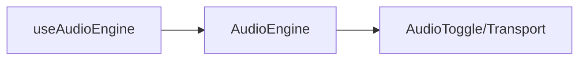

# 📘 17 — Intégration : TypeScript, bundlers et frameworks (Vite/Webpack, Vue/React)

> 🎯 **Objectif du chapitre** : Passer de la théorie à une **application moderne** en JS/TS : structurer un **service audio** typé, configurer **Vite** ou **Webpack**, intégrer l’audio dans **Vue 3** (composable) et **React** (hook), gérer **AudioWorklet**, **assets audio**, **workers**, et mettre en place des **tests unitaires** (Jest) sur la logique.

---

## 🧠 Architecture d’intégration — vue d’ensemble

- **Service Audio (façade)** : encapsule `AudioContext`, expose API haut niveau (play, stop, connect FX).
- **UI** : composants (Vue/React) + **composable/hook** qui consomme le service.
- **Bundler** : Vite (recommandé) ou Webpack. Gère assets (`.wav/.mp3`), modules **worklet**/**workers**.
- **Tests** : Jest pour **logique pure** (tempo/scheduling/conversions), stubs pour `AudioParam`/nœuds (chap. 16).

### 🧩 Schéma (Mermaid)
```mermaid
graph LR
  UI[Vue/React] --> Composable[useAudioEngine / useAudioEngine()] --> Service[AudioEngine (TS)]
  Service --> Graph[Web Audio Graph]
  Service --> Worklet[AudioWorklet]
  Service --> Assets[Audio files]
  Bundler[Vite/Webpack] --> Build[Dev/Prod build]
  Tests[Jest + stubs] --> Logic[Tempo/ADSR]
```

---

## 🛠️ Service Audio (TypeScript) — base typée

```ts
// src/audio/AudioEngine.ts
export class AudioEngine {
  private ctx: AudioContext;
  private master: GainNode;

  constructor(ctx?: AudioContext) {
    this.ctx = ctx ?? new AudioContext();
    this.master = this.ctx.createGain();
    this.master.gain.value = 0.8;
    this.master.connect(this.ctx.destination);
  }

  async ensureRunning() {
    if (this.ctx.state !== 'running') await this.ctx.resume();
  }

  playBeep(freq = 440, length = 0.2) {
    const osc = this.ctx.createOscillator();
    const g = this.ctx.createGain();
    osc.frequency.value = freq;
    g.gain.value = 0;
    osc.connect(g).connect(this.master);
    const t = this.ctx.currentTime;
    g.gain.setValueAtTime(0, t);
    g.gain.linearRampToValueAtTime(0.8, t + 0.01);
    g.gain.linearRampToValueAtTime(0, t + length);
    osc.start(t);
    osc.stop(t + length + 0.02);
    return { osc, gain: g } as const;
  }

  get context() { return this.ctx; }
  get output() { return this.master; }
}
```

> 💡 **Astuce** : Exporte ce service comme **singleton** ou **injectable** via un **provider** (React/Vue) pour le partager.

---

## 🛠️ AudioWorklet — chargement via bundler

> Les modules worklet doivent être **fichiers séparés**. Utilise `new URL('./worklet.js', import.meta.url)` pour laisser le bundler **référencer** correctement.

```js
// src/worklets/my-gain-processor.js (module worklet, pas TypeScript ici)
class MyGainProcessor extends AudioWorkletProcessor {
  static get parameterDescriptors() {
    return [{ name: 'gain', defaultValue: 1, minValue: 0, maxValue: 4, automationRate: 'a-rate' }];
  }
  process(inputs, outputs, params) {
    const input = inputs[0], output = outputs[0];
    const gain = params.gain;
    for (let ch = 0; ch < output.length; ch++) {
      const inCh = input[ch] || input[0];
      const outCh = output[ch];
      for (let i = 0; i < outCh.length; i++) {
        const g = gain.length === 1 ? gain[0] : gain[i];
        outCh[i] = inCh ? inCh[i] * g : 0;
      }
    }
    return true;
  }
}
registerProcessor('my-gain-processor', MyGainProcessor);
```

```ts
// src/audio/worklet-loader.ts
export async function loadGainWorklet(ctx: AudioContext) {
  // URL résolue par le bundler
  const url = new URL('../worklets/my-gain-processor.js', import.meta.url);
  await ctx.audioWorklet.addModule(url);
  return new AudioWorkletNode(ctx, 'my-gain-processor');
}
```

---

## 🛠️ Gestion des **assets audio**

- Charger des `.wav/.mp3` comme **ressources** du bundler et récupérer l’URL : `new URL('./kick.wav', import.meta.url)`.
- Puis `fetch` + `decodeAudioData` (chap. 7).

```ts
// src/audio/load-sample.ts
export async function loadSample(ctx: AudioContext, assetUrl: URL) {
  const res = await fetch(assetUrl);
  const ab = await res.arrayBuffer();
  return await ctx.decodeAudioData(ab);
}

// usage
const kickUrl = new URL('../assets/kick.wav', import.meta.url);
const kickBuf = await loadSample(engine.context, kickUrl);
```

---

## 🛠️ Vite (recommandé) — config & dev

```ts
// vite.config.ts
import { defineConfig } from 'vite';
import vue from '@vitejs/plugin-vue';

export default defineConfig({
  plugins: [vue()],
  build: { target: 'esnext' },
});
```

> 💡 **Pourquoi Vite** : démarrage rapide, HMR fluide, support **`import.meta.url`** natif pour assets/worklets.

### Structure de projet (exemple)
```
src/
  audio/
    AudioEngine.ts
    worklet-loader.ts
    load-sample.ts
  worklets/
    my-gain-processor.js
  components/
    AudioToggle.vue
    Sequencer.vue
  App.vue
  main.ts
assets/
  kick.wav
  snare.wav
```

### Vue 3 — **composable** `useAudioEngine()`
```ts
// src/composables/useAudioEngine.ts
import { ref, onMounted, onUnmounted } from 'vue';
import { AudioEngine } from '@/audio/AudioEngine';

export function useAudioEngine() {
  const engine = new AudioEngine();
  const running = ref(engine.context.state === 'running');

  async function enable() {
    await engine.ensureRunning();
    running.value = true;
  }

  onUnmounted(() => { /* rien: garder le contexte vivant */ });

  return { engine, running, enable } as const;
}
```

### Vue 3 — composant **AudioToggle**
```vue
<!-- src/components/AudioToggle.vue -->
<template>
  <button @click="enable" :disabled="running">🎵 Activer le son</button>
</template>
<script setup lang="ts">
import { useAudioEngine } from '@/composables/useAudioEngine';
const { running, enable } = useAudioEngine();
</script>
```

### Vue 3 — composant **Sequencer** (extrait)
```vue
<template>
  <div class="seq">
    <button @click="play">Play</button>
    <button @click="pause">Pause</button>
  </div>
</template>
<script setup lang="ts">
import { useAudioEngine } from '@/composables/useAudioEngine';
const { engine, enable } = useAudioEngine();

async function play(){ await enable(); engine.playBeep(440, 0.2); }
function pause(){ engine.context.suspend(); }
</script>
```

---

## 🛠️ Webpack — config minimale TypeScript + assets

```js
// webpack.config.js
const path = require('path');
module.exports = {
  mode: 'development',
  entry: './src/main.ts',
  output: { path: path.resolve(__dirname, 'dist'), filename: 'bundle.js', publicPath: '/' },
  module: {
    rules: [
      { test: /\.ts$/, use: 'ts-loader', exclude: /node_modules/ },
      { test: /\.vue$/, use: 'vue-loader' },
      { test: /\.(wav|mp3)$/i, type: 'asset/resource' },
    ]
  },
  resolve: { extensions: ['.ts', '.js'], alias: { '@': path.resolve(__dirname, 'src') } },
  devServer: { static: './dist', hot: true, historyApiFallback: true },
};
```

> 💡 **AudioWorklet avec Webpack** : charge via `new URL('./worklets/...', import.meta.url)` pour laisser **Webpack** émettre un fichier séparé et résolu.

---

## 🛠️ React — **hook** `useAudioEngine()`

```ts
// src/hooks/useAudioEngine.ts
import { useMemo, useState } from 'react';
import { AudioEngine } from '@/audio/AudioEngine';

export function useAudioEngine(){
  const engine = useMemo(() => new AudioEngine(), []);
  const [running, setRunning] = useState(engine.context.state === 'running');

  const enable = async () => { await engine.ensureRunning(); setRunning(true); };

  return { engine, running, enable } as const;
}
```

### React — composant d’activation
```tsx
// src/components/AudioToggle.tsx
import React from 'react';
import { useAudioEngine } from '@/hooks/useAudioEngine';

export function AudioToggle(){
  const { running, enable } = useAudioEngine();
  return <button onClick={enable} disabled={running}>🎵 Activer le son</button>;
}
```

### React — bouton Play/Pause (extrait)
```tsx
import { useAudioEngine } from '@/hooks/useAudioEngine';
export function Transport(){
  const { engine, enable } = useAudioEngine();
  return (
    <div>
      <button onClick={async () => { await enable(); engine.playBeep(440, 0.2); }}>Play</button>
      <button onClick={() => engine.context.suspend()}>Pause</button>
    </div>
  );
}
```

---

## 🛠️ Workers — scheduler hors UI (chap. 6)

```ts
// src/workers/scheduler-worker.ts
self.onmessage = (e) => {
  const { interval } = e.data;
  setInterval(() => (self as any).postMessage({}), interval);
};
```

```ts
// src/audio/scheduler.ts
export function startLookaheadWorker(interval = 25, cb: () => void){
  const url = new URL('../workers/scheduler-worker.ts', import.meta.url);
  const worker = new Worker(url, { type: 'module' });
  worker.onmessage = () => cb();
  worker.postMessage({ interval });
  return worker;
}
```

---

## 🧪 Tests (Jest) — logique pure

```ts
// src/lib/time.ts
export const spb = (bpm:number) => 60/bpm;
export const step = (bpm:number, perBeat=4) => (60/bpm)/perBeat;
export const midiToHz = (m:number) => 440 * Math.pow(2, (m - 69)/12);
```

```ts
// tests/time.spec.ts
import { spb, step, midiToHz } from '@/lib/time';

test('spb@120', () => expect(spb(120)).toBeCloseTo(0.5));
test('step 1/16 at 120', () => expect(step(120, 4)).toBeCloseTo(0.125));
test('A4', () => expect(midiToHz(69)).toBeCloseTo(440));
```

> ℹ️ **Note** : teste la **logique pure**. Pour la Web Audio API, utilise des **stubs** (chap. 16) ou valide via **OfflineAudioContext** hors UI.

---

## 🧠 Production : build, code splitting, robustesse

- **Code splitting** : charger les **worklets**/**workers** à la demande (`new URL(..., import.meta.url)`).
- **Tree shaking** : regrouper utilitaires dans modules **ES** et éviter `require()` dynamiques.
- **Robustesse** : bouton **Activer le son**, gestion des **états** (`resume/suspend`), **visibilité** (chap. 15).
- **Assets** : pré‑charger les samples nécessaires et **réutiliser** les buffers.

---

## 🧩 Schémas Mermaid supplémentaires

### Vue 3 — flux d’activation
```mermaid
graph LR
  Btn[Button Activer] --> Enable[enable()]
  Enable --> Resume[ctx.resume()]
  Resume --> Engine[AudioEngine]
  Engine --> Play[playBeep]
```

### React — hook & composant


---

## 🔧 Exercices (progressifs)

1. **Vite + Vue** : initialise un projet, ajoute `useAudioEngine()` et **AudioToggle**; fais jouer un beep.
2. **Webpack** : configure TS + assets; charge un **worklet** avec `import.meta.url` et vérifie qu’il est pris en compte.
3. **React** : implémente le **hook** et un composant **Transport**; test en local.
4. **Samples** : charge `kick.wav`/`snare.wav` via `new URL()`; déclenche au tempo.
5. **Worker** : ajoute un **scheduler** lookahead dans un Worker; observe la stabilité.
6. **Jest** : écris les tests sur `spb/step/midiToHz` et un stub ADSR; exécute en CI.

---

## 💡 Astuces & bonnes pratiques

- **Worklets**/**workers** → toujours en **fichiers séparés**; charge via `new URL(..., import.meta.url)`.
- **Service audio** partagé via **composable/hook** ; évite plusieurs `AudioContext`.
- **Assets** → préférer **URLs** résolues par bundler (pas chemins relatifs bruts).
- **Tests** → viser la **logique pure** et les **invariants** (ordre/temps) plutôt que des samples exacts.

---

## ⚠️ Pièges fréquents

- **Inliner** un module worklet → non chargé par `addModule`.
- **Chemins** d’assets brisés en prod → utiliser `import.meta.url`.
- **Multiples** `AudioContext` → latence/niveaux incohérents.
- **Tester Web Audio** dans JSDOM → partiel; préférer **stubs**/**OfflineAudioContext**.

---

## 🧾 Résumé du chapitre (points clés)

- **Service audio TS** pour une API claire et testable.
- **Bundling moderne** (Vite/Webpack) : assets, **worklets**, **workers** via `import.meta.url`.
- **Frameworks** : Vue (composable) & React (hook) pour relier l’UI au moteur audio.
- **Tests** : Jest sur la **logique**; stubs & offline pour l’audio.
- **Prod** : code splitting, tree shaking, robustesse UX.

---

> ✅ **Prochaines étapes** : **Chapitre 18 — Projet final (séquenceur + pedalboard)** : assembler tout en une app complète (Vue/React) avec presets et export.
