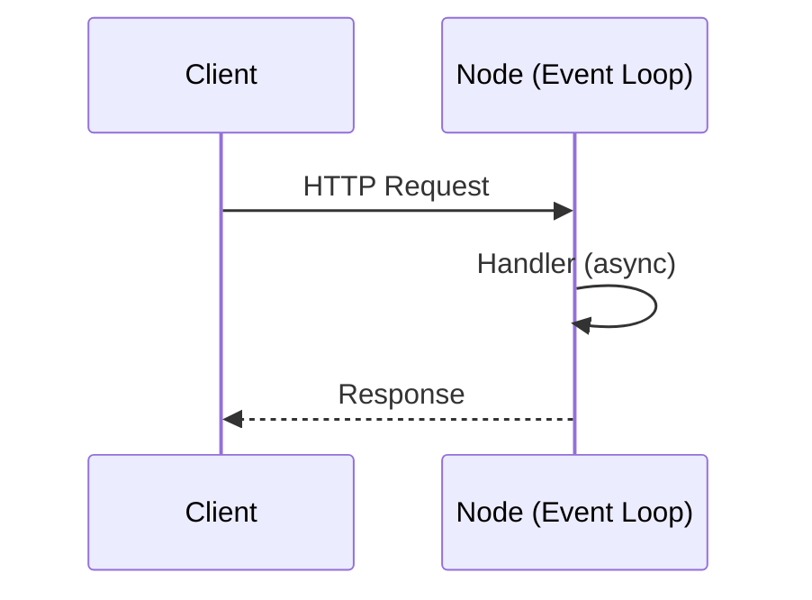

# Module JavaScript Backend — Node.js, NPM & Écosystème

> [!note]
> **Objectif** : Concevoir des **API et services backend** fiables en **Node.js** avec **NPM/PNPM**, **Express/Fastify**, **TypeScript (optionnel)**, **bases de données** (SQL/NoSQL), **authentification**, **sécurité**, **tests**, **observabilité**, **CI/CD** et **déploiement**.
>
> **Livrables** : serveur Node prêt prod, pipeline CI, tests unitaires, docs (OpenAPI), déploiement (Docker/Cloud), checklist sécurité.

---

## Table des matières

- [1. Fondamentaux Node.js](#1-fondamentaux-nodejs)
- [2. NPM/PNPM, package.json & scripts](#2-npmppnm-packagejson--scripts)
- [3. ESM vs CommonJS](#3-esm-vs-commonjs)
- [4. Structure de projet & conventions](#4-structure-de-projet--conventions)
- [5. Serveurs HTTP : Express, Fastify, Koa](#5-serveurs-http--express-fastify-koa)
- [6. Routage, middlewares & validation](#6-routage-middlewares--validation)
- [7. OpenAPI/Swagger & documentation](#7-openapiswagger--documentation)
- [8. Bases de données : SQL & NoSQL](#8-bases-de-donnees--sql--nosql)
- [9. ORMs & ODMs : Prisma, TypeORM, Mongoose](#9-orms--odms--prisma-typeorm-mongoose)
- [10. Authentification & sessions](#10-authentification--sessions)
- [11. Sécurité : OWASP, CORS, CSRF, headers](#11-securite--owasp-cors-csrf-headers)
- [12. Caching, files & uploads, streaming](#12-caching-files--uploads-streaming)
- [13. File d’attente & tâches asynchrones](#13-file-dattente--taches-asynchrones)
- [14. Logs, metrics & tracing](#14-logs-metrics--tracing)
- [15. Tests (unitaires/intégration)](#15-tests-unitairesintegration)
- [16. Performance & scalabilité](#16-performance--scalabilite)
- [17. DevOps : Docker, CI/CD, déploiement](#17-devops--docker-cicd-deploiement)
- [18. Observabilité & monitoring](#18-observabilite--monitoring)
- [19. Exercices guidés avec corrections](#19-exercices-guides-avec-corrections)
- [20. Checklist de référence](#20-checklist-de-reference)
- [21. FAQ](#21-faq)
- [22. Références & ressources](#22-references--ressources)

---

## 1. Fondamentaux Node.js

- **Event loop (libuv)**, **microtâches** (Promises) & **macrotâches**.
- **Modules** (ESM/CommonJS), **V8** (JS engine), **Buffer/streams**.
- Usage typique : **API HTTP**, **workers/queues**, **CLI**, **SSR**.



---

## 2. NPM/PNPM, package.json & scripts

```bash
npm init -y
npm i express zod
npm i -D typescript ts-node nodemon eslint prettier
```

```json
// package.json (extrait)
{
  "type": "module",
  "scripts": {
    "dev": "nodemon --watch src --exec ts-node src/index.ts",
    "build": "tsc -p tsconfig.json",
    "start": "node dist/index.js",
    "lint": "eslint .",
    "format": "prettier -w ."
  }
}
```

> [!tip]
> **PNPM** : plus rapide & économe (`pnpm add ...`). Standardisez un seul gestionnaire.

---

## 3. ESM vs CommonJS

- ESM : `import/export` ; CommonJS : `require/module.exports`.
- Node ≥ 14 supporte ESM nativement ; définissez `"type": "module"`.

---

## 4. Structure de projet & conventions

```
src/
├─ app/            # express/fastify
├─ routes/         # définitions de routes
├─ controllers/    # logique par endpoint
├─ services/       # logique métier
├─ repositories/   # accès données
├─ schemas/        # validation zod/joi
├─ middleware/
├─ config/
├─ utils/
└─ index.ts
```

> [!tip]
> **Séparez** contrôleurs/services/repositories (pattern couches). Envisagez **architecture hexagonale** pour projets complexes.

---

## 5. Serveurs HTTP : Express, Fastify, Koa

### Express (classique)
```ts
import express from 'express'
const app = express()
app.use(express.json())
app.get('/health', (req, res) => res.json({ ok: true }))
app.listen(3000)
```

### Fastify (performant)
```ts
import Fastify from 'fastify'
const app = Fastify()
app.get('/health', async () => ({ ok: true }))
await app.listen({ port: 3000 })
```

---

## 6. Routage, middlewares & validation

```ts
// zod validation
import { z } from 'zod'
const createUser = z.object({ name: z.string().min(2), email: z.string().email() })
```

```ts
// Express route avec validation
app.post('/users', (req, res) => {
  const parsed = createUser.safeParse(req.body)
  if (!parsed.success) return res.status(400).json(parsed.error.issues)
  // créer l'utilisateur...
  res.status(201).json(parsed.data)
})
```

---

## 7. OpenAPI/Swagger & documentation

- Utilisez **Swagger UI** ou **Redoc** ; **OpenAPI 3** pour contrat d’API.
- Génération statique ou via decorators (ex. `tsoa`, `nestjs/swagger`).

---

## 8. Bases de données : SQL & NoSQL

- **PostgreSQL/MySQL** (SQL, transactions ACID), **SQLite** (embarquée).
- **MongoDB** (documents), **Redis** (cache, sessions, pub/sub).

---

## 9. ORMs & ODMs : Prisma, TypeORM, Mongoose

### Prisma (SQL)
```ts
import { PrismaClient } from '@prisma/client'
const prisma = new PrismaClient()
const users = await prisma.user.findMany()
```

### Mongoose (Mongo)
```ts
import mongoose from 'mongoose'
const User = mongoose.model('User', new mongoose.Schema({ name: String }))
```

---

## 10. Authentification & sessions

- **JWT** (stateless) ; **sessions** (stateful) avec **Redis**.
- **OAuth2/OIDC** (Google/Microsoft) ; gestion **refresh tokens**.

```ts
import jwt from 'jsonwebtoken'
const token = jwt.sign({ sub: user.id }, process.env.JWT_SECRET!, { expiresIn: '1h' })
```

---

## 11. Sécurité : OWASP, CORS, CSRF, headers

- **Helmet** pour headers (CSP, HSTS, X‑Content‑Type‑Options).
- **CORS** : autoriser domaines légitimes ; **CSRF** pour formulaires.
- **Rate limiting** (ex. `express-rate-limit`), **validation** stricte des entrées.

```ts
import helmet from 'helmet'
app.use(helmet())
```

---

## 12. Caching, files & uploads, streaming

- **Cache** : Redis, HTTP cache headers.
- **Uploads** : `multer`/`busboy` ; stocker S3/Azure Blob.
- **Streams** : backpressure ; pipe fichiers (`fs.createReadStream`).

---

## 13. File d’attente & tâches asynchrones

- **BullMQ** (Redis), **Agenda** (Mongo), **Worker Threads** pour CPU.
- **Cron** jobs (node‑cron) ; files DLQ & retries (exponentiel).

---

## 14. Logs, metrics & tracing

- **Winston/Pino** (JSON logs) ; **Prometheus** (metrics) ; **OpenTelemetry** (traces).
- Corrélation requêtes (request id) ; export vers **ELK**/**Grafana**.

---

## 15. Tests (unitaires/intégration)

- **Vitest/Jest** ; **Supertest** pour HTTP ; **Testcontainers** pour DB.

```ts
import request from 'supertest'
import { app } from '../src/app'

it('GET /health', async () => {
  const res = await request(app).get('/health')
  expect(res.status).toBe(200)
})
```

---

## 16. Performance & scalabilité

- **Profiling** (Node DevTools), **load testing** (k6, Artillery).
- **Cluster/PM2**, **horizontal scaling** derrière reverse proxy (Nginx).

---

## 17. DevOps : Docker, CI/CD, déploiement

### Dockerfile minimal
```dockerfile
FROM node:20-alpine
WORKDIR /app
COPY package*.json ./
RUN npm ci --only=production
COPY dist ./dist
EXPOSE 3000
CMD ["node", "dist/index.js"]
```

### GitHub Actions (CI)
```yaml
name: CI
on: [push, pull_request]
jobs:
  build:
    runs-on: ubuntu-latest
    steps:
      - uses: actions/checkout@v4
      - uses: actions/setup-node@v4
        with: { node-version: 20, cache: 'npm' }
      - run: npm ci
      - run: npm run lint
      - run: npm test --if-present
      - run: npm run build
```

> [!tip]
> Déploiement : **Netlify/Vercel** (front), **Render/Fly.io/Docker** (API), **Azure/AWS/GCP** (containers/serverless).

---

## 18. Observabilité & monitoring

- **Health checks** `/health` ; **readiness/liveness** (Kubernetes).
- **Alerting** : seuils de latence/erreur ; **SLO/SLI**.

---

## 19. Exercices guidés avec corrections

> [!info]
> Les **corrections** sont **repliables**. Cliquez pour afficher.

### Exercice 1 — Endpoint de santé
**Objectif** : Ajouter `GET /health` qui renvoie `{ ok: true }`.

<details>
<summary><strong>Correction</strong></summary>

```ts
app.get('/health', (req, res) => res.json({ ok: true }))
```

</details>

---

### Exercice 2 — Validation de payload
**Objectif** : Valider le corps de requête avec zod.

<details>
<summary><strong>Correction</strong></summary>

```ts
const schema = z.object({ email: z.string().email() })
const p = schema.safeParse(req.body)
if (!p.success) return res.status(400).json(p.error.issues)
```

</details>

---

### Exercice 3 — JWT login
**Objectif** : Émettre un token sur `/login`.

<details>
<summary><strong>Correction</strong></summary>

```ts
const token = jwt.sign({ sub: user.id }, process.env.JWT_SECRET!, { expiresIn: '1h' })
res.json({ token })
```

</details>

---

### Exercice 4 — Dockerisation
**Objectif** : Créer `Dockerfile` et démarrer container.

<details>
<summary><strong>Correction</strong></summary>

```bash
docker build -t api:latest .
docker run -p 3000:3000 api:latest
```

</details>

---

## 20. Checklist de référence

- [ ] `package.json` propre, scripts (`dev`, `build`, `start`, `lint`)
- [ ] ESM ou CJS **choisi** et cohérent
- [ ] Validation d’entrées (zod/joi) sur **toutes** les routes
- [ ] Auth/JWT ou sessions **sécurisées** (secret/expiry)
- [ ] Headers sécurité via **helmet** ; CORS strict
- [ ] Logs JSON ; traces & metrics exposées
- [ ] Tests passants (unitaires/intégration)
- [ ] Dockerfile & CI prêts ; variables `.env` **non commit**
- [ ] Health checks ; monitoring & alerting

---

## 21. FAQ

**Q : Express ou Fastify ?**
> Express : **communauté** immense, simplicité. Fastify : **performances** supérieures, plugins modernes. Les deux sont valables.

**Q : Prisma ou TypeORM ?**
> Prisma (ergonomie & DX), TypeORM (features avancées). Choisir selon DB et préférences.

**Q : Sessions ou JWT ?**
> JWT (stateless) pour APIs ; sessions (stateful) si besoin de **révocation** rapide & conformité stricte.

---

## 22. Références & ressources

- Node.js Docs : https://nodejs.org/en/docs
- Express : https://expressjs.com/ ; Fastify : https://fastify.dev/
- Prisma : https://www.prisma.io/ ; TypeORM : https://typeorm.io/
- Zod : https://zod.dev/ ; Joi : https://joi.dev/
- OpenAPI : https://www.openapis.org/ ; Swagger : https://swagger.io/
- OWASP Top 10 : https://owasp.org/www-project-top-ten/

> [!success]
> Vous disposez maintenant d’un **module Backend Node.js complet**, prêt à l’emploi et à la production.
