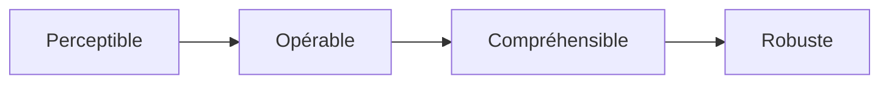

# Module Accessibilité (a11y) — Complet et Opérationnel

> [!note]
> **Objectif** : Concevoir des interfaces **utilisables par tous**, y compris les personnes en situation de handicap (moteur, visuel, auditif, cognitif). Ce module couvre **HTML sémantique**, **WAI‑ARIA**, **contrastes**, **navigation clavier**, **composants interactifs accessibles**, **tests** et **conformité**.
>
> **À la fin de ce module, vous saurez :**
> - Appliquer les **bonnes pratiques sémantiques** et les **repères (landmarks)**.
> - Assurer **navigation clavier**, **gestion du focus** et **ordre logique**.
> - Utiliser **WAI‑ARIA** **avec parcimonie** (noms, rôles, états, live regions).
> - Rendre accessibles **images, médias, formulaires, tableaux, SVG/canvas**, menus, modales, tabs, carrousels.
> - Mesurer la conformité aux **WCAG 2.2** (niveaux A/AA/AAA) et préparer la **déclaration d’accessibilité**.
>
> *Compatible Obsidian (Mac) : callouts, Mermaid, `<details>` pour corrections d’exercices.*

---

## Table des matières

- [1. Pourquoi l’accessibilité ?](#1-pourquoi-laccessibilite)
- [2. Principes (POUR) & WCAG 2.2](#2-principes-pour--wcag-22)
- [3. HTML sémantique et repères](#3-html-semantique-et-reperes)
- [4. Navigation clavier & focus](#4-navigation-clavier--focus)
- [5. Couleurs, contrastes & thèmes](#5-couleurs-contrastes--themes)
- [6. Images et alternatives textuelles](#6-images-et-alternatives-textuelles)
- [7. Médias : audio, vidéo, sous‑titres, transcripts](#7-medias--audio-video-sous-titres-transcripts)
- [8. Formulaires accessibles](#8-formulaires-accessibles)
- [9. Tableaux de données](#9-tableaux-de-donnees)
- [10. Composants interactifs accessibles](#10-composants-interactifs-accessibles)
- [11. ARIA : noms, rôles, propriétés, live regions](#11-aria--noms-roles-proprietes-live-regions)
- [12. SVG, Canvas & graphiques](#12-svg-canvas--graphiques)
- [13. Mouvement, confort visuel & préférences utilisateur](#13-mouvement-confort-visuel--preferences-utilisateur)
- [14. Internationalisation & direction du texte](#14-internationalisation--direction-du-texte)
- [15. Test, audit & conformité](#15-test-audit--conformite)
- [16. Processus, contenu & rédaction inclusive](#16-processus-contenu--redaction-inclusive)
- [17. Exercices guidés avec corrections](#17-exercices-guides-avec-corrections)
- [18. Checklists Accessibilité](#18-checklists-accessibilite)
- [19. Glossaire rapide](#19-glossaire-rapide)
- [20. FAQ](#20-faq)
- [21. Références & ressources](#21-references--ressources)

---

## 1. Pourquoi l’accessibilité ?

- **Éthique & légale** : accès égal à l’information et aux services.
- **Business** : améliorer **portée**, **SEO** (meilleure sémantique), **qualité** (robustesse).
- **Technique** : interfaces plus **résilientes**, **compatibles**, **maintenables**.

> [!tip]
> L’accessibilité **bénéficie à tous** : navigation clavier pour power users, textes alternatifs pour environnements à bande passante faible, contraste pour usages en extérieur, etc.

---

## 2. Principes (POUR) & WCAG 2.2

**POUR** = **Perceptible**, **Opérable**, **Compréhensible**, **Robuste**.

**WCAG 2.2** (niveaux **A/AA/AAA**) ajoute des critères par rapport à 2.1 (ex. **Focus Appearance**, **Dragging**, **Accessible Authentication**). Implémentez **AA** comme objectif réaliste.



> [!warning]
> Les WCAG ne sont pas une **liste unique** à cocher. L’**expérience réelle** (tests utilisateurs) est essentielle.

---

## 3. HTML sémantique et repères

- Utilisez les balises **sémantiques** : `<header>`, `<nav>`, `<main>`, `<article>`, `<section>`, `<aside>`, `<footer>`.
- Un seul `<main>` par page ; titres hiérarchisés (`h1` → `h2` → `h3`).
- **Skip links** : `Aller au contenu`.

```html
<a class="skip-link" href="#main">Aller au contenu principal</a>
<main id="main">…</main>
```

> [!tip]
> Préférez les **éléments natifs** aux **rôles ARIA** quand ils existent. N’ajoutez pas de rôle si la balise exprime déjà le sens.

---

## 4. Navigation clavier & focus

- Tous les contrôles doivent être **atteignables au clavier** (`Tab`, `Shift+Tab`).
- **Ordre du tab** logique, **piège** du focus à éviter.
- **Focus visible** (`:focus-visible`) ; gérer le **retour** de focus (ex. après fermeture modale).

```css
:focus-visible { outline: 3px solid hsl(220 80% 50%); outline-offset: 2px; }
```

```js
// Renvoyer le focus au bouton d'ouverture après fermeture de modale
const openBtn = document.getElementById('open');
const dialog = document.querySelector('dialog');
const closeBtn = document.getElementById('close');
closeBtn.addEventListener('click', () => { dialog.close(); openBtn.focus(); });
```

---

## 5. Couleurs, contrastes & thèmes

- Contraste **AA** : texte vs fond ≥ **4.5:1** (normal), ≥ **3:1** (grands). 
- Évitez d’encoder l’information seulement par la **couleur**.
- Respectez `prefers-color-scheme` et **mode sombre** ; **palette** avec variables.

```css
@media (prefers-color-scheme: dark) {
  :root { --bg: #111; --fg: #eee; }
  body { background: var(--bg); color: var(--fg); }
}
```

---

## 6. Images et alternatives textuelles

- **`alt`** pertinent et concis ; `alt=""` pour décoratives.
- **Figure** + **figcaption** pour contexte.
- **Complexes** (diagrammes) : **description** détaillée via texte proche ou `aria-describedby`.

```html

```

---

## 7. Médias : audio, vidéo, sous‑titres, transcripts

- Vidéos avec **sous‑titres** (`<track>`), **transcript** et **contrôles**.
- Audio : **transcript** ; éviter auto‑play.
- **Descriptions audio** pour contenu visuel essentiel.

```html
<video controls>
  <source src="/media/demo.mp4" type="video/mp4">
  <track kind="subtitles" src="/media/demo.fr.vtt" srclang="fr" label="Français" default>
</video>
```

---

## 8. Formulaires accessibles

- **Labels** reliés (`for`/`id`) ; **instructions** claires ; **erreurs** identifiables et expliquées.
- **Groupes** via `<fieldset>`/`<legend>`.
- Indiquez **états** (`required`, `aria-invalid`, `aria-describedby`).

```html
<label for="email">E‑mail</label>
<input id="email" name="email" type="email" required aria-describedby="help-email">
<small id="help-email">Nous n’utiliserons votre e‑mail que pour vous répondre.</small>
```

---

## 9. Tableaux de données

- Utilisez `<caption>`, `<thead>`, `<tbody>`.
- Associez les cellules via `scope` (col/row) ou `headers`/`id` pour complexes.

```html
<table>
  <caption>Ventes trimestrielles</caption>
  <thead><tr><th scope="col">Trimestre</th><th scope="col">Montant</th></tr></thead>
  <tbody><tr><th scope="row">T1</th><td>25 000 $</td></tr></tbody>
</table>
```

---

## 10. Composants interactifs accessibles

### 10.1. Modale

- **Focus piégé** dans la modale, retour au déclencheur à la fermeture.
- `aria-modal="true"`, titre (`aria-labelledby`).

```html
<button id="open">Ouvrir</button>
<dialog id="modal" aria-modal="true" aria-labelledby="title">
  <h2 id="title">Titre de la modale</h2>
  <p>Contenu…</p>
  <button id="close">Fermer</button>
</dialog>
```

```js
const openBtn = document.getElementById('open');
const modal = document.getElementById('modal');
const closeBtn = document.getElementById('close');
openBtn.addEventListener('click', () => { modal.showModal(); closeBtn.focus(); });
closeBtn.addEventListener('click', () => { modal.close(); openBtn.focus(); });
```

### 10.2. Accordéon

- Boutons avec `aria-expanded`, association au panneau (`aria-controls`).

```html
<button class="accordion" aria-expanded="false" aria-controls="panel-1">Section 1</button>
<div id="panel-1" hidden>Contenu section 1…</div>
```

```js
const btn = document.querySelector('.accordion');
const panel = document.getElementById('panel-1');
btn.addEventListener('click', () => {
  const expanded = btn.getAttribute('aria-expanded') === 'true';
  btn.setAttribute('aria-expanded', String(!expanded));
  panel.hidden = expanded;
});
```

### 10.3. Onglets (tabs)

- Rôles `tablist`, `tab`, `tabpanel` ; **activation** au clavier (`ArrowLeft/Right`, `Home/End`).

```html
<div role="tablist" aria-label="Sections">
  <button role="tab" aria-selected="true" aria-controls="p1" id="t1">Profil</button>
  <button role="tab" aria-selected="false" aria-controls="p2" id="t2">Paramètres</button>
</div>
<section role="tabpanel" id="p1" aria-labelledby="t1">…</section>
<section role="tabpanel" id="p2" aria-labelledby="t2" hidden>…</section>
```

### 10.4. Menu

- Utilisez les éléments natifs (`<button>`, `<nav>`) ; évitez les **menus non natifs** complexes.
- `aria-expanded` pour l’état, **fermeture** via `Escape`.

### 10.5. Carrousel

- Contrôles explicites (Précédent/Suivant), pause, **annonces** des changements via `aria-live`.

---

## 11. ARIA : noms, rôles, propriétés, live regions

- **Accessible Name** via `aria-label`, `aria-labelledby`, `alt`, `label`.
- **Roles** : seulement si **nécessaire** (pas pour `<button>`, `<a>`, etc.).
- **States/Properties** : `aria-expanded`, `aria-controls`, `aria-current`, `aria-hidden`.
- **Live regions** : `aria-live="polite|assertive"` ; éviter flood.

> [!warning]
> **Règle d’or** : *« N’utilisez ARIA que si nécessaire »*. La sémantique HTML **prime**.

---

## 12. SVG, Canvas & graphiques

- **SVG inline** : titres (`<title>`), descriptions (`<desc>`), `role="img"` + `aria-labelledby`.
- **Canvas** : fournir **alternative** textuelle/DOM.
- Graphiques : **tableaux** ou **résumés** textuels pour valeurs clés.

---

## 13. Mouvement, confort visuel & préférences utilisateur

- Respecter `prefers-reduced-motion` ; éviter **effets agressifs** (risques épileptiques).
- Limiter **parallaxe**, zoom brusque ; offrir **contrôles** pour réduire/arrêter.

```css
@media (prefers-reduced-motion: reduce) {
  * { animation-duration: 0.01ms !important; animation-iteration-count: 1 !important; transition-duration: 0.01ms !important; }
}
```

---

## 14. Internationalisation & direction du texte

- `lang` sur `<html>` et fragments ; `dir="ltr|rtl"` si besoin.
- **Logical properties** CSS (`margin-inline`, `padding-block`) pour compatibilité RTL.
- **Formats** de dates/heures via **Intl**.

---

## 15. Test, audit & conformité

- **Lighthouse** (catégorie Accessibility) ; **axe DevTools** ; **Wave**, **AChecker**.
- **NVDA**, **JAWS**, **VoiceOver** (lecteurs d’écran) pour tests **réels**.
- **Keyboard‑only** run : parcourir tout le site via `Tab`.
- **Déclaration d’accessibilité** : présenter état de conformité, périmètre, contact.

> [!tip]
> Impliquez des **utilisateurs** : retours concrets > scores automatiques.

---

## 16. Processus, contenu & rédaction inclusive

- **Plain language** : phrases courtes, vocabulaire simple.
- **Guidage** : étapes claires, feedback immédiat, **erreurs** expliquées.
- **Consistance** des patterns (boutons, libellés, messages).
- **Design** : cibles tactiles assez grandes (~44×44 px), espacement.

---

## 17. Exercices guidés avec corrections

> [!info]
> Les **corrections** sont **repliables**. Cliquez pour afficher.

### Exercice 1 — Navigation clavier & skip link
**Objectif** : Ajouter un lien d’évitement et assurer focus visible.

<details>
<summary><strong>Correction</strong></summary>

```html
<a class="skip-link" href="#main">Aller au contenu principal</a>
<main id="main">…</main>
```

```css
.skip-link { position: absolute; left: -9999px; }
.skip-link:focus { left: 1rem; top: 1rem; background: #000; color: #fff; padding: .5rem; }
:focus-visible { outline: 3px solid #0af; }
```

</details>

---

### Exercice 2 — Formulaire avec aide et message d’erreur
**Objectif** : Lier `aria-describedby`, indiquer `required`, et afficher message en cas d’erreur.

<details>
<summary><strong>Correction</strong></summary>

```html
<form novalidate>
  <label for="email">E‑mail</label>
  <input id="email" type="email" required aria-describedby="help-email error-email">
  <small id="help-email">Format : nom@domaine.tld</small>
  <div id="error-email" role="alert" hidden>Veuillez saisir un e‑mail valide.</div>
  <button type="submit">Envoyer</button>
</form>
<script>
const form = document.querySelector('form');
const email = document.getElementById('email');
const error = document.getElementById('error-email');
form.addEventListener('submit', e => {
  if (!email.checkValidity()) { e.preventDefault(); error.hidden = false; email.setAttribute('aria-invalid','true'); email.focus(); }
});
</script>
```

</details>

---

### Exercice 3 — Accordéon accessible
**Objectif** : Mettre à jour `aria-expanded`, basculer `hidden`, et gérer clavier.

<details>
<summary><strong>Correction</strong></summary>

```html
<button class="acc" aria-expanded="false" aria-controls="p1">FAQ 1</button>
<div id="p1" hidden>Réponse 1…</div>
```

```js
const acc = document.querySelector('.acc');
const p1 = document.getElementById('p1');
acc.addEventListener('click', () => {
  const ex = acc.getAttribute('aria-expanded') === 'true';
  acc.setAttribute('aria-expanded', String(!ex));
  p1.hidden = ex;
});
acc.addEventListener('keydown', e => { if (e.key === 'Enter' || e.key === ' ') { e.preventDefault(); acc.click(); } });
```

</details>

---

### Exercice 4 — Modale avec retour de focus
**Objectif** : Focus dans la modale, `Escape` pour fermer, retour au déclencheur.

<details>
<summary><strong>Correction</strong></summary>

```html
<button id="open">Ouvrir</button>
<dialog id="modal" aria-modal="true" aria-labelledby="title">
  <h2 id="title">Titre</h2>
  <p>Contenu…</p>
  <button id="close">Fermer</button>
</dialog>
```

```js
const openBtn = document.getElementById('open');
const modal = document.getElementById('modal');
const closeBtn = document.getElementById('close');
openBtn.addEventListener('click', () => { modal.showModal(); closeBtn.focus(); });
closeBtn.addEventListener('click', () => { modal.close(); openBtn.focus(); });
modal.addEventListener('keydown', e => { if (e.key === 'Escape') { modal.close(); openBtn.focus(); } });
```

</details>

---

### Exercice 5 — Image complexe avec description
**Objectif** : Ajouter `figcaption` et référence par `aria-describedby`.

<details>
<summary><strong>Correction</strong></summary>

```html
<figure>
  
  <figcaption id="desc-diag">Ce diagramme montre les flux entre modules A/B/C : A→B (auth), B→C (données).</figcaption>
</figure>
```

</details>

---

## 18. Checklists Accessibilité

### Base
- [ ] `lang` sur `<html>` ; titres hiérarchisés ; repères sémantiques
- [ ] **Skip link** présent et visible au focus
- [ ] **Focus visible** ; ordre du tab logique
- [ ] **Couleurs** avec contraste AA ; pas d’info uniquement par couleur
- [ ] Images : `alt` pertinent ; décoratives `alt=""`
- [ ] Formulaires : labels reliés ; aides & erreurs (ARIA) ; `required`
- [ ] Tableaux : `caption`, `scope` (ou `headers`/`id`)
- [ ] Respect `prefers-reduced-motion`; éviter animations agressives

### Avancé
- [ ] Modales : `aria-modal`, trap focus, retour au déclencheur
- [ ] Tabs : rôles & gestion clavier ; `aria-selected` cohérent
- [ ] Menu : fermeture `Escape` ; `aria-expanded` sur bouton
- [ ] Carrousel : contrôles, pause, annonces via `aria-live`
- [ ] SVG/Canvas : titres/desc ou alternative DOM
- [ ] Déclaration d’accessibilité rédigée et publiée

---

## 19. Glossaire rapide

- **WCAG** : Web Content Accessibility Guidelines (critères A/AA/AAA).
- **WAI‑ARIA** : attributs pour accessibilité des interfaces riches.
- **Accessible Name** : nom perçu par technologies d’assistance.
- **Landmark** : repère de structure (main, nav, header…).
- **Live Region** : zone dont les mises à jour sont **annoncées** aux lecteurs d’écran.

---

## 20. FAQ

**Q : Dois‑je toujours utiliser ARIA ?**
> Non. **HTML sémantique** d’abord. ARIA uniquement si **nécessaire**.

**Q : Comment tester efficacement ?**
> Parcours **clavier‑only**, **lecteur d’écran**, **Lighthouse/axe**. Impliquez des **utilisateurs** réels.

**Q : Le mode sombre influence l’accessibilité ?**
> Oui, assurez **contrastes** suffisants et styles de **focus visibles** dans chaque thème.

---

## 21. Références & ressources

- WCAG (W3C WAI) — Principes & critères : https://www.w3.org/WAI/standards-guidelines/wcag/
- WAI‑ARIA — Spécification & pratiques : https://www.w3.org/TR/wai-aria-1.2/ ; https://www.w3.org/TR/wai-aria-practices/
- MDN Web Docs — Accessibilité : https://developer.mozilla.org/fr/docs/Web/Accessibility
- Web.dev (Google) — A11y & tests : https://web.dev/learn/accessibility/
- Outils — Lighthouse, axe DevTools, Wave : https://developers.google.com/web/tools/lighthouse ; https://www.deque.com/axe/ ; https://wave.webaim.org/

> [!success]
> Vous disposez maintenant d’un **module Accessibilité complet**, prêt à l’emploi et à la production.
