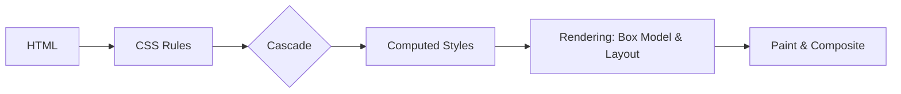
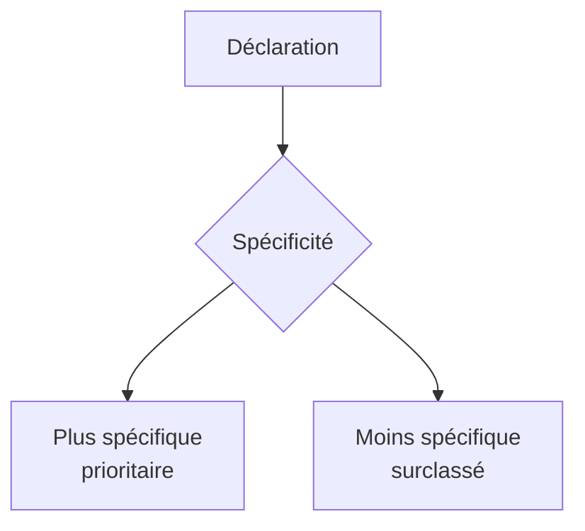

# Module CSS — Complet et Opérationnel

> [!note]
> **Objectif** : Maîtriser **100% des fondamentaux et techniques modernes CSS** pour concevoir des interfaces **lisibles, maintenables, accessibles, performantes** et prêtes pour la production.
>
> **À la fin de ce module, vous saurez :**
> - Comprendre le **modèle mental CSS** (cascade, héritage, spécificité, boîte).
> - Écrire des **sélecteurs efficaces** (simples, relationnels, pseudo-classes, pseudo‑éléments) et utiliser `:is()`, `:where()`, `:has()`.
> - Gérer **typographie, couleurs**, unités, variables CSS (custom properties), **nesting**, **layers**, **logical properties**.
> - Poser des **layouts robustes** avec **Flexbox** et **Grid**, et travailler avec **positionnement**, **z‑index**, **conteneurs**.
> - Faire du **responsive** moderne (media queries, **container queries**, préférences utilisateurs).
> - Animer proprement (transitions, keyframes) avec **performance** et **accessibilité**.
> - Structurer votre CSS (BEM, ITCSS, utility‑first) et déboguer avec DevTools.

---

## Table des matières

- [1. Le modèle mental CSS](#1-le-modele-mental-css)
- [2. Syntaxe et sélecteurs](#2-syntaxe-et-selecteurs)
- [3. Spécificité, cascade, héritage](#3-specificite-cascade-heritage)
- [4. Boîte CSS (Box Model)](#4-boite-css-box-model)
- [5. Unités et dimensions](#5-unites-et-dimensions)
- [6. Couleurs et fond](#6-couleurs-et-fond)
- [7. Typographie et polices](#7-typographie-et-polices)
- [8. Mise en page : Flux, Flexbox, Grid](#8-mise-en-page-flux-flexbox-grid)
- [9. Positionnement, empilement et contexte](#9-positionnement-empilement-et-contexte)
- [10. Responsive et préférences utilisateurs](#10-responsive-et-preferences-utilisateurs)
- [11. Features modernes : variables, nesting, layers, logical properties](#11-features-modernes-variables-nesting-layers-logical-properties)
- [12. Animations et transitions](#12-animations-et-transitions)
- [13. Effets avancés (filters, masks, shapes)](#13-effets-avances-filters-masks-shapes)
- [14. Accessibilité via CSS](#14-accessibilite-via-css)
- [15. Performance CSS](#15-performance-css)
- [16. Architecture et organisation](#16-architecture-et-organisation)
- [17. Debugging & Outils](#17-debugging--outils)
- [18. Exercices guidés avec corrections](#18-exercices-guides-avec-corrections)
- [19. Checklist de référence](#19-checklist-de-reference)
- [20. Glossaire rapide](#20-glossaire-rapide)
- [21. FAQ](#21-faq)
- [22. Références & ressources](#22-references--ressources)

---

## 1. Le modèle mental CSS

CSS décrit **comment** le contenu (HTML) doit être présenté : couleurs, tailles, positions, alignements, animations, etc. 

> [!tip]
> Pensez CSS comme un **système de règles** appliquées selon des **priorités** (spécificité), dans un **contexte** (cascade, héritage), et influencées par le **formatage** (box model, flow).



---

## 2. Syntaxe et sélecteurs

### 2.1. Règle CSS

```css
selector {
  property: value;
}
```

### 2.2. Sélecteurs de base

- **Type** : `div`, `p`, `h1` 
- **Classe** : `.carte` 
- **ID** : `#principal` (évitez l’usage excessif des IDs en CSS)
- **Universel** : `*` (peut être coûteux)

### 2.3. Combinateurs

- Descendant : `article p`
- Enfant direct : `article > p`
- Adjacent : `h2 + p`
- Sibling général : `h2 ~ p`

### 2.4. Attributs

```css
a[href^="https"] { /* commence par */ }
input[type="email"] { /* égal à */ }
img[alt=""] { /* alt vide (décoratif) */ }
```

### 2.5. Pseudo-classes

- État : `:hover`, `:focus`, `:active`, `:disabled`
- Formulaire : `:valid`, `:invalid`, `:checked`, `:placeholder-shown`
- Structure : `:first-child`, `:last-child`, `:nth-child(odd)`, `:nth-of-type(n)`
- Utilitaires modernes : `:is()`, `:where()`, `:has()` (sélecteur parent)

```css
/* :is() simplifie la spécificité groupée */
:is(h1, h2, h3) { margin-block: 0.5rem; }
/* :where() ne ajoute pas de spécificité */
:where(nav a) { text-decoration: none; }
/* :has() comme sélecteur parent */
.card:has(img) { padding-top: 0; }
```

### 2.6. Pseudo‑éléments

`::before`, `::after`, `::placeholder`, `::selection`, `::marker`.

```css
.button::before {
  content: "→";
  margin-inline-end: 0.5ch;
}
```

> [!warning]
> **N’abusez** pas des pseudo‑éléments pour du contenu **significatif**. Ils sont décoratifs.

---

## 3. Spécificité, cascade, héritage

### 3.1. Spécificité (score)

- Type (ex. `div`) : **0‑0‑1**
- Classe/attribut/pseudo‑classe (ex. `.btn`, `[type]`, `:hover`) : **0‑1‑0**
- ID (ex. `#main`) : **1‑0‑0**
- Inline style : **1‑0‑0‑0** (au‑dessus de tout)
- `!important` : casse la cascade (à utiliser **rarement**)



### 3.2. Cascade

L’ordre d’apparition, l’origine (user agent, utilisateur, auteur) et la spécificité déterminent la **déclaration gagnante**.

### 3.3. Héritage

Certaines propriétés **se transmettent** aux descendants (`color`, `font-family`), d’autres non (`margin`, `border`). Utilisez `inherit`, `initial`, `unset`, `revert` pour contrôler.

---

## 4. Boîte CSS (Box Model)

Chaque élément est une **boîte** : contenu + padding + border + margin.

```css
/* Inclure padding & border dans width/height */
* { box-sizing: border-box; }
```

- `width`, `height`, `min/max-*`
- `padding`, `border`, `margin`
- `overflow: visible | hidden | scroll | auto`
- `outline` (non pris dans le flux, utile pour le focus)

> [!tip]
> Utilisez `box-sizing: border-box;` globalement pour des layouts prévisibles.

---

## 5. Unités et dimensions

- **Absolues** : `px`, `cm`, `mm` (préférez `px`)
- **Relatives** : `em` (par rapport au parent), `rem` (root), `%` (contenant), `ch` (largeur du "0"), `ex`
- **Viewport** : `vw`, `vh`, `vmin`, `vmax` + unités modernes `svh`, `lvh`, `dvh` (viewport stable, large, dynamique)
- **Angles / temps** : `deg`, `rad`, `turn`, `s`, `ms`

```css
/* Tailles fluides */
html { font-size: 100%; } /* 16px par défaut */
h1 { font-size: clamp(1.25rem, 3vw, 2rem); }
```

---

## 6. Couleurs et fond

- **Formats** : `hex`, `rgb()`, `hsl()`, `lab()`, `lch()` (modernes), `color(display-p3 ...)`.
- **Transparence** : `rgba()`, `hsla()`, ou `rgb(0 0 0 / 0.5)` (nouvelle syntaxe)
- **Dégradés** : `linear-gradient()`, `radial-gradient()`, `conic-gradient()`
- **Arrière‑plans** : `background`, `background-image`, `background-size`, `background-position`, `background-repeat`

```css
:root {
  --brand: oklch(70% 0.15 240);
}
.button {
  background: var(--brand);
  color: white;
}
.hero {
  background-image: linear-gradient(135deg, hsl(220 80% 60%), hsl(280 80% 60%));
}
```

> [!warning]
> Les espaces colorimétriques **OKLCH/LCH/Lab** peuvent varier selon navigateurs. Fournissez des **fallbacks** (ex. `hsl()`) si compatibilité large requise.

---

## 7. Typographie et polices

- **Famille** : `font-family`
- **Taille** : `font-size`
- **Hauteur de ligne** : `line-height` (sans unité recommandé)
- **Poids** : `font-weight`
- **Style** : `font-style`
- **Espaces** : `letter-spacing`, `word-spacing`
- **Variant** : `font-variant`, `text-transform`
- **Mesure & lisibilité** : 45–75 caractères/ligne (approximatif)

### 7.1. Polices variables et @font-face

```css
@font-face {
  font-family: "Inter";
  src: url("/fonts/Inter.woff2") format("woff2");
  font-weight: 100 900; /* variable */
  font-display: swap; /* performance */
}
:root { --font-ui: "Inter", system-ui, -apple-system, Segoe UI, Roboto, sans-serif; }
body { font-family: var(--font-ui); }
```

> [!tip]
> **Variable fonts** réduisent le nombre de fichiers et offrent des axes (poids, largeur, italique).

---

## 8. Mise en page : Flux, Flexbox, Grid

### 8.1. Flux normal

- Les éléments block s’empilent verticalement ; les inline s’écoulent dans la ligne.
- **Logical properties** : `margin-block`, `padding-inline`, etc. pour internationalisation.

### 8.2. Flexbox

```css
.container {
  display: flex;
  gap: 1rem;
  justify-content: space-between; /* alignement horizontal */
  align-items: center;            /* alignement vertical */
}
.item { flex: 1 1 200px; }
```

- Axe principal vs axe secondaire
- `flex-grow`, `flex-shrink`, `flex-basis`
- `gap` (espacement natif)

### 8.3. Grid

```css
.grid {
  display: grid;
  grid-template-columns: repeat(12, 1fr);
  gap: 1rem;
}
.card { grid-column: span 3; }
```

- Grilles explicites/implicites
- **Areas** :

```css
grid-template-areas:
  "header header header"
  "sidebar main   main"
  "footer footer footer";
```

- **Fonctions utiles** : `minmax()`, `fit-content()`, `auto-fill`, `auto-fit`

> [!tip]
> Commencez par **Grid** pour la structure globale, **Flex** pour l’alignement local.

---

## 9. Positionnement, empilement et contexte

- `position: static | relative | absolute | fixed | sticky`
- **Stacking context** : créé par `position` + `z-index`, `opacity < 1`, `transform`, `filter`, etc.
- `z-index` s’applique **dans** le contexte ; évitez les grandes valeurs arbitraires.

```css
.header { position: sticky; top: 0; z-index: 10; }
.modal  { position: fixed; inset: 0; }
```

---

## 10. Responsive et préférences utilisateurs

### 10.1. Media queries

```css
@media (max-width: 768px) {
  .grid { grid-template-columns: 1fr; }
}
@media (prefers-color-scheme: dark) {
  :root { --bg: #111; --fg: #eee; }
  body { background: var(--bg); color: var(--fg); }
}
@media (prefers-reduced-motion: reduce) {
  * { animation-duration: 0.01ms; animation-iteration-count: 1; transition-duration: 0.01ms; }
}
```

### 10.2. Container queries

Définissez un **conteneur** :

```css
.card-list { container-type: inline-size; }
```

Puis ciblez selon **la taille du conteneur** :

```css
@container (min-width: 600px) {
  .card { display: grid; grid-template-columns: 200px 1fr; }
}
```

> [!tip]
> Les container queries rendent les composants **vraiment responsives**, indépendants du viewport.

---

## 11. Features modernes : variables, nesting, layers, logical properties

### 11.1. Variables (custom properties)

```css
:root {
  --space-1: 0.25rem;
  --space-2: 0.5rem;
  --space-3: 1rem;
}
.card { padding: var(--space-3); }
.card:hover { padding: calc(var(--space-3) + var(--space-1)); }
```

### 11.2. Nesting (imbriqué)

```css
.card {
  padding: 1rem;
  & h3 { margin: 0; }
  & .btn {
    color: white;
    &:hover { color: yellow; }
  }
}
```

### 11.3. Layers (contrôler la cascade)

```css
@layer reset, base, components, utilities;
@layer reset {
  *,*::before,*::after { box-sizing: border-box; }
}
@layer base {
  body { margin: 0; font: 1rem/1.5 system-ui; }
}
@layer components {
  .card { padding: 1rem; border: 1px solid #ddd; }
}
@layer utilities {
  .mt-1 { margin-top: 0.25rem; }
}
```

### 11.4. Logical properties

`margin-inline`, `padding-block`, `inset-inline`, `border-start-end-radius`… utiles pour les **langues RTL/LTR** et la **portabilité**.

---

## 12. Animations et transitions

- **Transitions** : pour changements doux
- **Keyframes** : animations complexes (`@keyframes`)
- **Transformations** : `transform: translate/scale/rotate` (optimisées)

```css
.button {
  transition: background-color 200ms ease, transform 150ms ease-out;
}
.button:active { transform: scale(0.98); }

@keyframes fade-in {
  from { opacity: 0; }
  to   { opacity: 1; }
}
.modal[open] { animation: fade-in 250ms ease-out; }
```

> [!warning]
> Évitez d’animer **layout** (ex. `width`, `height`, `top`) ; préférez `transform` et `opacity`.

---

## 13. Effets avancés (filters, masks, shapes)

- `filter: blur() brightness() contrast() drop-shadow()`
- `backdrop-filter` (sur calques semi‑transparents)
- `clip-path` (formes), `mask-image`

```css
.glass {
  background: rgba(255,255,255,.25);
  backdrop-filter: blur(10px);
}
.shape {
  clip-path: polygon(0 0, 100% 0, 100% 80%, 0 100%);
}
```

---

## 14. Accessibilité via CSS

- **Focus visible** : `:focus-visible` 
- **Éviter** `outline: none;` (ou le **remplacer** par style personnalisé)
- Respecter `prefers-reduced-motion`
- Couleurs avec **contraste suffisant** (WCAG AA)

```css
button:focus-visible {
  outline: 3px solid hsl(200 80% 50%);
  outline-offset: 2px;
}
```

---

## 15. Performance CSS

- **Réduire** la spécificité, éviter `!important`
- **Limiter** les règles et éviter les sélecteurs trop **profonds** (`.a .b .c .d`)
- Utiliser `will-change` **avec modération**
- Charger **critical CSS** inline (si politique CSP compatible), le reste différé
- **Regrouper** et **réutiliser** via variables et utilitaires

```css
.card { will-change: transform; } /* UNIQUEMENT si nécessaire avant interaction */
```

---

## 16. Architecture et organisation

- **BEM** : `block__element--modifier`
- **ITCSS** : ordonner reset → base → objets → composants → utilitaires
- **Utility-first** : classes petites et réutilisables
- **CSS Modules** / **Scoped CSS** 
- **@layer** pour piloter la cascade à l’échelle du projet

> [!tip]
> Choisissez une **convention** et **respectez‑la**. Documentez vos règles.

---

## 17. Debugging & Outils

- **DevTools** (Chrome, Firefox, Safari) : inspecteur, **Layout** (Flex/Grid), **Animations**, **Performance**.
- Activer le **mode outline** global pour voir les boîtes :

```css
* { outline: 1px solid rgba(0,0,0,.05); }
```

- Utiliser les panneaux **Accessibility** et **Contrast**.

---

## 18. Exercices guidés avec corrections

> [!info]
> Les **corrections** sont **repliables**. Cliquez pour afficher.

### Exercice 1 — Carte responsive (Flex)
**Objectif** : Créer une carte avec image, titre, texte et bouton, alignée avec Flex.

<details>
<summary><strong>Correction</strong></summary>

```html
<div class="card">
  
  <div class="content">
    <h3>Jane Doe</h3>
    <p>Développeuse front‑end.</p>
    <button class="btn">Contact</button>
  </div>
</div>
```

```css
.card { display: flex; gap: 1rem; align-items: center; }
.card img { border-radius: 50%; }
.card .content { flex: 1; }
.btn { background: hsl(220 80% 50%); color: #fff; padding: .5rem 1rem; border: 0; border-radius: .5rem; }
.btn:hover { background: hsl(220 80% 40%); }
```

</details>

---

### Exercice 2 — Grille 12 colonnes (Grid)
**Objectif** : Mettre en page un listing en 12 colonnes avec cards qui s’ajustent.

<details>
<summary><strong>Correction</strong></summary>

```html
<section class="grid">
  <article class="card">A</article>
  <article class="card">B</article>
  <article class="card">C</article>
  <article class="card">D</article>
</section>
```

```css
.grid { display: grid; grid-template-columns: repeat(12, 1fr); gap: 1rem; }
.card { grid-column: span 3; background: #f6f6f6; padding: 1rem; border-radius: .5rem; }
@media (max-width: 768px) { .card { grid-column: span 6; } }
@media (max-width: 480px) { .card { grid-column: span 12; } }
```

</details>

---

### Exercice 3 — Thème sombre avec variables
**Objectif** : Définir un thème clair/sombre en variables + respect des préférences.

<details>
<summary><strong>Correction</strong></summary>

```css
:root { --bg: #fff; --fg: #111; --primary: hsl(220 80% 50%); }
@media (prefers-color-scheme: dark) {
  :root { --bg: #111; --fg: #eee; --primary: hsl(220 80% 60%); }
}
body { background: var(--bg); color: var(--fg); }
a { color: var(--primary); }
```

</details>

---

### Exercice 4 — Container queries sur un composant
**Objectif** : Adapter la carte selon la largeur **du conteneur**.

<details>
<summary><strong>Correction</strong></summary>

```html
<section class="card-list">
  <article class="card">
    
    <h3>Titre</h3>
    <p>Texte…</p>
  </article>
</section>
```

```css
.card-list { container-type: inline-size; }
.card { display: block; }
@container (min-width: 480px) {
  .card { display: grid; grid-template-columns: 160px 1fr; gap: 1rem; }
}
```

</details>

---

### Exercice 5 — Focus accessible & reduced motion
**Objectif** : Créer des styles de focus visibles et respecter `prefers-reduced-motion`.

<details>
<summary><strong>Correction</strong></summary>

```css
.button { background: hsl(200 80% 50%); color: white; border: none; padding: .6rem 1rem; border-radius: .4rem; }
.button:focus-visible { outline: 3px solid hsl(45 100% 50%); outline-offset: 3px; }
@media (prefers-reduced-motion: reduce) {
  .button { transition: none; }
}
```

</details>

---

## 19. Checklist de référence

- [ ] `box-sizing: border-box;` global
- [ ] Typo lisible (line-height sans unité, mesure raisonnable)
- [ ] Palette accessible (contraste) + variables de thèmes
- [ ] Flex/Grid pour layout ; `gap` pour espacement
- [ ] Media queries + container queries
- [ ] `:focus-visible` présent et visible
- [ ] Animations limitées et performantes (`transform`, `opacity`)
- [ ] Spécificité sous contrôle (pas d’IDs, pas de `!important` non justifié)
- [ ] Architecture claire (BEM/ITCSS/@layer)
- [ ] Tests avec DevTools (Layout, Performance, Accessibility)

---

## 20. Glossaire rapide

- **Cascade** : mécanique d’application des règles.
- **Spécificité** : priorité d’un sélecteur.
- **Héritage** : transmission de propriétés aux descendants.
- **Box model** : structure des boîtes.
- **Flex/Grid** : modules de layout modernes.
- **Custom properties** : variables CSS.
- **Container query** : média basé sur dimensions du conteneur.
- **Logical properties** : propriétés indépendantes de la direction du texte.

---

## 21. FAQ

**Q : Dois‑je utiliser un reset CSS ?**
> Oui, un **reset** ou **normalize** gère les écarts inter‑navigateurs. Vous pouvez aussi construire un **layer `reset`**.

**Q : Flex ou Grid ?**
> **Grid** pour la structure en 2D ; **Flex** pour l’alignement 1D et les petits composants.

**Q : Pourquoi éviter `!important` ?**
> Cela casse la cascade, complique la maintenance. Préférez gérer la **spécificité** et l’ordre des **layers**.

**Q : Comment gérer RTL/LTR ?**
> Utilisez les **logical properties** (`margin-inline`, `padding-block`, etc.).

---

## 22. Références & ressources

- MDN Web Docs (CSS) : https://developer.mozilla.org/fr/docs/Web/CSS
- Spécifications CSS — W3C : https://www.w3.org/Style/CSS/specs.en.html
- web.dev (Google) — Performance & CSS : https://web.dev/learn/css/
- CSS‑Tricks (guides pratiques) : https://css-tricks.com/

> [!success]
> Vous disposez maintenant d’un **module CSS complet**, prêt à l’emploi et à la production.
